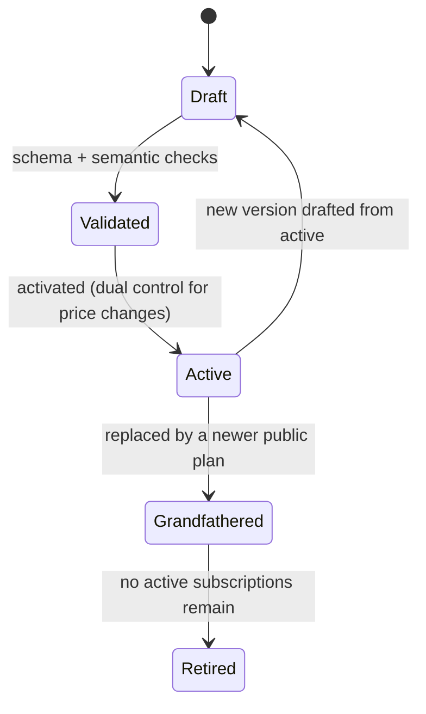
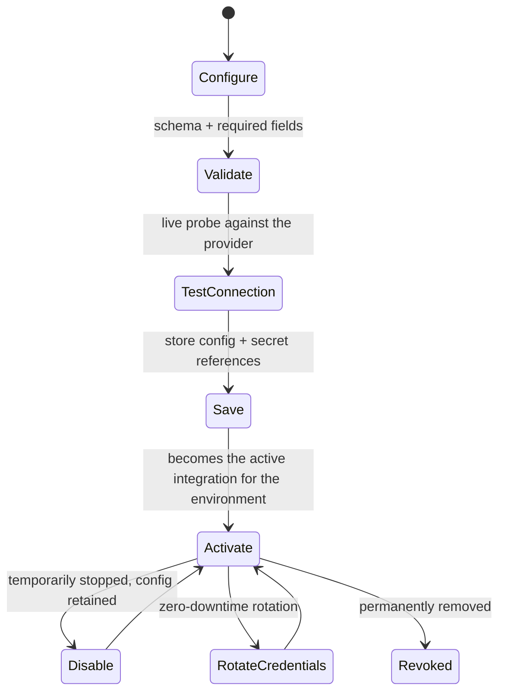
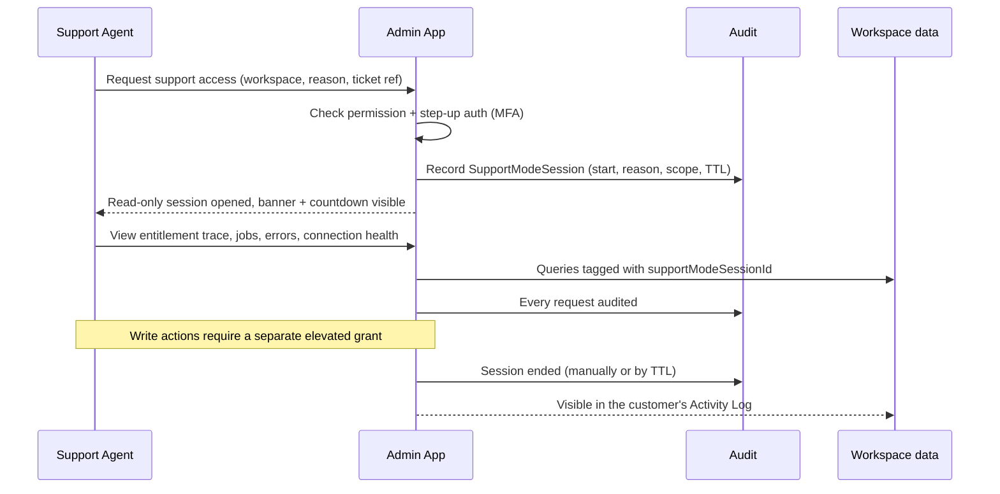

# BrandSpace — Platform Admin / Control Center

> **الملخص التنفيذي بالعربية**
>
> **مركز التحكم** هو التطبيق الخاص بمالك المنصة والفريق الداخلي فقط، ومنفصل معماريًا بالكامل عن لوحة تحكم العملاء:
> نطاق مستقل، جلسة مستقلة، صلاحيات مستقلة، ومصادقة ثنائية إلزامية للمالك والمدير.
>
> **الهدف الأساسي:** أن يدير مالك المنتج **كل العمليات اليومية للمنصة دون كتابة أو تعديل أي كود**.
>
> **الوحدات:** نظرة عامة على الأعمال (العملاء، الاشتراكات، الإيرادات، استخدام الذكاء الاصطناعي، التكلفة، هامش الربح، صحة التكاملات، التنبيهات) ·
> إدارة العملاء ومساحات العمل (إنشاء، دعوة، تعيين خطة، تجربة مجانية، إيقاف، تفعيل، إضافة رصيد، تغيير الحدود، تفعيل ميزات خاصة) ·
> الخطط والباقات · مفاتيح الميزات والاستحقاقات · التكاملات وإدارة الأسرار · بوابة الذكاء الاصطناعي · الرصيد والاستخدام ·
> الفوترة · القوالب والإشعارات · إدارة الإعدادات المُصدَّرة · سجل التدقيق · **وضع الدعم الآمن**.
>
> **قاعدة حاكمة:** لا يرى فريق الدعم أبدًا كلمات مرور العملاء ولا الرموز الخام (Tokens)، ولا تُعرض أي مفاتيح سرية — فقط بيانات وصفية مقنّعة
> (آخر أربعة أحرف)، وكل دخول إلى بيانات عميل يكون مؤقتًا، بسبب مُسجَّل، ومُدقَّقًا بالكامل.

---

## 1. Purpose and Separation

The Control Center is the **operating console for the BrandSpace business**. It exists so that plans, prices,
limits, features, AI models, integrations, and customer state can change without an engineering release.

### 1.1 Separation guarantees

| Aspect        | Guarantee                                                                                                                        |
| ------------- | -------------------------------------------------------------------------------------------------------------------------------- |
| Application   | `apps/admin` — a separate build and deployment from `apps/dashboard`                                                             |
| Hostname      | Dedicated internal hostname; optional IP allowlist; excluded from public sitemaps and robots                                     |
| Session realm | Distinct cookie name, signing key, and token audience. A customer session is rejected at the edge of admin routes                |
| Identity      | `PlatformUser` records are separate from customer `User` records; a person may hold both, but the accounts never share a session |
| Authorization | Platform permission set is disjoint from the workspace permission set                                                            |
| MFA           | **Mandatory** for Platform Owner and Platform Admin; step-up re-auth for sensitive operations                                    |
| Data access   | No ambient cross-tenant access — customer data requires Support Mode (§13)                                                       |
| Audit         | Every action is audited; audit access is itself audited                                                                          |
| Blast radius  | Financial and secret operations require step-up auth and, for pricing/credit-cost domains, dual control                          |

---

## 2. Module 1 — Overview

The landing screen: the health of the business in one view. Every widget is filterable by date range,
plan, and country, and every number is drillable to its source records.

| Widget                 | Content                                                                                | Source                       |
| ---------------------- | -------------------------------------------------------------------------------------- | ---------------------------- |
| **Customers**          | Total, new this period, active, churned, by type and country                           | `Workspace`, `Membership`    |
| **Active workspaces**  | Trialing / active / past due / suspended, with 30-day trend                            | `Workspace`, `Subscription`  |
| **Subscriptions**      | By plan and interval; trial→paid conversion; upgrades vs. downgrades                   | `Subscription`               |
| **Revenue**            | MRR, ARR, new/expansion/contraction/churned MRR, ARPA, by currency                     | `Subscription`, `Invoice`    |
| **AI usage**           | Requests, credits consumed, by task, model, plan, top workspaces                       | `AIRequest`, `AIUsageLedger` |
| **Provider costs**     | Actual spend by provider and model, day/month, vs. budget                              | `AIUsageLedger`              |
| **Estimated margin**   | Credit revenue attributed vs. provider cost; margin % overall, per plan, per workspace | derived                      |
| **Publishing status**  | Scheduled / published / failed in the last 24h and 7d; failure reasons ranked          | `PublishJob`                 |
| **Integration health** | Per AI provider and social platform: status, error rate, latency, last check           | health checks                |
| **System alerts**      | Open alerts by severity with owner and age                                             | alerting subsystem           |

**Attention queue** (the owner's daily to-do): trials ending within 3 days, payments failed, workspaces below
low-credit threshold, connections needing re-auth, publish failure spikes, providers degraded, configuration
drafts awaiting activation, refund requests, and abuse flags.

---

## 3. Module 2 — Customers and Workspaces

### 3.1 Directory

Searchable, filterable list: name, slug, type, country, plan, status, MRR, credits remaining, seats used,
brands, connected accounts, last activity, health score. Saved views and CSV export.

### 3.2 Workspace detail

Tabs: **Summary · Members · Brands · Subscription · Credits · Usage · Integrations · Limits & Features ·
Invoices · Activity · Support**.

### 3.3 Owner capabilities

| Capability                            | Behavior                                                                                                              | Controls                                         |
| ------------------------------------- | --------------------------------------------------------------------------------------------------------------------- | ------------------------------------------------ |
| **Create customer**                   | Create the `User` shell and workspace in one flow, without a password (invitation-based)                              | audited                                          |
| **Create workspace**                  | Name, slug, type, country, locale, timezone, currency, initial plan, trial                                            | audited                                          |
| **Send invitation**                   | Choose role and brand scope; signed, expiring, single-use link; resend and revoke                                     | audited, rate-limited                            |
| **Assign plan**                       | Immediate or at next period; preview of entitlement and credit deltas before confirming                               | audited, dual control if price differs from list |
| **Start / extend trial**              | Set or extend `trialEndsAt`; reason required; cap on cumulative extension per role                                    | audited                                          |
| **Suspend / reactivate**              | Suspend blocks login and all publishing/AI; data is retained; reason required                                         | audited, confirmation typed                      |
| **Add / remove AI credits**           | Writes a `CreditTransaction` of type `admin_adjustment` with reason; never edits the balance directly                 | audited, step-up above threshold                 |
| **Change limits**                     | Creates `WorkspaceOverride` rows with optional expiry and reason                                                      | audited                                          |
| **Enable customer-specific features** | Per-workspace feature override with precedence over plan                                                              | audited                                          |
| **View usage**                        | AI credits by task/user/brand, storage, seats, scheduled posts, publish volume                                        | read-only                                        |
| **View billing status**               | Subscription state, next invoice, payment method presence (masked), dunning stage                                     | read-only                                        |
| **View audit-safe support context**   | Recent errors, failed jobs, connection health, entitlement resolution trace — **without** customer content by default | read-only                                        |
| **Enter support mode**                | Time-boxed, reason-tagged, audited, read-only by default                                                              | §13                                              |

**Never available:** viewing a customer password or hash, viewing raw OAuth tokens or BYOK keys, viewing full
payment card data, silently acting as the customer.

### 3.4 Entitlement resolution trace

For any workspace and feature, Admin shows _why_ the current value applies:

```
feature: ai.image_generation
  ← workspace override (none)
  ← flag rule "beta-image-v2" (matched: beta group) → enabled
  ← plan "growth" entitlement → enabled, limit 200/month
  ← feature default → disabled
  = EFFECTIVE: enabled, limit 200/month, source: plan(growth) + flag(beta-image-v2)
```

This makes support questions answerable in seconds and makes precedence bugs visible.

---

## 4. Module 3 — Plans and Packages

Plans are **configuration**, created and edited entirely in Admin, versioned through the Configuration Service.

> **IMPLEMENTED IN PHASE 3 (2026-09-07)** at `/console/plans`. A structured form over a
> versioned draft: identity, per-currency prices, trial, credits, rollover and the six quota
> dimensions of §4.1, plus the draft → validate → activate → roll back lifecycle of §4.2 and the
> impact preview of §4.3 — which names the workspaces that would exceed a new limit rather than
> reporting a count. Add-ons, tax behaviour and the overage policy are in the schema and validated;
> the overage editor waits on D-11 being revisited, since the MVP hard-stops and nothing implements
> a postpaid charge.
>
> The price table renders one column per SUPPORTED currency, read from the `operations` domain.
> Nothing on the page converts one currency into another (D-08).

### 4.1 Plan editor fields

| Group           | Fields                                                                                                     |
| --------------- | ---------------------------------------------------------------------------------------------------------- |
| Identity        | key, name (ar/en), description (ar/en), tier, visibility (public/private/legacy), sort order, badge        |
| Pricing         | monthly price, annual price, currency, **per-currency price table**, tax behavior (inclusive/exclusive)    |
| Trial           | trial days, trial requires card (yes/no), trial credits                                                    |
| Seats & scope   | number of users, number of brands, number of social accounts                                               |
| Volume          | scheduled posts per month, storage GB, analytics retention days                                            |
| AI              | monthly AI credits, credit rollover policy, per-feature AI limits (e.g. images/month, video seconds/month) |
| Features        | allowed feature list with per-feature limits                                                               |
| Add-ons         | available add-ons (extra seats, extra credits, extra storage, extra brands) with prices                    |
| Overage         | policy: block / allow with charge / allow with cap; overage price per credit                               |
| Change behavior | upgrade behavior (immediate + prorate), downgrade behavior (at period end, quota reconciliation rules)     |

### 4.2 Plan lifecycle



**Existing subscribers are never silently repriced.** Changing the price of an active plan creates a new plan
version; current subscriptions keep their agreed price until an explicit, audited migration is run, and the
customer is notified per policy.

### 4.3 Safety rails

- Publishing a plan requires: all referenced features exist, no negative or zero-credit misconfiguration,
  currency table complete for supported currencies, and downgrade rules resolvable.
- **Impact preview before activation:** "3 plans changed, 128 workspaces affected, 12 would exceed their new
  brand limit." Workspaces that would be pushed over a limit are listed, and the owner chooses grandfathering
  or enforcement.
- Retiring a plan with active subscriptions is blocked; a migration path must be chosen first.

---

## 5. Module 4 — Feature Flags and Entitlements

> **IMPLEMENTED IN PHASE 3 (2026-09-07).** The registry and the plan grant matrix at
> `/console/features`; the targeting editor at `/console/flags`, which prints the §5.3 precedence
> order beside the form and gives the kill switch its own one-press control that validates and
> activates in the same action — containment during an incident must not depend on remembering a
> second step. Beta-cohort membership is managed per workspace at
> `/console/workspaces/{id}`; before this phase the engine's cohort dimension read a hard-coded
> empty set, so a flag targeted at a cohort matched nobody.

### 5.1 Feature registry

Each `Feature` has: key, name (ar/en), category, value type (boolean / quota / enum), default value,
dependencies, and status. Features are referenced by plans, flags, overrides, and code — code asks
`entitlements.can(workspace, 'ai.image_generation')`, never `if (plan === 'growth')`.

### 5.2 Targeting dimensions

| Dimension              | Rule shape                                                                                                      |
| ---------------------- | --------------------------------------------------------------------------------------------------------------- |
| Global                 | on/off for everyone                                                                                             |
| By plan                | enabled for plans `[…]`                                                                                         |
| By workspace           | explicit allow/deny list                                                                                        |
| By individual customer | workspace override with reason and expiry                                                                       |
| Beta group             | named cohort membership                                                                                         |
| By country             | workspace country in `[…]`                                                                                      |
| Date range             | active from → until (timezone-aware)                                                                            |
| Percentage rollout     | deterministic hash of `(featureKey, workspaceId)` — **stable**, so a workspace does not flip between page loads |

### 5.3 Precedence (highest wins)

```
1. Kill switch (feature.status = disabled)      → OFF for everyone, immediately
2. Workspace override (explicit, unexpired)
3. Explicit workspace allow/deny list on a flag rule
4. Beta group membership
5. Country rule
6. Date-range rule
7. Percentage rollout
8. Plan entitlement
9. Feature default
```

Rules are evaluated top-down; the first rule that produces a decision wins. The resolution trace (§3.4) shows
which rule decided.

### 5.4 Dependencies and conflicts

- A feature declares `dependsOn`. Enabling `ai.video_generation` while `ai.generation` is off is rejected at
  validation time, not discovered at runtime.
- Disabling a feature that others depend on shows the dependency tree and requires explicit confirmation.
- Quota features validate that a workspace-level override is not below current consumption without an
  explicit "enforce anyway" acknowledgement.

### 5.5 Rollback

Every flag change is a configuration version. Rollback restores the previous rule set atomically and takes
effect within the cache TTL (seconds). A **global kill switch** per feature bypasses all rules for immediate
containment during an incident.

---

## 6. Module 5 — Integrations

One consistent management surface for every external dependency:

**AI providers · Social platform applications · Email providers · SMS and WhatsApp providers ·
Payment providers · Object storage · Analytics providers · Webhooks · Future CRM integrations.**

### 6.1 Common integration lifecycle



### 6.2 Per-integration capabilities

| Capability             | Detail                                                                                          |
| ---------------------- | ----------------------------------------------------------------------------------------------- |
| **Configure**          | Provider-specific form generated from a Zod schema, with inline help and validation             |
| **Validate**           | Structural + semantic validation before anything is saved                                       |
| **Test connection**    | Live probe (list models, fetch account, ping webhook endpoint) with the result shown and stored |
| **Save**               | Config stored as a configuration version; secrets stored by reference only                      |
| **Activate**           | Atomic switch of the active integration for the environment; audited                            |
| **Disable**            | Stops use immediately; existing config retained for quick re-enable                             |
| **Rotate credentials** | Create new version → validate → shift traffic → retire old after drain window                   |
| **Masked metadata**    | Last 4 characters, fingerprint, created/rotated/last-used timestamps, expiry, status            |
| **Connection health**  | Rolling status, error rate, p95 latency, last successful call, circuit-breaker state            |
| **Usage**              | Calls, volume, and cost over time, by workspace where applicable                                |
| **Errors**             | Recent failures with codes, counts, and example (redacted) responses                            |
| **Audit history**      | Who changed what, when, and why                                                                 |

### 6.3 Environment separation

Each integration is configured **independently per environment** (development / staging / production).
Development defaults to mock providers. Production credentials are never readable from a non-production
environment, and the UI labels the active environment prominently to prevent misclicks.

### 6.4 Social platform applications

Platform Admin holds the BrandSpace app credentials (client ID/secret, redirect URI, scopes, webhook secret)
per provider per environment. **Customers never provide app credentials, and never provide social passwords** —
they authorize via OAuth. See `docs/SOCIAL-INTEGRATIONS.md`.

---

## 7. Module 6 — Secret Management (Admin view)

The Admin surface over the Secret Service (`docs/SECURITY.md` §5).

| Screen element   | Behavior                                                                             |
| ---------------- | ------------------------------------------------------------------------------------ |
| Secret list      | ref, scope, environment, status, masked hint, last rotated, last used, expiry        |
| Create           | Value entered once, in a masked field, over TLS, never echoed back                   |
| Reveal           | **Not available.** There is no "show secret" action anywhere in the product          |
| Rotate           | Guided zero-downtime rotation with validation and a drain window                     |
| Disable / Revoke | Immediate effect; dependent integrations flagged                                     |
| Access log       | Who created/rotated/revoked, and which service resolved it when (value never logged) |
| Expiry warnings  | Alerts at 30/14/7 days before a known expiry                                         |
| Step-up auth     | Required for every write operation                                                   |

### 7.1 The listing contract (F-53)

The secret list is **paginated on the server**. `SecretService.listSecrets` returns one page, never the
table; a Control Center page is bounded work regardless of how many secrets the platform holds.

| Property              | Contract                                                                                                                   |
| --------------------- | -------------------------------------------------------------------------------------------------------------------------- |
| Queries per page      | Exactly two: a `count` over the filter, and a `findMany` with `skip`/`take`. Neither reads more than one page of rows      |
| Ordering              | `[category, name, id]` — **total**, so a record cannot appear on two pages or on none. The `id` is the tie-breaker         |
| Page size             | Chosen from `SECRET_PAGE_SIZES` (10/25/50/100), default 25, capped at `MAX_SECRET_PAGE_SIZE`                               |
| A malformed page size | Falls back to the default rather than throwing                                                                             |
| An out-of-range page  | Returns the **last** page and reports it in `page`. A stale bookmark shows something useful, not an error or a blank table |
| Reported range        | `from`, `to`, `total`, `totalPages`, `hasPrevious`, `hasNext`. Rendered as `Showing N–M of Total` / `عرض N–M من Total`     |
| Empty result          | `from` and `to` are `0` — never `1–0 of 0` — and the empty state distinguishes "no matches" from "none stored"             |
| Filtering and search  | Applied **by the database**, over `name` and `ref`, case-insensitive. Search narrows `total`, not merely the current page  |
| Changing a filter     | Resets to page one. The filter form deliberately does not carry `page`                                                     |
| State                 | Lives in the URL (`q`, `category`, `page`, `size`), so a page is bookmarkable and the back button works                    |
| Payload               | Masked metadata only. No value, ciphertext, nonce, auth tag, key id or wrapped key ever reaches a response                 |
| Authorization         | `platform.secret.read`, enforced in the page boundary **and** again in the service. Listing is not a lesser permission     |

**The page-size cap is not a display cap.** It bounds how many rows one request may materialise, so a
crafted URL cannot ask for a million. Every record stays reachable by paging and `total` always reports
the true count — an operator is never silently stopped from seeing a secret, which is the property F-53
turns on. A silent cap would have been worse than the unbounded query it replaced.

Supported by an index on `[environment, category, name, id]`, so the database returns a page from the
index instead of sorting the whole matching set to produce one.

**This contract is not specific to secrets.** The customers-and-workspaces directory follows it
exactly (A-11), and it is the shape any new Control Center listing should take. Where a listing is
still capped rather than paged — invitations at 200, support history at 50, the audit log at 100 —
the page states **"the most recent N of Total"**. That is the line that matters: a bounded read the
operator can see is fine, a bounded read they cannot is the defect F-53 named.

---

## 8. Module 7 — AI Gateway Administration

Full detail in `docs/AI-GATEWAY.md`. Admin screens:

| Screen                | Purpose                                                                                                                                                                                 |
| --------------------- | --------------------------------------------------------------------------------------------------------------------------------------------------------------------------------------- |
| **Providers**         | Register providers, base URL, timeouts, concurrency, rate limits, health, enable/disable                                                                                                |
| **Credentials**       | Per provider per environment, masked, rotatable                                                                                                                                         |
| **Model registry**    | Add/edit models: modality, capabilities, unit costs, quality tier, status, **disable switch**                                                                                           |
| **Routing rules**     | Task → primary model + ordered fallbacks, parameters, timeouts, max cost per request; scoped globally, per plan, or per workspace                                                       |
| **Credit costs**      | Credit price per task/model/unit; margin calculator showing cost vs. credit revenue                                                                                                     |
| **Budgets**           | Per-workspace, per-plan, and platform-wide daily/monthly caps with warn and hard-stop thresholds                                                                                        |
| **Usage explorer**    | Requests, credits, cost, latency, failure rate — sliced by task, model, provider, plan, workspace, user                                                                                 |
| **Cost alerts**       | Daily and monthly thresholds with recipients                                                                                                                                            |
| **Request inspector** | Per-request audit-safe metadata: task, model chain, status, latency, tokens, cost, credits, failure reason — **not** raw customer content unless the retention policy explicitly allows |
| **Live test bench**   | Run a task against a routing rule with a synthetic prompt to verify configuration before activation                                                                                     |

**Phase 4 status.** Providers, the model registry, routing rules, credit costs and budgets are configuration
screens over the versioned `ai.*` domains. The **usage explorer** and **request inspector** are built, on the
§7.1 pagination contract: two bounded queries, a total order, an out-of-range page clamped to the last rather
than emptied, and the `Showing N–M of Total` line rendered even on a single page and even when empty.

Both are gated on **`platform.ai.usage.read`**, which is its own authority and not implied by
`platform.workspace.read` (D-77). Neither screen shows a prompt or a generated result — not even for a
routing rule that opted into persisting output. The "unless the retention policy explicitly allows" clause
above is **not** implemented as a way into these screens: reading a customer's content is a Support Mode
decision with its own time box and audit trail (D-76).

Not yet built: **cost alerts** (they need a delivery channel and thresholds nobody has set) and the **live
test bench** (it needs a real adapter to be worth running — D-13).

**Activation gates an operator will meet (approved 2026-09-13).** These are refusals from configuration
validation, not advice:

| Screen         | Refuses to activate when                                                                                                                                                                    |
| -------------- | ------------------------------------------------------------------------------------------------------------------------------------------------------------------------------------------- |
| Providers      | An **active** provider is not confirmed free of training on customer data, has `unverified` or `retains_data` retention terms, or has no privacy-review reference (D-13)                    |
| Model registry | A model is set to **available** with no Arabic quality-benchmark reference (D-17). `beta` is exempt — it is the status a model sits in while being benchmarked                              |
| Routing rules  | A rule enables `persistOutput` without an `outputRetentionDays` window (D-78)                                                                                                               |
| Credit costs   | Unchanged; the margin calculator now derives a price as `provider cost / (1 - target gross margin)` against the D-15 target of 65%, which is entered in configuration and defaults to unset |

---

## 9. Module 8 — Credits and Usage Administration

| Screen            | Capability                                                                                               |
| ----------------- | -------------------------------------------------------------------------------------------------------- |
| Wallet list       | Balance, reserved, monthly grant, burn rate, projected exhaustion date, low-balance status               |
| Wallet detail     | Full `CreditTransaction` ledger with filters and export                                                  |
| Manual adjustment | Grant or deduct with type, amount, expiry, and mandatory reason; step-up auth above a threshold          |
| Bulk grants       | Promotional credits to a cohort (plan, country, beta group) with expiry and a preview of who is affected |
| Reconciliation    | Nightly ledger-vs-balance check; drift is surfaced here and alerted                                      |
| Cost vs. charge   | Per workspace: provider cost, credits charged, estimated gross margin                                    |
| Refunds           | Reverse a usage charge for a failed or disputed action, linked to the original ledger row                |

---

## 10. Module 9 — Billing Administration

| Screen               | Capability                                                                                                    |
| -------------------- | ------------------------------------------------------------------------------------------------------------- |
| Subscriptions        | Filter by status, plan, interval, currency; drill to workspace                                                |
| Invoices             | List, view, download PDF, void, mark uncollectible, issue credit note                                         |
| Refunds              | Full or partial, with reason; step-up auth; audited                                                           |
| Coupons & promotions | Create, limit by plan/country/date/usage count; view redemption                                               |
| Add-ons              | Define and price; assign to a workspace                                                                       |
| Dunning              | Configure retry schedule, grace period, suspension timing, and email sequence                                 |
| Payment providers    | Configure and switch the active provider; view webhook health and failed events with replay                   |
| Tax                  | Configure tax behavior per country/region; view tax reports                                                   |
| Reports              | MRR/ARR movement, cohort retention, revenue by plan/country/currency, failed-payment recovery rate, AI margin |

### 10.1 What is built today — the billing inbox on the System health page

The table above is the module's destination. The one operational capability in it that is **built** is
"failed events with replay", and it does not live on a Billing screen yet: the current execution Phase 3
put it on **System health**, the page an operator already opens to ask whether anything is wrong.

- **A bounded, read-only list** of the inbox rows in `DEAD_LETTER`, `FAILED` and `UNRESOLVED` — oldest
  first, with the event type, provider, attempt count and failure reason. **Never the payload.**
- **A replay control**, shown only to an actor holding both `platform.plan.assign` and
  `platform.credit.adjust` — the union of the authorities a replay can exercise, which is strictly
  narrower than either alone. The action re-checks both: a control that is not rendered is not a
  control, because a server action is a public HTTP endpoint.
- **The operator supplies nothing but an id.** The event re-applied is the normalized one the platform
  stored when its signature was verified, so there is no path to invent a payment or amend an amount.
- **This surface holds no provider secret.** Its reconciler is built without a provider registry, so it
  can finish an event the platform already verified and cannot accept a new one (F-07).

**The Phase 7 Control Center redesign is where this becomes a Billing screen.** Nothing here
reorganises navigation or adds a dashboard.

---

## 11. Module 10 — Notification Templates

Every template exists in **Arabic and English**.

Templates: welcome · email confirmation · invitation · password reset · approval request · approval result ·
publishing success · publishing failure · low AI balance · trial ending · subscription renewal ·
payment failure · invoice · integration disconnected.

| Capability    | Detail                                                                                                        |
| ------------- | ------------------------------------------------------------------------------------------------------------- |
| **Edit**      | Subject and body per locale and per channel (email/in-app/SMS/WhatsApp/push), with a documented variable list |
| **Preview**   | Rendered with sample data, in both LTR and RTL, desktop and mobile widths                                     |
| **Test send** | To an internal address only, clearly marked as a test, rate-limited                                           |
| **Activate**  | Becomes live as a configuration version                                                                       |
| **Version**   | Full history with diffs, author, and reason                                                                   |
| **Rollback**  | Restore a previous version atomically                                                                         |

Validation before activation: all required variables present, no unknown variables, both locales complete,
links absolute and allowlisted, unsubscribe/footer present where legally required, and no secret-like content.

---

## 12. Module 11 — Configuration Management

A single surface across all configuration domains (`docs/ARCHITECTURE.md` §7).

| Capability          | Detail                                                                                       |
| ------------------- | -------------------------------------------------------------------------------------------- |
| Domain browser      | All domains, each with its active version, schema version, and last change                   |
| Diff view           | Side-by-side payload diff between any two versions                                           |
| Validation report   | Structural and semantic errors, shown before activation is possible                          |
| Impact preview      | Which workspaces/plans/features are affected and how                                         |
| Activation          | Atomic, audited; step-up auth on sensitive domains; dual control on pricing and credit costs |
| Rollback            | One click; creates a new activation carrying an older payload — history is never rewritten   |
| Change history      | Author, timestamp, reason, diff, activation result                                           |
| Environment scoping | Independent active versions for development, staging, production                             |
| Export / import     | Export a domain to review; import creates a draft, never an active version                   |

---

## 13. Module 12 — Support Mode

The controlled way to look at a customer's workspace.



| Rule                | Detail                                                                                      |
| ------------------- | ------------------------------------------------------------------------------------------- |
| Entry               | Permission + step-up auth + reason (free text) + optional ticket reference                  |
| Default posture     | **Read-only**                                                                               |
| Elevation           | Write actions need a separate, narrower grant, justified and individually audited           |
| TTL                 | Default 60 minutes, configurable, auto-expiring, with a visible countdown                   |
| Never visible       | Passwords/hashes, MFA secrets, OAuth access/refresh tokens, BYOK keys, full card data       |
| Content masking     | Configurable policy for content bodies and Brand Brain                                      |
| Customer visibility | Appears in the workspace Activity Log with reason and duration; optional owner notification |
| Impersonation       | Prohibited at MVP — the actor is always shown as a platform actor, never as the customer    |

---

## 14. Module 13 — Platform Audit Log

Filterable by actor, action, workspace, resource, severity, outcome, date, and support-mode session.
Shows before/after diffs (redacted), request/trace IDs for correlation with logs, and supports export.
Append-only; access to the audit log is itself audited. Saved investigations can be shared internally by link.

---

## 15. Module 14 — Platform Users and Roles

Manage internal staff: invite, assign platform role, enforce MFA, view last login and active sessions,
revoke sessions, deactivate. Only the Platform Owner may grant Platform Admin or transfer ownership.
Quarterly access review is prompted in-product with a checklist and a recorded sign-off.

---

## 16. Module 15 — System Health and Operations

| Screen                | Content                                                                            |
| --------------------- | ---------------------------------------------------------------------------------- |
| Service health        | API, workers, database, Redis, storage — status, latency, error rate               |
| Queues                | Depth, oldest job age, throughput, failure rate, per-queue pause/resume            |
| Dead-letter queue     | Failed jobs with payload (redacted), error, and a **replay** action                |
| Webhook inbox         | Inbound provider events, signature verification results, processing status, replay |
| Scheduled jobs        | Cron health: credit resets, analytics polls, retention pruning, reconciliation     |
| Feature kill switches | One-click disable of any feature during an incident                                |
| Status page control   | Publish and update public incidents                                                |
| Maintenance mode      | Per-app read-only or maintenance banner                                            |

---

## 17. Module 16 — Website CMS

Owner-editable public site content in both languages: page copy, feature pages, solutions, resources/blog,
templates gallery, legal documents (versioned with effective dates), navigation, and SEO metadata.
Pricing content is **generated from the Plan registry**, not typed twice — one source of truth.
Draft → preview (both locales, both directions) → publish → version history → rollback.

---

## 18. Admin UX Principles

1. **Every destructive or financial action** shows what will change, requires typed confirmation for the
   irreversible ones, and records a reason.
2. **Preview before activate** for anything affecting customers (plans, flags, routing, templates, pricing).
3. **Traceability everywhere** — every number links to the records that produced it.
4. **No hidden state.** If a customer's behavior differs from their plan, the resolution trace explains why.
5. **Bilingual admin** — the Control Center itself is available in Arabic and English.
6. **Environment clarity** — the active environment is always visible; production actions are visually distinct.
7. **Safety over speed** — bulk operations run as reviewable, cancellable jobs with a dry-run mode.

---

## 19. Implementation Status — Phase 2A

> **ملخّص بالعربية**
>
> هذا القسم يوثّق ما تم بناؤه فعليًا في المرحلة 2A، وما لم يُبنَ بعد. الوحدات المذكورة أعلاه هي التصميم الكامل؛
> ما يلي هو الواقع الحالي في الكود، حتى لا يُفترض وجود ما لم يُنفَّذ.

Sections 1–18 describe the Control Center as designed. This section records what actually exists in the
codebase today, so nobody plans against a module that has not been built.

### 19.1 Built and working

| Area                                            | Route                             | State                                                                                                           |
| ----------------------------------------------- | --------------------------------- | --------------------------------------------------------------------------------------------------------------- |
| Sign-in (password)                              | `/[locale]/login`                 | Server action. Uniform failure message; the session it creates grants nothing.                                  |
| Second factor (TOTP)                            | `/[locale]/mfa`                   | Mandatory (D-27). Recovery codes accepted once each. Only this makes a session usable.                          |
| Overview                                        | `/[locale]/console`               | Real counts from the platform database: activated domains, pending drafts, stored secrets, active environment.  |
| Configuration management                        | `/[locale]/console/configuration` | 17 domains. Draft → edit (JSON) → validate → impact preview → activate → rollback, with optimistic concurrency. |
| Secret management                               | `/[locale]/console/secrets`       | Create, rotate, disable. Masked hint and keyed fingerprint only — there is no reveal.                           |
| Providers / AI models / routing / flags / plans | `/[locale]/console/*`             | Read-only views of the ACTIVE configuration for each domain. Editing happens through the configuration module.  |
| Platform audit log                              | `/[locale]/console/audit`         | Most recent platform events, read-only, gated on `platform.audit.read`.                                         |
| System health                                   | `/[locale]/console/health`        | Database, configuration, secret vault, tracing, and each provider adapter's connection test.                    |
| Sign out                                        | `POST /[locale]/sign-out`         | Revokes the session server-side before clearing the cookie.                                                     |

### 19.2 How authorisation actually works

Three checks, none of which trusts the others:

1. **The console layout** (`app/[locale]/console/layout.tsx`) resolves the actor and redirects to sign-in when
   there is none. Every console page nests inside it.
2. **Every page** calls `requirePageActor(locale, permission)` — redirect when unauthenticated, **404** when
   authenticated without the permission, so the page is indistinguishable from one that does not exist.
3. **Every server action** calls `requirePlatformActor(permission)` independently. A server action is a public
   HTTP endpoint; being reachable only from an authorised page is not a control.

Middleware handles locale redirection **only**. It runs on the edge with no database access and is never an
authorisation control.

### 19.3 Configuration lifecycle as implemented

```
create draft ──► edit payload (JSON) ──► validate ──► impact preview ──► activate
     │                   │                   │              │               │
     │                   │                   │              │               └─ atomic; exactly one ACTIVE
     │                   │                   │              │                  per (domain, environment),
     │                   │                   │              │                  enforced by a partial
     │                   │                   │              │                  unique index
     │                   │                   │              └─ high-impact changes require an explicit tick
     │                   │                   └─ structural (Zod) then semantic (cross-domain references)
     │                   └─ clears any previous validation and preview; lockVersion must match
     └─ seeded from the current ACTIVE payload, or the domain's empty-but-valid default
```

Rollback activates a **new** version carrying an older payload. History is never rewritten: a database trigger
refuses any edit to an ACTIVE version's payload.

`plans` and `ai.credit-rules` additionally require **dual control** (D-31): the activator may not be the author.

### 19.4 Not built yet

Customers and workspaces (§3), plan editing as a form (§4), feature-flag targeting UI (§5), integration
connect/disconnect flows (§6), credits and billing administration (§9, §10), notification templates (§11),
Support Mode UI (§12), platform user management (§15), and the website CMS (§17) are **designed but not
implemented**. The configuration and secret modules they depend on now exist, which is what Phase 2A was for.

---

## 20. Implementation Status — Phase 2B

> **ملخّص بالعربية**
>
> ما بُني في المرحلة 2B داخل مركز التحكم: دليل العملاء ومساحات العمل، إنشاء عميل، صفحة تفاصيل تعرض بيانات
> حقيقية، إدارة دورة الحياة، تعيين الخطة، عارض الميزات الفعّالة مع سبب كل قرار، محرّر الاستثناءات، تعديل
> رصيد الذكاء الاصطناعي، الدعوات، ووضع الدعم. ما لم يُعرض بعد يُقال صراحةً بدل اختراع رقم.

### 20.1 Built and working

| Module                     | What exists                                                                                                                                                                                                                                              |
| -------------------------- | -------------------------------------------------------------------------------------------------------------------------------------------------------------------------------------------------------------------------------------------------------- |
| **Customers & workspaces** | Searchable directory; create customer + workspace + wallet in one audited transaction; detail page with identity, status, plan, members, invitations, effective features, limits, credits, creation and last-activity dates, and recent audited activity |
| **Lifecycle**              | Suspend, reactivate, archive and cancel, each with a mandatory written reason, a transition table that refuses unsafe moves by name, optimistic concurrency, and session revocation scoped to that workspace                                             |
| **Plans**                  | Assign or clear a plan, validated against the ACTIVE `plans` configuration version                                                                                                                                                                       |
| **Entitlements**           | Effective feature/limit table for a workspace, each row carrying the rule that decided it (§3.4)                                                                                                                                                         |
| **Overrides**              | Grant and revoke per-customer overrides, validated for feature existence, value type, dependencies and kill switches                                                                                                                                     |
| **Credits**                | Signed adjustment with a mandatory reason and a per-render idempotency key; recent ledger                                                                                                                                                                |
| **Invitations**            | Invite into a customer workspace, list, revoke                                                                                                                                                                                                           |
| **Support Mode**           | Start with a reason and optional ticket reference, a persistent banner with a countdown, explicit termination, automatic expiry, and full audit                                                                                                          |

### 20.2 The entitlement resolution trace is the deciding code

§3.4 promises Admin can show _why_ a value applies. It does — using the **same call** that decides. There
is no second implementation to drift: `resolveEntitlement()` returns the decision and the ordered trace
together, and both the Control Center and the customer's own plan page render from it.

### 20.3 Honest empty states

Where later-phase data does not exist, the Control Center says so rather than showing a plausible zero.
`lastActivityAt` is null until a customer session touches the workspace and renders as "none yet". MRR,
connected accounts, publish volume and health score are **absent columns**, not zeroes — a fabricated
number in an admin console is worse than a missing one, because somebody will act on it.

Plans are the same: with no configured plan the selector is empty and says that plans are owner-managed
configuration. No tier, price or allowance is invented (D-40).

### 20.4 Support Mode, as implemented

Entry requires the permission, **verified MFA**, an existing workspace and a written reason of at least
eight characters. The banner is rendered from the RESOLVED grant, never from the cookie, so an expired or
ended session shows no banner and the badge cannot claim access that no longer exists. It states in both
languages that the operator is platform staff and **not** the customer, because D-28 prohibits
impersonation and a vague banner undermines that as effectively as a missing check.

Read-only. A write attempt is refused and audited. No role holds the elevated grant (F-16).

### 20.5 Not built yet

Brands, subscription and invoice tabs, usage explorer, integration health, saved views and CSV export,
platform user management, the notification-template editor, and the website CMS. Support Mode does not yet
render customer CONTENT — it shows the workspace's operational context (status, plan, entitlements,
members, activity), which is what §3.3 calls "audit-safe support context".

Conditional authorities in §4.4 (support resend, goodwill credits within a cap, billing-manager suspension
for non-payment) are **ungranted** until their conditions exist — F-14.

---

## 21. Implementation Status — Phase 9

Phase 9 adds no new Control Center MODULE. It adds two configuration domains that the existing
Configuration Management module (§12) already knows how to draft, validate, activate and roll back,
and one thing an operator must understand about each.

### `commerce` — the commercial geography

Currencies (each with its own minor-unit digits), markets, tax policies, credit packs, provider
routing, dunning and the invoice's legal identity.

**It is under DUAL CONTROL**, alongside `plans`, `ai.credit-rules` and `credits`: activating it
changes what customers are charged.

Three things an operator needs to know:

- **There is no default currency field, and adding one would be a product regression** (D-194). A
  market NARROWS which currencies a country is offered; the customer still chooses.
- **A plan with no price in a currency is UNAVAILABLE in that currency.** Nothing converts. The
  customer is told which of the two reasons applies, so the fix is visible: add the price.
- **`checkout.trustBrowserRedirect` is a literal `false`.** It is in the document so the rule is
  visible, and it cannot be switched on (D-205).

### `onboarding` — the rules of joining

Whether signup is open, the password floor, the verification link's lifetime and resend limits, which
legal documents must be accepted and at which VERSION, customer MFA, and the first-run checklist.

**Publishing a new document version makes every earlier acceptance stale by construction.** That is
the point of storing the version beside the key: "they agreed to the terms" is not a fact unless it
says which terms.

### What an operator can see about a customer's commerce

Through the existing Workspaces module (§4) and the Platform Audit Log (§13):

- The workspace's subscription, its pinned price and the configuration version it came from.
- Its invoices, credit notes and payment attempts.
- Every commercial action as an `AuditEvent`: `billing.checkout.opened`, `billing.invoice.issued`,
  `billing.invoice.paid`, `billing.credit-note.issued`, `billing.payment.failed`,
  `billing.subscription.suspended`, and — the one worth watching for —
  `billing.reconcile.amount-mismatch`, which is CRITICAL and means a provider reported an amount that
  was not the amount we priced.

### The webhook inbox

`billing_event` is platform-owned and the tenant role has no access to it at all. An operator reading
it sees every delivery with its outcome: `PROCESSED`, `DUPLICATE`, `STALE`, `UNRESOLVED` or `FAILED`.

**`UNRESOLVED` is the row to watch.** It means a provider sent an event that could not be tied to any
workspace through a relationship BrandSpace wrote — a misconfiguration made visible rather than money
silently lost.

### No payment provider is configured, and that is deliberate

`integrations.payment` exists and is empty. D-204 leaves the choice to the owner; the only adapter
registered is the development one, and it is refused in production. Phase 10 selects the vendor,
stores its credentials through the Secret Service, and adds it to `commerce.providerRouting`.

---

## 22. Phase 10 — the Integrations Hub

### 22.1 What it replaced

Before this screen, an owner configuring BrandSpace had to know that AI providers lived under
`ai.providers`, social applications under `integrations.social-apps`, payments, email, storage and
observability under four `integrations.*` domains, and every credential on a separate Secrets page.
Six screens and a mental map. **Integrations** is the map.

### 22.2 It is generated, not hand-written

The screen is built from `INTEGRATION_DEFINITIONS` in `@brandspace/integrations`. Adding a provider is a
registry entry plus its adapter; no page changes. That is also what makes §4's promise checkable rather
than aspirational: **the Hub lists only providers BrandSpace has an adapter for**, so "configure and
activate it from the Control Center" is true of every row it shows.

**Every provider in the registry today is a development double, and every row says so.** That is the
honest state of the platform at the end of Phase 10: the contracts, the routing, the accounting and the
screens are finished, and no production vendor has been chosen. There is deliberately no generic
arbitrary-HTTP provider — one would let an owner point payment webhooks at an unvalidated endpoint and
call it compatibility.

### 22.3 It is where an owner configures a provider, not only where they inspect one

**When an adapter exists, ordinary provider setup happens entirely here:**

> Platform Control Center → Integrations → the provider → enter settings and credentials → **Save
> configuration** → **Test connection** → **Activate**

The provider page renders its own form from the registry's `settingFields` and `credentialFields`, so a
provider that declares a base URL and an API key gets inputs for exactly those and nothing else. Saving
creates the provider's configuration record if it does not exist yet — an owner is never sent to the
Configuration page to create one before they can begin.

**The generic Configuration and Secrets pages remain**, and they remain useful: inspecting a document's
version history, comparing environments, an advanced edit the Hub's form does not express, recovery when
something is wrong. They are no longer a required step in connecting a provider.

**Nothing moved underneath.** Settings are written through the Configuration Service — draft, validate,
activate — so an integration change still has an author, a change reason, a validation pass, an audit
event, a version history and a rollback. Credentials are written through the Secret Service, so they are
encrypted with the same key domain, masked the same way, and audited the same way as one entered on the
Secrets page. There is no second configuration system and no second secret store.

**Write-only credential inputs.** A secret box is never pre-populated, because nothing in this product
can read a stored value back. An empty box therefore means _leave this credential alone_ — which is why
correcting a URL does not wipe a working key — and entering a value replaces it and is recorded as a
rotation against the same stable reference.

**Values BrandSpace generates are shown, not asked for.** A webhook or callback URL is the address of one
of our own routes; it renders read-only and copyable. An input for it would be a way to point a payment
callback at somebody else's host.

**Two authorities, and neither is relaxed for the new screen.** `platform.configuration.manage` is
required for the settings edit; `platform.secret.manage` _and_ verified MFA are required for every
credential write, checked inside the Secret Service. Activation continues to require the stronger
`platform.configuration.activate`. A role that may edit configuration but not manage secrets can save a
URL and is still refused a key.

### 22.4 Per provider

| Shown                          | Read from                                                                       |
| ------------------------------ | ------------------------------------------------------------------------------- |
| Provider, adapter, environment | The registry                                                                    |
| Enabled / disabled             | The category's configuration domain, active version                             |
| Configuration completeness     | Required credentials and settings, compared against what is stored              |
| Masked credential status       | The Secret Service — a hint, a fingerprint, a rotation date                     |
| Connection status              | `integration_health_check`, newest first                                        |
| Last success / last failure    | The same table                                                                  |
| Declared capabilities          | The registry, because §4 says capabilities are declared and never assumed equal |
| Verification history           | Every attempt, including refusals and never-attempted                           |

**A credential is never readable again.** There is no reveal operation anywhere in this product — not
hidden behind a permission, absent. An owner confirms "same key" from the fingerprint, which is what
they actually need, and a database dump yields nothing.

### 22.5 Saving is not testing, and testing is not activating

**Save configuration** writes settings and credentials and stops there. A provider whose key was just
saved is a provider with a key, not a provider serving traffic; `applyProviderRecord` is structurally
incapable of writing `status` or `activeProviderKey`, so this is a property of the code rather than a
discipline.

**Test Connection** writes an `integration_health_check` row and changes nothing about what serves
traffic. It uses minimal billable usage, reports a sentence rather than a credential or a raw provider
error, and records the outcome — including the refusals and the attempts that never left the platform,
because "we never tried" is an answer the next operator needs.

**And it tests the configuration the owner actually saved.** The Hub hands the tester the settings from
the configuration document and the credential REFERENCES it holds; the tester exchanges those references
for values at the adapter boundary — the single sanctioned decryption seam — and constructs the adapter
from them. `packages/integrations` cannot decrypt anything, and a unit guard asserts it cannot even name
the operation. This closes a real defect: the payment tester used to read `BILLING_DEV_WEBHOOK_SECRET`
from the process environment while the screen displayed a `webhookSecret` the owner had entered, so it
reported success for a credential nobody had verified. Phase 9's automated billing fixtures still use
that variable for their own loopback signing, which is a separate concern and deliberately unchanged.

**Activate / Disable** goes through `ConfigurationService` — draft, validate, activate — exactly like
every other configuration change. That is not ceremony: it is what gives an activation an author, a
change reason of at least eight characters, a validation pass, an audit event, a version history and a
rollback. A second write path would have had none of those, and §3's requirement that integration
changes obey the existing Platform Admin security model would have been a comment rather than a fact.

**A development double cannot be activated in production.** The refusal lives in `selectionRefusal()`
so every caller — the screen, the action, the readiness check — asks one function, and the screen shows
the REASON rather than a disabled button, because a disabled button teaches nothing.

### 22.6 Routing, catalogue and health

- **Routing** shows the active profile and what each one does, every capability with the models
  eligible to serve it, and — for each declared model — the verdict from the same function the router
  uses, so an operator can see WHY a model is excluded rather than inferring it from a modality column.
- **Health** shows the readiness verdict `evaluateHealth()` produces, which is the same one
  `/health/ready` returns, plus the operator detail the public endpoint withholds.
- **The console overview** carries readiness, the degraded capabilities and the count of production
  integration gaps. It used to carry a card promising that "operational indicators appear here once
  telemetry is wired in a later phase"; Phase 10 is that phase, so the promise is replaced by the thing.
