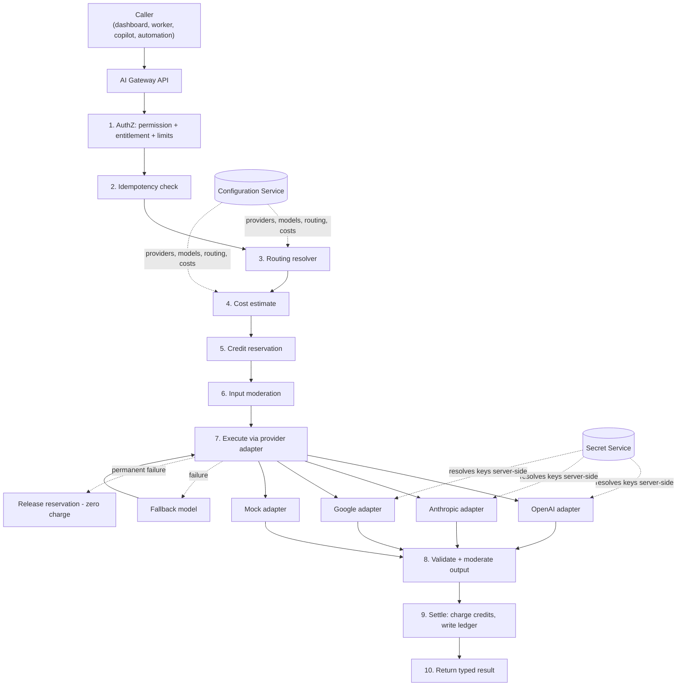
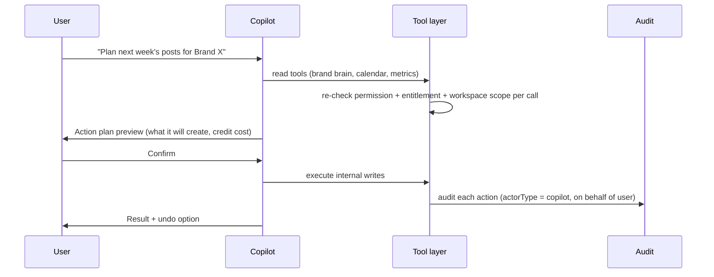

# BrandSpace — AI Gateway

> **الملخص التنفيذي بالعربية**
>
> **بوابة الذكاء الاصطناعي** هي الطبقة المركزية التي تمر عبرها **كل** طلبات الذكاء الاصطناعي في المنصة. لا يتصل أي كود بمزود خارجي مباشرة.
>
> **الفكرة الأساسية:** مالك المنصة يضيف بيانات اعتماد المزودين **مرة واحدة** في مركز التحكم، ثم تستهلك مساحات عمل العملاء الخدمة
> حسب خطتهم واستحقاقاتهم وحدودهم ورصيدهم — **دون أن يرى العميل مفتاح المنصة أبدًا**.
>
> **تدعم البوابة:** النصوص، الصور، الفيديو، الصوت، التضمينات (Embeddings)، والمراجعة الأخلاقية (Moderation).
>
> **آلية الحماية المالية:** كل طلب يمر بدورة **حجز → تنفيذ → تسوية**:
> يُحجز الرصيد قبل الاستدعاء، ويُخصم فعليًا فقط عند النجاح، ويُحرَّر بالكامل عند الفشل — **لا خصم عند الفشل، ولا خصم مزدوج عند إعادة المحاولة**.
> كل ذلك مسجَّل في **دفتر استخدام ثابت** يوضح التكلفة الحقيقية للمزود مقابل الرصيد المخصوم، لحساب هامش الربح.
>
> **التوجيه (Routing) قابل للتهيئة بالكامل:** كل مهمة (كتابة تعليق، أفكار، خطة شهرية، استراتيجية، شرح تحليلات، المساعد الذكي، توليد صورة،
> توليد فيديو، مراجعة، استرجاع معرفة العلامة) يمكن ربطها بنموذج أساسي ونماذج بديلة، مع مهلة زمنية وسقف تكلفة — دون تعديل الكود.

---

## 1. Responsibilities

The AI Gateway is the single point of contact between BrandSpace and any AI provider. It owns:

1. **Abstraction** — a provider-agnostic interface per modality.
2. **Routing** — task → model chain, resolved from configuration.
3. **Authorization** — the caller's permissions, entitlements, and limits.
4. **Economics** — reservation, cost capture, credit charging, budgets, margin.
5. **Reliability** — timeouts, retries, fallbacks, circuit breakers, health.
6. **Safety** — moderation, prompt-injection containment, output validation.
7. **Observability** — an immutable usage ledger and an audit-safe request record.

**Nothing in the product calls a provider SDK directly.** A lint rule blocks provider SDK imports outside
`packages/ai-gateway`.

---

## 2. Architecture



---

## 3. Provider Adapter Interface

Every provider implements a narrow contract. Adding a provider means writing one adapter and adding
configuration — no changes anywhere else.

```ts
interface AIProviderAdapter {
  readonly key: string;
  readonly supportedModalities: Modality[];   // text | image | video | voice | embedding | moderation

  validateConfig(config: ProviderConfig): Promise<ValidationResult>;
  testConnection(ctx: AdapterContext): Promise<ConnectionTestResult>;
  health(ctx: AdapterContext): Promise<HealthStatus>;
  listModels?(ctx: AdapterContext): Promise<ProviderModelDescriptor[]>;

  generateText?(req: TextRequest, ctx: AdapterContext): Promise<TextResult>;
  generateImage?(req: ImageRequest, ctx: AdapterContext): Promise<ImageResult>;
  generateVideo?(req: VideoRequest, ctx: AdapterContext): Promise<VideoResult>;
  generateSpeech?(req: SpeechRequest, ctx: AdapterContext): Promise<SpeechResult>;
  transcribe?(req: TranscribeRequest, ctx: AdapterContext): Promise<TranscriptResult>;
  embed?(req: EmbeddingRequest, ctx: AdapterContext): Promise<EmbeddingResult>;
  moderate?(req: ModerationRequest, ctx: AdapterContext): Promise<ModerationResult>;

  // Normalizes provider errors into the gateway's taxonomy
  classifyError(error: unknown): GatewayErrorClass;
  // Reports usage units so cost is computed uniformly
  extractUsage(raw: unknown): UsageUnits;
}
```

**`AdapterContext`** carries: resolved credential (in memory only), base URL, timeout, abort signal,
trace context, and the request ID. It never carries customer identity beyond what the provider needs.

**Error taxonomy** (uniform across providers): `auth_error` · `rate_limited` · `quota_exceeded` ·
`invalid_request` · `content_filtered` · `context_too_long` · `model_unavailable` · `provider_unavailable` ·
`timeout` · `network_error` · `unknown`. Retryability, fallback eligibility, and user-facing messaging are
derived from this class, not from provider-specific strings.

### 3.1 Configurable base URL
Every provider has a configurable `baseUrl`. This supports self-hosted gateways, regional endpoints, proxies,
and Azure/Bedrock-style deployments without a code change. The URL is validated (HTTPS, allowlisted host
pattern) before activation.

### 3.2 The Mock adapter
A first-class, always-present adapter used in development, tests, and the first vertical slice. It returns
deterministic, latency-simulated, cost-simulated responses so the entire credit and ledger pipeline can be
proven end-to-end **before any real provider credential exists**.

---

## 4. Model Registry

Models are configuration, not constants.

| Field | Purpose |
|---|---|
| `providerId`, `key`, `displayName` | Identity |
| `modality` | text / image / video / voice / embedding / moderation |
| `capabilities` | context window, max output, streaming, tool use, JSON mode, languages, image sizes, video length |
| `inputCostPerUnitMinor`, `outputCostPerUnitMinor`, `unit`, `currency` | Cost basis for margin |
| `qualityTier` | `fast` \| `balanced` \| `premium` — lets routing express intent, not model names |
| `status` | `available` \| `beta` \| `deprecated` \| `disabled` |
| `disableSwitch` | Immediate kill switch — a disabled model is unusable by any rule, instantly |

Registry changes are validated: routing rules may not reference a disabled or missing model, and cost fields
must be present before a model can be activated.

---

## 5. Task Routing

### 5.1 Task catalogue

| Task key | Modality | Typical tier | Notes |
|---|---|---|---|
| `caption.generate` | text | fast/balanced | High volume, latency-sensitive, per-platform constraints |
| `ideas.generate` | text | fast | Short outputs, brainstorming |
| `plan.monthly` | text | premium | Long, structured JSON output; high value |
| `strategy.generate` | text | premium | Longest context (Brand Brain + market context) |
| `analytics.explain` | text | balanced | Grounded in metric data; must not hallucinate numbers |
| `copilot.chat` | text | balanced/premium | Tool-calling, streaming, multi-turn |
| `image.generate` | image | balanced | Per-image cost; brand palette guidance |
| `video.generate` | video | premium | Long-running, async, high cost — always queued |
| `moderation.check` | moderation | fast | Cheap, mandatory on ingest and pre-publish |
| `brand.retrieve` | embedding | fast | Brand Brain chunk embedding + query embedding |
| `content.translate` | text | balanced | ar↔en with brand glossary preservation |
| `voice.synthesize` | voice | balanced | Optional, post-MVP |

**Each task can use a different model.** That mapping lives entirely in `AIRoutingRule`.

### 5.2 Routing rule

```yaml
taskKey: caption.generate
scope: global                 # global | plan | workspace
qualityTier: balanced
primaryModel: <modelId>
fallbackModels: [<modelId>, <modelId>]   # ordered
parameters:
  temperature: 0.7
  maxOutputTokens: 800
  promptTemplateVersion: 4
timeoutMs: 20000
maxCostPerRequestMinor: 300
retryPolicy:
  maxAttempts: 3
  backoff: exponential
  jitter: true
  retryOn: [rate_limited, provider_unavailable, timeout, network_error]
```

**Resolution order:** workspace rule → plan rule → global rule. Within a scope, highest `priority` wins.
If no rule resolves, the request fails with a clear configuration error and an owner alert — the gateway
never silently guesses a model.

### 5.3 Fallback semantics
1. Try the primary model.
2. On a **fallback-eligible** error class (`provider_unavailable`, `rate_limited`, `model_unavailable`,
   `timeout`), try the next model in the chain.
3. `invalid_request`, `content_filtered`, and `context_too_long` are **not** fallback-eligible — a different
   model would fail the same way, or would mask a real problem.
4. Every attempted model is recorded in `AIRequest.attemptedModelIds`.
5. Cost accrues per attempt from the provider, but the **customer is charged once**, based on the successful
   attempt (see §7.4). Failed-attempt provider cost is absorbed and reported in margin analytics.
6. If the whole chain fails, the request fails, the reservation is released, and the user gets an actionable
   error.

### 5.4 BYOK (Bring Your Own Key)
Available on higher plans as a feature entitlement (`ai.byok`).

- The customer supplies a provider key, stored via the same vault mechanism, workspace-scoped, and **never
  readable back** — only masked metadata.
- Routing uses the customer's credential in place of the platform's; the model registry and routing rules
  still apply.
- **Credit accounting for BYOK** charges a reduced platform fee (configuration-defined) rather than full
  credit cost, since the customer pays the provider directly. Provider cost is recorded as `0` to BrandSpace
  and the ledger marks `byok: true`, so margin reporting stays accurate.
- BYOK failures are attributed to the customer's key and surfaced clearly (invalid key, quota exceeded) without
  falling back to the platform key unless the customer explicitly enables that.

---

## 6. Request Lifecycle

```mermaid
sequenceDiagram
  participant U as Caller
  participant G as Gateway
  participant W as CreditWallet (Postgres)
  participant P as Provider
  participant L as Usage Ledger

  U->>G: request(task, input, idempotencyKey)
  G->>G: authorize (permission + entitlement + limits + budget)
  G->>G: idempotency lookup → replay if seen
  G->>G: resolve routing rule + model
  G->>G: estimate cost → estimate credits
  G->>W: BEGIN; SELECT ... FOR UPDATE; reserve credits
  W-->>G: reservation ok (or insufficient_credits)
  G->>G: input moderation
  G->>P: call model (timeout, abort signal)
  alt success
    P-->>G: response + usage
    G->>G: validate + moderate output
    G->>W: BEGIN; settle reservation → charge actual credits
    G->>L: append immutable ledger row (cost, credits, model)
    G-->>U: typed result
  else retryable failure
    G->>P: retry / fallback model
  else permanent failure
    G->>W: release reservation in full (zero charge)
    G->>L: append failed-request row (cost recorded, credits = 0)
    G-->>U: typed error
  end
```

### 6.1 Status model
`pending → reserved → running → (succeeded | failed | timeout | cancelled | moderation_blocked)`

A sweeper reconciles requests stuck in `running` past their timeout: the reservation is released and the
request is marked `timeout`. **No reservation can outlive its request.**

---

## 7. Credit Accounting

### 7.1 Why credits
Customers should not reason about tokens, per-model pricing, or provider changes. A **credit** is a stable
internal unit. The platform absorbs provider price volatility and controls margin centrally.

### 7.2 Cost formula (all inputs are configuration)

```
providerCost   = Σ (usageUnits × unitCostFromModelRegistry)
creditsCharged = ceil( creditCost(taskKey, modelId, usageUnits) × workspaceMultiplier )
```

`creditCost` is defined per task and model in the `ai.credit-costs` configuration domain — as a base cost plus
a per-unit component. The Admin credit-cost editor shows the implied margin at the configured provider cost
and warns when a change would drive margin below a configured floor.

### 7.3 Reserve → confirm → settle

| Phase | Action | Guarantee |
|---|---|---|
| **Reserve** | Estimate credits generously; `SELECT … FOR UPDATE` on the wallet; write a `reservation` transaction; increment `reservedBalance` | Prevents concurrent overspend; `CHECK (balance >= 0)` makes negative impossible |
| **Confirm** | Provider succeeded and output validated | Only now is a charge possible |
| **Settle** | Replace the reservation with a `usage_charge` for the **actual** amount; release any excess | Customer never pays for an over-estimate |
| **Release** | On any failure, cancel the reservation in full | **Zero charge for failed requests** |

All four phases are idempotent on `AIRequest.idempotencyKey` and `CreditTransaction.idempotencyKey`.

### 7.4 The three guarantees

1. **No charge for failure.** Any terminal non-success status releases the reservation completely. Provider
   cost incurred on failed attempts is recorded for margin analysis but never billed to the customer.
2. **No duplicate charge on retry.** Retries reuse the same `AIRequest` and the same reservation. A duplicate
   inbound request with the same idempotency key returns the original result without touching the wallet.
3. **No negative balance.** Wallet row lock + database `CHECK` constraint + reservation-before-execution.
   Under concurrency, the second request sees the reserved amount and is rejected with `insufficient_credits`.

### 7.5 Grant types and consumption order

| Type | Behavior |
|---|---|
| `plan_grant` | Monthly, on billing-cycle reset; rollover per plan policy |
| `addon_purchase` | Purchased packs; typically no expiry or a long one |
| `promotional_grant` | Campaign/goodwill credits; usually expiring |
| `admin_adjustment` | Manual, reason-required, audited |

Consumption is **FIFO by expiry date** (soonest-expiring first), so customers are never surprised by expiring
credits they could have used. Each `usage_charge` records the `sourceBucketId` it drew from.

### 7.6 Resets, expiry, warnings, limits

- **Monthly reset** runs on the subscription's billing-cycle boundary (not calendar month), writing a `reset`
  transaction. Rollover behavior is plan configuration.
- **Expiry** is a scheduled sweep writing `expiry` transactions; customers are warned 7 days before.
- **Low balance** warnings at configurable thresholds (default 20% and 5%), in-app and by email, rate-limited
  to avoid spam.
- **Hard limit:** at zero balance, AI actions are refused with a clear, actionable error and an upgrade path.
  Non-AI functionality continues to work.
- **Overage:** optional per plan — allow beyond zero up to a cap, billed on the next invoice, with explicit
  customer opt-in and a visible running total.

### 7.7 Refunds
A confirmed charge can be reversed (support decision, provider incident, or a defective result) with a
`refund` transaction referencing the original `usage_charge`. Ledger rows are never edited or deleted.

---

## 8. Budgets and Limits

| Level | Control | Behavior on breach |
|---|---|---|
| Per request | `maxCostPerRequestMinor` | Reject before calling the provider |
| Per user | requests/minute, credits/day | `429` with retry guidance |
| Per workspace | credits/day, credits/month, concurrent requests | Warn at threshold, block at hard limit |
| Per plan | aggregate ceilings | Applied as defaults to member workspaces |
| Per provider | concurrency and RPM caps | Queue and shed to fallback |
| Platform-wide | daily and monthly provider spend caps | Alert, then degrade to cheaper tiers, then block non-critical tasks |

**Cost alerts:** daily and monthly thresholds per provider and platform-wide, with configurable recipients.
A projected-overrun alert fires when the current burn rate would exceed the monthly cap.

---

## 9. Reliability

| Control | Behavior |
|---|---|
| **Timeouts** | Per task and per model; the abort signal reaches the HTTP layer so no request outlives its deadline |
| **Retries** | Exponential backoff with jitter, only for retryable classes, capped by attempt count and total deadline |
| **Circuit breaker** | Per provider; opens on sustained failure, half-opens to probe, closes on recovery. While open, routing skips straight to fallback |
| **Health checks** | Periodic lightweight probes; results feed Admin, the Status page, and the breaker |
| **Rate limit handling** | Honor `Retry-After`; internal token buckets keep us under provider quotas |
| **Long-running tasks** | Video and batch tasks are async jobs with polling/callbacks; the client sees a request status, not a hung connection |
| **Graceful degradation** | If all providers for a task are down, queue the request (where semantics allow) or fail fast with a clear message — never a silent partial result |
| **Idempotency** | Same key ⇒ same result, no re-execution, no re-charge |

---

## 10. Safety and Content Moderation

1. **Input moderation** on user-supplied prompts and on uploaded content used as context.
2. **Output moderation** before any generated content is persisted or scheduled for publishing.
3. **Prompt-injection containment:** retrieved Brand Brain content, uploaded documents, and social content are
   inserted as clearly delimited *untrusted data*. System instructions are immutable and are never
   reconstructed from retrieved text. Instructions found inside retrieved content are ignored by policy and
   flagged.
4. **Brand rule enforcement:** the brand's do/don't rules are applied both as prompt guidance and as a
   post-generation check; violations are surfaced to the user rather than silently corrected.
5. **Structured output validation:** every structured response is parsed with a Zod schema; a parse failure is
   a retryable error, never persisted data.
6. **No autonomous external effects.** The gateway itself never publishes, sends, or pays.
7. **Blocked results are not charged** — `moderation_blocked` releases the reservation.

---

## 11. Data Handling and Privacy

| Rule | Detail |
|---|---|
| Raw prompts/responses | **Not persisted by default.** `AIRequest.inputSummary` holds audit-safe metadata: task, language, token counts, Brand Brain citation IDs, template version |
| Opt-in retention | A workspace may enable short-term retention for debugging, with a visible notice and a fixed TTL |
| Provider training | Only providers configured with no-training / zero-retention terms are eligible for production; this is recorded per provider in configuration |
| Tenant scoping | Retrieval is workspace- and brand-scoped at query level; one tenant's context can never enter another's request |
| PII | Detected PII in prompts may be redacted per policy before leaving the platform |
| Sub-processors | Active AI providers are published on the Security page |

---

## 12. Observability

**Per request:** `AIRequest` row + trace span with attributes (task, model chain, provider, latency, usage
units, provider cost, credits, status, failure class, workspace, byok flag).

**Ledger:** `AIUsageLedger` is the immutable financial truth — the source for all cost, credit, and margin
reporting.

**Metrics:** requests/sec by task and model · success and failure rate by class · p50/p95/p99 latency ·
fallback rate · credits consumed · provider cost per hour · cost per successful request · reservation
leak count (must be zero) · moderation block rate.

**Alerts:** provider error rate > 10% (10 min) · fallback rate > 30% · p95 latency beyond target ·
daily cost above cap · reservation leaks detected · ledger/balance drift · routing rule referencing a
disabled model.

---

## 13. AI Copilot

The Copilot is a **permission-aware agent** built on the gateway. It is the only component allowed to plan
and execute multi-step internal actions on the user's behalf.

### 13.1 Capabilities

| Capability | Class |
|---|---|
| Read Brand Brain and cite it | read |
| Explain analytics with real numbers | read |
| Create a campaign | internal write |
| Create content drafts | internal write |
| Suggest schedules | read / proposal |
| Add drafts to the calendar | internal write |
| Prepare approval requests | internal write |
| Propose automations | proposal (creation requires confirmation) |
| Execute allowed internal actions | internal write |

### 13.2 Action classes and policy

| Class | Examples | Policy |
|---|---|---|
| **Read** | retrieve Brand Brain, read metrics, list content | Allowed if the user may read it. Never returns data the user cannot see |
| **Internal write** | create draft, create campaign, add to calendar, request approval | Allowed if the user has the permission and entitlement. Shows what was done, and is undoable |
| **High-impact** | publish, delete, disconnect, bulk changes, spending credits above a threshold | **Preview + explicit confirmation required.** Never executed on the model's own decision |
| **Forbidden** | pay, refund, change plan, send external communications, change roles/permissions, touch secrets, cross-workspace anything | Not exposed as tools at all |

### 13.3 Execution contract



**Guarantees**
1. Every tool call is authorized **server-side** against the user's real permissions. The model's assertions
   about what it may do are ignored.
2. Workspace scope is bound to the session and cannot be changed by the conversation.
3. Entitlements are checked per tool — a plan without `automations` has no automation tool available.
4. The action plan and every tool result are recorded and shown to the user.
5. **Undo** is supported wherever technically possible (created drafts, calendar placements, campaign
   creation, approval requests). Actions that cannot be undone are always in the high-impact class and
   therefore always confirmed first.
6. The Copilot **never** silently publishes, deletes, disconnects, pays, or sends external communications.
7. Credits consumed by Copilot actions are charged to the workspace wallet through the normal pipeline and
   attributed to the requesting user.

---

## 14. Brand Brain Retrieval

1. **Ingest:** documents are chunked with overlap, embedded via `brand.retrieve`, and stored in
   `BrandKnowledge` with `workspaceId` and `brandId`.
2. **Query:** the user's intent is embedded; ANN search runs **with the workspace and brand predicate inside
   the query**, never as a post-filter.
3. **Rerank and assemble:** top chunks plus structured brand fields (tone, do/don't, offers) form the context.
4. **Cite:** every generation records which `BrandKnowledge` rows and versions it used, shown to the user as
   "based on: Tone of Voice v3, Audience v2" so output is explainable and correctable.
5. **Re-embed:** when the embedding model changes, affected rows are marked `stale` and re-embedded by a
   background job; retrieval never mixes embedding spaces.

---

## 15. Testing the Gateway

| Test | Assertion |
|---|---|
| Mock end-to-end | Full reserve → execute → settle path produces a correct ledger and balance |
| Failure | Provider error ⇒ reservation released, balance unchanged, request `failed` |
| Timeout | Deadline exceeded ⇒ released, request `timeout`, no charge |
| Retry idempotency | Same idempotency key twice ⇒ one charge, one ledger row, same result |
| Concurrency | N parallel requests against a wallet with capacity for N−1 ⇒ exactly N−1 succeed, no negative balance |
| Fallback | Primary unavailable ⇒ fallback used, one charge, both models recorded |
| Non-fallback errors | `invalid_request` does not trigger fallback |
| Budget | Workspace daily cap reached ⇒ blocked before the provider is called |
| Model disable | Disabling a model makes routing to it fail immediately, even mid-session |
| Isolation | Workspace A's request can never retrieve B's Brand Brain chunks |
| Copilot authorization | A Content Creator's Copilot cannot invoke a publish tool |
| Ledger integrity | Replaying all transactions reproduces the wallet balance exactly |
| Moderation | Blocked input/output ⇒ no charge, clear status |
| BYOK | BYOK request uses the customer credential, records zero platform provider cost, charges the reduced fee |
