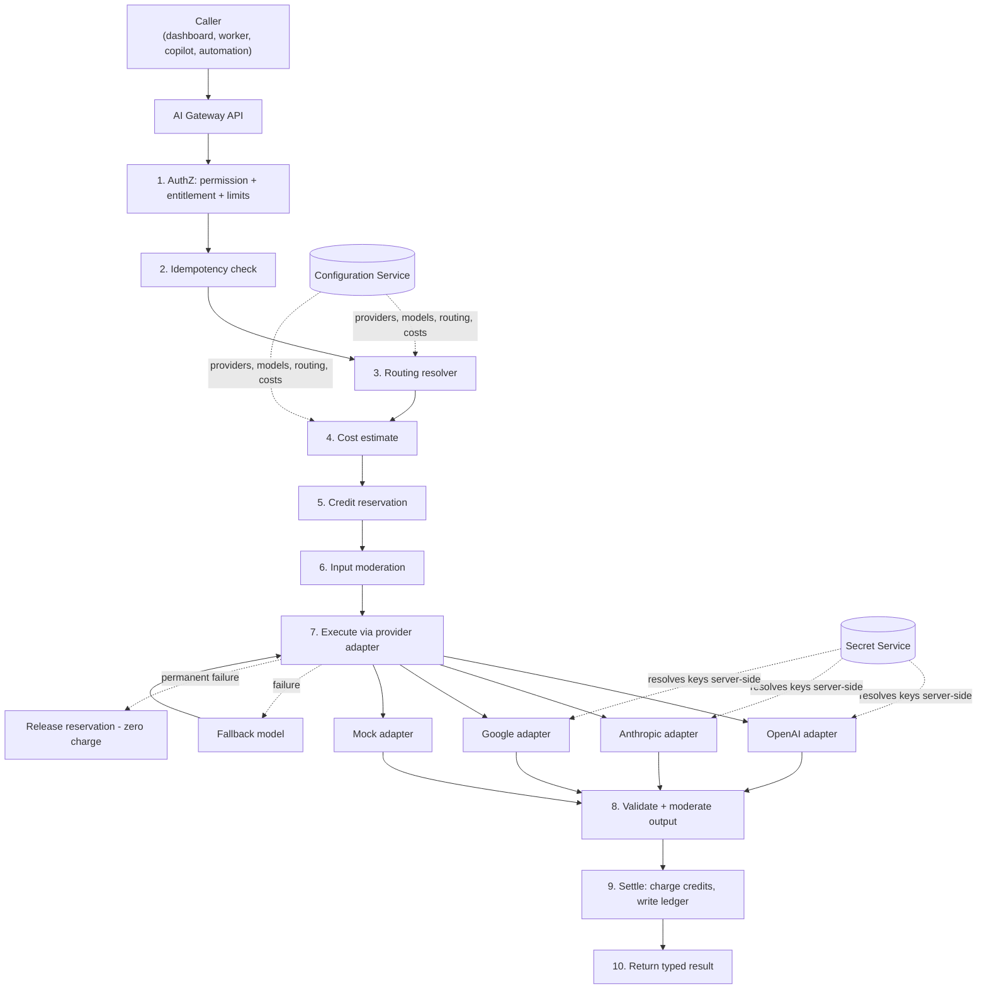
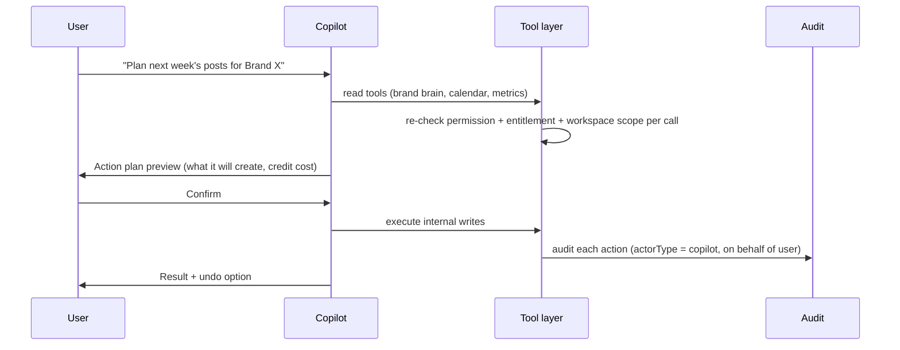

# BrandSpace — AI Gateway

> **الملخص التنفيذي بالعربية**
>
> **بوابة الذكاء الاصطناعي** هي الطبقة المركزية التي تمر عبرها **كل** طلبات الذكاء الاصطناعي في المنصة. لا يتصل أي كود بمزود خارجي مباشرة.
>
> **الفكرة الأساسية:** مالك المنصة يضيف بيانات اعتماد المزودين **مرة واحدة** في مركز التحكم، ثم تستهلك مساحات عمل العملاء الخدمة
> حسب خطتهم واستحقاقاتهم وحدودهم ورصيدهم — **دون أن يرى العميل مفتاح المنصة أبدًا**.
>
> **تدعم البوابة:** النصوص، الصور، الفيديو، الصوت، التضمينات (Embeddings)، والمراجعة الأخلاقية (Moderation).
>
> **آلية الحماية المالية:** كل طلب يمر بدورة **حجز → تنفيذ → تسوية**:
> يُحجز الرصيد قبل الاستدعاء، ويُخصم فعليًا فقط عند النجاح، ويُحرَّر بالكامل عند الفشل — **لا خصم عند الفشل، ولا خصم مزدوج عند إعادة المحاولة**.
> كل ذلك مسجَّل في **دفتر استخدام ثابت** يوضح التكلفة الحقيقية للمزود مقابل الرصيد المخصوم، لحساب هامش الربح.
>
> **التوجيه (Routing) قابل للتهيئة بالكامل:** كل مهمة (كتابة تعليق، أفكار، خطة شهرية، استراتيجية، شرح تحليلات، المساعد الذكي، توليد صورة،
> توليد فيديو، مراجعة، استرجاع معرفة العلامة) يمكن ربطها بنموذج أساسي ونماذج بديلة، مع مهلة زمنية وسقف تكلفة — دون تعديل الكود.

---

## 1. Responsibilities

The AI Gateway is the single point of contact between BrandSpace and any AI provider. It owns:

1. **Abstraction** — a provider-agnostic interface per modality.
2. **Routing** — task → model chain, resolved from configuration.
3. **Authorization** — the caller's permissions, entitlements, and limits.
4. **Economics** — reservation, cost capture, credit charging, budgets, margin.
5. **Reliability** — timeouts, retries, fallbacks, circuit breakers, health.
6. **Safety** — moderation, prompt-injection containment, output validation.
7. **Observability** — an immutable usage ledger and an audit-safe request record.

**Nothing in the product calls a provider SDK directly.** A lint rule blocks provider SDK imports outside
`packages/ai-gateway`.

---

## 2. Architecture



---

## 3. Provider Adapter Interface

Every provider implements a narrow contract. Adding a provider means writing one adapter and adding
configuration — no changes anywhere else.

```ts
interface AIProviderAdapter {
  readonly key: string;
  readonly supportedModalities: Modality[]; // text | image | video | voice | embedding | moderation

  validateConfig(config: ProviderConfig): Promise<ValidationResult>;
  testConnection(ctx: AdapterContext): Promise<ConnectionTestResult>;
  health(ctx: AdapterContext): Promise<HealthStatus>;
  listModels?(ctx: AdapterContext): Promise<ProviderModelDescriptor[]>;

  generateText?(req: TextRequest, ctx: AdapterContext): Promise<TextResult>;
  generateImage?(req: ImageRequest, ctx: AdapterContext): Promise<ImageResult>;
  generateVideo?(req: VideoRequest, ctx: AdapterContext): Promise<VideoResult>;
  generateSpeech?(req: SpeechRequest, ctx: AdapterContext): Promise<SpeechResult>;
  transcribe?(req: TranscribeRequest, ctx: AdapterContext): Promise<TranscriptResult>;
  embed?(req: EmbeddingRequest, ctx: AdapterContext): Promise<EmbeddingResult>;
  moderate?(req: ModerationRequest, ctx: AdapterContext): Promise<ModerationResult>;

  // Normalizes provider errors into the gateway's taxonomy
  classifyError(error: unknown): GatewayErrorClass;
  // Reports usage units so cost is computed uniformly
  extractUsage(raw: unknown): UsageUnits;
}
```

**`AdapterContext`** carries: resolved credential (in memory only), base URL, timeout, abort signal,
trace context, and the request ID. It never carries customer identity beyond what the provider needs.

**Error taxonomy** (uniform across providers): `auth_error` · `rate_limited` · `quota_exceeded` ·
`invalid_request` · `content_filtered` · `context_too_long` · `model_unavailable` · `provider_unavailable` ·
`timeout` · `network_error` · `unknown`. Retryability, fallback eligibility, and user-facing messaging are
derived from this class, not from provider-specific strings.

### 3.1 Configurable base URL

Every provider has a configurable `baseUrl`. This supports self-hosted gateways, regional endpoints, proxies,
and Azure/Bedrock-style deployments without a code change. The URL is validated (HTTPS, allowlisted host
pattern) before activation.

### 3.1.1 Provider eligibility — D-13 (approved 2026-09-13)

The owner approved the provider **architecture** — one primary plus one fallback per supported modality —
and deferred vendor selection. The recorded decision is:

> **Provider architecture approved; exact providers pending benchmark, privacy verification and owner approval.**

Vendor selection happens only after Arabic and English quality benchmarking, a current pricing comparison, a
privacy and data-processing review, confirmation that customer data is not used for provider training,
confirmation of zero retention or an acceptable equivalent, and owner approval of the final provider/model
routing table.

Three of those are recorded per provider and **enforced at activation** rather than trusted:

| Field                 | Gate                                                                                                                                                                                                                              |
| --------------------- | --------------------------------------------------------------------------------------------------------------------------------------------------------------------------------------------------------------------------------- |
| `noTrainingGuarantee` | An active provider must be confirmed not to train on customer data. This was a warning while D-13 was open; it is now an **error**                                                                                                |
| `dataRetentionPolicy` | `unverified` (the default), `zero_retention`, `limited_retention` or `retains_data`. An active provider may not be `unverified` — nobody reviewed it — or `retains_data`, which is not an acceptable equivalent to zero retention |
| `privacyReviewRef`    | Where the privacy and data-processing review is written down. Free text, and never a credential                                                                                                                                   |

A `draft` provider is left alone: the gates bind at activation, and a provider being assessed has by
definition not finished being assessed.

**No real production provider adapter exists.** The adapter contract and the Mock provider are built; adding
a vendor is one `classifyError` implementation once D-13's conditions are met.

### 3.2 The Mock adapter

A first-class, always-present adapter used in development, tests, and the first vertical slice. It returns
deterministic, latency-simulated, cost-simulated responses so the entire credit and ledger pipeline can be
proven end-to-end **before any real provider credential exists**.

---

## 4. Model Registry

Models are configuration, not constants.

| Field                                                                                   | Purpose                                                                                          |
| --------------------------------------------------------------------------------------- | ------------------------------------------------------------------------------------------------ |
| `providerId`, `key`, `displayName`                                                      | Identity                                                                                         |
| `modality`                                                                              | text / image / video / voice / embedding / moderation                                            |
| `capabilities`                                                                          | context window, max output, streaming, tool use, JSON mode, languages, image sizes, video length |
| `inputCostPerUnitMicroMinor`, `outputCostPerUnitMicroMinor`, `costUnit`, `costCurrency` | Cost basis for margin. **MICRO-MINOR**, a millionth of a minor unit — see the note below         |
| `qualityTier`                                                                           | `fast` \| `balanced` \| `premium` — lets routing express intent, not model names                 |
| `status`                                                                                | `available` \| `beta` \| `deprecated` \| `disabled`                                              |
| `disableSwitch`                                                                         | Immediate kill switch — a disabled model is unusable by any rule, instantly                      |

Registry changes are validated: routing rules may not reference a disabled or missing model, model keys must
be unique, and cost fields must be present before a model can be activated.

> **The Arabic quality gate — D-17 (approved 2026-09-13).** A model carries `qualityBenchmarkRef`, and
> validation refuses status `available` without it: no model reaches production customer routing until it
> has passed a documented side-by-side Arabic marketing-content benchmark. `beta` is deliberately exempt —
> beta is the status a model sits in _while_ it is being benchmarked, and a gate that blocked beta would
> make the evaluation impossible to run. The criteria and method are in **`docs/AI-QUALITY-BENCHMARK.md`**.

> **Why micro-minor and not minor.** A minor unit cannot express what providers charge. A text model at
> $0.15 per million input tokens costs 0.015 of a cent per thousand tokens; as an integer count of cents
> that is **zero**, so every text request would record a provider cost of nothing and the margin reporting
> below would show infinite margin on every row — precisely the number the margin floor exists to catch.
> One micro-minor is a millionth of a minor unit, which holds that price exactly as the integer `15000`.
> Both rates are nullable and default to null: a provider rate is a commercial fact, and a plausible-looking
> default would be indistinguishable from a real one on the margin screen.
>
> The same scale is used by `AIRequest.providerCostMicroMinor` and `AIUsageLedger.providerCostMicroMinor`.
> Credits stay in **milli-credits** (D-14) and the workspace multiplier is expressed in **basis points**, so
> no money or credit arithmetic anywhere in the gateway uses a floating-point number.

---

## 5. Task Routing

### 5.1 Task catalogue

| Task key            | Modality   | Typical tier     | Notes                                                    |
| ------------------- | ---------- | ---------------- | -------------------------------------------------------- |
| `caption.generate`  | text       | fast/balanced    | High volume, latency-sensitive, per-platform constraints |
| `ideas.generate`    | text       | fast             | Short outputs, brainstorming                             |
| `plan.monthly`      | text       | premium          | Long, structured JSON output; high value                 |
| `strategy.generate` | text       | premium          | Longest context (Brand Brain + market context)           |
| `analytics.explain` | text       | balanced         | Grounded in metric data; must not hallucinate numbers    |
| `copilot.chat`      | text       | balanced/premium | Tool-calling, streaming, multi-turn                      |
| `image.generate`    | image      | balanced         | Per-image cost; brand palette guidance                   |
| `video.generate`    | video      | premium          | Long-running, async, high cost — always queued           |
| `moderation.check`  | moderation | fast             | Cheap, mandatory on ingest and pre-publish               |
| `brand.retrieve`    | embedding  | fast             | Brand Brain chunk embedding + query embedding            |
| `content.translate` | text       | balanced         | ar↔en with brand glossary preservation                   |
| `voice.synthesize`  | voice      | balanced         | Optional, post-MVP                                       |

**Each task can use a different model.** That mapping lives entirely in `AIRoutingRule`.

> **MVP scope — D-16 (approved 2026-09-13).** The MVP covers **text generation and transformation** and
> **image generation and editing**. **Video generation is excluded** and recorded as a **Phase 7+ candidate
> requiring a separate cost, latency and product review**; voice remains post-MVP.
>
> `video.generate` and `voice.synthesize` stay in the catalogue above — deleting them would erase the record
> that they are known, deliberately deferred capabilities — but they are marked `mvpApproved: false`, and
> `resolveRoute` refuses them. An out-of-scope task therefore cannot be served even if a routing rule for it
> were somehow activated.
>
> D-16 governs customer-facing **generation** modalities. `moderation.check` and `brand.retrieve` are
> internal plumbing — the gateway's own moderation step and Brand Brain retrieval — and are unaffected.

> **PHASE 8 GAVE `image.generate` ITS CUSTOMER SURFACE.** The AI Creative Studio is the only place a
> customer reaches it, and it changes nothing about the rules above: the same reserve → execute →
> settle, the same idempotency key, the same ledger. Three things about it are worth stating because
> each was a decision rather than an omission:
>
> - **IMAGE ONLY. NO VIDEO AND NO VOICE.** D-16 still holds and `resolveRoute` still refuses both.
> - **THE OUTPUT IS NOT PERSISTED BY THE GATEWAY** (`persistOutput: false`, D-78). An image's bytes
>   belong in the Asset Library, which owns files, versions, scanning and retention. THE CONSEQUENCE
>   IS LOAD-BEARING: a gateway REPLAY therefore carries no bytes, so the Creative Studio looks for the
>   asset its own idempotency key already produced BEFORE asking the gateway, and again after a
>   replay. Without that, retrying a generation reported a failure for work that had succeeded.
> - **NOTHING NAMES A MODEL, A PROVIDER OR A PROMPT ON THE CUSTOMER SURFACE** — a source guard asserts
>   it across the whole dashboard, not just the Studio (AC-28.8).

### 5.2 Routing rule

```yaml
taskKey: caption.generate
scope: global # global | plan | workspace
qualityTier: balanced
primaryModel: <modelId>
fallbackModels: [<modelId>, <modelId>] # ordered
parameters:
  temperature: 0.7
  maxOutputTokens: 800
  promptTemplateVersion: 4
timeoutMs: 20000
maxCostPerRequestMinor: 300
retryPolicy:
  maxAttempts: 3 # capped at 5
  backoff: exponential # none | fixed | exponential
  initialDelayMs: 250
  jitter: true
moderateInput: false # §10.1; requires moderationModelKey when true
moderationModelKey: null
```

> **`retryOn` is deliberately not configurable.** Which classes may be retried is derived from the failure
> taxonomy in §3, not from a list an operator can widen: making `content_filtered` retryable from a config
> screen would turn a moderation refusal into a paid retry loop. `maxAttempts` is capped for the same reason.
>
> **The retry policy and the fallback chain share ONE deadline.** Attempts do not each get a fresh
> `timeoutMs`, and a retry is handed only the budget the earlier attempt left behind — otherwise a
> reservation is held for `maxAttempts × timeoutMs` rather than `timeoutMs`.
>
> **The reservation is sized on the DEAREST model in the chain**, not on the primary. One reservation covers
> the whole attempt sequence, and a fallback may be priced higher than the model that failed; sizing on the
> primary would make that fallback settle above its reservation, which the database refuses outright.

**Resolution order:** workspace rule → plan rule → global rule. Within a scope, highest `priority` wins.
If no rule resolves, the request fails with a clear configuration error and an owner alert — the gateway
never silently guesses a model.

### 5.3 Fallback semantics

1. Try the primary model.
2. On a **fallback-eligible** error class (`provider_unavailable`, `rate_limited`, `model_unavailable`,
   `timeout`), try the next model in the chain.
3. `invalid_request`, `content_filtered`, and `context_too_long` are **not** fallback-eligible — a different
   model would fail the same way, or would mask a real problem.
4. Every attempted model is recorded in `AIRequest.attemptedModelIds`.
5. Cost accrues per attempt from the provider, but the **customer is charged once**, based on the successful
   attempt (see §7.4). Failed-attempt provider cost is absorbed and reported in margin analytics.
6. If the whole chain fails, the request fails, the reservation is released, and the user gets an actionable
   error.

### 5.4 BYOK (Bring Your Own Key)

Available on higher plans as a feature entitlement (`ai.byok`).

- The customer supplies a provider key, stored via the same vault mechanism, workspace-scoped, and **never
  readable back** — only masked metadata.
- Routing uses the customer's credential in place of the platform's; the model registry and routing rules
  still apply.
- **Credit accounting for BYOK** charges a reduced platform fee (configuration-defined) rather than full
  credit cost, since the customer pays the provider directly. Provider cost is recorded as `0` to BrandSpace
  and the ledger marks `byok: true`, so margin reporting stays accurate.
- BYOK failures are attributed to the customer's key and surfaced clearly (invalid key, quota exceeded) without
  falling back to the platform key unless the customer explicitly enables that.

---

## 6. Request Lifecycle

```mermaid
sequenceDiagram
  participant U as Caller
  participant G as Gateway
  participant W as CreditWallet (Postgres)
  participant P as Provider
  participant L as Usage Ledger

  U->>G: request(task, input, idempotencyKey)
  G->>G: authorize (permission + entitlement + limits + budget)
  G->>G: idempotency lookup → replay if seen
  G->>G: resolve routing rule + model
  G->>G: estimate cost → estimate credits
  G->>W: BEGIN; SELECT ... FOR UPDATE; reserve credits
  W-->>G: reservation ok (or insufficient_credits)
  G->>G: input moderation
  G->>P: call model (timeout, abort signal)
  alt success
    P-->>G: response + usage
    G->>G: validate + moderate output
    G->>W: BEGIN; settle reservation → charge actual credits
    G->>L: append immutable ledger row (cost, credits, model)
    G-->>U: typed result
  else retryable failure
    G->>P: retry / fallback model
  else permanent failure
    G->>W: release reservation in full (zero charge)
    G->>L: append failed-request row (cost recorded, credits = 0)
    G-->>U: typed error
  end
```

### 6.1 Status model

`pending → reserved → running → (succeeded | failed | timeout | cancelled | moderation_blocked)`

A sweeper reconciles requests stuck in `running` past their timeout: the reservation is released and the
request is marked `timeout`. **No reservation can outlive its request.**

---

## 7. Credit Accounting

### 7.1 Why credits

Customers should not reason about tokens, per-model pricing, or provider changes. A **credit** is a stable
internal unit. The platform absorbs provider price volatility and controls margin centrally.

### 7.2 Cost formula (all inputs are configuration)

```
providerCost   = Σ (usageUnits × unitCostFromModelRegistry)
creditsCharged = ceil( creditCost(taskKey, modelId, usageUnits) × workspaceMultiplier )
```

`creditCost` is defined per task and model in the **`ai.credit-rules`** configuration domain — as a base cost
plus a per-unit component. The Admin credit-cost editor shows the implied margin at the configured provider
cost and warns when a change would drive margin below a configured floor.

> **The target gross margin is 65% — D-15 (approved 2026-09-13),** and a credit price is DERIVED from a
> measured provider cost rather than marked up:
>
> ```
> customer price = provider cost / (1 - target gross margin)
> ```
>
> This is the direction people get wrong. A 65% target is **not** "cost plus 65%": marking a cost of 100 up
> by 65% gives 165, on which the margin is 65/165 ≈ **39.4%**. Dividing by (1 − 0.65) gives ≈285.7, and
> (285.7 − 100) / 285.7 = **65%** exactly. `requiredPriceMicroMinor()` implements the division, and a unit
> test asserts the two produce different numbers so the markup can never be substituted by accident.
>
> The 65% is an internal commercial **target**, not a hard-coded markup (CLAUDE.md §2.2). It lives in
> `ai.credit-rules.targetGrossMarginPercent`, is versioned with every other configuration value, and
> defaults to `null` — no margin is named in source. It is a separate number from
> `minimumGrossMarginPercent`, the **floor** below which a change is flagged: the target is where pricing
> aims, the floor is where you are warned.
>
> **Final per-action credit prices are not set.** They will be calibrated from real provider benchmarks once
> D-13 and D-17 are cleared. Published package prices are unchanged.

> **Margin is reported as UNKNOWN until a credit is priced.** Revenue is denominated in credits and cost in
> money, and nothing in the system converts between them until the owner sets `creditValueMicroMinor` — what
> one whole credit is worth. That value is an owner commercial decision (D-15 / D-16) and defaults to `null`.
> While it is null the margin assessment returns `null` rather than 100%, and the floor check does not run at
> all: reporting a healthy margin for an unpriced platform would be worse than reporting nothing.
>
> Rounding directions are deliberate. **Our own cost rounds up**, because understating it makes a
> loss-making model look profitable. **Credits round up once at the end**, not per component, because
> rounding the base and the per-unit part separately gives away a fraction of a credit on every request with
> nothing in the ledger to show for it.

### 7.3 Reserve → confirm → settle

| Phase       | Action                                                                                                                           | Guarantee                                                                       |
| ----------- | -------------------------------------------------------------------------------------------------------------------------------- | ------------------------------------------------------------------------------- |
| **Reserve** | Estimate credits generously; `SELECT … FOR UPDATE` on the wallet; write a `reservation` transaction; increment `reservedBalance` | Prevents concurrent overspend; `CHECK (balance >= 0)` makes negative impossible |
| **Confirm** | Provider succeeded and output validated                                                                                          | Only now is a charge possible                                                   |
| **Settle**  | Replace the reservation with a `usage_charge` for the **actual** amount; release any excess                                      | Customer never pays for an over-estimate                                        |
| **Release** | On any failure, cancel the reservation in full                                                                                   | **Zero charge for failed requests**                                             |

All four phases are idempotent on `AIRequest.idempotencyKey` and `CreditTransaction.idempotencyKey`.

### 7.4 The three guarantees

1. **No charge for failure.** Any terminal non-success status releases the reservation completely. Provider
   cost incurred on failed attempts is recorded for margin analysis but never billed to the customer.
2. **No duplicate charge on retry.** Retries reuse the same `AIRequest` and the same reservation. A duplicate
   inbound request with the same idempotency key returns the original result without touching the wallet.
3. **No negative balance.** Wallet row lock + database `CHECK` constraint + reservation-before-execution.
   Under concurrency, the second request sees the reserved amount and is rejected with `insufficient_credits`.

### 7.5 Grant types and consumption order

| Type                | Behavior                                                  |
| ------------------- | --------------------------------------------------------- |
| `plan_grant`        | Monthly, on billing-cycle reset; rollover per plan policy |
| `addon_purchase`    | Purchased packs; typically no expiry or a long one        |
| `promotional_grant` | Campaign/goodwill credits; usually expiring               |
| `admin_adjustment`  | Manual, reason-required, audited                          |

Consumption is **FIFO by expiry date** (soonest-expiring first), so customers are never surprised by expiring
credits they could have used. Each `usage_charge` records the `sourceBucketId` it drew from.

### 7.6 Resets, expiry, warnings, limits

- **Monthly reset** runs on the subscription's billing-cycle boundary (not calendar month), writing a `reset`
  transaction. Rollover behavior is plan configuration.
- **Expiry** is a scheduled sweep writing `expiry` transactions; customers are warned 7 days before.
- **Low balance** warnings at configurable thresholds (default 20% and 5%), in-app and by email, rate-limited
  to avoid spam.
- **Hard limit:** at zero balance, AI actions are refused with a clear, actionable error and an upgrade path.
  Non-AI functionality continues to work.
- **Overage:** optional per plan — allow beyond zero up to a cap, billed on the next invoice, with explicit
  customer opt-in and a visible running total.

### 7.7 Refunds

A confirmed charge can be reversed (support decision, provider incident, or a defective result) with a
`refund` transaction referencing the original `usage_charge`. Ledger rows are never edited or deleted.

---

## 8. Budgets and Limits

| Level         | Control                                         | Behavior on breach                                                  |
| ------------- | ----------------------------------------------- | ------------------------------------------------------------------- |
| Per request   | `maxCostPerRequestMinor`                        | Reject before calling the provider                                  |
| Per user      | requests/minute, credits/day                    | `429` with retry guidance                                           |
| Per workspace | credits/day, credits/month, concurrent requests | Warn at threshold, block at hard limit                              |
| Per plan      | aggregate ceilings                              | Applied as defaults to member workspaces                            |
| Per provider  | concurrency and RPM caps                        | Queue and shed to fallback                                          |
| Platform-wide | daily and monthly provider spend caps           | Alert, then degrade to cheaper tiers, then block non-critical tasks |

**Cost alerts:** daily and monthly thresholds per provider and platform-wide, with configurable recipients.
A projected-overrun alert fires when the current burn rate would exceed the monthly cap.

---

## 9. Reliability

| Control                  | Behavior                                                                                                                                          |
| ------------------------ | ------------------------------------------------------------------------------------------------------------------------------------------------- |
| **Timeouts**             | Per task and per model; the abort signal reaches the HTTP layer so no request outlives its deadline                                               |
| **Retries**              | Exponential backoff with jitter, only for retryable classes, capped by attempt count and total deadline                                           |
| **Circuit breaker**      | Per provider; opens on sustained failure, half-opens to probe, closes on recovery. While open, routing skips straight to fallback                 |
| **Health checks**        | Periodic lightweight probes; results feed Admin, the Status page, and the breaker                                                                 |
| **Rate limit handling**  | Honor `Retry-After`; internal token buckets keep us under provider quotas                                                                         |
| **Long-running tasks**   | Video and batch tasks are async jobs with polling/callbacks; the client sees a request status, not a hung connection                              |
| **Graceful degradation** | If all providers for a task are down, queue the request (where semantics allow) or fail fast with a clear message — never a silent partial result |
| **Idempotency**          | Same key ⇒ same result, no re-execution, no re-charge                                                                                             |

---

## 10. Safety and Content Moderation

1. **Input moderation** on user-supplied prompts and on uploaded content used as context.
2. **Output moderation** before any generated content is persisted or scheduled for publishing.
3. **Prompt-injection containment:** retrieved Brand Brain content, uploaded documents, and social content are
   inserted as clearly delimited _untrusted data_. System instructions are immutable and are never
   reconstructed from retrieved text. Instructions found inside retrieved content are ignored by policy and
   flagged.
4. **Brand rule enforcement:** the brand's do/don't rules are applied both as prompt guidance and as a
   post-generation check; violations are surfaced to the user rather than silently corrected.
5. **Structured output validation:** every structured response is parsed with a Zod schema; a parse failure is
   a retryable error, never persisted data.
6. **No autonomous external effects.** The gateway itself never publishes, sends, or pays.
7. **Blocked results are not charged** — `moderation_blocked` releases the reservation.

---

## 11. Data Handling and Privacy

| Rule                  | Detail                                                                                                                                                     |
| --------------------- | ---------------------------------------------------------------------------------------------------------------------------------------------------------- |
| Raw prompts/responses | **Not persisted by default.** `AIRequest.inputSummary` holds audit-safe metadata: task, language, token counts, Brand Brain citation IDs, template version |
| Opt-in retention      | A workspace may enable short-term retention for debugging, with a visible notice and a fixed TTL                                                           |
| Provider training     | Only providers configured with no-training / zero-retention terms are eligible for production; this is recorded per provider in configuration              |
| Tenant scoping        | Retrieval is workspace- and brand-scoped at query level; one tenant's context can never enter another's request                                            |
| PII                   | Detected PII in prompts may be redacted per policy before leaving the platform                                                                             |
| Sub-processors        | Active AI providers are published on the Security page                                                                                                     |

### 11.1 AI output persistence policy — D-78 (approved 2026-09-13)

| Rule                                                                                                                                | Status                                                                                                                                                           |
| ----------------------------------------------------------------------------------------------------------------------------------- | ---------------------------------------------------------------------------------------------------------------------------------------------------------------- |
| `persistOutput` defaults to **`false`**                                                                                             | Enforced — the schema default, asserted by test                                                                                                                  |
| The minimum operational metadata for usage, cost, credits, idempotency, auditing and diagnostics is **always retained**             | Enforced — `purgeExpiredOutputs` clears only the payload column and leaves every accounting field                                                                |
| Raw provider prompts and raw provider responses are **not persisted by default**                                                    | Enforced — `inputSummary` holds metadata about the prompt, never the prompt; a failure message is the customer-facing string for its class, never the provider's |
| A user-facing AI result is persisted **only when the calling product feature explicitly requires it**                               | Enforced — per routing rule, off unless an operator turns it on for that task                                                                                    |
| Anything persisted is **tenant-isolated** and covered by a **defined retention/deletion policy**                                    | Enforced — `ai_request` is tenant-owned under RLS, and validation refuses `persistOutput` without `outputRetentionDays`                                          |
| Sensitive data, secrets and provider credentials are **never** stored in prompts, outputs, logs or audit metadata                   | Enforced — credentials are resolved into memory per call and never written; the redaction layer covers every log sink and error serializer                       |
| The feature/domain that requests persistence **owns** the saved artifact; the gateway **must not become a permanent content store** | Enforced — the retention window is mandatory, and `purgeExpiredOutputs()` is what stops a replay convenience turning into indefinite storage                     |

**What the purge does and does not remove.** It clears `outputPayload` past the configured window and
nothing else. The request row, its usage units, its provider cost, its credit charge, its idempotency key
and its ledger entry all survive — the policy requires that metadata be retained, and the financial record
is append-only regardless. A replay after expiry still returns the recorded accounting and simply carries no
output: the customer's content is gone, the ledger is not.

Where two rules select the same task in different scopes, the **shortest** retention window wins. That is
the conservative reading, and the one a privacy commitment should take.

**Not yet built:** the customer-facing retention _notice_ the row above describes belongs with the Phase 5
feature that first turns persistence on, and is tracked as F-63.

---

#### The first feature to turn persistence on — Brand Brain chat (Phase 5A)

D-78 says the requesting feature owns the artifact and the gateway must not become a content store.
Brand Brain chat is the first feature to persist a customer-visible AI result, and it does so
WITHOUT asking the gateway to: its routing rule leaves `persistOutput` **false**, and the answer
lives in `brand_brain_message` with its own `expiresAt` taken from validated configuration
(`brand-brain.chat.retentionDays`).

This closes the customer-facing half of F-63. The retention notice §11 describes is on the chat
panel, visible BEFORE the customer types rather than after their first answer is stored.
`purgeExpiredChatContent()` clears the message BODY and nulls its citations while leaving the row,
its `aiRequestId` and the usage ledger untouched — which is precisely D-78's split between content
and the operational metadata that must be retained. An integration test asserts both halves.

**Still open (F-72):** nothing calls the purge on a timer yet. The window is enforceable but not
enforced until it is wired into `apps/worker` alongside the existing sweeps.

## 12. Observability

**Per request:** `AIRequest` row + trace span with attributes (task, model chain, provider, latency, usage
units, provider cost, credits, status, failure class, workspace, byok flag).

**Ledger:** `AIUsageLedger` is the immutable financial truth — the source for all cost, credit, and margin
reporting.

**Metrics:** requests/sec by task and model · success and failure rate by class · p50/p95/p99 latency ·
fallback rate · credits consumed · provider cost per hour · cost per successful request · reservation
leak count (must be zero) · moderation block rate.

**Alerts:** provider error rate > 10% (10 min) · fallback rate > 30% · p95 latency beyond target ·
daily cost above cap · reservation leaks detected · ledger/balance drift · routing rule referencing a
disabled model.

---

## 13. AI Copilot

The Copilot is a **permission-aware agent** built on the gateway. It is the only component allowed to plan
and execute multi-step internal actions on the user's behalf.

### 13.1 Capabilities

| Capability                          | Class                                     |
| ----------------------------------- | ----------------------------------------- |
| Read Brand Brain and cite it        | read                                      |
| Explain analytics with real numbers | read                                      |
| Create a campaign                   | internal write                            |
| Create content drafts               | internal write                            |
| Suggest schedules                   | read / proposal                           |
| Add drafts to the calendar          | internal write                            |
| Prepare approval requests           | internal write                            |
| Propose automations                 | proposal (creation requires confirmation) |
| Execute allowed internal actions    | internal write                            |

### 13.2 Action classes and policy

| Class              | Examples                                                                                                                  | Policy                                                                                       |
| ------------------ | ------------------------------------------------------------------------------------------------------------------------- | -------------------------------------------------------------------------------------------- |
| **Read**           | retrieve Brand Brain, read metrics, list content                                                                          | Allowed if the user may read it. Never returns data the user cannot see                      |
| **Internal write** | create draft, create campaign, add to calendar, request approval                                                          | Allowed if the user has the permission and entitlement. Shows what was done, and is undoable |
| **High-impact**    | publish, delete, disconnect, bulk changes, spending credits above a threshold                                             | **Preview + explicit confirmation required.** Never executed on the model's own decision     |
| **Forbidden**      | pay, refund, change plan, send external communications, change roles/permissions, touch secrets, cross-workspace anything | Not exposed as tools at all                                                                  |

### 13.3 Execution contract



**Guarantees**

1. Every tool call is authorized **server-side** against the user's real permissions. The model's assertions
   about what it may do are ignored.
2. Workspace scope is bound to the session and cannot be changed by the conversation.
3. Entitlements are checked per tool — a plan without `automations` has no automation tool available.
4. The action plan and every tool result are recorded and shown to the user.
5. **Undo** is supported wherever technically possible (created drafts, calendar placements, campaign
   creation, approval requests). Actions that cannot be undone are always in the high-impact class and
   therefore always confirmed first.
6. The Copilot **never** silently publishes, deletes, disconnects, pays, or sends external communications.
7. Credits consumed by Copilot actions are charged to the workspace wallet through the normal pipeline and
   attributed to the requesting user.

---

## 14. Brand Brain Retrieval and Write-Back

> **NON-NEGOTIABLE PRINCIPLE (D-63, D-64).**
>
> **Brand Brain is the intelligence and memory layer for the entire BrandSpace workspace. Relevant AI
> tasks retrieve from it before generation, and meaningful approved outputs, strategies, campaigns,
> content decisions and performance learnings can feed back into it.**
>
> The loop: **Brand Brain → AI Strategy → Content Generation → Calendar/Publishing → Analytics →
> Learnings → Brand Brain.** The full principle, the four-memory architecture and the write-back
> requirements are in `docs/PRODUCT.md` §6A; this section is the gateway's side of it.

**The gateway reads on the way out and writes on the way back.** §14.1 is retrieval, which Phase 5
implements. §14.2 is write-back, which is specification only — but it is recorded here now because a
gateway that only reads is a different system from one that also writes, and the difference shows up in
the schema, not in the prompt.

### 14.1 Retrieval

1. **Ingest:** documents are chunked with overlap, embedded via `brand.retrieve`, and stored in
   `BrandKnowledge` with `workspaceId` and `brandId`.
2. **Query:** the user's intent is embedded; ANN search runs **with the workspace and brand predicate inside
   the query**, never as a post-filter.
3. **Rerank and assemble:** top chunks plus structured brand fields (tone, do/don't, offers) form the context.
4. **Cite:** every generation records which `BrandKnowledge` rows and versions it used, shown to the user as
   "based on: Tone of Voice v3, Audience v2" so output is explainable and correctable.
5. **Re-embed:** when the embedding model changes, affected rows are marked `stale` and re-embedded by a
   background job; retrieval never mixes embedding spaces.

### 14.2 Write-back (specification only — Phase 5+)

The gateway may propose entries into Brand Brain from approved outputs, campaign decisions and analytics
learnings. **No proposal becomes grounding until it satisfies all seven requirements (D-65):**

| Requirement          | Gateway obligation                                                                                                                                            |
| -------------------- | ------------------------------------------------------------------------------------------------------------------------------------------------------------- |
| **Provenance**       | The proposing `AIRequest` id, the model, the task key and the analytics window are recorded on the entry                                                      |
| **Evidence**         | The specific rows or metrics that support the inference are cited and inspectable by the customer                                                             |
| **Confidence**       | The inference carries a confidence value; below the configured threshold it is a suggestion, not a proposal                                                   |
| **Approval state**   | `proposed` → `approved` → `active`. A proposal is **never retrieved as grounding** while unapproved                                                           |
| **Versioning**       | An approved entry supersedes rather than overwrites; the previous version stays readable                                                                      |
| **Reproducibility**  | A generation can be replayed against the exact Brand Brain state it used, via the recorded version set                                                        |
| **Human precedence** | Where an inferred learning contradicts human-entered Canonical Brand Knowledge, **the human rule wins** and the conflict is surfaced, never resolved silently |

Write-back is a **high-impact action** under §12: the Copilot may propose and preview it, and it is never
committed on the model's own decision. It writes an `AuditEvent` like every other state change.

---

## 15. Testing the Gateway

Phase 4 covers the gateway rows below. The rows that depend on Brand Brain, the Copilot or BYOK belong to
later phases and are marked as such rather than quietly dropped.

| Test                  | Assertion                                                                                               | Phase 4  |
| --------------------- | ------------------------------------------------------------------------------------------------------- | -------- |
| Mock end-to-end       | Full reserve → execute → settle path produces a correct ledger and balance                              | ✅       |
| Failure               | Provider error ⇒ reservation released, balance unchanged, request `failed`                              | ✅       |
| Timeout               | Deadline exceeded ⇒ released, request `timeout`, no charge                                              | ✅       |
| Retry idempotency     | Same idempotency key twice ⇒ one charge, one ledger row, same result                                    | ✅       |
| Concurrency           | N parallel requests against a wallet with capacity for N−1 ⇒ exactly N−1 succeed, no negative balance   | ✅       |
| Fallback              | Primary unavailable ⇒ fallback used, one charge, both models recorded                                   | ✅       |
| Non-fallback errors   | `invalid_request` does not trigger fallback                                                             | ✅       |
| Budget                | Workspace daily cap reached ⇒ blocked before the provider is called                                     | ✅       |
| Model disable         | Disabling a model makes routing to it fail immediately, even mid-session                                | ✅       |
| Isolation             | Workspace A's request can never retrieve B's Brand Brain chunks                                         | Phase 5  |
| Unapproved grounding  | A `proposed` Brand Brain entry is never returned as retrieval grounding                                 | Phase 5  |
| Human precedence      | An inferred learning contradicting human-entered knowledge does not override it; the conflict surfaces  | Phase 5  |
| Write-back provenance | Every written entry carries its `AIRequest` id, evidence citations and confidence, or the write fails   | Phase 5  |
| Copilot authorization | A Content Creator's Copilot cannot invoke a publish tool                                                | Phase 5  |
| Ledger integrity      | Replaying all transactions reproduces the wallet balance exactly                                        | ✅       |
| Moderation            | Blocked input/output ⇒ no charge, clear status                                                          | ✅ input |
| BYOK                  | BYOK request uses the customer credential, records zero platform provider cost, charges the reduced fee | deferred |

**Two rows read "✅ input" and "deferred" rather than "✅", and both are deliberate.**

_Moderation_: input moderation is implemented and off by default — a check with no moderation model named
would have to pass everything or fail everything, and both are worse than not claiming to moderate, so
enabling it without a model is refused at activation. It **fails open**: if the moderation model is itself
unreachable the request proceeds. A moderation outage that silently blocked every customer's work would be a
far larger incident than the content it exists to catch, and the outage is visible through the same failure
metrics as any other provider call. A moderation model that _answers_ and says "flagged" always blocks.
Output moderation (§10.2) belongs with the content workflows that persist generated results.

_BYOK_: the `byok` column and its ledger flag exist, but a customer-supplied credential needs
workspace-scoped secret storage that Phase 4 does not build. Deferred rather than half-built — a BYOK path
that fell back to the platform key would bill BrandSpace for a customer's usage.

---

## 16. Phase 7 as built — grounded insights, and the Copilot's real tool layer

§13 described the Copilot as designed. This section records what shipped, where it differs, and why.

### 16.1 The tool registry, as built

Ten tools, not the capability list in §13.1 — the difference is that each one is now a concrete entry with
a Zod schema, a permission key, a BrandScope requirement, an action class, an entitlement key where it
spends, and an explicit `undoable` flag.

| Tool                     | Permission          | Class                     | Undoable |
| ------------------------ | ------------------- | ------------------------- | -------- |
| `analytics.summary`      | `analytics.read`    | `READ_ONLY`               | —        |
| `brand.context`          | `brand_brain.read`  | `READ_ONLY`               | —        |
| `content.search`         | `content.read`      | `READ_ONLY`               | —        |
| `calendar.lookup`        | `content.read`      | `READ_ONLY`               | —        |
| `campaign.list`          | `campaigns.read`    | `READ_ONLY`               | —        |
| `campaign.create`        | `campaigns.manage`  | `INTERNAL_REVERSIBLE`     | yes      |
| `campaign.update`        | `campaigns.manage`  | `INTERNAL_REVERSIBLE`     | yes      |
| `content.draft`          | `content.create`    | `INTERNAL_REVERSIBLE`     | yes      |
| `calendar.place`         | `content.schedule`  | `INTERNAL_REVERSIBLE`     | yes      |
| `publishing.publish_now` | `publishing.manage` | `EXTERNAL_OR_DESTRUCTIVE` | **no**   |

**Three differences from §13.2 worth stating rather than leaving to be discovered.**

1. **`INTERNAL_REVERSIBLE` also requires confirmation.** §13.2 required it only for the high-impact class.
   In practice a customer who typed a sentence and received four drafts and a calendar entry without being
   asked has been surprised by their own tooling, so anything that changes state is confirmed. A read-only
   plan runs without ceremony, which is the only case where ceremony would be noise.
2. **There is no "propose automations" tool.** Creating a rule is a form, and an assistant that could
   create stored authority is an assistant that could create a thing that keeps acting.
3. **`publishing.publish_now` declares `undoable: false`**, in the registry rather than by implication.
   §13.3 guarantee 5 says undo is supported "wherever technically possible"; this states the boundary.

The forbidden set is enforced by ABSENCE: there is no payment, refund, plan-change, role-change, secret or
cross-workspace tool to expose, and `video.generate` remains unavailable per D-16.

### 16.2 The execution contract, as built

Every step re-resolves the caller's LIVE authorization, then re-checks the permission, the brand scope and
the entitlement — in that order — before the tool runs. A refused step stops the plan; later steps are
recorded as `SKIPPED` rather than attempted, because placing a draft on the calendar after failing to
create it would be acting on a state that does not exist.

A tool runs at most once: its idempotency key is DERIVED from the plan, the ordinal, the tool and the
canonical arguments, and is unique per workspace, so a retried execution finds the completed call rather
than running the tool again. Two concurrent executions of one plan are resolved by a conditional claim,
so pressing "run" twice is harmless.

Undo is a per-tool COMPENSATION CONTRACT recorded at execution with the resource version it acted on, and
it refuses any step whose resource has moved since. Contracts run in reverse order. A campaign is
ARCHIVED rather than deleted, because an undo that erased the row would also erase the evidence that the
assistant ever acted.

### 16.3 `analytics.explain` — the grounding contract

A new gateway task, charged and settled through the normal reserve → execute → settle pipeline, with five
properties the rest of this document does not otherwise require:

1. **The model never sees "explain performance".** It sees an ordinal-indexed evidence table built from
   this workspace's own stored observations, and is asked to explain THOSE. A prompt without the numbers
   is a prompt that produces numbers.
2. **A refusal below the evidence floor is free** — no gateway call, no reservation, no credit movement.
3. **Evidence is persisted separately from prose.** `insight_evidence` rows carry the metric, the value,
   the unit, the window and the source, and the UI renders figures from them. No numeral the model wrote
   reaches a chart.
4. **A fabricated citation is structurally impossible.** A claim citing an ordinal outside the package
   fails validation; so does a claim containing a numeral that appears nowhere in the evidence, with
   Arabic-Indic digits folded so the check is not bypassed by writing in Arabic. Either refuses the whole
   generation — there is no degraded insight and no warning banner.
5. **A retry replays.** The insight is keyed on the caller's idempotency key, so a lost response cannot
   bill twice or call the provider twice.

### 16.4 Ingestion is not an AI operation

Analytics ingestion consumes **no AI credits**. It is network and database work against a social platform;
charging for it would make a customer's bill depend on how often this product polls, which is our decision
and not theirs. It shares the provider rate-limit budget with publishing and reserves headroom for it:
a chart refreshing must never delay a post going out.
