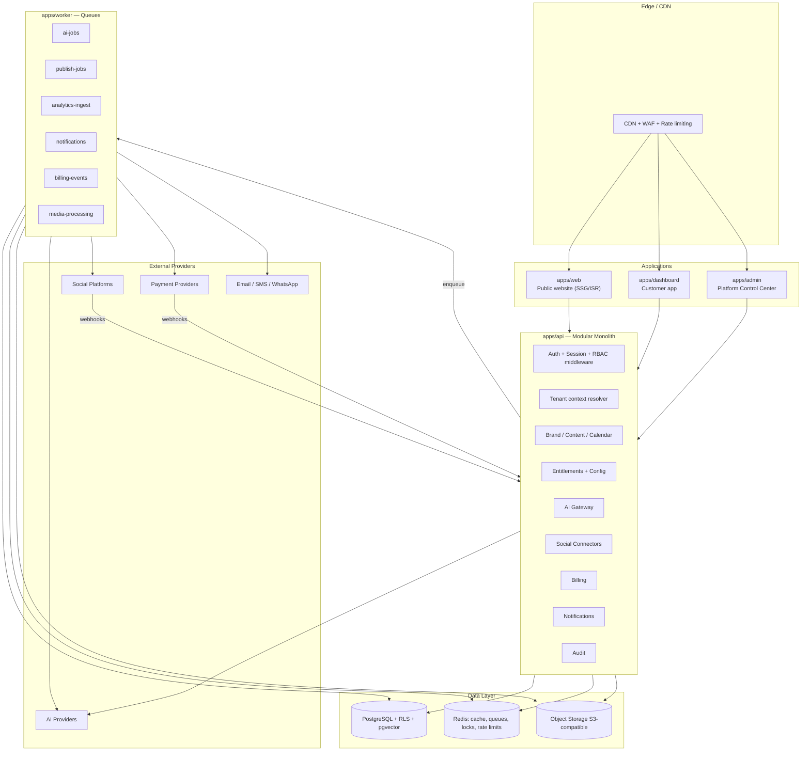
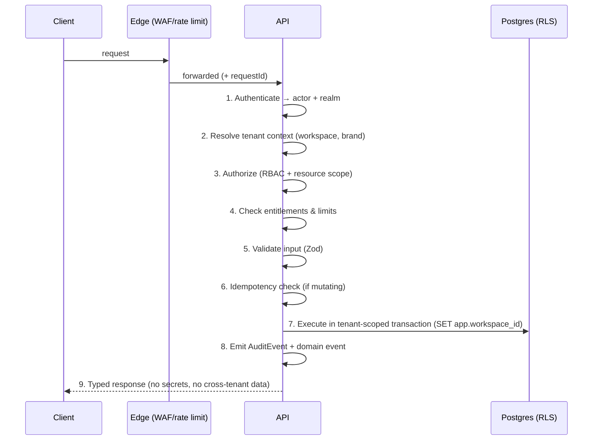
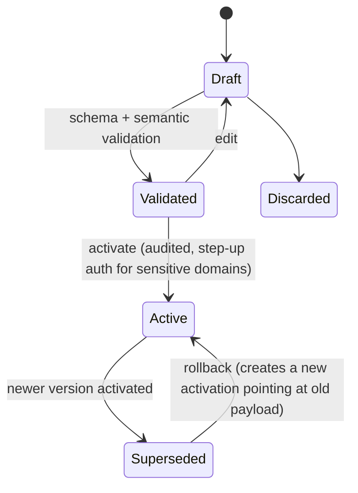
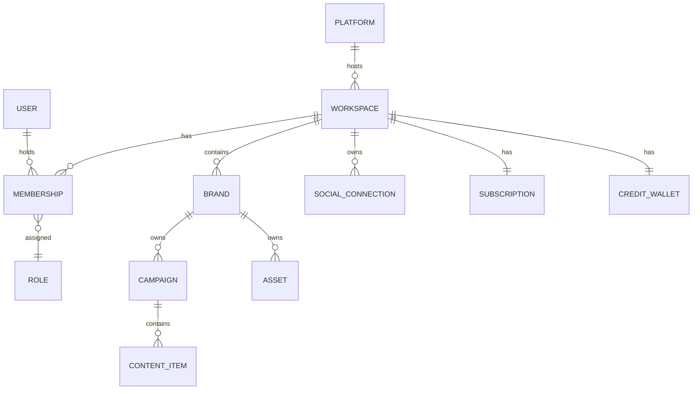

# BrandSpace — System Architecture

> **الملخص التنفيذي بالعربية**
>
> النظام مبني كـ **"مونوليث معياري" (Modular Monolith)** داخل مستودع واحد (Monorepo) — أي تطبيق واحد منظم في وحدات مستقلة
> بحدود واضحة، يمكن فصلها لاحقًا إلى خدمات منفصلة عند الحاجة، دون تعقيد الخدمات المصغّرة في المرحلة الأولى.
>
> **التقنيات المقترحة:** Next.js + TypeScript للواجهات، Node.js/TypeScript للـ API، **PostgreSQL** كقاعدة بيانات أساسية مع **Prisma** كـ ORM،
> **Redis** للتخزين المؤقت وقوائم المهام عبر **BullMQ**، تخزين الملفات عبر واجهة متوافقة مع **S3**، التحقق من البيانات بـ **Zod**،
> المصادقة عبر **Auth.js** مع جلسات منفصلة للعميل والمالك، الاختبارات بـ **Vitest + Playwright**، والمراقبة عبر **OpenTelemetry**.
>
> **العزل بين العملاء** مطبّق على طبقتين: طبقة البرمجة (كل استعلام مقيّد بـ `workspaceId`) وطبقة قاعدة البيانات (Row-Level Security).
>
> **كل الإعدادات** (المزودون، النماذج، الخطط، الأسعار، الحدود، الميزات، القوالب) تُدار من **خدمة إعدادات مُصدَّرة** (Versioned Configuration)
> تدعم التحقق والتفعيل والتراجع وسجل التغييرات — بحيث يدير مالك المنتج المنصة دون تعديل الكود.
>
> **الحدود الجاهزة للفصل مستقبلًا:** عمال الذكاء الاصطناعي، عمال النشر، استقبال التحليلات، الإشعارات، الفوترة، ومعالجة الوسائط.

---

## 1. Architectural Goals and Constraints

| Goal                                            | Consequence                                                                      |
| ----------------------------------------------- | -------------------------------------------------------------------------------- |
| Ship a credible MVP fast with a small team      | Modular monolith, one deployable API, one worker                                 |
| Never leak data between tenants                 | Two-layer isolation: app-level scoping + PostgreSQL RLS                          |
| Let the owner run the business without releases | Versioned Configuration Service as a first-class subsystem                       |
| Survive provider churn (AI + social + payments) | Adapter interfaces + registries, no provider names in business logic             |
| Be splittable into services later               | Explicit module boundaries, async messaging via queues, no cross-module DB reads |
| Bilingual, accessible, fast public surface      | Separate statically-rendered marketing app                                       |
| Predictable AI economics                        | Central AI Gateway with ledger, budgets, and credit accounting                   |

**Anti-goals for MVP:** microservices, event sourcing everywhere, multi-region active-active, custom
identity provider, self-hosted model serving.

---

## 2. High-Level System View



---

## 3. Recommended Technology Stack

Every choice below is a **recommendation pending owner approval** (see `docs/DECISIONS.md`). Reasoning and
tradeoffs are stated so alternatives can be chosen deliberately.

### 3.1 Frontend

**Recommendation: Next.js (App Router) + React + TypeScript + Tailwind CSS + Radix UI primitives.**

- _Why Next.js:_ one framework covers the three very different rendering needs — static/ISR marketing pages
  for SEO, authenticated dynamic dashboard, and internal admin. Built-in i18n routing, image optimization,
  server components reduce client JS, and it deploys well on multiple hosts.
- _Why Tailwind + Radix:_ Tailwind has native RTL support via logical properties and `rtl:` variants, which
  matters enormously for Arabic. Radix gives accessible, unstyled primitives so WCAG 2.2 AA is achievable
  without fighting a component library's opinions.
- _Design system:_ `packages/ui` owns tokens (colours incl. `#7935FE` / `#FFDD15`, spacing, typography with an
  Arabic-capable font pairing), primitives, and composed patterns. Direction-agnostic by construction.
- _State/data:_ TanStack Query for server state; minimal client state. Forms via React Hook Form + Zod resolvers.
- _Tradeoff:_ Next.js couples us to its rendering model and upgrade cadence. Accepted — the alternative
  (Vite SPA + separate static site generator) means maintaining two frontends and losing SSR SEO for free.
- _Rejected:_ Nuxt/Vue (smaller hiring pool for this stack), Remix (smaller ecosystem for our needs),
  pure SPA (SEO loss on the marketing surface).

### 3.2 Backend / API

**Recommendation: Node.js + TypeScript, served by Next.js Route Handlers for BFF concerns plus a dedicated
Fastify/Nest-style HTTP layer in `apps/api` for the core domain; tRPC for typed internal calls from
dashboard/admin; REST + OpenAPI for public/partner and webhook surfaces.**

- _Why one language end-to-end:_ shared types, shared validation schemas, shared domain packages between
  web, api, and worker. For a small team this is the single largest velocity multiplier.
- _Why tRPC internally:_ end-to-end type safety with zero codegen for our own first-party clients.
- _Why REST/OpenAPI externally:_ webhooks, future partner API, and non-TS consumers need a stable contract.
- _Tradeoff:_ Node is not the best fit for CPU-heavy media processing. Mitigated by pushing media work to a
  dedicated queue that can later move to a separate service or a managed transcoding provider.
- _Rejected:_ Go or Python API (loses type sharing and doubles the toolchain), GraphQL (schema and caching
  complexity not justified at MVP; tRPC covers first-party needs).

### 3.3 Database

**Recommendation: PostgreSQL 16+ (managed), single primary + read replica, `pgvector` extension for
embeddings, logical schemas per bounded context inside one database.**

- _Why Postgres:_ relational integrity for billing/credits, strong transactional guarantees, JSONB for
  flexible config payloads, and **Row-Level Security** — which is the mechanism that makes tenant isolation
  defensible rather than aspirational.
- _Why `pgvector` instead of a separate vector DB:_ Brand Brain retrieval volumes at MVP are small (thousands
  of chunks per brand). Keeping vectors in Postgres means embeddings inherit the same RLS tenant isolation as
  everything else — a dedicated vector store would create a second, weaker isolation boundary.
- _Tenancy model:_ **shared database, shared schema, `workspaceId` column + RLS.** Chosen over
  schema-per-tenant (migration cost explodes past a few hundred tenants) and database-per-tenant (operationally
  heavy, and wrong for self-serve sign-up). Enterprise-dedicated instances remain possible later without
  changing the code, because the isolation predicate is identical.
- _Tradeoff:_ a single noisy tenant can affect others. Mitigated by per-workspace rate limits, queue
  concurrency caps, and statement timeouts.

### 3.4 ORM

**Recommendation: Prisma, wrapped in a tenant-scoped client.**

- _Why:_ excellent TypeScript ergonomics, a first-class migration workflow, and a client-extension mechanism
  we use to make tenant scoping automatic rather than remembered.
- _How isolation is enforced:_ `packages/database` exports `forWorkspace(workspaceId)` which returns a client
  extension that (a) injects the workspace predicate into every query on a tenant-owned model, (b) sets the
  Postgres session variable `app.workspace_id` used by RLS policies, and (c) throws at runtime if a
  tenant-owned model is queried through an unscoped client outside an explicit `asPlatform()` escape hatch.
- _Escape hatch:_ `asPlatform(actor, reason)` is the only way to run cross-tenant queries. It requires a
  platform actor, writes an `AuditEvent`, and is unavailable in customer-facing code paths by lint rule.
- _Tradeoff:_ Prisma's raw-SQL story is weaker than Drizzle/Kysely and its query planner control is limited.
  Mitigated by using `$queryRaw` with explicit tenant predicates for the few analytics aggregates that need it.
- _Rejected:_ Drizzle (better SQL control, less mature migration/tooling story for a team this size),
  TypeORM (weaker types), raw SQL (unacceptable isolation risk from human error).

### 3.5 Cache, Queue, Coordination

**Recommendation: Redis (managed) for cache, distributed locks, and rate limiting; BullMQ for job queues.**

- _Why BullMQ:_ mature Redis-backed queues with delayed jobs (essential for scheduled publishing), repeatable
  jobs (analytics polling, credit resets), retries with backoff, priorities, concurrency limits per queue, and
  dead-letter handling. It runs in-process today and behind a separate worker deployment tomorrow with no code
  change.
- _Scheduled publishing:_ a `CalendarSlot` produces a delayed job at its UTC time, plus a **sweeper** that
  reconciles slots whose jobs are missing (defense against Redis loss). The database is the source of truth;
  the queue is an accelerator.
- _Locks:_ Redis locks guard non-transactional critical sections; anything touching money or credits uses
  **PostgreSQL** row locks instead, never Redis.
- _Tradeoff:_ Redis persistence is not a durability guarantee. Accepted because Postgres holds all truth.
- _Rejected:_ SQS/Cloud Tasks (cloud lock-in at MVP; harder local dev), Temporal (excellent for long workflows,
  but a heavy operational addition — revisit at Phase 6 for publishing sagas), pg-boss (fewer features).

### 3.6 Object Storage

**Recommendation: S3-compatible object storage behind a `StorageProvider` interface (S3, R2, or compatible).**

- Uploads use **pre-signed URLs**; the API never proxies file bytes.
- Objects are keyed `workspaceId/brandId/assetId/version/filename` and served through signed, short-TTL URLs
  or a CDN with signed cookies. **No public buckets.**
- Server-side encryption at rest; virus/malware scanning on ingest before an asset becomes usable.
- Media derivatives (thumbnails, platform-specific crops, video transcodes) are produced by the
  `media-processing` queue.

### 3.7 Validation

**Recommendation: Zod as the single schema language.**

Used for HTTP input, job payloads, webhook bodies, configuration documents, AI structured output, and
environment variables. Schemas live in `packages/shared` and are reused by frontend forms — one definition,
one source of truth. Configuration documents are validated against a **versioned Zod schema** before a
configuration version can be activated.

### 3.8 Authentication and Authorization

**Recommendation: Auth.js (NextAuth) for session/credential/OAuth handling, with two isolated realms and a
custom RBAC layer.**

- **Two realms:** customer sessions (`apps/dashboard`) and platform sessions (`apps/admin`) use different
  cookie names, different signing keys, different token audiences, and different session tables. A customer
  session presented to Admin is rejected before any handler runs.
- **MFA/2FA:** TOTP, with recovery codes. Optional for customers, **mandatory for Platform Owner and Platform
  Admin** from Phase 2. Step-up re-authentication required for: secret rotation, plan pricing changes,
  entering support mode, refunds, and account deletion.
- **Sessions:** short-lived access token + rotating refresh, device list, revoke-all, absolute expiry. Session
  invalidation on password change, role change, or workspace suspension.
- **Invitations:** signed, single-use, expiring tokens tied to a workspace + role; acceptance creates the
  `Membership`.
- **SSO/SAML/SCIM:** deliberately deferred to Enterprise (post-MVP), but the identity model (User separate
  from Membership) is designed so it can be added without migration.
- _Tradeoff:_ Auth.js is convenient but opinionated; complex enterprise flows may later justify a dedicated
  IdP. The abstraction in `packages/auth` keeps that option open.

### 3.9 Testing

**Recommendation: Vitest (unit/integration), Testcontainers (real Postgres + Redis), Playwright (E2E + a11y),
MSW and recorded fixtures (provider contracts), k6 (load).**

Isolation tests are a **first-class, non-skippable suite** — see §8.4.

### 3.10 Observability

**Recommendation: OpenTelemetry as the instrumentation standard; structured JSON logs; vendor-neutral export.**

- **Tracing:** every request and job carries `traceId`, `workspaceId`, `actorId`, `requestId`. AI and publish
  operations are spans with provider, model, latency, and cost attributes.
- **Metrics:** RED metrics per endpoint and queue; domain metrics (publish success rate, AI failure rate,
  credit burn, provider cost per hour, webhook lag).
- **Logs:** structured, correlated, with a mandatory **redaction layer** (secrets, tokens, PII fields) applied
  at the sink — not at the call site.
- **Alerting:** paging on publish failure rate, AI provider error rate, queue depth/age, webhook processing lag,
  daily AI cost thresholds, failed billing webhooks, RLS policy violations (should be zero).

### 3.11 Deployment

**Recommendation: containerized services on a managed platform, with managed Postgres and Redis; IaC from day one.**

- Environments: **development → staging → production**, fully separated credentials, databases, buckets,
  provider apps, and configuration stores. No shared secrets across environments.
- CI: typecheck → lint → unit → integration (Testcontainers) → isolation suite → build → E2E on preview →
  migration check → deploy.
- Migrations run as a separate, gated step; expand/contract pattern so deploys are backward-compatible.
- Blue/green or rolling deploys; workers drain gracefully and jobs are idempotent so restarts are safe.
- _Tradeoff:_ a managed platform costs more than raw VMs but removes an entire category of operational work
  from a small team.

---

## 4. Monorepo Layout and Module Boundaries

```
apps/web · apps/dashboard · apps/admin · apps/api · apps/worker
packages/ui · packages/database · packages/auth · packages/ai-gateway
packages/social-connectors · packages/entitlements · packages/billing
packages/config · packages/shared
packages/secrets · packages/observability · packages/providers   (added in Phase 2A)
```

### 4.1 Dependency rules (lint-enforced)

| Package             | May import                                     | Must never import                                               |
| ------------------- | ---------------------------------------------- | --------------------------------------------------------------- |
| `shared`            | —                                              | anything                                                        |
| `database`          | `shared`                                       | any domain package                                              |
| `observability`     | `shared`                                       | everything else, including `database`                           |
| `secrets`           | `shared`, `database`                           | `config` and every domain package                               |
| `config`            | `shared`, `database`                           | `secrets`, `auth`, `billing`, `ai-gateway`, `social-connectors` |
| `auth`              | `shared`, `database`, `secrets`                | domain packages                                                 |
| `providers`         | `shared`, `config`                             | `database`, `secrets`, domain packages                          |
| `entitlements`      | `shared`, `database`, `config`                 | `ai-gateway`, `billing`, `social-connectors`                    |
| `ai-gateway`        | `shared`, `database`, `config`, `entitlements` | `social-connectors`, `billing`                                  |
| `social-connectors` | `shared`, `database`, `config`, `entitlements` | `ai-gateway`, `billing`                                         |
| `billing`           | `shared`, `database`, `config`, `entitlements` | `ai-gateway`, `social-connectors`                               |
| `ui`                | `shared`                                       | everything else                                                 |
| apps                | any package                                    | another app                                                     |

**No package imports an app. No package reads another package's tables directly** — cross-module access goes
through the owning package's exported service functions or through queue events.

`auth` depends on `secrets` for one reason only: the TOTP seed is a vault entry, not a column, so MFA
verification has to resolve it. `providers` depends on `config` and nothing else, because an adapter is
configured rather than wired — it never reaches the database itself.

### 4.1a Two restricted modules (F-07)

Beyond the table above, two modules are restricted by name because either one, in the wrong bundle, exposes
the whole platform:

| Module                               | Who may import it                                                 | Why                                                                                                                            |
| ------------------------------------ | ----------------------------------------------------------------- | ------------------------------------------------------------------------------------------------------------------------------ |
| `@brandspace/secrets`                | `packages/auth`, `apps/admin`, `apps/api`                         | It holds the only decrypt path for every platform credential.                                                                  |
| `@brandspace/database/platform`      | `apps/admin`, `apps/api`, `packages/database`                     | It opens a connection with cross-tenant visibility.                                                                            |
| `@brandspace/database/platform-pool` | `packages/database/src/platform.ts` and `platform-client.ts` only | The raw pool. `asPlatform()` is the audited entrance for tenant data; the client seam is the entrance for platform-owned data. |

Enforced by ESLint patterns, by `import 'server-only'` in the admin server context (a client-component import
becomes a build error), by the pool's own browser guard, and by unit tests that probe each boundary in both
directions — a rule nobody has watched fail is not known to work.

### 4.2 Bounded contexts and their tables

| Context           | Owns                                                                                                                                | Split-out candidate           |
| ----------------- | ----------------------------------------------------------------------------------------------------------------------------------- | ----------------------------- |
| Identity & Access | `User`, `Membership`, `Role`, `Permission`, sessions, invitations                                                                   | later                         |
| Tenancy           | `Workspace`, `Brand`                                                                                                                | no (core)                     |
| Brand & Content   | `BrandKnowledge`, `Campaign`, `ContentItem`, `ContentVariant`, `Asset`, `CalendarSlot`, `Approval`, `Comment`                       | no (core)                     |
| Social            | `SocialProvider`, `SocialAppConfiguration`, `SocialConnection`, `PublishJob`, `PublishAttempt`                                      | **yes — publishing workers**  |
| Analytics         | `MetricSnapshot`, `Insight`                                                                                                         | **yes — analytics ingestion** |
| AI                | `AIProvider`, `AIProviderCredential`, `AIModel`, `AIRoutingRule`, `AIRequest`, `AIUsageLedger`                                      | **yes — AI workers**          |
| Commerce          | `Plan`, `Feature`, `PlanEntitlement`, `WorkspaceOverride`, `Subscription`, `Invoice`, `CreditWallet`, `CreditTransaction`           | **yes — billing**             |
| Automation        | `AutomationRule`, `AutomationRun`                                                                                                   | later                         |
| Messaging         | `Notification`, templates                                                                                                           | **yes — notifications**       |
| Platform Ops      | `AuditEvent`, `ConfigurationVersion`, `SecretRecord`, `SecretVersion`, `PlatformUser`, `PlatformSession`, `PlatformMfaRecoveryCode` | no (core)                     |
| Media             | asset derivatives, scanning                                                                                                         | **yes — media processing**    |

### 4.3 How a module becomes a service later

Each split-out candidate already satisfies three preconditions: (1) it communicates with the rest of the
system through queue events or a narrow exported service interface, (2) it owns its tables and no other module
reads them directly, (3) it has no synchronous call into another module's internals. Extraction is therefore
"deploy the package behind an HTTP/queue boundary," not a rewrite.

---

## 5. Request Lifecycle



Steps 1–4 are middleware and cannot be bypassed by a handler. A handler that needs no tenant context must
declare that explicitly (`scope: 'public' | 'platform' | 'workspace'`), which is checked at route registration.

---

## 6. Tenant Context Resolution

1. Session identifies the `User` (customer realm) or platform actor (platform realm).
2. The request carries a workspace reference (subdomain, path segment, or header). The server **verifies the
   user has an active membership** in that workspace — it never trusts the client's claim.
3. Brand-level scoping: if the membership restricts the user to specific brands, the brand filter is applied
   in addition to the workspace filter.
4. The resolved context is attached to an async-local-storage request context, and `SET LOCAL app.workspace_id`
   is issued at the start of the transaction so RLS applies even to raw SQL.
5. Platform actors operate with `asPlatform()` and, when acting on a specific customer, through **Support Mode**
   (`docs/ADMIN-CONTROL-CENTER.md` §Support Mode), which is time-boxed, reason-tagged, and audited.

---

## 7. Configuration Service (`packages/config`)

This subsystem is the reason the owner can operate BrandSpace without engineering.

### 7.1 Model

A **configuration domain** is a named, schema-backed document set. Domains at MVP:

`ai.providers` · `ai.models` · `ai.routing` · `ai.credit-costs` · `plans` · `features` · `entitlements` ·
`feature-flags` · `integrations.social` · `integrations.email` · `integrations.sms` · `integrations.payment` ·
`integrations.storage` · `integrations.analytics` · `notifications.templates` · `billing.settings` ·
`currencies` · `trial` · `limits` · `policies` · `cms` (website content).

Each domain has:

- a **Zod schema** with a `schemaVersion`,
- a chain of **`ConfigurationVersion`** rows (immutable),
- exactly one **active** version per environment,
- a full **change history** with author, diff, reason, and timestamp.

### 7.2 Lifecycle



- **Validation** is two-stage: structural (Zod) and semantic (referential — e.g. a routing rule may not point
  at a disabled model; a plan may not grant a feature that does not exist; a credit cost may not be negative).
- **Activation** is atomic and audited; it emits a `config.activated` event that invalidates caches.
- **Rollback** never mutates history — it activates a new version whose payload equals a previous one.
- **Dry-run / impact preview:** activation shows what changes (e.g. "142 workspaces gain feature X",
  "credit cost for `image.generate` rises 40%").
- **Environment separation:** dev/staging/production have independent active versions and independent secrets.

### 7.3 Runtime consumption

- Config is read through a typed accessor: `config.get('plans')` returns a parsed, typed object.
- Cached in-process with a short TTL plus Redis pub/sub invalidation on activation, so changes propagate in
  seconds without a restart.
- **Reading configuration never returns secrets.** Secret-bearing fields are references
  (`secretRef: "ai/openai/prod/api-key"`) resolved only server-side by the Secret Service.

### 7.3a As implemented (Phase 2A)

The design above is unchanged; these are the concrete details a reader needs when working in the code.

**Seventeen domains ship**, named as they appear in `packages/config/src/domains.ts`:

`ai.providers` · `ai.models` · `ai.model-capabilities` · `ai.routing` · `ai.credit-rules` · `plans` ·
`entitlements` · `feature-flags` · `usage-limits` · `integrations.email` · `integrations.storage` ·
`integrations.payment` · `integrations.observability` · `integrations.social-apps` · `templates` ·
`website` · `operations`.

Every domain's default is **empty but valid** — no provider, price, model or limit is invented in code, which
is the point of CLAUDE.md §2.2. A fresh installation therefore reads a well-formed empty document rather than
throwing, and the owner fills it in from the Control Center.

| Guarantee                                  | How it is actually enforced                                                                                                                                                |
| ------------------------------------------ | -------------------------------------------------------------------------------------------------------------------------------------------------------------------------- |
| One ACTIVE version per domain/environment  | A **partial unique index** on `(domain, environment) WHERE status = 'ACTIVE'`. Not application logic — the database refuses.                                               |
| History is immutable                       | A trigger rejects any update to an ACTIVE version's payload or checksum. Rollback creates a new version.                                                                   |
| Concurrent edits do not silently overwrite | `lockVersion` travels in the `WHERE` clause of a conditional `updateMany`, so the check and the write are one statement.                                                   |
| Editing invalidates prior verdicts         | `updateDraft` clears `validationReport` and `impactPreview` (as `Prisma.DbNull`, not `undefined`, which under `exactOptionalPropertyTypes` would mean "leave unchanged").  |
| Money changes need two people              | `plans` and `ai.credit-rules` require dual control: the activator may not be the author (D-31).                                                                            |
| High-impact changes are acknowledged       | The impact preview marks removals, price changes, credit-rule changes, model disables and kill switches as `high`; activation refuses without an explicit acknowledgement. |

**Cache**: `InMemoryConfigCache` with a 30-second TTL, invalidated in-process on activation. Redis pub/sub
invalidation across instances is **not** implemented — recorded as F-12, and bounded at 30 seconds until it is.

### 7.4 What is code vs. configuration

| Code                                             | Configuration                                              |
| ------------------------------------------------ | ---------------------------------------------------------- |
| Adapter implementations (how to call a provider) | Which providers exist, base URLs, which models, routing    |
| Credit _calculation algorithm_                   | Credit _costs_ per task/model                              |
| Entitlement _precedence engine_                  | Plans, features, limits, overrides, flags                  |
| Publishing _pipeline_                            | Per-platform limits and enabled capabilities               |
| Notification _delivery_                          | Templates, subjects, bodies, locales                       |
| Payment _abstraction_                            | Active provider, currencies, tax settings, dunning windows |

---

## 8. Multi-Tenancy Architecture

### 8.1 Hierarchy



### 8.2 Isolation rules

1. Every tenant-owned table has a non-null `workspaceId` with a foreign key and an index whose **leading
   column is `workspaceId`**.
2. Brand-owned tables carry both `workspaceId` and `brandId`; a database constraint (trigger or composite FK)
   guarantees the brand belongs to that workspace, so a mismatched pair is impossible.
3. RLS policies: `USING (workspace_id = current_setting('app.workspace_id')::uuid)` for select/update/delete,
   with an equivalent `WITH CHECK` on insert. The application connects as a role that **cannot bypass RLS**.
4. A separate migration/admin role may bypass RLS; it is never used by request handlers.
5. Cross-tenant reads are only possible through `asPlatform()`, which is audited.
6. Unauthorized access to another tenant's resource returns a `404` identical to a genuine miss — no
   existence disclosure.
7. Search, export, counts, aggregates, autocomplete, and vector similarity are all workspace-scoped. Vector
   search adds the workspace predicate **inside** the ANN query, not as a post-filter.
8. Object storage keys are workspace-prefixed and only reachable via signed URLs generated after an
   authorization check.
9. Queue jobs carry `workspaceId`; the worker re-resolves and re-applies the tenant context before touching data.
10. Caches are keyed by `workspaceId`; no shared cache key may span tenants.

### 8.3 Agency and multi-workspace UX

A user with memberships in several workspaces gets a workspace switcher. Switching issues a new tenant context;
it never widens a query. There is no "all workspaces" view for customers — only for platform actors.

### 8.4 Automated isolation tests (mandatory)

The suite creates two workspaces with overlapping data shapes and asserts, for **every tenant-owned resource**:

| Test                       | Assertion                                                                    |
| -------------------------- | ---------------------------------------------------------------------------- |
| Direct read by ID          | Workspace A actor requesting B's record → 404                                |
| List/index                 | A's listing never contains B's rows, at any page or filter                   |
| Search                     | Full-text and vector search from A never surfaces B content                  |
| Mutation                   | Update/delete of B's record from A → 404, and B's row is unchanged           |
| Create with foreign parent | Creating a child under B's parent from A → rejected                          |
| Export                     | Export from A contains zero B rows                                           |
| Aggregate                  | Counts/metrics from A exclude B entirely                                     |
| Storage                    | A cannot obtain a signed URL for B's object                                  |
| Queue                      | A job with a forged `workspaceId` fails authorization, not silently succeeds |
| RLS direct                 | Raw SQL with the app role and A's context cannot see B's rows                |
| Copilot                    | Copilot in A cannot retrieve or reference B's Brand Brain                    |

A generic, schema-driven test walks the Prisma model list and **fails CI if a tenant-owned model has no
isolation coverage** — so new models cannot be added without tests.

---

## 9. Background Processing

| Queue              | Jobs                                         | Concurrency                          | Retry                       | Failure path                                                |
| ------------------ | -------------------------------------------- | ------------------------------------ | --------------------------- | ----------------------------------------------------------- |
| `ai-jobs`          | generation, embeddings, moderation, insights | per-provider cap + per-workspace cap | exponential, provider-aware | credit reservation released, `AIRequest` = failed           |
| `publish-jobs`     | publish, verify, retry, token refresh        | per-platform cap                     | exponential + jitter        | `PublishAttempt` recorded, DLQ after N, user notified       |
| `analytics-ingest` | scheduled metric pulls, backfills            | per-platform cap                     | exponential                 | partial-window retry, no duplicates (upsert on natural key) |
| `notifications`    | email/SMS/WhatsApp/in-app dispatch           | high                                 | exponential                 | DLQ + admin alert                                           |
| `billing-events`   | webhook processing, dunning, resets          | low, ordered per subscription        | exponential                 | DLQ + manual replay tool                                    |
| `media-processing` | thumbnails, crops, transcode, virus scan     | CPU-bound cap                        | limited                     | asset stays `processing_failed`                             |

**Cross-cutting job rules:** every job is idempotent (natural idempotency key), carries tenant context,
declares a timeout, is observable as a trace span, and lands in a dead-letter queue with a replay tool rather
than disappearing.

**Scheduling correctness:** delayed jobs are an optimization; a reconciliation sweeper every minute finds
`CalendarSlot`s that are due and unclaimed, so a lost Redis state degrades punctuality, not correctness.

---

## 10. API Design Principles

- Versioned (`/v1`), with additive-only changes inside a version.
- Consistent envelope for errors: stable `code`, human message (localized), `requestId`, no internals.
- **Idempotency-Key** header required for all POST/PUT that cause external effects or money movement.
- Pagination is cursor-based; no offset pagination on tenant data (leaks ordering and is slow).
- Rate limits per IP, per user, per workspace, and per endpoint class; limits are configuration, not constants.
- All list endpoints enforce a maximum page size server-side.
- Webhooks (inbound) verify signatures and timestamps and are processed idempotently on the provider event ID.

---

## 11. Frontend Architecture

- **Three apps, one design system.** `packages/ui` exports tokens, primitives, and patterns; each app composes.
- **Directionality:** `dir` is set from locale at the document root; all spacing uses logical properties;
  charts, sliders, and progress bars are direction-aware. RTL is verified in E2E snapshots, not by eye.
- **i18n:** message catalogs per locale, ICU pluralization, locale-aware dates/numbers, translation keys typed
  so a missing key fails the build.
- **Routing:** `/{locale}/…` on the public site; the dashboard scopes by workspace (`/w/{workspaceSlug}/…`)
  and brand (`/w/{ws}/b/{brand}/…`).
- **Data:** TanStack Query with tenant-scoped cache keys; a workspace switch clears the cache.
- **Performance:** server components by default, client components only for interactivity, route-level code
  splitting, image optimization, font subsetting for Arabic and Latin.
- **Accessibility:** semantic landmarks, focus management on route change, keyboard-complete flows,
  announced async states, contrast-checked tokens, automated axe checks in CI.

---

## 12. Environments and Data Separation

| Concern         | Development            | Staging                   | Production                |
| --------------- | ---------------------- | ------------------------- | ------------------------- |
| Database        | local/container        | isolated managed instance | isolated managed instance |
| Redis / Storage | local                  | isolated                  | isolated                  |
| AI providers    | **mock provider only** | sandbox keys              | production keys           |
| Social apps     | mock connectors        | platform sandbox apps     | production apps           |
| Payments        | mock                   | provider test mode        | provider live mode        |
| Config store    | seeded bootstrap       | independent versions      | independent versions      |
| Customer data   | synthetic only         | synthetic only            | real                      |

**Production data is never copied to lower environments.** Staging is seeded with generated fixtures.

---

## 13. Key Architectural Decisions (summary)

| #   | Decision                                    | Alternative considered         | Why                                                                                  |
| --- | ------------------------------------------- | ------------------------------ | ------------------------------------------------------------------------------------ |
| A1  | Modular monolith + monorepo                 | Microservices                  | Team size, velocity, transactional integrity; boundaries preserved for later split   |
| A2  | Shared DB + RLS tenancy                     | Schema/DB per tenant           | Scales to self-serve; RLS gives defense in depth; dedicated instances still possible |
| A3  | TypeScript everywhere                       | Polyglot                       | Shared types/schemas across web, api, worker                                         |
| A4  | Prisma + tenant-scoped client               | Raw SQL, Drizzle               | Ergonomics + enforced scoping; escape hatch is explicit and audited                  |
| A5  | BullMQ on Redis                             | Managed cloud queues, Temporal | Delayed jobs, local dev parity, no cloud lock-in; Temporal revisited at Phase 6      |
| A6  | pgvector for Brand Brain                    | Dedicated vector DB            | Embeddings inherit tenant isolation; volume is small                                 |
| A7  | Versioned Configuration Service             | Env vars + code constants      | The core product requirement: owner-operated platform                                |
| A8  | Separate `apps/admin`                       | Admin routes in dashboard      | Hard separation of session realm, permissions, and blast radius                      |
| A9  | Credits abstraction over tokens             | Pass-through token billing     | Predictable pricing, provider independence, margin control                           |
| A10 | Adapter + registry for AI, social, payments | Direct SDK calls               | Provider churn is certain; swaps must be configuration, not releases                 |

---

## Phase 2B — where the customer-side code lives

> **ملخّص بالعربية**
>
> توزيع كود المرحلة 2B على الحزم المعتمدة في CLAUDE.md §3، دون اختراع أي حزمة جديدة، ومع بيان لماذا وُضع كل
> جزء حيث وُضع.

No new package was created. Phase 2B fits the structure CLAUDE.md §3 already approves:

| Package                 | What Phase 2B added, and why here                                                                                                                                                                                                                                                                                                                   |
| ----------------------- | --------------------------------------------------------------------------------------------------------------------------------------------------------------------------------------------------------------------------------------------------------------------------------------------------------------------------------------------------- |
| `packages/auth`         | Customer sessions, invitations, memberships, workspace lifecycle and Support Mode. CLAUDE.md §3 defines this package as _"Sessions, MFA, invitations, platform vs customer realms"_ — invitations are named explicitly, and memberships are the subject sessions are scoped by. The workspace lifecycle lives here because what it gates is access. |
| `packages/entitlements` | Plans, features, flags, limits, overrides, the precedence engine and the credit wallet/ledger — exactly the package's stated remit. The engine is **pure**; only the service touches a database.                                                                                                                                                    |
| `packages/database`     | `withCustomerSession()`, the two session-scoped policies, and the catalogue snapshot table. Still the only package that talks to PostgreSQL.                                                                                                                                                                                                        |
| `packages/config`       | Projects the three customer-relevant domains into the snapshot when it activates one, in the same transaction.                                                                                                                                                                                                                                      |
| `apps/dashboard`        | The customer application. Runs on the TENANT identity only; cannot import `@brandspace/secrets` or the platform client, asserted by lint and by a scan of its real source.                                                                                                                                                                          |
| `apps/admin`            | Customers, workspaces, plans, overrides, credits, invitations and Support Mode surfaces.                                                                                                                                                                                                                                                            |

### The one thing that needed a new mechanism

Two reads precede any workspace context, and RLS has no notion of "the signed-in user":

1. **Which workspaces may this session act in?** Solved with a transaction-local session-token hash and
   two `SELECT`-only policies on `membership` and `workspace` that apply _only_ when there is no workspace
   context. Expressed as policies, not definer rights, so the widening is visible in `pg_policies`.

2. **What does the plan entitle them to?** Solved by projecting three configuration domains into
   `entitlement_catalogue_snapshot`. `configuration_version` keeps every privilege revoked from the tenant
   role.

`SECURITY DEFINER` was tried for both and rejected: the tables are under `FORCE ROW LEVEL SECURITY`, so
even the owner is subject to policy, and no policy names the migrator — a definer function would have
returned nothing. That is the schema working as designed, and it pushed the solution somewhere better.
