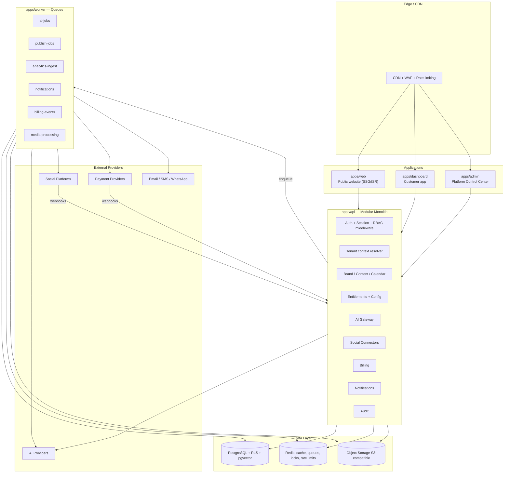
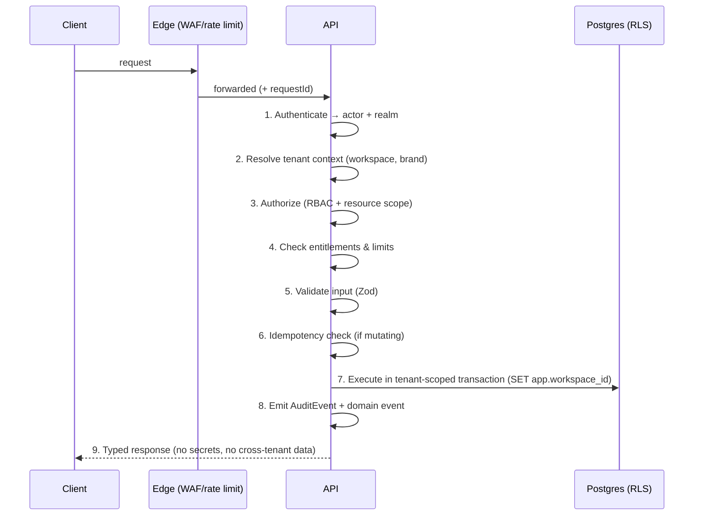
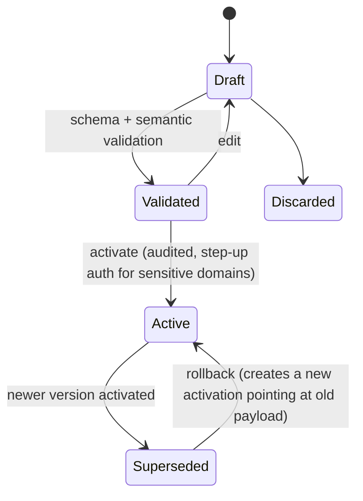
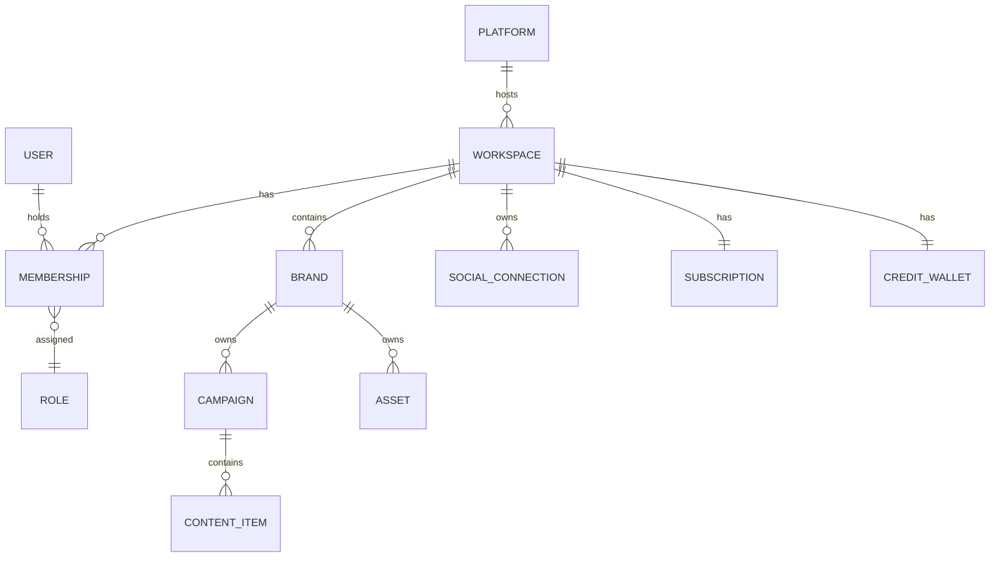

# BrandSpace — System Architecture

> **الملخص التنفيذي بالعربية**
>
> النظام مبني كـ **"مونوليث معياري" (Modular Monolith)** داخل مستودع واحد (Monorepo) — أي تطبيق واحد منظم في وحدات مستقلة
> بحدود واضحة، يمكن فصلها لاحقًا إلى خدمات منفصلة عند الحاجة، دون تعقيد الخدمات المصغّرة في المرحلة الأولى.
>
> **التقنيات المقترحة:** Next.js + TypeScript للواجهات، Node.js/TypeScript للـ API، **PostgreSQL** كقاعدة بيانات أساسية مع **Prisma** كـ ORM،
> **Redis** للتخزين المؤقت وقوائم المهام عبر **BullMQ**، تخزين الملفات عبر واجهة متوافقة مع **S3**، التحقق من البيانات بـ **Zod**،
> المصادقة عبر **Auth.js** مع جلسات منفصلة للعميل والمالك، الاختبارات بـ **Vitest + Playwright**، والمراقبة عبر **OpenTelemetry**.
>
> **العزل بين العملاء** مطبّق على طبقتين: طبقة البرمجة (كل استعلام مقيّد بـ `workspaceId`) وطبقة قاعدة البيانات (Row-Level Security).
>
> **كل الإعدادات** (المزودون، النماذج، الخطط، الأسعار، الحدود، الميزات، القوالب) تُدار من **خدمة إعدادات مُصدَّرة** (Versioned Configuration)
> تدعم التحقق والتفعيل والتراجع وسجل التغييرات — بحيث يدير مالك المنتج المنصة دون تعديل الكود.
>
> **الحدود الجاهزة للفصل مستقبلًا:** عمال الذكاء الاصطناعي، عمال النشر، استقبال التحليلات، الإشعارات، الفوترة، ومعالجة الوسائط.

---

## 1. Architectural Goals and Constraints

| Goal                                            | Consequence                                                                      |
| ----------------------------------------------- | -------------------------------------------------------------------------------- |
| Ship a credible MVP fast with a small team      | Modular monolith, one deployable API, one worker                                 |
| Never leak data between tenants                 | Two-layer isolation: app-level scoping + PostgreSQL RLS                          |
| Let the owner run the business without releases | Versioned Configuration Service as a first-class subsystem                       |
| Survive provider churn (AI + social + payments) | Adapter interfaces + registries, no provider names in business logic             |
| Be splittable into services later               | Explicit module boundaries, async messaging via queues, no cross-module DB reads |
| Bilingual, accessible, fast public surface      | Separate statically-rendered marketing app                                       |
| Predictable AI economics                        | Central AI Gateway with ledger, budgets, and credit accounting                   |

**Anti-goals for MVP:** microservices, event sourcing everywhere, multi-region active-active, custom
identity provider, self-hosted model serving.

---

## 2. High-Level System View



---

## 3. Recommended Technology Stack

Every choice below is a **recommendation pending owner approval** (see `docs/DECISIONS.md`). Reasoning and
tradeoffs are stated so alternatives can be chosen deliberately.

### 3.1 Frontend

**Recommendation: Next.js (App Router) + React + TypeScript + Tailwind CSS + Radix UI primitives.**

- _Why Next.js:_ one framework covers the three very different rendering needs — static/ISR marketing pages
  for SEO, authenticated dynamic dashboard, and internal admin. Built-in i18n routing, image optimization,
  server components reduce client JS, and it deploys well on multiple hosts.
- _Why Tailwind + Radix:_ Tailwind has native RTL support via logical properties and `rtl:` variants, which
  matters enormously for Arabic. Radix gives accessible, unstyled primitives so WCAG 2.2 AA is achievable
  without fighting a component library's opinions.
- _Design system:_ `packages/ui` owns tokens (colours incl. `#7935FE` / `#FFDD15`, spacing, typography with an
  Arabic-capable font pairing), primitives, and composed patterns. Direction-agnostic by construction.
- _State/data:_ TanStack Query for server state; minimal client state. Forms via React Hook Form + Zod resolvers.
- _Tradeoff:_ Next.js couples us to its rendering model and upgrade cadence. Accepted — the alternative
  (Vite SPA + separate static site generator) means maintaining two frontends and losing SSR SEO for free.
- _Rejected:_ Nuxt/Vue (smaller hiring pool for this stack), Remix (smaller ecosystem for our needs),
  pure SPA (SEO loss on the marketing surface).

### 3.2 Backend / API

**Recommendation: Node.js + TypeScript, served by Next.js Route Handlers for BFF concerns plus a dedicated
Fastify/Nest-style HTTP layer in `apps/api` for the core domain; tRPC for typed internal calls from
dashboard/admin; REST + OpenAPI for public/partner and webhook surfaces.**

- _Why one language end-to-end:_ shared types, shared validation schemas, shared domain packages between
  web, api, and worker. For a small team this is the single largest velocity multiplier.
- _Why tRPC internally:_ end-to-end type safety with zero codegen for our own first-party clients.
- _Why REST/OpenAPI externally:_ webhooks, future partner API, and non-TS consumers need a stable contract.
- _Tradeoff:_ Node is not the best fit for CPU-heavy media processing. Mitigated by pushing media work to a
  dedicated queue that can later move to a separate service or a managed transcoding provider.
- _Rejected:_ Go or Python API (loses type sharing and doubles the toolchain), GraphQL (schema and caching
  complexity not justified at MVP; tRPC covers first-party needs).

### 3.3 Database

**Recommendation: PostgreSQL 16+ (managed), single primary + read replica, `pgvector` extension for
embeddings, logical schemas per bounded context inside one database.**

- _Why Postgres:_ relational integrity for billing/credits, strong transactional guarantees, JSONB for
  flexible config payloads, and **Row-Level Security** — which is the mechanism that makes tenant isolation
  defensible rather than aspirational.
- _Why `pgvector` instead of a separate vector DB:_ Brand Brain retrieval volumes at MVP are small (thousands
  of chunks per brand). Keeping vectors in Postgres means embeddings inherit the same RLS tenant isolation as
  everything else — a dedicated vector store would create a second, weaker isolation boundary.
- _Tenancy model:_ **shared database, shared schema, `workspaceId` column + RLS.** Chosen over
  schema-per-tenant (migration cost explodes past a few hundred tenants) and database-per-tenant (operationally
  heavy, and wrong for self-serve sign-up). Enterprise-dedicated instances remain possible later without
  changing the code, because the isolation predicate is identical.
- _Tradeoff:_ a single noisy tenant can affect others. Mitigated by per-workspace rate limits, queue
  concurrency caps, and statement timeouts.

### 3.4 ORM

**Recommendation: Prisma, wrapped in a tenant-scoped client.**

- _Why:_ excellent TypeScript ergonomics, a first-class migration workflow, and a client-extension mechanism
  we use to make tenant scoping automatic rather than remembered.
- _How isolation is enforced:_ `packages/database` exports `forWorkspace(workspaceId)` which returns a client
  extension that (a) injects the workspace predicate into every query on a tenant-owned model, (b) sets the
  Postgres session variable `app.workspace_id` used by RLS policies, and (c) throws at runtime if a
  tenant-owned model is queried through an unscoped client outside an explicit `asPlatform()` escape hatch.
- _Escape hatch:_ `asPlatform(actor, reason)` is the only way to run cross-tenant queries. It requires a
  platform actor, writes an `AuditEvent`, and is unavailable in customer-facing code paths by lint rule.
- _Tradeoff:_ Prisma's raw-SQL story is weaker than Drizzle/Kysely and its query planner control is limited.
  Mitigated by using `$queryRaw` with explicit tenant predicates for the few analytics aggregates that need it.
- _Rejected:_ Drizzle (better SQL control, less mature migration/tooling story for a team this size),
  TypeORM (weaker types), raw SQL (unacceptable isolation risk from human error).

### 3.5 Cache, Queue, Coordination

**Recommendation: Redis (managed) for cache, distributed locks, and rate limiting; BullMQ for job queues.**

- _Why BullMQ:_ mature Redis-backed queues with delayed jobs (essential for scheduled publishing), repeatable
  jobs (analytics polling, credit resets), retries with backoff, priorities, concurrency limits per queue, and
  dead-letter handling. It runs in-process today and behind a separate worker deployment tomorrow with no code
  change.
- _Scheduled publishing:_ a `CalendarSlot` produces a delayed job at its UTC time, plus a **sweeper** that
  reconciles slots whose jobs are missing (defense against Redis loss). The database is the source of truth;
  the queue is an accelerator.
- _Locks:_ Redis locks guard non-transactional critical sections; anything touching money or credits uses
  **PostgreSQL** row locks instead, never Redis.
- _Tradeoff:_ Redis persistence is not a durability guarantee. Accepted because Postgres holds all truth.
- _Rejected:_ SQS/Cloud Tasks (cloud lock-in at MVP; harder local dev), Temporal (excellent for long workflows,
  but a heavy operational addition — revisit at Phase 6 for publishing sagas), pg-boss (fewer features).

### 3.6 Object Storage

**Recommendation: S3-compatible object storage behind a `StorageProvider` interface (S3, R2, or compatible).**

- Uploads use **pre-signed URLs**; the API never proxies file bytes.
- Objects are keyed `workspaceId/brandId/assetId/version/filename` and served through signed, short-TTL URLs
  or a CDN with signed cookies. **No public buckets.**
- Server-side encryption at rest; virus/malware scanning on ingest before an asset becomes usable.
- Media derivatives (thumbnails, platform-specific crops, video transcodes) are produced by the
  `media-processing` queue.

### 3.7 Validation

**Recommendation: Zod as the single schema language.**

Used for HTTP input, job payloads, webhook bodies, configuration documents, AI structured output, and
environment variables. Schemas live in `packages/shared` and are reused by frontend forms — one definition,
one source of truth. Configuration documents are validated against a **versioned Zod schema** before a
configuration version can be activated.

### 3.8 Authentication and Authorization

**Recommendation: Auth.js (NextAuth) for session/credential/OAuth handling, with two isolated realms and a
custom RBAC layer.**

- **Two realms:** customer sessions (`apps/dashboard`) and platform sessions (`apps/admin`) use different
  cookie names, different signing keys, different token audiences, and different session tables. A customer
  session presented to Admin is rejected before any handler runs.
- **MFA/2FA:** TOTP, with recovery codes. Optional for customers, **mandatory for Platform Owner and Platform
  Admin** from Phase 2. Step-up re-authentication required for: secret rotation, plan pricing changes,
  entering support mode, refunds, and account deletion.
- **Sessions:** short-lived access token + rotating refresh, device list, revoke-all, absolute expiry. Session
  invalidation on password change, role change, or workspace suspension.
- **Invitations:** signed, single-use, expiring tokens tied to a workspace + role; acceptance creates the
  `Membership`.
- **SSO/SAML/SCIM:** deliberately deferred to Enterprise (post-MVP), but the identity model (User separate
  from Membership) is designed so it can be added without migration.
- _Tradeoff:_ Auth.js is convenient but opinionated; complex enterprise flows may later justify a dedicated
  IdP. The abstraction in `packages/auth` keeps that option open.

### 3.9 Testing

**Recommendation: Vitest (unit/integration), Testcontainers (real Postgres + Redis), Playwright (E2E + a11y),
MSW and recorded fixtures (provider contracts), k6 (load).**

Isolation tests are a **first-class, non-skippable suite** — see §8.4.

#### Test data ownership and cleanup (F-53)

A suite that writes rows and never removes them is a slow leak. It is invisible in CI, which builds a
fresh database per run, and it accumulates on every long-lived developer machine until something that
used to pass starts timing out. That is exactly how F-53 was found: 853 secret records, and a page that
had to render all of them.

The rule is **each suite owns and identifies only the rows it creates, and removes exactly those**.

- **A per-run token.** `tests/support/secret-fixtures.ts` mints `zz-testfixture-<8 hex>` once per suite
  run and embeds it in every ref the run creates. It is the row's proof of ownership.
- **Cleanup deletes by token, never by shape or by time.** `deleteTestSecrets` refuses any argument that
  is not a well-formed token — an empty string, a bare prefix, a `%`, a category name — so no call can
  widen into "delete the secrets table". "Everything created since the run started" was rejected as a
  strategy: it would delete a suite running in parallel.
- **Cleanup lives in the test harness only.** `tests/support/` and `tests/e2e/platform-prisma.ts` are not
  reachable from any application package, and the module boundary lint rules keep it that way. **No
  product-facing secret deletion path was added**, and none should be: secret records are immutable by
  design and rotation, disable and revoke are the product's answers.
- **It uses privileges that already existed.** The `brandspace_platform` role already held `DELETE` on
  `secret_record` and `secret_version`; nothing was granted for testing, and `brandspace_app` still has
  no privilege on either table at all.
- **It is proven, not asserted.** `tests/isolation/secret-cleanup.test.ts` shows the helper removing its
  own rows and their versions, leaving another run's rows and non-fixture rows untouched, refusing
  malformed tokens, and returning the table to its starting count across repeated create/clean cycles.

A suite must remain safe on a fresh, unseeded, migrations-only database: bootstrap what you read (F-23),
clean up what you write.

### 3.10 Observability

**Recommendation: OpenTelemetry as the instrumentation standard; structured JSON logs; vendor-neutral export.**

- **Tracing:** every request and job carries `traceId`, `workspaceId`, `actorId`, `requestId`. AI and publish
  operations are spans with provider, model, latency, and cost attributes.
- **Metrics:** RED metrics per endpoint and queue; domain metrics (publish success rate, AI failure rate,
  credit burn, provider cost per hour, webhook lag).
- **Logs:** structured, correlated, with a mandatory **redaction layer** (secrets, tokens, PII fields) applied
  at the sink — not at the call site.
- **Alerting:** paging on publish failure rate, AI provider error rate, queue depth/age, webhook processing lag,
  daily AI cost thresholds, failed billing webhooks, RLS policy violations (should be zero).

### 3.11 Deployment

**Recommendation: containerized services on a managed platform, with managed Postgres and Redis; IaC from day one.**

- Environments: **development → staging → production**, fully separated credentials, databases, buckets,
  provider apps, and configuration stores. No shared secrets across environments.
- CI: typecheck → lint → unit → integration (Testcontainers) → isolation suite → build → E2E on preview →
  migration check → deploy.
- Migrations run as a separate, gated step; expand/contract pattern so deploys are backward-compatible.
- Blue/green or rolling deploys; workers drain gracefully and jobs are idempotent so restarts are safe.
- _Tradeoff:_ a managed platform costs more than raw VMs but removes an entire category of operational work
  from a small team.

---

## 4. Monorepo Layout and Module Boundaries

```
apps/web · apps/dashboard · apps/admin · apps/api · apps/worker
packages/ui · packages/database · packages/auth · packages/ai-gateway
packages/social-connectors · packages/entitlements · packages/billing
packages/config · packages/shared
packages/secrets · packages/observability · packages/providers   (added in Phase 2A)
packages/creative                                                (added in Phase 8)
```

> **Phase 8 added `packages/creative` (D-193, AC-28).** It holds the AI Creative Studio's service and
> its format catalogue and NOTHING ELSE — no provider, no encoder, no storage driver. It asks the AI
> Gateway for an image and asks the Asset Library to keep it, which is why it can exist beside both
> without either learning about the other: there is no second library, no second ledger and no second
> route to a model.
>
> **Phase 8 also gave `packages/assets` a second consumer.** `publishableAssetWhere()` is the ONE
> predicate deciding what media a post may carry (D-199), and `packages/content` and the publish
> pipeline both go through it — `content_variant.assetIds` is a `uuid[]`, so the composite foreign key
> D-112 relies on cannot reach it and the predicate IS the tenant boundary. `packages/social-connectors`
> takes the resolved bytes through a PORT rather than depending on the Asset Library, so no connector's
> package graph pulls in the media subsystem and no adapter can reach a tenant's files (D-200).

### 4.1 Dependency rules (lint-enforced)

> **Phase 6 added `packages/vault` (D-136).** It holds the envelope-encryption primitives and the KEK seam
> and nothing else — no table, no service, no policy — which is the only reason both the platform Secret
> Service and the tenant social-token vault can safely depend on it. `@brandspace/secrets` re-exports them
> unchanged, so its F-07 import restriction still means exactly what it meant: the customer dashboard and
> ordinary workers may not import the package that can decrypt PLATFORM credentials. They may import the
> CIPHER, which decrypts nothing on its own.

| Package             | May import                                                                   | Must never import                                               |
| ------------------- | ---------------------------------------------------------------------------- | --------------------------------------------------------------- |
| `shared`            | —                                                                            | anything                                                        |
| `database`          | `shared`                                                                     | any domain package                                              |
| `observability`     | `shared`                                                                     | everything else, including `database`                           |
| `vault`             | `shared`                                                                     | `database`, `config` and every domain package                   |
| `secrets`           | `shared`, `database`, `vault`                                                | `config` and every domain package                               |
| `config`            | `shared`, `database`                                                         | `secrets`, `auth`, `billing`, `ai-gateway`, `social-connectors` |
| `auth`              | `shared`, `database`, `secrets`                                              | domain packages                                                 |
| `providers`         | `shared`, `config`                                                           | `database`, `secrets`, domain packages                          |
| `entitlements`      | `shared`, `database`, `config`                                               | `ai-gateway`, `billing`, `social-connectors`                    |
| `ai-gateway`        | `shared`, `database`, `config`, `entitlements`                               | `social-connectors`, `billing`                                  |
| `social-connectors` | `shared`, `database`, `config`, `entitlements`, `providers`, `vault`, `jobs` | `ai-gateway`, `billing`, **`secrets`**                          |
| `billing`           | `shared`, `database`, `config`, `entitlements`                               | `ai-gateway`, `social-connectors`                               |
| `ui`                | `shared`                                                                     | everything else                                                 |
| apps                | any package                                                                  | another app                                                     |

**No package imports an app. No package reads another package's tables directly** — cross-module access goes
through the owning package's exported service functions or through queue events.

`auth` depends on `secrets` for one reason only: the TOTP seed is a vault entry, not a column, so MFA
verification has to resolve it. `providers` depends on `config` and nothing else, because an adapter is
configured rather than wired — it never reaches the database itself.

### 4.1a Two restricted modules (F-07)

Beyond the table above, two modules are restricted by name because either one, in the wrong bundle, exposes
the whole platform:

| Module                               | Who may import it                                                 | Why                                                                                                                            |
| ------------------------------------ | ----------------------------------------------------------------- | ------------------------------------------------------------------------------------------------------------------------------ |
| `@brandspace/secrets`                | `packages/auth`, `apps/admin`, `apps/api`                         | It holds the only decrypt path for every platform credential.                                                                  |
| `@brandspace/database/platform`      | `apps/admin`, `apps/api`, `packages/database`                     | It opens a connection with cross-tenant visibility.                                                                            |
| `@brandspace/database/platform-pool` | `packages/database/src/platform.ts` and `platform-client.ts` only | The raw pool. `asPlatform()` is the audited entrance for tenant data; the client seam is the entrance for platform-owned data. |

Enforced by ESLint patterns, by `import 'server-only'` in the admin server context (a client-component import
becomes a build error), by the pool's own browser guard, and by unit tests that probe each boundary in both
directions — a rule nobody has watched fail is not known to work.

### 4.2 Bounded contexts and their tables

| Context           | Owns                                                                                                                                | Split-out candidate           |
| ----------------- | ----------------------------------------------------------------------------------------------------------------------------------- | ----------------------------- |
| Identity & Access | `User`, `Membership`, `Role`, `Permission`, sessions, invitations                                                                   | later                         |
| Tenancy           | `Workspace`, `Brand`                                                                                                                | no (core)                     |
| Brand & Content   | `BrandKnowledge`, `Campaign`, `ContentItem`, `ContentVariant`, `Asset`, `CalendarSlot`, `Approval`, `Comment`                       | no (core)                     |
| Social            | `SocialProvider`, `SocialAppConfiguration`, `SocialConnection`, `PublishJob`, `PublishAttempt`                                      | **yes — publishing workers**  |
| Analytics         | `MetricSnapshot`, `Insight`                                                                                                         | **yes — analytics ingestion** |
| AI                | `AIProvider`, `AIProviderCredential`, `AIModel`, `AIRoutingRule`, `AIRequest`, `AIUsageLedger`                                      | **yes — AI workers**          |
| Commerce          | `Plan`, `Feature`, `PlanEntitlement`, `WorkspaceOverride`, `Subscription`, `Invoice`, `CreditWallet`, `CreditTransaction`           | **yes — billing**             |
| Automation        | `AutomationRule`, `AutomationRun`                                                                                                   | later                         |
| Messaging         | `Notification`, templates                                                                                                           | **yes — notifications**       |
| Platform Ops      | `AuditEvent`, `ConfigurationVersion`, `SecretRecord`, `SecretVersion`, `PlatformUser`, `PlatformSession`, `PlatformMfaRecoveryCode` | no (core)                     |
| Media             | asset derivatives, scanning                                                                                                         | **yes — media processing**    |

### 4.3 How a module becomes a service later

Each split-out candidate already satisfies three preconditions: (1) it communicates with the rest of the
system through queue events or a narrow exported service interface, (2) it owns its tables and no other module
reads them directly, (3) it has no synchronous call into another module's internals. Extraction is therefore
"deploy the package behind an HTTP/queue boundary," not a rewrite.

---

## 5. Request Lifecycle



Steps 1–4 are middleware and cannot be bypassed by a handler. A handler that needs no tenant context must
declare that explicitly (`scope: 'public' | 'platform' | 'workspace'`), which is checked at route registration.

---

## 6. Tenant Context Resolution

1. Session identifies the `User` (customer realm) or platform actor (platform realm).
2. The request carries a workspace reference (subdomain, path segment, or header). The server **verifies the
   user has an active membership** in that workspace — it never trusts the client's claim.
3. Brand-level scoping: if the membership restricts the user to specific brands, the brand filter is applied
   in addition to the workspace filter.
4. The resolved context is attached to an async-local-storage request context, and `SET LOCAL app.workspace_id`
   is issued at the start of the transaction so RLS applies even to raw SQL.
5. Platform actors operate with `asPlatform()` and, when acting on a specific customer, through **Support Mode**
   (`docs/ADMIN-CONTROL-CENTER.md` §Support Mode), which is time-boxed, reason-tagged, and audited.

---

## 7. Configuration Service (`packages/config`)

This subsystem is the reason the owner can operate BrandSpace without engineering.

### 7.1 Model

A **configuration domain** is a named, schema-backed document set. Domains at MVP:

`ai.providers` · `ai.models` · `ai.routing` · `ai.credit-costs` · `plans` · `features` · `entitlements` ·
`feature-flags` · `integrations.social` · `integrations.email` · `integrations.sms` · `integrations.payment` ·
`integrations.storage` · `integrations.analytics` · `notifications.templates` · `billing.settings` ·
`currencies` · `trial` · `limits` · `policies` · `cms` (website content).

Each domain has:

- a **Zod schema** with a `schemaVersion`,
- a chain of **`ConfigurationVersion`** rows (immutable),
- exactly one **active** version per environment,
- a full **change history** with author, diff, reason, and timestamp.

### 7.2 Lifecycle



- **Validation** is two-stage: structural (Zod) and semantic (referential — e.g. a routing rule may not point
  at a disabled model; a plan may not grant a feature that does not exist; a credit cost may not be negative).
- **Activation** is atomic and audited; it emits a `config.activated` event that invalidates caches.
- **Rollback** never mutates history — it activates a new version whose payload equals a previous one.
- **Dry-run / impact preview:** activation shows what changes (e.g. "142 workspaces gain feature X",
  "credit cost for `image.generate` rises 40%").
- **Environment separation:** dev/staging/production have independent active versions and independent secrets.

### 7.3 Runtime consumption

- Config is read through a typed accessor: `config.get('plans')` returns a parsed, typed object.
- Cached in-process with a short TTL plus Redis pub/sub invalidation on activation, so changes propagate in
  seconds without a restart.
- **Reading configuration never returns secrets.** Secret-bearing fields are references
  (`secretRef: "ai/openai/prod/api-key"`) resolved only server-side by the Secret Service.

### 7.3a As implemented (Phase 2A)

The design above is unchanged; these are the concrete details a reader needs when working in the code.

**Nineteen domains ship** (seventeen in Phase 2A, two added in Phase 3), named as they appear in
`packages/config/src/domains.ts`:

`ai.providers` · `ai.models` · `ai.routing` · `ai.capability-routing` · `ai.credit-rules` · `plans` ·
`entitlements` · `feature-flags` · **`credits`** · **`beta-cohorts`** · `usage-limits` ·
`integrations.email` · `integrations.storage` · `integrations.payment` · `integrations.observability` ·
`integrations.social-apps` · `templates` · `website` · `operations`.

`credits` is the credit POLICY — expiry windows, rollover, low-balance thresholds, the hard stop —
kept separate from `ai.credit-rules`, which prices AI TASKS. Nothing in it is AI-specific: those rules
govern the wallet whether or not a provider ever exists. `beta-cohorts` holds the cohort definitions
the flag engine targets; membership is a database row, not a configuration line per customer.

Every domain's default is **empty but valid** — no provider, price, model or limit is invented in code, which
is the point of CLAUDE.md §2.2. A fresh installation therefore reads a well-formed empty document rather than
throwing, and the owner fills it in from the Control Center.

| Guarantee                                  | How it is actually enforced                                                                                                                                                                                                                                                 |
| ------------------------------------------ | --------------------------------------------------------------------------------------------------------------------------------------------------------------------------------------------------------------------------------------------------------------------------- |
| One ACTIVE version per domain/environment  | A **partial unique index** on `(domain, environment) WHERE status = 'ACTIVE'`. Not application logic — the database refuses.                                                                                                                                                |
| History is immutable                       | A trigger rejects any update to an ACTIVE version's payload or checksum. Rollback creates a new version.                                                                                                                                                                    |
| Concurrent edits do not silently overwrite | `lockVersion` travels in the `WHERE` clause of a conditional `updateMany`, so the check and the write are one statement.                                                                                                                                                    |
| Editing invalidates prior verdicts         | `updateDraft` clears `validationReport` and `impactPreview` (as `Prisma.DbNull`, not `undefined`, which under `exactOptionalPropertyTypes` would mean "leave unchanged").                                                                                                   |
| Money changes need two people              | `plans`, `ai.credit-rules` and `credits` require dual control: the activator may not be the author (D-31). `credits` joined them in Phase 3 — expiry and rollover decide how much of a customer's balance survives a cycle, which is the same class of decision as a price. |
| High-impact changes are acknowledged       | The impact preview marks removals, price changes, credit-rule changes, model disables and kill switches as `high`; activation refuses without an explicit acknowledgement.                                                                                                  |

**Cache**: `InMemoryConfigCache` with a 30-second TTL, invalidated in-process on activation. Redis pub/sub
invalidation across instances is **not** implemented — recorded as F-12, and bounded at 30 seconds until it is.

Phase 3 adds a second, shorter cache in front of the ENTITLEMENT CATALOGUE (five seconds), invalidated
directly by activation. The two are layered deliberately: docs/ADMIN-CONTROL-CENTER.md §5.5 puts kill-switch
containment "within the cache TTL (seconds)", and thirty seconds is not seconds. The short TTL bounds how
stale another process can be; `EntitlementService.invalidate()` is the fast path for the one that made the
change. Neither replaces the cross-instance invalidation F-12 still records.

**Phase 3 also projects plan QUOTAS into the catalogue** rather than requiring them to be written twice.
A quota on a plan appears as a plan entitlement under a canonical key (`limit.seats`, `limit.brands`, …).
The projection is deterministic and one-directional, and an explicitly declared entitlement for the same
pair still wins. Two places to write a seat limit would be two places for it to disagree, and the one the
engine reads would win silently. The KEYS are code — application code asks
`entitlements.limit(ws, 'limit.seats')` exactly as §5.1 has it ask `can(ws, 'ai.image_generation')` — and
every NUMBER stays configuration, which is what AC-04.3 forbids in source.

### 7.4 What is code vs. configuration

| Code                                             | Configuration                                              |
| ------------------------------------------------ | ---------------------------------------------------------- |
| Adapter implementations (how to call a provider) | Which providers exist, base URLs, which models, routing    |
| Credit _calculation algorithm_                   | Credit _costs_ per task/model                              |
| Entitlement _precedence engine_                  | Plans, features, limits, overrides, flags                  |
| Publishing _pipeline_                            | Per-platform limits and enabled capabilities               |
| Notification _delivery_                          | Templates, subjects, bodies, locales                       |
| Payment _abstraction_                            | Active provider, currencies, tax settings, dunning windows |

---

## 8. Multi-Tenancy Architecture

### 8.1 Hierarchy



### 8.2 Isolation rules

1. Every tenant-owned table has a non-null `workspaceId` with a foreign key and an index whose **leading
   column is `workspaceId`**.
2. Brand-owned tables carry both `workspaceId` and `brandId`; a database constraint (trigger or composite FK)
   guarantees the brand belongs to that workspace, so a mismatched pair is impossible.
3. RLS policies: `USING (workspace_id = current_setting('app.workspace_id')::uuid)` for select/update/delete,
   with an equivalent `WITH CHECK` on insert. The application connects as a role that **cannot bypass RLS**.
4. A separate migration/admin role may bypass RLS; it is never used by request handlers.
5. Cross-tenant reads are only possible through `asPlatform()`, which is audited.
6. Unauthorized access to another tenant's resource returns a `404` identical to a genuine miss — no
   existence disclosure.
7. Search, export, counts, aggregates, autocomplete, and vector similarity are all workspace-scoped. Vector
   search adds the workspace predicate **inside** the ANN query, not as a post-filter.
8. Object storage keys are workspace-prefixed and only reachable via signed URLs generated after an
   authorization check.
9. Queue jobs carry `workspaceId`; the worker re-resolves and re-applies the tenant context before touching data.
10. Caches are keyed by `workspaceId`; no shared cache key may span tenants.

### 8.3 Agency and multi-workspace UX

A user with memberships in several workspaces gets a workspace switcher. Switching issues a new tenant context;
it never widens a query. There is no "all workspaces" view for customers — only for platform actors.

### 8.4 Automated isolation tests (mandatory)

The suite creates two workspaces with overlapping data shapes and asserts, for **every tenant-owned resource**:

| Test                       | Assertion                                                                    |
| -------------------------- | ---------------------------------------------------------------------------- |
| Direct read by ID          | Workspace A actor requesting B's record → 404                                |
| List/index                 | A's listing never contains B's rows, at any page or filter                   |
| Search                     | Full-text and vector search from A never surfaces B content                  |
| Mutation                   | Update/delete of B's record from A → 404, and B's row is unchanged           |
| Create with foreign parent | Creating a child under B's parent from A → rejected                          |
| Export                     | Export from A contains zero B rows                                           |
| Aggregate                  | Counts/metrics from A exclude B entirely                                     |
| Storage                    | A cannot obtain a signed URL for B's object                                  |
| Queue                      | A job with a forged `workspaceId` fails authorization, not silently succeeds |
| RLS direct                 | Raw SQL with the app role and A's context cannot see B's rows                |
| Copilot                    | Copilot in A cannot retrieve or reference B's Brand Brain                    |

A generic, schema-driven test walks the Prisma model list and **fails CI if a tenant-owned model has no
isolation coverage** — so new models cannot be added without tests.

---

## 9. Background Processing

| Queue              | Jobs                                                                       | Concurrency                          | Retry                       | Failure path                                                                                   |
| ------------------ | -------------------------------------------------------------------------- | ------------------------------------ | --------------------------- | ---------------------------------------------------------------------------------------------- |
| `ai-jobs`          | generation, embeddings, moderation, insights                               | per-provider cap + per-workspace cap | exponential, provider-aware | credit reservation released, `AIRequest` = failed                                              |
| `publish-jobs`     | publish, verify, retry, token refresh                                      | per-platform cap                     | exponential + jitter        | `PublishAttempt` recorded, DLQ after N, user notified                                          |
| `analytics-ingest` | scheduled metric pulls, backfills                                          | per-platform cap                     | exponential                 | partial-window retry, no duplicates (upsert on natural key)                                    |
| `notifications`    | email/SMS/WhatsApp/in-app dispatch                                         | high                                 | exponential                 | DLQ + admin alert                                                                              |
| `billing-events`   | webhook processing, dunning, resets                                        | low, ordered per subscription        | exponential                 | DLQ + manual replay tool                                                                       |
| `media-processing` | thumbnails, crops, transcode, virus scan, **Brand Brain source ingestion** | CPU-bound cap                        | limited                     | asset stays `processing_failed`; a source document stays `PROCESSING` until a terminal failure |

**Cross-cutting job rules:** every job is idempotent (natural idempotency key), carries tenant context,
declares a timeout, is observable as a trace span, and lands in a dead-letter queue with a replay tool rather
than disappearing.

**Scheduling correctness:** delayed jobs are an optimization; a reconciliation sweeper every minute finds
`CalendarSlot`s that are due and unclaimed, so a lost Redis state degrades punctuality, not correctness.

**Where the definitions live (Phase 5B, D-95).** `packages/jobs`, not `apps/worker`. They were inside the
worker, which meant only the consumer could see them — an app may not import another app — so a producer
had nowhere to dispatch from. That absence, not a decision, is why Phase 5A parsed uploaded documents
inside a server action. The package carries the queue table above, the typed payloads, and the dispatch
client; `shared` is its only workspace dependency, so a producer can reach it without pulling the database
or a domain package in.

**Payloads are pointers, never work.** A message names a row and the workspace it belongs to. Redis is not
tenant-isolated and is not encrypted at rest the way the database is, so customer content does not travel
through it — and a message that names durable state is safe to replay, which is what makes at-least-once
delivery harmless.

**Who schedules, and with which identity (Phase 5B, D-96).** Both maintenance sweeps — ingestion
reconciliation and the D-78 retention purge — begin with a CROSS-TENANT question: which tenants have work
waiting, which have content past its window. F-07 keeps the platform identity out of ordinary workers, so
the enumeration runs in `apps/api` (`MaintenanceScheduler`) and the per-tenant work is either dispatched to
the worker or performed inside that tenant's own RLS context. Only the enumeration is cross-tenant; nothing
that writes tenant data does so with a wider reach than the tenant itself has.

**The worker's own liveness.** A queue consumer has no request to answer, so `apps/worker` serves a small
liveness endpoint. Without one, a worker that has lost its Redis connection and consumes nothing is
indistinguishable from one that is idle.

---

## 10. API Design Principles

- Versioned (`/v1`), with additive-only changes inside a version.
- Consistent envelope for errors: stable `code`, human message (localized), `requestId`, no internals.
- **Idempotency-Key** header required for all POST/PUT that cause external effects or money movement.
- Pagination is cursor-based; no offset pagination on tenant data (leaks ordering and is slow).
- Rate limits per IP, per user, per workspace, and per endpoint class; limits are configuration, not constants.
- All list endpoints enforce a maximum page size server-side.
- Webhooks (inbound) verify signatures and timestamps and are processed idempotently on the provider event ID.

---

## 11. Frontend Architecture

- **Three apps, one design system.** `packages/ui` exports tokens, primitives, and patterns; each app composes.
- **Directionality:** `dir` is set from locale at the document root; all spacing uses logical properties;
  charts, sliders, and progress bars are direction-aware. RTL is verified in E2E snapshots, not by eye.
- **i18n:** message catalogs per locale, ICU pluralization, locale-aware dates/numbers, translation keys typed
  so a missing key fails the build.
- **Routing:** `/{locale}/…` on the public site; the dashboard scopes by workspace (`/w/{workspaceSlug}/…`)
  and brand (`/w/{ws}/b/{brand}/…`).
- **Data:** TanStack Query with tenant-scoped cache keys; a workspace switch clears the cache.
- **Performance:** server components by default, client components only for interactivity, route-level code
  splitting, image optimization, font subsetting for Arabic and Latin.
- **Accessibility:** semantic landmarks, focus management on route change, keyboard-complete flows,
  announced async states, contrast-checked tokens, automated axe checks in CI.

---

## 12. Environments and Data Separation

| Concern         | Development            | Staging                   | Production                |
| --------------- | ---------------------- | ------------------------- | ------------------------- |
| Database        | local/container        | isolated managed instance | isolated managed instance |
| Redis / Storage | local                  | isolated                  | isolated                  |
| AI providers    | **mock provider only** | sandbox keys              | production keys           |
| Social apps     | mock connectors        | platform sandbox apps     | production apps           |
| Payments        | mock                   | provider test mode        | provider live mode        |
| Config store    | seeded bootstrap       | independent versions      | independent versions      |
| Customer data   | synthetic only         | synthetic only            | real                      |

**Production data is never copied to lower environments.** Staging is seeded with generated fixtures.

---

## 13. Key Architectural Decisions (summary)

| #   | Decision                                    | Alternative considered         | Why                                                                                  |
| --- | ------------------------------------------- | ------------------------------ | ------------------------------------------------------------------------------------ |
| A1  | Modular monolith + monorepo                 | Microservices                  | Team size, velocity, transactional integrity; boundaries preserved for later split   |
| A2  | Shared DB + RLS tenancy                     | Schema/DB per tenant           | Scales to self-serve; RLS gives defense in depth; dedicated instances still possible |
| A3  | TypeScript everywhere                       | Polyglot                       | Shared types/schemas across web, api, worker                                         |
| A4  | Prisma + tenant-scoped client               | Raw SQL, Drizzle               | Ergonomics + enforced scoping; escape hatch is explicit and audited                  |
| A5  | BullMQ on Redis                             | Managed cloud queues, Temporal | Delayed jobs, local dev parity, no cloud lock-in; Temporal revisited at Phase 6      |
| A6  | pgvector for Brand Brain                    | Dedicated vector DB            | Embeddings inherit tenant isolation; volume is small                                 |
| A7  | Versioned Configuration Service             | Env vars + code constants      | The core product requirement: owner-operated platform                                |
| A8  | Separate `apps/admin`                       | Admin routes in dashboard      | Hard separation of session realm, permissions, and blast radius                      |
| A9  | Credits abstraction over tokens             | Pass-through token billing     | Predictable pricing, provider independence, margin control                           |
| A10 | Adapter + registry for AI, social, payments | Direct SDK calls               | Provider churn is certain; swaps must be configuration, not releases                 |

---

## Phase 2B — where the customer-side code lives

> **ملخّص بالعربية**
>
> توزيع كود المرحلة 2B على الحزم المعتمدة في CLAUDE.md §3، دون اختراع أي حزمة جديدة، ومع بيان لماذا وُضع كل
> جزء حيث وُضع.

No new package was created. Phase 2B fits the structure CLAUDE.md §3 already approves:

| Package                 | What Phase 2B added, and why here                                                                                                                                                                                                                                                                                                                   |
| ----------------------- | --------------------------------------------------------------------------------------------------------------------------------------------------------------------------------------------------------------------------------------------------------------------------------------------------------------------------------------------------- |
| `packages/auth`         | Customer sessions, invitations, memberships, workspace lifecycle and Support Mode. CLAUDE.md §3 defines this package as _"Sessions, MFA, invitations, platform vs customer realms"_ — invitations are named explicitly, and memberships are the subject sessions are scoped by. The workspace lifecycle lives here because what it gates is access. |
| `packages/entitlements` | Plans, features, flags, limits, overrides, the precedence engine and the credit wallet/ledger — exactly the package's stated remit. The engine is **pure**; only the service touches a database.                                                                                                                                                    |
| `packages/database`     | `withCustomerSession()`, the two session-scoped policies, and the catalogue snapshot table. Still the only package that talks to PostgreSQL.                                                                                                                                                                                                        |
| `packages/config`       | Projects the three customer-relevant domains into the snapshot when it activates one, in the same transaction.                                                                                                                                                                                                                                      |
| `apps/dashboard`        | The customer application. Runs on the TENANT identity only; cannot import `@brandspace/secrets` or the platform client, asserted by lint and by a scan of its real source.                                                                                                                                                                          |
| `apps/admin`            | Customers, workspaces, plans, overrides, credits, invitations and Support Mode surfaces.                                                                                                                                                                                                                                                            |

### The one thing that needed a new mechanism

Two reads precede any workspace context, and RLS has no notion of "the signed-in user":

1. **Which workspaces may this session act in?** Solved with a transaction-local session-token hash and
   two `SELECT`-only policies on `membership` and `workspace` that apply _only_ when there is no workspace
   context. Expressed as policies, not definer rights, so the widening is visible in `pg_policies`.

2. **What does the plan entitle them to?** Solved by projecting three configuration domains into
   `entitlement_catalogue_snapshot`. `configuration_version` keeps every privilege revoked from the tenant
   role.

`SECURITY DEFINER` was tried for both and rejected: the tables are under `FORCE ROW LEVEL SECURITY`, so
even the owner is subject to policy, and no policy names the migrator — a definer function would have
returned nothing. That is the schema working as designed, and it pushed the solution somewhere better.

---

## Appendix — Phase 5A: where customer-initiated AI executes

Phase 5 surfaced a seam Phase 4 never had to cross, and it is worth stating in the architecture
rather than only in a decision log.

**The AI Gateway requires the platform database identity.** It reads platform-owned `ai.*`
configuration and settles credits in its own transactions, outside any tenant context. F-07 forbids
tenant-facing applications — the public site, the customer dashboard, ordinary workers — from ever
holding that identity. Until Phase 5 the gateway had no application caller at all: its only
consumers were tests, which run on the platform pool, so nothing forced the question.

**Customer-initiated AI therefore executes in `apps/api`**, the designated platform surface
(`PLATFORM_SURFACE_APPS` in `eslint.config.mjs`). The route uses two identities for two different
things, and neither borrows the other's reach:

```
browser ──► apps/dashboard  /api/brand-brain/chat   (proxy: forwards the session token, nothing else)
                │
                ▼
            apps/api  POST /v1/brand-brain/chat
                ├── TENANT identity  (withWorkspace)  → brand_knowledge_item, chunks, conversations,
                │                                       messages — RLS applies to every statement
                └── PLATFORM identity                → ai.* configuration, credit ledger, ai_request
                                                       — never reads a Brand Brain table
```

**Why not project `ai.*` into the tenant-readable snapshot.** That would have followed the D-44
precedent mechanically, and it was rejected: `ai.providers` carries provider names and credential
references, and CLAUDE.md §10 says customers are never shown provider names. A projection that
leaked the vendor list to every tenant would trade a real disclosure for convenience.

The dashboard still owns every NON-AI Brand Brain operation directly — knowledge, review, ingestion —
because those touch only tenant tables under RLS.

---

## Phase 6 as built — Social Publishing

### Where each operation runs, and why it runs there

The seam this phase crosses is the same one the Brand Brain chat and the Content Studio crossed before it,
and for the same reason: some operations need the PLATFORM identity and F-07 keeps that out of the
applications closest to a browser bundle.

| Operation                                           | Application            | Identity                                             | Why there                                                                                                                             |
| --------------------------------------------------- | ---------------------- | ---------------------------------------------------- | ------------------------------------------------------------------------------------------------------------------------------------- |
| Start authorization, exchange code, refresh, revoke | `apps/api`             | Platform + tenant                                    | Needs the platform app's own client secret, resolved through the Secret Service                                                       |
| Materialise due slots, dispatch publish jobs        | `apps/api` (scheduler) | Platform for the enumeration, tenant for every write | "Which workspaces have work due" is a cross-tenant question; nothing that writes a tenant row has a wider reach than the tenant       |
| Publish to a platform                               | `apps/worker`          | Tenant only                                          | An external call is unbounded work against somebody else's infrastructure — on a request path that is a held connection and a spinner |
| List connections, read history, cancel, retry       | `apps/dashboard`       | Tenant only                                          | Tenant tables under RLS; no platform credential is in play                                                                            |

**The boundary is expressed in the type.** The dashboard builds its `SocialConnectionService` without an
`ApplicationResolver`, so it has no path to a platform credential even by mistake; the worker builds its
`PublishPipelineService` without one for the same reason. Disconnection therefore lives on the API,
because revoking at the provider needs that secret — and a disconnect that only stops US from using a
grant, while leaving the customer's account authorized to an application they believe they removed, is not
a disconnect.

### The publish queue is a separate worker

`publish-jobs` gets its own BullMQ worker rather than sharing `media-processing`. The two are different
kinds of work: one is CPU and disk bounded by our own timeouts, the other is network bounded by somebody
else's platform, where a single rate-limited account can hold a slot for minutes. Sharing one worker would
let a throttled Instagram account starve every asset upload in the workspace.

**BullMQ's own retry is deliberately not used for the domain** (`attempts: 1` on the message). Whether a
failure may be retried at all depends on its class, the backoff comes from configuration, and an uncertain
outcome must be VERIFIED rather than resent — a queue-level retry would resend blindly, which is exactly
the duplicate post the design exists to prevent. The database row carries `nextAttemptAt`, and the API's
sweep re-dispatches when it is due.

### The sweep is what makes Redis an optimization

A delayed job is faster; the reconciliation sweep is what makes a Redis failure cost punctuality rather
than correctness. Both halves are idempotent: materialising a slot twice derives the same keys and creates
nothing, and dispatching twice is a BullMQ job-id collision.

---

## Phase 7 as built — Analytics and Copilot

### Four new packages, and the boundary each one holds

| Package                    | Owns                                                                                                                                                            |
| -------------------------- | --------------------------------------------------------------------------------------------------------------------------------------------------------------- |
| `@brandspace/analytics`    | The canonical metric vocabulary, the adapter boundary, ingestion, the query and export surfaces, evidence and grounding, `analytics.explain`, retention pruning |
| `@brandspace/intelligence` | Strategy generation, monthly plans, content-gap analysis, and the learning write-back that feeds Brand Brain's existing review                                  |
| `@brandspace/copilot`      | The tool registry, plan construction and hashing, the confirmation contract, execution, and the undo compensation contracts                                     |
| `@brandspace/automation`   | The closed trigger, condition and action registries, and the engine that re-resolves authority on every run                                                     |

None of them imports an app; none talks to PostgreSQL except through `@brandspace/database`'s
tenant-scoped client. The module-boundary matrix in `eslint.config.mjs` makes that a lint failure rather
than a convention.

### Where the AI work executes, and why not in the dashboard

`analytics.explain`, `strategy.generate` and every Copilot turn run in **`apps/api`**, for the reason
Phase 5A's appendix already gives: the gateway needs the PLATFORM database identity, and F-07 keeps that
out of tenant-facing applications. The dashboard reaches them over HTTP.

**Reading analytics needs neither, and stays in the dashboard** on the tenant identity, where it belongs —
a chart is an ordinary tenant read, and routing it through the API would be widening a boundary for no
reason.

### The external-action port, and the one place it is wired

Publishing needs the social connectors, a decrypted customer token and the publish queue — none of which
belongs in a package the dashboard links against. Both the Copilot and the automation engine reach it
through a narrow injected PORT, and that port is wired in **`apps/api` only**, behind a human
confirmation. The worker wires none, so a confirmed external automation run there is blocked by policy
rather than reaching a platform. A surface that was not given the port cannot publish at all — the F-07
pattern applied to the assistant.

### The analytics queue is a third worker

`analytics-ingest` gets its own BullMQ worker rather than sharing `publish-jobs`. It is network work
against somebody else's platform, like publishing — but it is also the work that must NEVER delay
publishing: a backfill walking ninety days of a busy account would hold a publish slot for minutes, and a
post that went out late because a chart was refreshing is a customer failed by an architectural decision.
Three workers, three concurrency budgets. The rate limiter reserves a publishing floor on top of that, so
ingestion cannot spend the whole provider budget either.

Automation evaluation shares this queue rather than taking a fourth: both are bounded database work that
must not sit on a request path, both want the same modest concurrency, and the `kind` discriminant routes
them apart — the same reasoning that put asset processing and Brand Brain ingestion together.

### Queue payloads stay pointers

An analytics message names a cursor row and a workspace. No token, no metric value, no account name.
Redis is not tenant-isolated and is not encrypted at rest the way the database is, and a customer's
follower count in a queue message is their performance data outside every guarantee this platform makes
about it. The worker resolves the credential itself, inside the workspace's own RLS context, from
`social_credential` decrypted with the social key domain (D-136) — the same path publishing uses, and the
only one.

### Two new maintenance sweeps, and one Phase 6 gap closed

`MaintenanceScheduler` gained an analytics dispatch sweep and an analytics/Copilot retention sweep, both
on the platform identity because "which cursors are due" and "which rows are past their window" are
cross-tenant questions no single tenant can ask.

It also gained the timer for `sweepPublishing`, which Phase 6 wrote and left reachable only from
`runOnce` — so the publishing reconciliation sweep had never actually run on a schedule. Found while
wiring the analytics sweep beside it.

**And in Phase 2 it gained the step that gives the analytics sweep something to enumerate** (D-225).
`ensureCursors()` was complete, correct and called by nothing outside the tests, so a workspace that
connected an account had no `analytics_ingestion_cursor` rows and ingestion could never begin. The sweep
now asks the question itself on every run, before enumerating due cursors: active connections with no
cursor rows at all, distinct by workspace, bounded by the same batch size, then `withWorkspace(...)` per
workspace so the enumeration is cross-tenant and every write is the tenant's own.

Creating the cursors at CONNECTION time was the obvious alternative and is worse: it fixes tomorrow and
not today, leaving every already-connected account permanently uncovered, and it has to be repeated in
the connect, reconnect and re-authorisation paths — three places to forget. Ensuring from the sweep is
idempotent by construction, self-heals after a newly registered metric, and costs one indexed query on a
run that was already reading that table. A workspace whose ensure throws is logged and skipped: one
tenant's broken state must not stop ingestion for everybody else.

**AND THE ENUMERATION HAD TO ROTATE (D-229).** The first version asked for active connections with
`analyticsCursors: { none: {} }` — no cursor AT ALL — which repairs "never provisioned" and nothing
else. A connection holding a PARTIAL set no longer matched and was skipped for ever: an adapter that
later declares `supportsPostMetrics`, a `supportedGranularities` that grows, one insert that failed, a
row an operator removed. Dropping the filter alone would starve everything past `take: batch`, which is
the defect D-182 names, so the sweep orders every ACTIVE connection by
`social_connection.analyticsCursorsEnsuredAt ASC NULLS FIRST` and parks what it visited — inside the
tenant's own transaction, beside the ensure it records, so the two commit together and a failed pass is
not marked done.

### The financial sweeps (current execution Phase 3)

`MaintenanceScheduler.sweepFinance` is the caller six financial operations never had. It releases
abandoned credit reservations, expires lapsed grants, crosses billing-cycle boundaries and grants the
new period's allowance, advances the dunning ladder, and reconciles the materialised financial numbers
against the records they derive from — in that order, because each pass changes what the next one sees.

It rides the **retention-purge cadence** rather than introducing a seventh operator setting: work
waiting to be dispatched answers to the reconcile cadence, and a boundary, an expiry date and a grace
period are all measured in days.

**A CYCLE BOUNDARY IS ONE TRANSACTION.** The subscription's period transition and the credit reset that
belongs to it commit together, because the two were separate and the gap between them lost a month of
credits silently: `dueForCycle` selects on the period end, so a period that moved without its allowance
left the workspace no longer due and nothing ever retried it. A terminal boundary — a cancellation
reaching its period end, a trial expiring — commits on its own and grants zero, because there is no next
period for an allowance to belong to.

**It is the same enumeration seam as every sweep above.** The credit ledger's WRITE identity everywhere
in the product is already the platform client, so the passes that maintain it use that identity rather
than inventing a second one; dunning takes a tenant-scoped client and runs inside `withWorkspace`,
exactly as the commerce routes call it. One workspace's failure is logged and the loop continues.

Why it was missing, what each absence meant, and what each pass guarantees is
`docs/BILLING-AND-CREDITS.md` Part V.

---

## Phase 9 — Commerce & Onboarding

### One new package, and a reason it is not two

`packages/onboarding` is the only addition. It composes the commercial geography (`billing`), the plan
catalogue and the ledger (`entitlements`) and the activated `onboarding` document (`config`) into
workspace creation and the derived first-run state.

It does NOT import `auth`, and the boundary matrix enforces it: onboarding runs AFTER authentication
and takes a verified user id. An import would let a first-run screen mint a session.

`packages/billing` was already declared in CLAUDE.md §3 and is now inhabited: the provider contract,
one development adapter, the commerce resolver, checkout, invoices, credit notes, dunning, the
subscription lifecycle and the reconciler.

| Package               | What Phase 9 added, and why here                                                                                                                                         |
| --------------------- | ------------------------------------------------------------------------------------------------------------------------------------------------------------------------ |
| `packages/shared`     | `Money` — integer minor units carrying their own scale, refusing cross-currency arithmetic. In `shared` because the database package, the UI and every service speak it. |
| `packages/config`     | The `commerce` and `onboarding` domains, both projected to the customer-visible snapshot.                                                                                |
| `packages/billing`    | The payment provider contract, the development adapter, checkout, invoicing, credit notes, dunning, the subscription lifecycle and the webhook reconciler.               |
| `packages/onboarding` | Customer workspace creation with four explicit answers, and onboarding state derived from the workspace's own rows.                                                      |
| `packages/auth`       | Signup, email verification and customer MFA. In `auth` because CLAUDE.md §3 defines the package as _"Sessions, MFA, invitations, platform vs customer realms"_.          |
| `packages/vault`      | `CUSTOMER_MFA_DOMAIN` — a third key domain, for the reasons in D-206.                                                                                                    |
| `apps/api`            | The commerce routes, the webhook receiver, the development hosted page and the account/onboarding routes.                                                                |
| `apps/dashboard`      | Billing & Usage, invoice detail, the checkout landing states, signup, verification, the MFA challenge and the first-run checklist.                                       |

### Why the commercial surface is in `apps/api` and not the dashboard

The same seam every phase since Phase 5 has used. Opening a checkout reads the PLATFORM-owned
commercial catalogue and calls a payment adapter; receiving a webhook needs the platform connection
because an event arrives before anyone knows whose it is, and invoice numbering is refused to the
tenant role outright. F-07 keeps all of that out of tenant-facing apps.

The dashboard reads what it can read on the TENANT identity — the projection, its own subscription,
its own invoices — and proxies every action to `apps/api`, forwarding exactly one credential: the
customer's session cookie as a bearer token. The upstream path is a constant at each call site, never
a value from the request, because a proxy whose target came out of a dynamic segment would let a
browser aim that credential at any route the API exposes.

### Two encapsulated Fastify plugins, and why encapsulation matters here

The webhook route installs a RAW-BODY parser and the development hosted page installs a
form-encoded one. Both are registered as encapsulated plugins so each parser applies to its own
routes and nothing else — installed on the root instance, either would replace JSON parsing for the
whole API and every other handler would start receiving the wrong type. The webhook's parser is
load-bearing for correctness, not convenience: verifying a re-serialized document verifies a
different document from the one that was signed.

### The development provider's page is a different origin on purpose

A real hosted checkout is a page on the PROVIDER's domain. The development one is served by
`apps/api` rather than the dashboard so the redirect out, the signed server-to-server event and the
return are all exercised across an origin boundary rather than simulated inside one process. It is
not registered at all when `APP_ENV=production` — the route does not exist rather than existing and
refusing.

---

## Phase 10 — platform completion

### The Integrations Hub is a VIEW, not a store

`packages/integrations` describes every external system BrandSpace can be connected to — category,
supported environments, declared capabilities, credential fields, whether an adapter exists — and the
Control Center's Integrations screen is generated from it. Adding a provider is an entry plus an
adapter, and no screen changes.

It **owns nothing**. It joins three sources that already existed and keeps them where they were:

| Source                     | Holds                                                               | Why it stays there                                                                                  |
| -------------------------- | ------------------------------------------------------------------- | --------------------------------------------------------------------------------------------------- |
| The configuration service  | Which provider is selected, its settings, its credential REFERENCES | Versioning, validation, activation, rollback and audit already live there                           |
| The Secret Service         | Masked metadata — a hint, a fingerprint, a rotation date            | It is the only decrypt path, and the Hub never uses it                                              |
| `integration_health_check` | What happened the last time we called a provider                    | An observation is not a setting; versioning it would make every health check a configuration change |

**It imports no adapter, deliberately.** Reaching a provider means running one, and importing
`ai-gateway`, `billing`, `social-connectors` and `storage` would put this package at the centre of the
dependency graph — and let a Control Center screen reach a customer OAuth token. The caller injects an
`IntegrationTester`, which `apps/admin` wires once in `src/server/integration-tester.ts`.

**Boundary:** `integrations: ['shared', 'database', 'config', 'secrets']`. It is one of only three
packages permitted to name the Secret Service, and a unit test asserts it never calls `resolveSecret`.

### The AI capability layer sits BENEATH the task rules

Resolution order, in full:

```
workspace task rule  ->  plan task rule  ->  global task rule  ->  capability route  ->  refuse
```

A task rule still wins outright, so every route written before Phase 10 resolves exactly as it did. The
capability layer answers when nobody wrote one, and it never guesses: every model it considers has been
DECLARED for the capability by an operator and has the feature flags the capability requires.

`packages/config` carries a deliberate COPY of the capability requirement table, because the dependency
runs `ai-gateway -> config` and activation must be able to refuse an impossible route. A unit test
asserts the copy matches its source field for field — the same discipline the modality enum has had
since Phase 4.

### One question, one answer

Phase 10 removed three duplications that had each become a place for the platform to disagree with
itself:

- **`currentEnvironment()`** existed twelve times, one private copy per file. The production rule is only
  as strong as the weakest copy of the question it depends on; it now lives in `@brandspace/shared`.
- **`ai.model-capabilities`** described the same models as `ai.models` in a second document nothing read.
  Its fields moved into the catalogue and the domain is gone.
- **`@brandspace/providers`** held Phase 2A provider contracts and fake adapters that nothing imported —
  and the admin health page was listing those fakes as though they were the platform inventory. The
  package is removed.

### Health is evaluated in one place and rendered in two

`evaluateHealth()` in `@brandspace/observability` decides what a set of probe answers means. `/health/ready`
and the Control Center health screen both feed it, so an orchestrator and an operator cannot reach
different verdicts. The public endpoint answers with a state per named check and no detail; the screen
adds the database role, the collector host and the reason a category is unconfigured, behind a platform
session.
