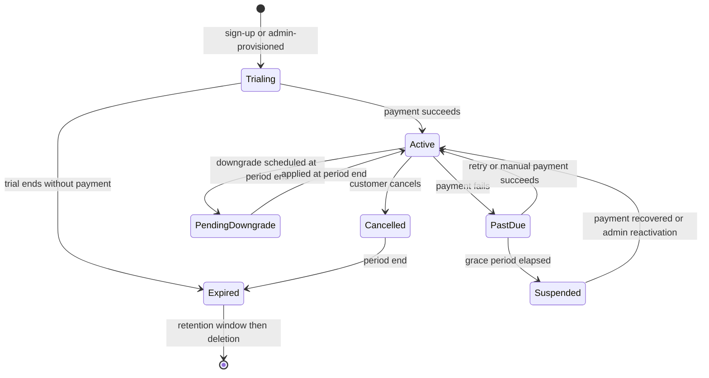

# BrandSpace — Billing and AI Credits

> **الملخص التنفيذي بالعربية**
>
> هذا المستند يحدد نموذج **الاشتراكات والفوترة ورصيد الذكاء الاصطناعي**.
>
> **مبدأ أول:** لا نربط المعمارية بمزود دفع واحد. هناك **طبقة تجريد** (Payment Provider Abstraction) تسمح بتغيير مزود الدفع
> أو دعم أكثر من مزود (لأسواق مختلفة) دون إعادة كتابة النظام.
>
> **مبدأ ثانٍ:** كل شيء مالي **قابل للتهيئة من مركز التحكم**: الخطط، الأسعار، العملات، مدة التجربة، الحدود، أسعار الرصيد،
> سياسة التجاوز، وقواعد الترقية والتخفيض.
>
> **مبدأ ثالث:** الرصيد يُدار عبر **دفتر حركات ثابت** لا يُعدَّل ولا يُحذف. الرصيد الحالي يُحسب من الدفتر ويمكن إعادة بنائه بالكامل.
> **لا خصم عند فشل الطلب، ولا خصم مزدوج عند إعادة المحاولة، ولا رصيد سالب أبدًا.**
>
> **مبدأ رابع:** أحداث مزود الدفع (Webhooks) تُعالَج بشكل **غير مكرر** (Idempotent) اعتمادًا على معرّف الحدث،
> مع دعم كامل للفواتير، الضرائب، الكوبونات، الإضافات، الترقية والتخفيض والتناسب الزمني (Proration)، فشل الدفع، فترة السماح،
> الإيقاف، والاسترداد.

---

## Part I — Subscription Billing

## 1. Provider Abstraction

BrandSpace defines its own billing domain and treats payment providers as replaceable adapters. The domain
model (`Plan`, `Subscription`, `Invoice`, entitlements, credits) is **ours**; the provider handles payment
instruments, PCI scope, and money movement.

```ts
interface PaymentProviderAdapter {
  readonly key: string;

  // Customers & payment methods
  ensureCustomer(w: WorkspaceBillingProfile): Promise<ProviderCustomerRef>;
  createCheckoutSession(p: CheckoutParams): Promise<HostedSession>; // hosted → PCI scope stays out of our systems
  createBillingPortalSession(p: PortalParams): Promise<HostedSession>;

  // Subscriptions
  createSubscription(p: CreateSubscriptionParams): Promise<ProviderSubscription>;
  updateSubscription(p: UpdateSubscriptionParams): Promise<ProviderSubscription>; // plan change, seats, add-ons
  cancelSubscription(p: CancelParams): Promise<ProviderSubscription>;
  resumeSubscription(p: ResumeParams): Promise<ProviderSubscription>;

  // One-off & credits
  createOneTimeCharge(p: ChargeParams): Promise<ProviderCharge>; // credit packs, add-ons, overage

  // Invoices & refunds
  getInvoice(id: string): Promise<ProviderInvoice>;
  refund(p: RefundParams): Promise<ProviderRefund>;

  // Webhooks
  verifyWebhook(raw: Buffer, headers: Headers, secret: string): boolean;
  parseWebhook(raw: Buffer): NormalizedBillingEvent[];

  // Capabilities the provider supports (drives UI and validation)
  capabilities(): ProviderCapabilities;
}
```

### 1.1 Design rules

- **Hosted checkout and hosted portal by default** — card data never touches BrandSpace systems, keeping PCI
  scope minimal.
- Provider objects are referenced by ID (`providerKey`, `providerSubscriptionId`, `providerCustomerId`,
  `providerInvoiceId`), never mirrored as the source of truth for entitlements.
- **Entitlements are resolved from our own `Subscription` + `Plan`**, so a provider outage never removes a
  paying customer's access.
- Multiple providers can be active simultaneously (e.g. a global provider plus a regional one for MENA local
  payment methods); the provider is selected per workspace by configuration rules (country, currency).
- `capabilities()` tells the platform what the provider supports (proration, trials without card, tax
  calculation, multi-currency, local methods). The UI and validation adapt rather than assuming.

---

## 2. Products and Pricing

All defined in Platform Admin (`docs/ADMIN-CONTROL-CENTER.md` §4), never in code.

| Item                   | Detail                                                                                                                                                                                   |
| ---------------------- | ---------------------------------------------------------------------------------------------------------------------------------------------------------------------------------------- |
| **Subscription plans** | Monthly and annual, per currency; annual typically discounted                                                                                                                            |
| **Seats**              | Included seat count + priced additional seats                                                                                                                                            |
| **Add-ons**            | Extra brands, extra social accounts, extra storage, extra AI credits, priority support                                                                                                   |
| **Credit packs**       | One-time purchases, non-expiring or long-expiry                                                                                                                                          |
| **Overage**            | Optional per-plan, priced per credit, capped                                                                                                                                             |
| **Trials**             | Configurable length, card-required or not, trial credits, one trial per workspace (abuse-checked). **Approved: 14 days, no card, 200 credits (D-09)**                                    |
| **Coupons**            | Percentage or fixed, duration (once / repeating / forever), restricted by plan, country, date, and redemption count                                                                      |
| **Taxes**              | Inclusive or exclusive per region; VAT number capture and validation for business customers; provider tax engine where available                                                         |
| **Currencies**         | Configurable list with per-currency price tables. No runtime FX conversion for display prices — each currency has its own explicitly set price. **Approved at launch: SAR + USD (D-08)** |

---

## 3. Subscription Lifecycle



### 3.1 Trials

- Length, credits, and card requirement are configuration.
- Trial end triggers reminders at 7 / 3 / 1 days (bilingual templates).
- At expiry without payment: workspace moves to `suspended` — **data is retained**, publishing and AI stop,
  and export remains available.
- Extensions are an audited admin action with a per-role cap.

### 3.2 Upgrades

- Take effect **immediately**.
- Charged with proration for the remainder of the period (when the provider supports it; otherwise a
  one-time charge is created).
- Entitlements apply at once; the credit difference is granted immediately, pro-rated by remaining period
  (policy configurable: full grant vs. pro-rated grant).

### 3.3 Downgrades

- Take effect at **period end** by default, avoiding refund complexity and abrupt capability loss.
- A **pre-downgrade impact check** runs at request time and again before application: seats over limit,
  brands over limit, connected accounts over limit, storage over limit.
- The customer must resolve overages, or choose which resources to deactivate. Nothing is deleted
  automatically — excess resources become read-only/archived and are restored on re-upgrade.
- Unused credits: rollover per plan policy; excess above the new plan's cap is **retained until its own
  expiry** under the approved policy (D-12), not forfeited at period end. The policy is shown before
  confirming.

### 3.4 Cancellation

- Cancel-at-period-end by default; access continues until then.
- Immediate cancellation with proration is an admin action.
- On expiry: workspace `cancelled` → export available for the retention window → deletion per policy.

### 3.5 Payment failure and dunning

Configurable retry schedule (e.g. day 1, 3, 5, 7) with bilingual emails at each step.

```
Payment fails → past_due (full access, banner + email)
  → retries per schedule
  → grace period ends → suspended (AI + publishing stop; data retained; export available)
  → after N days suspended → cancelled
```

Grace period length, retry schedule, and what is disabled at each stage are all configuration.
Recovery at any stage restores access immediately.

### 3.6 Refunds

Full or partial, from Platform Admin with a reason and step-up auth. Issued through the provider,
mirrored to a credit note against the invoice, and audited. Refunding a period may optionally revoke the
credits granted for it (configurable, default: no revocation for goodwill refunds, revocation for fraud).

---

## 4. Invoicing

- Every charge produces an `Invoice` with a sequential number, line items, discounts, taxes, and totals.
- Immutable once issued; corrections are credit notes, never edits.
- PDF stored in object storage, downloadable by the customer from the Billing module and by staff from Admin.
- Bilingual invoice templates with the correct legal entity, tax identifiers, and address.
- Line items are explicit: subscription, seats, add-ons, credit packs, overage, discounts, tax.

---

## 5. Billing Webhooks

| Rule           | Detail                                                                                                    |
| -------------- | --------------------------------------------------------------------------------------------------------- |
| Verification   | Signature + timestamp on the raw body, before parsing                                                     |
| Idempotency    | `unique(providerKey, externalEventId)`; replays are no-ops                                                |
| Async          | Acknowledge fast, process on the `billing-events` queue                                                   |
| Ordering       | Events may arrive out of order; state transitions compare event timestamps/versions and ignore stale ones |
| Failure        | Failed processing retries with backoff, then dead-letters with an alert and an admin replay tool          |
| Reconciliation | A daily job compares provider subscription/invoice state against ours and reports drift                   |

Normalized events: `subscription.created` · `subscription.updated` · `subscription.cancelled` ·
`invoice.created` · `invoice.paid` · `invoice.payment_failed` · `charge.refunded` · `dispute.created` ·
`payment_method.updated` · `customer.updated`.

**A webhook never grants entitlements directly.** It updates our `Subscription`, and entitlements are then
resolved from our own model — so a spoofed or malformed event cannot escalate access.

---

## 6. Customer Billing Portal (in the dashboard)

Plan and usage summary · change plan (with impact preview) · add/remove seats · buy credit packs and add-ons ·
manage payment method (hosted) · billing address and tax ID · invoice history and downloads · cancel with
retention offer · **AI credit balance, burn rate, projected exhaustion date, and usage breakdown by member,
brand, and feature**.

Visible only to Workspace Owner (full) and Workspace Admin (read-only).

---

## 7. Platform Billing Reports

MRR/ARR with movement breakdown (new / expansion / contraction / churn) · trial-to-paid conversion ·
revenue by plan, country, and currency · failed-payment recovery rate · refunds and disputes ·
LTV and payback by cohort · **AI cost vs. credit revenue and gross margin** overall, per plan, and per
workspace · outstanding invoices and aging.

---

# Part II — AI Credits

> **APPROVED CREDIT POLICY (D-11, D-12), 2026-09-07.** For the MVP:
>
> - **Hard stop at zero on every plan.** No postpaid overage and no surprise invoice charges.
> - **Prepaid top-ups only** — credit packs are bought before they are used.
> - Purchased packs expire after **12 months**; promotional credits after **3 months**.
> - Monthly plan credits **roll over up to one monthly allowance**.
> - Consumption is **FIFO by nearest expiry**.
> - On downgrade **no customer resource is ever deleted**; resources over the new limit become read-only
>   and are restored on re-upgrade.
>
> Allowances and per-action credit costs (`docs/PRODUCT.md` §10A.5) are **provisional and configurable**.
> They must **not** be activated as final production economics until Phase 4 validates real provider costs
> against the required gross margin (D-15).

## 8. Why an Internal Credit Unit

| Problem with raw provider billing              | How credits solve it                                                   |
| ---------------------------------------------- | ---------------------------------------------------------------------- |
| Customers cannot predict token usage           | A credit is a stable, understandable unit shown before every AI action |
| Provider prices change                         | Only the internal cost mapping changes; customer pricing stays stable  |
| Different providers price differently          | One unit across text, image, video, voice, and embeddings              |
| Provider switching would change customer bills | Routing changes are invisible to customers                             |
| Margin is opaque                               | Cost and charge are recorded side by side on every request             |

**Definition:** 1 credit = a configuration-defined unit of AI work. The Admin credit-cost editor maps each
task and model to a credit cost and displays the implied margin at the current provider price.

**Customer-facing communication rule:** the UI always shows the credit cost of an action **before** it runs
(e.g. "Generate 5 captions — 5 credits"), plus the remaining balance.

---

## 9. Wallet and Ledger

- One `CreditWallet` per workspace.
- `CreditTransaction` is the **immutable, append-only** ledger. Every movement is a row.
- `currentBalance` is a materialized projection updated only inside the same transaction as the ledger row,
  and fully reconstructible by replaying the ledger.
- A nightly reconciliation job replays and compares; **any drift is a critical alert**.

### 9.1 Transaction types

| Type                  | Sign              | Trigger                                       |
| --------------------- | ----------------- | --------------------------------------------- |
| `plan_grant`          | +                 | Billing-cycle reset from the plan allowance   |
| `addon_purchase`      | +                 | Credit pack purchased                         |
| `promotional_grant`   | +                 | Campaign or goodwill grant (usually expiring) |
| `admin_adjustment`    | ±                 | Manual, reason-required, audited              |
| `reservation`         | − (to reserved)   | AI request reserves an estimate               |
| `reservation_release` | + (from reserved) | Request failed or over-estimated              |
| `usage_charge`        | −                 | Confirmed successful usage                    |
| `refund`              | +                 | Reversal of a usage charge                    |
| `expiry`              | −                 | Expiring grant swept                          |
| `reset`               | ±                 | Cycle reset per rollover policy               |

---

## 10. Concurrency and Integrity

### 10.1 Reservation flow

```sql
BEGIN;
  SELECT current_balance, reserved_balance
    FROM credit_wallet
   WHERE workspace_id = $1
     FOR UPDATE;                       -- serializes all wallet mutations

  -- available = current_balance - reserved_balance
  -- if available < estimate  → ROLLBACK, return insufficient_credits

  INSERT INTO credit_transaction (..., type='reservation', idempotency_key=$k, ...);
  UPDATE credit_wallet
     SET reserved_balance = reserved_balance + $estimate,
         version = version + 1
   WHERE id = $wallet;
COMMIT;
```

### 10.2 The four integrity guarantees

| Guarantee                  | Mechanism                                                                                                                                    |
| -------------------------- | -------------------------------------------------------------------------------------------------------------------------------------------- |
| **No negative balance**    | `FOR UPDATE` row lock + `CHECK (current_balance >= 0)` + reserve-before-execute                                                              |
| **No race conditions**     | All wallet mutations serialize on the wallet row; parallel requests queue behind the lock                                                    |
| **No duplicate deduction** | `unique(CreditTransaction.idempotencyKey)` and `unique(AIRequest.idempotencyKey)`; retries reuse the existing reservation                    |
| **No charge for failure**  | Terminal non-success releases the reservation in full; the ledger records `credits = 0` with the provider cost preserved for margin analysis |

### 10.3 Leak prevention

A sweeper finds reservations older than their request's timeout and releases them, then alerts.
**Reservation leaks are a monitored metric that must stay at zero.**

---

## 11. Grants, Expiry, Resets

- **Monthly plan grant** on the subscription's billing-cycle boundary — not the calendar month — so a
  customer who subscribes on the 20th resets on the 20th.
- **Rollover policy** per plan: `none` (unused expire), `capped` (roll over up to N), or `full`.
- **Expiry:** each grant may carry `expiresAt`. A daily sweep writes `expiry` transactions.
  Customers are warned 7 days before a material expiry.
- **Consumption order: FIFO by expiry** — soonest-expiring credits are consumed first, and each usage
  charge records which grant bucket it drew from.
- **Promotional grants** are bulk-issuable from Admin to a cohort with an expiry and an affected-workspace
  preview before commit.

---

## 12. Limits, Warnings, Overage

| Control                             | Behavior                                                                                                                                                                           |
| ----------------------------------- | ---------------------------------------------------------------------------------------------------------------------------------------------------------------------------------- |
| Low-balance warning                 | Configurable thresholds (default 20% and 5%): in-app + email, rate-limited to avoid nagging                                                                                        |
| Hard limit (**MVP: on every plan**) | At zero available credits, AI actions are refused with a clear message and upgrade/top-up paths. Everything non-AI keeps working                                                   |
| Overage                             | **NOT IMPLEMENTED FOR THE MVP (D-11).** No postpaid overage, no surprise invoice charges. Prepaid top-ups only. The mechanism below is retained as a possible post-launch addition |
| Per-feature limits                  | Independent of the wallet (e.g. 200 images/month) — enforced as entitlement quotas                                                                                                 |
| Per-user limits                     | Optional, so one member cannot drain a shared wallet                                                                                                                               |
| Budget alerts                       | Workspace-level daily/monthly burn alerts to the Workspace Owner                                                                                                                   |

---

## 13. Reporting

**Customer-facing:** balance, reserved, granted this cycle, consumed this cycle, burn rate, projected
exhaustion date, breakdown by feature/task, by brand, by member, and a transaction history with export.

**Platform-facing:** per workspace and in aggregate — credits consumed, credits charged in money terms,
**actual provider cost**, **estimated gross margin**, cost per credit by task and model, most expensive
workspaces, and margin outliers.

```
grossMargin(workspace, period)
  = creditRevenueAttributed(period) − providerCost(period)

creditRevenueAttributed
  = (plan revenue allocated to credits per configuration)
  + credit pack revenue recognized
  + overage revenue
```

The allocation rule (how much of a subscription price is attributed to credits vs. platform features) is
configuration, set by the owner. It is an internal reporting construct — customers never see it.

---

## 14. Edge Cases and Their Resolutions

| Case                                             | Resolution                                                                                                                                    |
| ------------------------------------------------ | --------------------------------------------------------------------------------------------------------------------------------------------- |
| Request succeeds but settlement fails            | Reservation stands; a reconciliation job settles from the `AIRequest` record. The customer is never double-charged, and revenue is never lost |
| Provider double-bills us                         | Detected in reconciliation; the ledger reflects our recorded usage, and the discrepancy is reported for a provider dispute                    |
| Downgrade with a larger balance than the new cap | Per plan policy: retain or expire at period end. Always shown before confirming                                                               |
| Workspace suspended with a balance               | Balance is frozen, not forfeited. It is restored on reactivation                                                                              |
| Workspace deleted with a balance                 | Credits are non-refundable by policy (stated in Terms); unused paid credit packs may be refunded at the owner's discretion                    |
| Refund of a subscription period                  | Optionally revokes credits granted for that period, per configuration                                                                         |
| Concurrent requests exceeding the balance        | Serialized on the wallet lock; the first N succeed, the rest get `insufficient_credits`                                                       |
| Provider price rises                             | Owner adjusts credit costs; existing balances keep their face value, and the margin change is visible before activation                       |
| Clock/timezone edge at cycle reset               | Resets are driven by the subscription period boundary in UTC, with the workspace timezone used only for display                               |
| BYOK customer                                    | Reduced platform fee instead of full credit cost; provider cost recorded as zero to BrandSpace; ledger flags `byok`                           |

---

## 15. Testing

| Test                | Assertion                                                                                  |
| ------------------- | ------------------------------------------------------------------------------------------ |
| Ledger replay       | Replaying all transactions reproduces `currentBalance` exactly                             |
| Failure path        | Failed AI request ⇒ balance unchanged, zero `usage_charge`                                 |
| Retry               | Same idempotency key twice ⇒ exactly one charge                                            |
| Concurrency         | 50 parallel requests on a wallet sized for 10 ⇒ exactly 10 charges, balance ≥ 0            |
| Reservation leak    | Abandoned reservations are released by the sweeper                                         |
| FIFO expiry         | Soonest-expiring credits are consumed first                                                |
| Reset               | Cycle reset applies the correct rollover policy                                            |
| Overage             | With overage off, zero balance blocks; with overage on, it charges up to the cap and stops |
| Webhook idempotency | Duplicate provider events change nothing                                                   |
| Webhook spoofing    | Invalid signature ⇒ rejected, no state change                                              |
| Proration           | Upgrade mid-cycle produces the expected charge and credit grant                            |
| Downgrade guard     | Downgrade with resources over the new limit is blocked until resolved                      |
| Isolation           | Workspace A can never read or affect B's wallet, ledger, or invoices                       |
| Immutability        | Any attempt to update or delete a ledger row or issued invoice fails at the database level |
