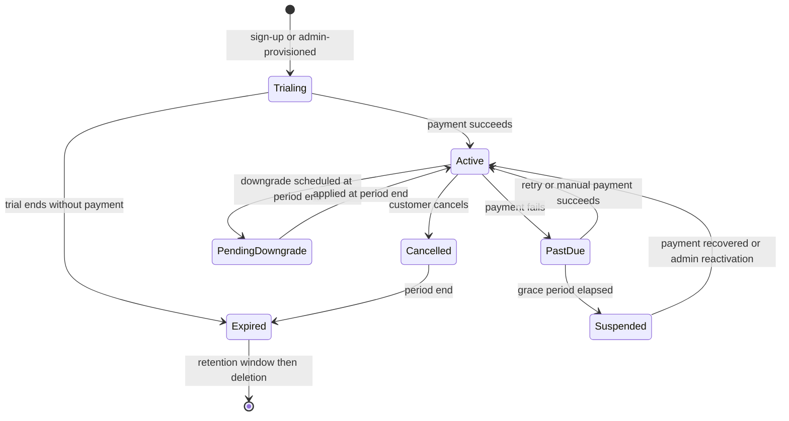

# BrandSpace — Billing and AI Credits

> **الملخص التنفيذي بالعربية**
>
> هذا المستند يحدد نموذج **الاشتراكات والفوترة ورصيد الذكاء الاصطناعي**.
>
> **مبدأ أول:** لا نربط المعمارية بمزود دفع واحد. هناك **طبقة تجريد** (Payment Provider Abstraction) تسمح بتغيير مزود الدفع
> أو دعم أكثر من مزود (لأسواق مختلفة) دون إعادة كتابة النظام.
>
> **مبدأ ثانٍ:** كل شيء مالي **قابل للتهيئة من مركز التحكم**: الخطط، الأسعار، العملات، مدة التجربة، الحدود، أسعار الرصيد،
> سياسة التجاوز، وقواعد الترقية والتخفيض.
>
> **مبدأ ثالث:** الرصيد يُدار عبر **دفتر حركات ثابت** لا يُعدَّل ولا يُحذف. الرصيد الحالي يُحسب من الدفتر ويمكن إعادة بنائه بالكامل.
> **لا خصم عند فشل الطلب، ولا خصم مزدوج عند إعادة المحاولة، ولا رصيد سالب أبدًا.**
>
> **مبدأ رابع:** أحداث مزود الدفع (Webhooks) تُعالَج بشكل **غير مكرر** (Idempotent) اعتمادًا على معرّف الحدث،
> مع دعم كامل للفواتير، الضرائب، الكوبونات، الإضافات، الترقية والتخفيض والتناسب الزمني (Proration)، فشل الدفع، فترة السماح،
> الإيقاف، والاسترداد.

---

## Part I — Subscription Billing

## 1. Provider Abstraction

BrandSpace defines its own billing domain and treats payment providers as replaceable adapters. The domain
model (`Plan`, `Subscription`, `Invoice`, entitlements, credits) is **ours**; the provider handles payment
instruments, PCI scope, and money movement.

```ts
interface PaymentProviderAdapter {
  readonly key: string;

  // Customers & payment methods
  ensureCustomer(w: WorkspaceBillingProfile): Promise<ProviderCustomerRef>;
  createCheckoutSession(p: CheckoutParams): Promise<HostedSession>; // hosted → PCI scope stays out of our systems
  createBillingPortalSession(p: PortalParams): Promise<HostedSession>;

  // Subscriptions
  createSubscription(p: CreateSubscriptionParams): Promise<ProviderSubscription>;
  updateSubscription(p: UpdateSubscriptionParams): Promise<ProviderSubscription>; // plan change, seats, add-ons
  cancelSubscription(p: CancelParams): Promise<ProviderSubscription>;
  resumeSubscription(p: ResumeParams): Promise<ProviderSubscription>;

  // One-off & credits
  createOneTimeCharge(p: ChargeParams): Promise<ProviderCharge>; // credit packs, add-ons, overage

  // Invoices & refunds
  getInvoice(id: string): Promise<ProviderInvoice>;
  refund(p: RefundParams): Promise<ProviderRefund>;

  // Webhooks
  verifyWebhook(raw: Buffer, headers: Headers, secret: string): boolean;
  parseWebhook(raw: Buffer): NormalizedBillingEvent[];

  // Capabilities the provider supports (drives UI and validation)
  capabilities(): ProviderCapabilities;
}
```

### 1.1 Design rules

- **Hosted checkout and hosted portal by default** — card data never touches BrandSpace systems, keeping PCI
  scope minimal.
- Provider objects are referenced by ID (`providerKey`, `providerSubscriptionId`, `providerCustomerId`,
  `providerInvoiceId`), never mirrored as the source of truth for entitlements.
- **Entitlements are resolved from our own `Subscription` + `Plan`**, so a provider outage never removes a
  paying customer's access.
- Multiple providers can be active simultaneously (e.g. a global provider plus a regional one for MENA local
  payment methods); the provider is selected per workspace by configuration rules (country, currency).
- `capabilities()` tells the platform what the provider supports (proration, trials without card, tax
  calculation, multi-currency, local methods). The UI and validation adapt rather than assuming.

---

## 2. Products and Pricing

All defined in Platform Admin (`docs/ADMIN-CONTROL-CENTER.md` §4), never in code.

| Item                   | Detail                                                                                                                                                                                   |
| ---------------------- | ---------------------------------------------------------------------------------------------------------------------------------------------------------------------------------------- |
| **Subscription plans** | Monthly and annual, per currency; annual typically discounted                                                                                                                            |
| **Seats**              | Included seat count + priced additional seats                                                                                                                                            |
| **Add-ons**            | Extra brands, extra social accounts, extra storage, extra AI credits, priority support                                                                                                   |
| **Credit packs**       | One-time purchases, non-expiring or long-expiry                                                                                                                                          |
| **Overage**            | Optional per-plan, priced per credit, capped                                                                                                                                             |
| **Trials**             | Configurable length, card-required or not, trial credits, one trial per workspace (abuse-checked). **Approved: 14 days, no card, 200 credits (D-09)**                                    |
| **Coupons**            | Percentage or fixed, duration (once / repeating / forever), restricted by plan, country, date, and redemption count                                                                      |
| **Taxes**              | Inclusive or exclusive per region; VAT number capture and validation for business customers; provider tax engine where available                                                         |
| **Currencies**         | Configurable list with per-currency price tables. No runtime FX conversion for display prices — each currency has its own explicitly set price. **Approved at launch: SAR + USD (D-08)** |

---

## 3. Subscription Lifecycle



### 3.1 Trials

- Length, credits, and card requirement are configuration.
- Trial end triggers reminders at 7 / 3 / 1 days (bilingual templates).
- At expiry without payment: workspace moves to `suspended` — **data is retained**, publishing and AI stop,
  and export remains available.
- Extensions are an audited admin action with a per-role cap.

### 3.2 Upgrades

- Take effect **immediately**.
- Charged with proration for the remainder of the period (when the provider supports it; otherwise a
  one-time charge is created).
- Entitlements apply at once; the credit difference is granted immediately, pro-rated by remaining period
  (policy configurable: full grant vs. pro-rated grant).

### 3.3 Downgrades

- Take effect at **period end** by default, avoiding refund complexity and abrupt capability loss.
- A **pre-downgrade impact check** runs at request time and again before application: seats over limit,
  brands over limit, connected accounts over limit, storage over limit.
- The customer must resolve overages, or choose which resources to deactivate. Nothing is deleted
  automatically — excess resources become read-only/archived and are restored on re-upgrade.
- Unused credits: rollover per plan policy; excess above the new plan's cap is **retained until its own
  expiry** under the approved policy (D-12), not forfeited at period end. The policy is shown before
  confirming.

### 3.4 Cancellation

- Cancel-at-period-end by default; access continues until then.
- Immediate cancellation with proration is an admin action.
- On expiry: workspace `cancelled` → export available for the retention window → deletion per policy.

### 3.5 Payment failure and dunning

Configurable retry schedule (e.g. day 1, 3, 5, 7) with bilingual emails at each step.

```
Payment fails → past_due (full access, banner + email)
  → retries per schedule
  → grace period ends → suspended (AI + publishing stop; data retained; export available)
  → after N days suspended → cancelled
```

Grace period length, retry schedule, and what is disabled at each stage are all configuration.
Recovery at any stage restores access immediately.

### 3.6 Refunds

Full or partial, from Platform Admin with a reason and step-up auth. Issued through the provider,
mirrored to a credit note against the invoice, and audited. Refunding a period may optionally revoke the
credits granted for it (configurable, default: no revocation for goodwill refunds, revocation for fraud).

---

## 4. Invoicing

- Every charge produces an `Invoice` with a sequential number, line items, discounts, taxes, and totals.
- Immutable once issued; corrections are credit notes, never edits.
- PDF stored in object storage, downloadable by the customer from the Billing module and by staff from Admin.
- Bilingual invoice templates with the correct legal entity, tax identifiers, and address.
- Line items are explicit: subscription, seats, add-ons, credit packs, overage, discounts, tax.

---

## 5. Billing Webhooks

| Rule           | Detail                                                                                                               |
| -------------- | -------------------------------------------------------------------------------------------------------------------- |
| Verification   | Signature + timestamp on the raw body, before parsing                                                                |
| Idempotency    | `unique(providerKey, externalEventId)`; replays are no-ops                                                           |
| Async          | Acknowledge fast. Implemented SYNCHRONOUSLY, with the provider's own redelivery as the retry transport — §5.1, D-222 |
| Concurrency    | One delivery at a time per event, enforced by a processing claim with a lease (D-221)                                |
| Ordering       | Events may arrive out of order; state transitions compare event timestamps/versions and ignore stale ones            |
| Failure        | TRANSIENT processing retries with backoff, then dead-letters with an alert and an admin replay tool                  |
| Reconciliation | A daily job compares provider subscription/invoice state against ours and reports drift                              |

Normalized events: `subscription.created` · `subscription.updated` · `subscription.cancelled` ·
`invoice.created` · `invoice.paid` · `invoice.payment_failed` · `charge.refunded` · `dispute.created` ·
`payment_method.updated` · `customer.updated`.

**A webhook never grants entitlements directly.** It updates our `Subscription`, and entitlements are then
resolved from our own model — so a spoofed or malformed event cannot escalate access.

### 5.1 How retry, dead-lettering and replay actually work

The table above has always asked for three things. This is where each of them lives.

**Retry with backoff — the provider's redelivery is the transport.** A `RETRYABLE` outcome answers
**503**, and every payment provider retries a non-2xx on its own exponential schedule. There is no
second hop through the `billing-events` queue between the delivery and the settlement, which is the one
place this implementation departs from the "process on the queue" line above; D-222 records why. The
retry BUDGET is still the queue's — `QUEUE_DEFINITIONS['billing-events'].maxAttempts` — bound to the
reconciler by `tests/unit/billing-retry-policy.test.ts` so the two cannot drift.

**The distinction that makes this safe is `FAILED` versus `RETRYABLE`.** `FAILED` is a decision about
the money, reached by comparing rows we hold against an event we were sent; every redelivery reaches it
again, so retrying is noise rather than resilience. `RETRYABLE` is a dropped connection, a deadlock, a
timeout — nothing was applied, because the settlement is atomic, so a redelivery must re-apply it.
Classification DEFAULTS TO `RETRYABLE`: misreading a transient failure as terminal loses a customer's
money silently, while the reverse costs at most `maxAttempts` redeliveries before the row dead-letters
with an alert on it.

**Dead-letter with an alert.** `DEAD_LETTER` is terminal and writes a CRITICAL `AuditEvent`
(`billing.event.dead_lettered`) — an alert that is emitted, rather than a row somebody would have to go
looking for.

**Admin replay.** `BillingReconciler.replay()` reconstructs the normalized event from the inbox row's
own stored payload and re-runs the settlement. It replays only from `DEAD_LETTER`, `FAILED`,
`UNRESOLVED`, `RETRYABLE` or `RECEIVED` — never from `PROCESSED`, `DUPLICATE` or `STALE`, so the tool
cannot turn one payment into two — and it records the operator who asked
(`billing.event.replayed`, `PLATFORM_USER`). An operator cannot supply an event, amend an amount, or
replay anything that was not signed on arrival.

**The operator can now see them and finish them** (current execution Phase 3, D-241).
`eventsNeedingAttention()` lists the inbox rows in `DEAD_LETTER`, `FAILED` and `UNRESOLVED` — bounded,
oldest first, and never returning the normalized payload — and the Control Center's **System health**
page shows them with a replay control. Until that existed the queue had an index described as "listing
the dead-letter queue for an operator" that no query used, and an operator's only route to a stuck
payment was to already know its id.

**The replay surface holds no provider secret.** `ReconcilerOptions.providers` is optional: it is
consulted only by `receive()`, which verifies and parses a delivery. A reconciler built without it can
re-apply an event the platform already verified and CANNOT accept a new one, so the Control Center
never needs a webhook signing key (F-07).

**The authority it requires is the union of what it can do.** A replay can activate a subscription and
can grant purchased credits, so it requires BOTH `platform.plan.assign` and `platform.credit.adjust` —
strictly narrower than either alone. Whether it should instead have a key of its own is D-236.

**One delivery at a time.** Settlement runs outside the inbox row's own transaction, deliberately, so a
rolled-back apply still leaves the receipt visible. A processing claim — a conditional `UPDATE` carrying
a token and a lease — is therefore what serializes two deliveries of the same event, rather than a
database lock. D-221.

---

## 6. Customer Billing Portal (in the dashboard)

Plan and usage summary · change plan (with impact preview) · add/remove seats · buy credit packs and add-ons ·
manage payment method (hosted) · billing address and tax ID · invoice history and downloads · cancel with
retention offer · **AI credit balance, burn rate, projected exhaustion date, and usage breakdown by member,
brand, and feature**.

Visible only to Workspace Owner (full) and Workspace Admin (read-only).

---

## 7. Platform Billing Reports

MRR/ARR with movement breakdown (new / expansion / contraction / churn) · trial-to-paid conversion ·
revenue by plan, country, and currency · failed-payment recovery rate · refunds and disputes ·
LTV and payback by cohort · **AI cost vs. credit revenue and gross margin** overall, per plan, and per
workspace · outstanding invoices and aging.

---

# Part II — AI Credits

> **APPROVED CREDIT POLICY (D-11, D-12), 2026-09-07.** For the MVP:
>
> - **Hard stop at zero on every plan.** No postpaid overage and no surprise invoice charges.
> - **Prepaid top-ups only** — credit packs are bought before they are used.
> - Purchased packs expire after **12 months**; promotional credits after **3 months**.
> - Monthly plan credits **roll over up to one monthly allowance**.
> - Consumption is **FIFO by nearest expiry**.
> - On downgrade **no customer resource is ever deleted**; resources over the new limit become read-only
>   and are restored on re-upgrade.
>
> Allowances and per-action credit costs (`docs/PRODUCT.md` §10A.5) are **provisional and configurable**.
> They must **not** be activated as final production economics until real provider costs are measured
> against the target gross margin (D-15).
>
> **D-15 approved 2026-09-13: the target gross margin on AI usage is 65%.** A credit price is derived from
> a measured provider cost, not marked up:
>
> ```
> customer price = provider cost / (1 - target gross margin)
> ```
>
> Marking a cost up by 65% yields a margin of ≈39.4%, not 65% — the two are not the same operation and the
> error compounds across every priced task. `requiredPriceMicroMinor()` in `@brandspace/ai-gateway`
> implements the division.
>
> The 65% is an internal commercial **target**, not a hard-coded markup. It lives in
> `ai.credit-rules.targetGrossMarginPercent`, versioned like every other configuration value, and defaults
> to `null`. It is distinct from `minimumGrossMarginPercent`, the floor that triggers a warning.
>
> **Final per-action credit prices remain uncalibrated** and published package prices are unchanged. They
> will be set from real provider benchmarks once D-13 (vendor selection) and D-17 (the Arabic quality gate)
> are cleared.
>
> **IMPLEMENTED IN PHASE 3 (2026-09-07).** `reserve → confirm → settle` with `release`, credit
> buckets consumed FIFO by nearest expiry, the expiry sweep, cycle reset with the rollover cap,
> trial and promotional grants, low-balance thresholds, the abandoned-reservation sweeper, and
> reconciliation by replay. All provider-independent: nothing calls an AI provider, prices a task
> or knows what a model costs. Phase 4 drives these primitives; it does not replace them.
>
> **STILL SPECIFICATION.** Everything in Part I above — the payment provider abstraction,
> checkout, the billing portal, webhooks, invoices, dunning, proration and refunds — is Phase 7.
> Phase 3 ships `WorkspaceSubscription`, which records the plan, the pinned price, the trial and
> the cycle, and touches no payment provider at all.

## 8. Why an Internal Credit Unit

| Problem with raw provider billing              | How credits solve it                                                   |
| ---------------------------------------------- | ---------------------------------------------------------------------- |
| Customers cannot predict token usage           | A credit is a stable, understandable unit shown before every AI action |
| Provider prices change                         | Only the internal cost mapping changes; customer pricing stays stable  |
| Different providers price differently          | One unit across text, image, video, voice, and embeddings              |
| Provider switching would change customer bills | Routing changes are invisible to customers                             |
| Margin is opaque                               | Cost and charge are recorded side by side on every request             |

**Definition:** 1 credit = a configuration-defined unit of AI work. The Admin credit-cost editor maps each
task and model to a credit cost and displays the implied margin at the current provider price.

**Customer-facing communication rule:** the UI always shows the credit cost of an action **before** it runs
(e.g. "Generate 5 captions — 5 credits"), plus the remaining balance.

---

## 9. Wallet and Ledger

- One `CreditWallet` per workspace.
- `CreditTransaction` is the **immutable, append-only** ledger. Every movement is a row.
- `currentBalance` is a materialized projection updated only inside the same transaction as the ledger row,
  and fully reconstructible by replaying the ledger.
- A nightly reconciliation job replays and compares; **any drift is a critical alert**.

### 9.1 Transaction types

| Type                  | Sign              | Trigger                                       |
| --------------------- | ----------------- | --------------------------------------------- |
| `plan_grant`          | +                 | Billing-cycle reset from the plan allowance   |
| `addon_purchase`      | +                 | Credit pack purchased                         |
| `promotional_grant`   | +                 | Campaign or goodwill grant (usually expiring) |
| `admin_adjustment`    | ±                 | Manual, reason-required, audited              |
| `reservation`         | − (to reserved)   | AI request reserves an estimate               |
| `reservation_release` | + (from reserved) | Request failed or over-estimated              |
| `usage_charge`        | −                 | Confirmed successful usage                    |
| `refund`              | +                 | Reversal of a usage charge                    |
| `expiry`              | −                 | Expiring grant swept                          |
| `reset`               | ±                 | Cycle reset per rollover policy               |

---

## 10. Concurrency and Integrity

### 10.1 Reservation flow

```sql
BEGIN;
  SELECT current_balance, reserved_balance
    FROM credit_wallet
   WHERE workspace_id = $1
     FOR UPDATE;                       -- serializes all wallet mutations

  -- available = current_balance - reserved_balance
  -- if available < estimate  → ROLLBACK, return insufficient_credits

  INSERT INTO credit_transaction (..., type='reservation', idempotency_key=$k, ...);
  UPDATE credit_wallet
     SET reserved_balance = reserved_balance + $estimate,
         version = version + 1
   WHERE id = $wallet;
COMMIT;
```

### 10.2 The four integrity guarantees

| Guarantee                  | Mechanism                                                                                                                                    |
| -------------------------- | -------------------------------------------------------------------------------------------------------------------------------------------- |
| **No negative balance**    | `FOR UPDATE` row lock + `CHECK (current_balance >= 0)` + reserve-before-execute                                                              |
| **No race conditions**     | All wallet mutations serialize on the wallet row; parallel requests queue behind the lock                                                    |
| **No duplicate deduction** | `unique(CreditTransaction.idempotencyKey)` and `unique(AIRequest.idempotencyKey)`; retries reuse the existing reservation                    |
| **No charge for failure**  | Terminal non-success releases the reservation in full; the ledger records `credits = 0` with the provider cost preserved for margin analysis |

### 10.3 Leak prevention

A sweeper finds reservations older than their request's timeout and releases them, then alerts.
**Reservation leaks are a monitored metric that must stay at zero.**

---

## 11. Grants, Expiry, Resets

- **Monthly plan grant** on the subscription's billing-cycle boundary — not the calendar month — so a
  customer who subscribes on the 20th resets on the 20th.
- **Rollover policy** per plan: `none` (unused expire), `capped` (roll over up to N), or `full`.
- **Expiry:** each grant may carry `expiresAt`. A sweep writes `expiry` transactions.
  Customers are warned 7 days before a material expiry — **the warning is not implemented**;
  `noteLowBalance` exists and has no caller, and nothing emails a customer about an expiry.
- **Consumption order: FIFO by expiry** — soonest-expiring credits are consumed first, and each usage
  charge records which grant bucket it drew from.
- **Promotional grants** are bulk-issuable from Admin to a cohort with an expiry and an affected-workspace
  preview before commit.

---

## 12. Limits, Warnings, Overage

| Control                             | Behavior                                                                                                                                                                           |
| ----------------------------------- | ---------------------------------------------------------------------------------------------------------------------------------------------------------------------------------- |
| Low-balance warning                 | Configurable thresholds (default 20% and 5%): in-app + email, rate-limited to avoid nagging                                                                                        |
| Hard limit (**MVP: on every plan**) | At zero available credits, AI actions are refused with a clear message and upgrade/top-up paths. Everything non-AI keeps working                                                   |
| Overage                             | **NOT IMPLEMENTED FOR THE MVP (D-11).** No postpaid overage, no surprise invoice charges. Prepaid top-ups only. The mechanism below is retained as a possible post-launch addition |
| Per-feature limits                  | Independent of the wallet (e.g. 200 images/month) — enforced as entitlement quotas                                                                                                 |
| Per-user limits                     | Optional, so one member cannot drain a shared wallet                                                                                                                               |
| Budget alerts                       | Workspace-level daily/monthly burn alerts to the Workspace Owner                                                                                                                   |

---

## 13. Reporting

**Customer-facing:** balance, reserved, granted this cycle, consumed this cycle, burn rate, projected
exhaustion date, breakdown by feature/task, by brand, by member, and a transaction history with export.

**Platform-facing:** per workspace and in aggregate — credits consumed, credits charged in money terms,
**actual provider cost**, **estimated gross margin**, cost per credit by task and model, most expensive
workspaces, and margin outliers.

```
grossMargin(workspace, period)
  = creditRevenueAttributed(period) − providerCost(period)

creditRevenueAttributed
  = (plan revenue allocated to credits per configuration)
  + credit pack revenue recognized
  + overage revenue
```

The allocation rule (how much of a subscription price is attributed to credits vs. platform features) is
configuration, set by the owner. It is an internal reporting construct — customers never see it.

---

## 14. Edge Cases and Their Resolutions

| Case                                             | Resolution                                                                                                                                    |
| ------------------------------------------------ | --------------------------------------------------------------------------------------------------------------------------------------------- |
| Request succeeds but settlement fails            | Reservation stands; a reconciliation job settles from the `AIRequest` record. The customer is never double-charged, and revenue is never lost |
| Provider double-bills us                         | Detected in reconciliation; the ledger reflects our recorded usage, and the discrepancy is reported for a provider dispute                    |
| Downgrade with a larger balance than the new cap | Per plan policy: retain or expire at period end. Always shown before confirming                                                               |
| Workspace suspended with a balance               | Balance is frozen, not forfeited. It is restored on reactivation                                                                              |
| Workspace deleted with a balance                 | Credits are non-refundable by policy (stated in Terms); unused paid credit packs may be refunded at the owner's discretion                    |
| Refund of a subscription period                  | Optionally revokes credits granted for that period, per configuration                                                                         |
| Concurrent requests exceeding the balance        | Serialized on the wallet lock; the first N succeed, the rest get `insufficient_credits`                                                       |
| Provider price rises                             | Owner adjusts credit costs; existing balances keep their face value, and the margin change is visible before activation                       |
| Clock/timezone edge at cycle reset               | Resets are driven by the subscription period boundary in UTC, with the workspace timezone used only for display                               |
| BYOK customer                                    | Reduced platform fee instead of full credit cost; provider cost recorded as zero to BrandSpace; ledger flags `byok`                           |

---

## 15. Testing

| Test                | Assertion                                                                                  |
| ------------------- | ------------------------------------------------------------------------------------------ |
| Ledger replay       | Replaying all transactions reproduces `currentBalance` exactly — **implemented, Phase 3**  |
| Failure path        | Failed AI request ⇒ balance unchanged, zero `usage_charge`                                 |
| Retry               | Same idempotency key twice ⇒ exactly one charge                                            |
| Concurrency         | 50 parallel requests on a wallet sized for 10 ⇒ exactly 10 charges, balance ≥ 0            |
| Reservation leak    | Abandoned reservations are released by the sweeper — **implemented, Phase 3**              |
| FIFO expiry         | Soonest-expiring credits are consumed first — **implemented, Phase 3**                     |
| Reset               | Cycle reset applies the correct rollover policy                                            |
| Overage             | With overage off, zero balance blocks; with overage on, it charges up to the cap and stops |
| Webhook idempotency | Duplicate provider events change nothing                                                   |
| Webhook spoofing    | Invalid signature ⇒ rejected, no state change                                              |
| Proration           | Upgrade mid-cycle produces the expected charge and credit grant                            |
| Downgrade guard     | Downgrade with resources over the new limit is blocked until resolved                      |
| Isolation           | Workspace A can never read or affect B's wallet, ledger, or invoices                       |
| Immutability        | Any attempt to update or delete a ledger row or issued invoice fails at the database level |

---

## Part III — What Phase 9 Implemented

> This part records what the code actually does, so a reader comparing the specification above with
> the repository is never guessing which parts are built. Everything here is implemented, tested
> against real PostgreSQL, and walked end to end in a browser.

### 16. Money is exact, and carries its own scale

`packages/shared/src/money.ts` is the only representation of an amount in the product.

- **Integer minor units, held as `bigint`.** No floating-point value is ever the canonical form of
  money, and no `number` reaches the database (§6 of the Phase 9 brief, D-207).
- **The SCALE travels with the amount.** `1000` is `10.00` SAR and `1.000` KWD, and three of the
  seven launch currencies are three-digit. Every monetary row therefore stores `currency` AND
  `currencyScale`, because a scale re-read from the live catalogue would silently re-denominate an
  invoice issued last year the moment an owner corrected a typo.
- **`Money` refuses to combine two amounts whose currency or scale differ.** Cross-currency
  arithmetic becomes a thrown error at the line that caused it rather than a wrong total three
  screens away.
- **Nothing converts.** There is no rate anywhere in `packages/billing`. A plan with no price in the
  customer's currency is UNAVAILABLE and reports which of the two reasons applies.

### 17. The commercial geography is configuration

The `commerce` domain carries currencies (each with its own `minorUnitDigits`), markets, tax
policies, credit packs, provider routing, dunning and the invoice's legal identity. The `onboarding`
domain carries the rules of joining. **Neither holds a default country, locale, timezone or
currency** (D-194) — onboarding asks for all four, and a field here would be exactly the assumption
that decision removed.

A market may NARROW which currencies a country is offered. It never picks one.

### 18. The provider contract (D-204)

```
PaymentProviderAdapter
  capabilities()                → declared, never assumed equal
  ensureCustomer()              → the trusted workspace ↔ provider-customer mapping
  createCheckoutSession()       → hosted. There is no non-hosted alternative.
  createBillingPortalSession()
  updateSubscription() / cancelSubscription() / resumeSubscription()
  refund()                      → idempotent on the caller's key
  verifyWebhook(raw, headers)   → over the RAW bytes, before parsing
  parseWebhook(raw)             → into OUR vocabulary
```

**No method accepts a payment instrument, and none can be added without changing this contract.**
That absence is the PCI argument: hosted checkout means no card number ever reaches BrandSpace, and
the only durable way to guarantee it is to have nowhere to put one.

The only adapter shipped is the DEVELOPMENT one. It is not a stub that returns success — it issues a
signed event that must be delivered, verified and reconciled, so the honest path is the only path
that works.

### 19. Checkout: the price is ours, the confirmation is the provider's

1. A request names a plan key and an interval, or a pack key. **It carries no amount, and there is no
   field it could carry one in.**
2. The price is resolved server-side from the activated catalogue, taxed by the market's configured
   policy, and written onto our own `checkout_session` row.
3. The provider is called and returns a URL. The row is `PENDING`.
4. The customer pays on the provider's page. **Nothing in BrandSpace marks anything paid.**
5. A signed event arrives, is verified over the raw body, recorded, resolved, ordered and compared
   against the amount we wrote down. Only then is anything paid (D-205).

`commerce.checkout.trustBrowserRedirect` is typed `z.literal(false)` so this cannot be configured
away. The landing page reports reconciled state, which for a moment after a genuine payment is
legitimately "confirming your payment".

### 20. Webhook authority (D-208)

| Outcome       | When                                         | Effect                                     |
| ------------- | -------------------------------------------- | ------------------------------------------ |
| _(refused)_   | signature does not verify                    | **nothing is written**                     |
| `PROCESSED`   | verified, resolved, in order, amount matches | applied                                    |
| `DUPLICATE`   | the provider's event id was already recorded | nothing; original outcome kept             |
| `STALE`       | older than the state it describes            | recorded, not applied                      |
| `UNRESOLVED`  | no trusted mapping ties it to a workspace    | recorded, visible, applied to nothing      |
| `FAILED`      | amount or currency does not match our row    | CRITICAL audit; not applied, never retried |
| `RETRYABLE`   | settlement did not finish, transiently       | nothing applied; 503 asks for redelivery   |
| `IN_PROGRESS` | another delivery holds the processing claim  | nothing; that delivery owns the retry      |
| `DEAD_LETTER` | transient failures exhausted the budget      | CRITICAL audit; an operator must replay it |

The inbox is **platform-owned**: an event arrives before anyone knows whose it is, and one workspace
being able to count another's payment events would be a disclosure in itself.

### 21. Invoices and credit notes

- **Numbered at ISSUE, never at creation**, from a locked counter table rather than a sequence, so a
  discarded draft burns no number and a rolled-back issue returns its own (D-209).
- **Immutable once issued.** A correction is a credit note — a second document — and the invoice's
  `creditedMinor` rises under a CHECK that refuses more than the invoice total.
- **Line descriptions are written in BOTH languages at issue time**, so a PDF in either language is
  produced from the row rather than re-derived from a catalogue that has moved on.
- **Snapshots freeze the agreed terms and the printed parties**, so a price change or a moved office
  does not rewrite a document already issued.

### 22. Dunning

Measured from the FIRST failure, never from the last attempt, so a worker that runs late or twice can
neither extend nor shorten a customer's grace period. The escalation ends at SUSPENDED: **access is
withdrawn, the data is retained, and export stays available.** The audit event says so in as many
words so it cannot be misread later as a deletion. A provider's decline message never reaches our
rows — failure codes are a closed vocabulary, and anything unrecognised becomes `payment_failed`.

### 23. Credits stay prepaid (D-196)

The bridge from a settled purchase to the ledger is **one function wide**: "grant these credits,
once, inside the transaction I am already in". Billing cannot reserve, settle, expire or read the
wallet, and there is no method that could extend credit — which is the architectural form of "no
postpaid overage". A completed pack purchase **cannot exist without naming the one grant it
produced**, enforced by a CHECK constraint, so "paid once, granted once" is a database property
rather than a worker's good intentions.

---

# Part IV — Phase 10: the invoice as a document, and the accounting export

## 24. The document model

`InvoiceDocument` is the canonical, renderer-independent shape of an issued invoice: the parties as they
were printed, the lines as they were described, the amounts at the scale they were stored. The print
page, the PDF and the accounting export all read it, so the three cannot disagree about what a customer
was charged.

**Built from the row and its snapshots, never from the live catalogue.** A price change, a moved office
or a renamed plan does not alter a document that was already issued. Descriptions were written in BOTH
languages at issue time, so either locale renders without re-deriving anything.

**The scale comes from the row (D-207).** `1000` is `10.00` SAR and `1.000` KWD, and three of the seven
launch currencies are three-digit — so re-reading the scale from the live catalogue would silently
re-denominate an invoice issued last year the moment an owner corrected a typo.

## 25. Why the bilingual document is HTML and the PDF is English only

Setting Arabic in a PDF requires two things this repository cannot decide (D-216):

1. **A licensed Arabic-capable font to embed.** Every PDF containing Arabic carries a subset of a font,
   and which font a company may embed in documents it sends to customers is a licensing decision with a
   cost. It is the owner's.
2. **A shaping engine.** Arabic is cursive and contextual — a letter takes a different glyph depending
   on its neighbours — and bidirectional text is reordered before it is drawn. Hand-rolling that is how
   invoices end up with disconnected letters in the wrong order.

So Phase 10 ships:

- **`/[locale]/billing/invoices/[id]/document`** — a standalone, print-optimised route with no
  application chrome, at A4 proportions, with its own `@page` rules. It sets **both languages and both
  directions correctly**, because every browser already has a licensed font and a shaping engine. It is
  the same markup on screen and in the PDF a customer prints, so the two cannot drift.
- **`DeterministicPdfRenderer`** — a complete, dependency-free PDF 1.7 writer using Helvetica, one of
  the fourteen fonts every reader provides. It emits a real file with a real cross-reference table, and
  a test asserts the offsets actually point at objects.
- **An explicit refusal for Arabic.** `supportedLocales` is `['en']`, and an Arabic request returns 409
  with a sentence saying where to get the Arabic version. A PDF full of empty rectangles looks like a
  document until somebody opens it, which is worse than an honest refusal.

**What the owner must decide** to change this: which Arabic font may be embedded, and whether the
production engine is a headless browser or a shaping-capable PDF library.

## 26. The accounting export

`GET /api/billing/export?from=YYYY-MM-DD&to=YYYY-MM-DD&format=csv|json`, behind `billing.read`.

**Three row kinds** — `INVOICE`, `CREDIT_NOTE` and `PAYMENT` — built from the canonical billing record.
A credit note exports as a **negative**, because that is what it does to the ledger; exporting it as a
positive and expecting the reader to infer the sign from `kind` is how a period reconciles to twice
what was actually billed.

**Every amount twice.** `totalMinor` is the exact integer the platform stores; `total` is the same value
written at the currency's own scale. A spreadsheet reads the decimal and a ledger reads the integer, and
neither has to guess whether this currency has two decimal places or three.

**No jurisdiction's tax law is encoded as universal.** There is no VAT return here and no government
envelope. What an invoice was taxed AT, under WHICH policy, and with which party tax numbers, was
recorded when it was issued; the export carries those as explicit columns — `sellerTaxId`, `buyerTaxId`,
`taxPolicyKey`, `taxRatePercent` — that a market which does not use them leaves empty. Turning them into
a particular government's form is an integration against that government's API, and belongs with that
country's decision.

**Details that matter to the reader**, each for a specific reason:

- **Every CSV field is quoted**, not only the ones that look dangerous. A legal name containing a comma
  is ordinary, and a conditional rule is one missed case from an export that shifts every column right.
- **CRLF line endings**, which RFC 4180 specifies and several accounting packages require.
- **A UTF-8 BOM**, because several spreadsheet applications open a CSV without one in the system's
  legacy encoding — turning every Arabic legal name into mojibake, on a file whose purpose is to be
  opened in one of them.
- **The tax rate as a decimal string** rather than a float. `0.15000000000000002` in an accounting
  export is the kind of thing a filing agent rejects.
- **The period is required and bounded** to 400 days. An unbounded export of a commercial record is a
  query nobody bounded.

---

# Part V — Current execution Phase 3: Billing & Entitlements Operations

> **Phase numbering.** `docs/ROADMAP.md` uses an older scheme in which "Phase 3 — Plans, Entitlements
> and Credits" was delivered long ago. That history is unchanged. This part describes the **current
> execution Phase 3**, which followed "Core Product Completeness" and built nothing new: it found the
> operations that existed and had no caller, and gave them one.

## 27. The gap this phase existed to close

Every mechanism in Parts I–IV was implemented and tested. Between them, six of them had **no caller
outside `tests/`**:

| Operation                                        | What its absence meant in a running deployment                              |
| ------------------------------------------------ | --------------------------------------------------------------------------- |
| `CreditLedgerService.runCycleReset`              | The monthly allowance was granted once, at plan assignment, and never again |
| `CreditLedgerService.expireLapsedGrants`         | Credits never expired, whatever `expiresAt` said                            |
| `CreditLedgerService.sweepAbandonedReservations` | A hold left by a died request reduced a customer's balance for ever         |
| `SubscriptionService.advanceCycle`               | The billing period never moved; a scheduled downgrade never took effect     |
| `SubscriptionService.dueForCycle`                | **No caller at all** — the method exists only to be a sweep's input         |
| `SubscriptionLifecycleService.advanceDunning`    | A past-due subscription never escalated, so the ladder ended at PAST_DUE    |

None of that is visible from reading the services, which are correct. It is visible only by asking who
calls them — which is why the regression tests assert against `MaintenanceScheduler` and not against the
helpers underneath it. A test against a helper would have passed before this phase and after it.

## 28. `sweepFinance` — what runs, in what order, and why

`MaintenanceScheduler.sweepFinance` runs five passes on the **retention-purge cadence**, which is the
judgement every sweep before it made: work waiting to be dispatched answers to the reconcile cadence,
and things that come due over time answer to the purge one. A billing boundary, an expiry date and a
grace period are all measured in days.

1. **Abandoned reservations** are released first, so the credits they were holding are spendable before
   anything downstream decides what a balance is.
2. **Lapsed grants** are written off. The candidate query excludes a bucket whose whole remainder is
   reserved — `expireLapsedGrants` deliberately cannot touch one, so it would otherwise sit at the head
   of an ordered scan for ever and keep later workspaces out of a bounded batch.
3. **Cycle boundaries** are crossed and the new period's allowance granted. `dueForCycle` is ordered by
   the boundary being waited on, oldest first; a bounded `take` with no order is a scan whose contents
   the database may choose differently every pass.
4. **The dunning ladder** advances for past-due subscriptions, oldest first, measured from the FIRST
   failure so a sweep that runs late or twice cannot lengthen or shorten anyone's grace period.
5. **Reconciliation** runs last, so it judges the state the other four produced.

**Everything is idempotent and bounded.** `advanceCycle` writes conditionally on the period end it read,
so two instances crossing one boundary move it once; `runCycleReset` is keyed on the period it grants
for, so the loser of that race reads back `alreadyApplied`. One workspace's failure is logged and the
loop continues — a single bad row must not become every customer's problem.

**THE PERIOD AND ITS ALLOWANCE ARE ONE UNIT.** A non-terminal boundary runs the subscription's period
transition and the credit reset that belongs to it inside ONE transaction —
`advanceCycleWithin` and `runCycleResetWithin`, both taking the transaction the scheduler opens.

They were two committed operations, and the gap between them was a hole a month of credits fell
through: the period committed, the grant failed, and because `dueForCycle` selects on the period end the
workspace was no longer due. Nothing retried it and nothing recorded that an allowance had been missed.
"The period advanced, the grant failed" is not a degraded outcome; it is a silently wrong one, and the
first version of this phase's own test asserted it as acceptable.

So: either the customer has the new period AND its credits, or the period never moved and the next sweep
tries again. A subscription on a plan the active catalogue does not define rolls the whole boundary back
and stays due, so an operator who fixes the catalogue gets the missed cycle applied.

**A TERMINAL BOUNDARY IS DIFFERENT BY NATURE** and commits on its own: a cancellation reaching its period
end and a trial expiring have no next period, so there is no allowance to pair them with and they grant
zero.

**Which identity does what.** The ledger's write identity everywhere in the product is already the
platform client (`reserve`, `settle` and `release` all run that way, and `#lockWallet` is raw SQL the
tenant role is not granted), so the sweeps that maintain it use the same identity rather than inventing
a second one. Dunning is the exception and runs inside `withWorkspace`: `advanceDunning` takes a
tenant-scoped client and writes the tenant's own audit event, exactly as the commerce routes call it.

## 29. Reconciliation: five invariants, no repairs

`FinancialReconciler` reads at most `limit` wallets in a stable order, starting after the id it last
saw, and reports where a materialised value disagrees with the record it derives from:

| Invariant                                                                               | What a disagreement means                             |
| --------------------------------------------------------------------------------------- | ----------------------------------------------------- |
| wallet balance == sum of the immutable ledger                                           | A balance moved without a transaction, or the reverse |
| wallet balance == sum of what the buckets say is left                                   | FIFO consumption and the wallet have diverged         |
| wallet held == sum of what the buckets say is held                                      | A reservation moved one and not the other             |
| wallet held == sum of the reservations that are actually open                           | A hold outlived, or never reached, its reservation    |
| a completed purchase's grant exists, is the customer's, and is the size that was bought | A payment that produced nothing, or the wrong thing   |

**It repairs nothing.** A drift means an invariant that is supposed to hold by construction did not, and
rewriting the materialised value to match would destroy the evidence and leave the cause in place. It
writes a CRITICAL `AuditEvent` when it finds drift and an INFO one when a full rotation completes
clean. **That is an audit record, not an external alert**: nothing pages anybody, and no notification
platform was built for this phase.

**"CLEAN" MEANS THE WHOLE ROTATION, NOT THE LAST PAGE.** The pass reads a page at a time, and the clean
record used to be written by whichever page happened to finish the rotation — so a rotation whose first
page found drift and whose last did not wrote `reconciliation.clean` over the top of its own CRITICAL.
The drift record survived, and the newest word on the platform's financial state said everything was
fine. `foldRotation` carries "did any page of this rotation find drift" across the pages and resets it
only when the cursor wraps, so a clean record is only ever written by a completed rotation that found
none. A page that finds drift always records its own, wherever it falls.

Its cursor is deliberately in memory, unlike the analytics cursor D-182 makes durable. The difference is
what forgetting costs: an analytics cursor that resets can MISS data, while a reconciliation that starts
again re-checks workspaces it has already checked, which is the safe direction.

## 30. Quota enforcement reached two more dimensions

`limit.brands` and `limit.social_accounts` were configured, projected, editable and consulted by nothing.
Both are now consumed where the resource comes into existence — brand creation, and the OAuth callback
that creates a connection — through `createPlanQuota`, which is `EntitlementService.limit` plus the same
atomic `usage_counter` statement every other quota uses. The connected-account slot is returned on
disconnection, keyed on the connection rather than on the provider's account id, so a reconnection takes
a fresh slot instead of replaying a spent key.

**The consumption and the business mutation share one transaction.** Both call sites run inside
`withWorkspace`, and `UsageService` runs inline on that transaction rather than opening its own, so a
creation that fails takes the consumption with it. There is no window in which the plan is charged for a
resource that does not exist, and none in which one exists uncounted.

`limit.seats` is **configured but not currently consumed**, and that is recorded rather than papered
over: what counts as a seat, and the fact that the founder's own membership is written by the
transaction that creates the workspace before any plan can exist, make it a product decision (D-233).

**A TOTAL QUOTA COUNTS WHAT EXISTS, NOT WHAT IT WAS TOLD ABOUT.** A usage counter records what has been
consumed through it, and the things a `total` dimension counts predate the day their dimension was
wired up. A workspace with four connected accounts and a counter of zero was admitted four more under a
limit of five, and two callbacks racing for the last slot could both be admitted because the counter
neither of them incremented had ever known about the other four.

So a total-resource consumption now takes the counter row's own lock, asks for the authoritative live
count behind it, and admits on `GREATEST(counter, live) + n <= limit` in one statement. `GREATEST` is
what makes it idempotent and non-double-counting: a resource already represented in the counter is also
in the live count, and the greater of the two is one of them, never their sum. What "occupies a slot"
means is declared once, beside the dimension (`TOTAL_RESOURCE_DIMENSIONS`), so the route, the server
action and every suite cannot drift apart.

`limit.storage_gb` is deliberately unchanged. It is a `total` dimension too, but it counts GIGABYTES
rather than rows, and its counter rounds each upload up — so a sum-of-bytes baseline would not be the
same number the counter holds and applying one would make it less correct, not more. It was wired in an
earlier phase and is outside this correction.

`limit.brands` is enforced at the one path that creates a brand — and that path is reachable only while
the workspace has none, because the create form lives in Brand Brain's empty state and nothing else in
the product offers to make another (D-243). So the ceiling is enforced correctly and the only refusal
the product can currently reach is the first brand against a ceiling of none. The missing piece is a
customer surface for a second brand, which belongs to the Phase 6 customer UX work; inventing one here
would have been adding product rather than operating it.

## 31. A subscription that ended stops granting its plan

`EntitlementService.contextFor` resolved the plan from `Workspace.planKey` and never looked at the
subscription. `Workspace.planKey` is a denormalised copy of what the customer bought and is not cleared
when a subscription ends — deliberately, because the commercial record is history and history is not
deleted. So the cycle boundary, the billing screen and the audit trail all said the relationship was
over while `can()` and `limit()` went on granting the paid plan. §3.4 says access continues UNTIL the
period end, not after it.

**CANCELLED and EXPIRED now resolve as a workspace on no plan.** Nothing is deleted and no data is
touched: quota dimensions become none rather than unlimited, plan-granted capabilities fall back to
their declared defaults, and everything gated on a PERMISSION rather than on an entitlement — reading,
the billing screen, the invoice documents and the accounting export — is untouched. That is what "data
is retained and export remains available" requires of this layer.

**PAST_DUE is unchanged**: §3.5 gives it full access while dunning runs.

**SUSPENDED is unchanged, and that is the open item.** D-234 records why: §3.5 promises "AI and
publishing stop, data retained, export available", and the platform's only suspension mechanism
(`Workspace.status`) removes the workspace from its members' sessions entirely, which would take the
export with it. Reconciling those two is a product decision. Until it is taken, a SUSPENDED subscription
resolves exactly as it did before, and the suspension audit record says `accessChanged: false` rather
than claiming otherwise.

---

## 32. What this phase did NOT do

- **No production payment provider was chosen, named or activated** (D-204 stands). The only adapter is
  still the deterministic development one, and nothing here simulates a collection.
- **No proration or refund economics were invented.** Nothing beyond what §3 already approves.
- **No notification platform.** A dead-letter and a drift each write an audit row, and the docs above say
  so in those words rather than calling it an alert.
- **No Control Center redesign.** One read-only list and one button on a page that already existed.
