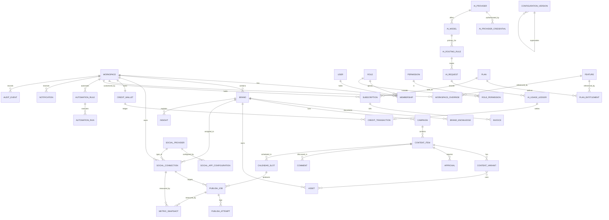
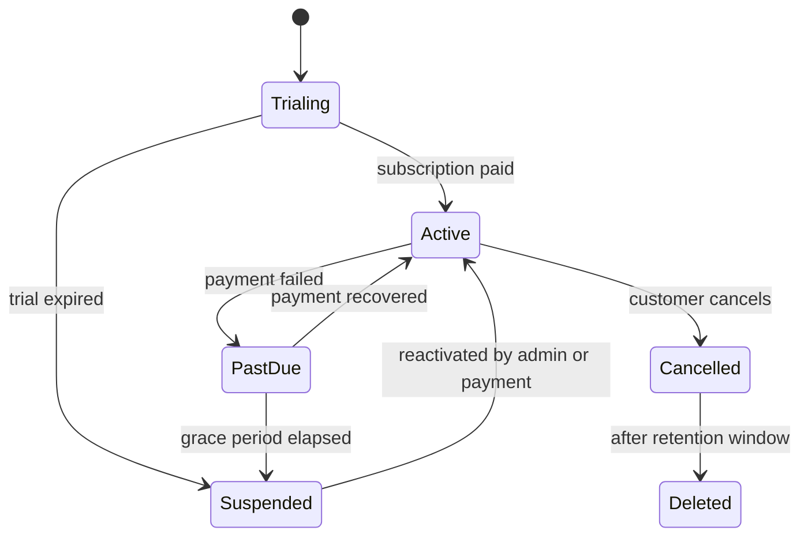
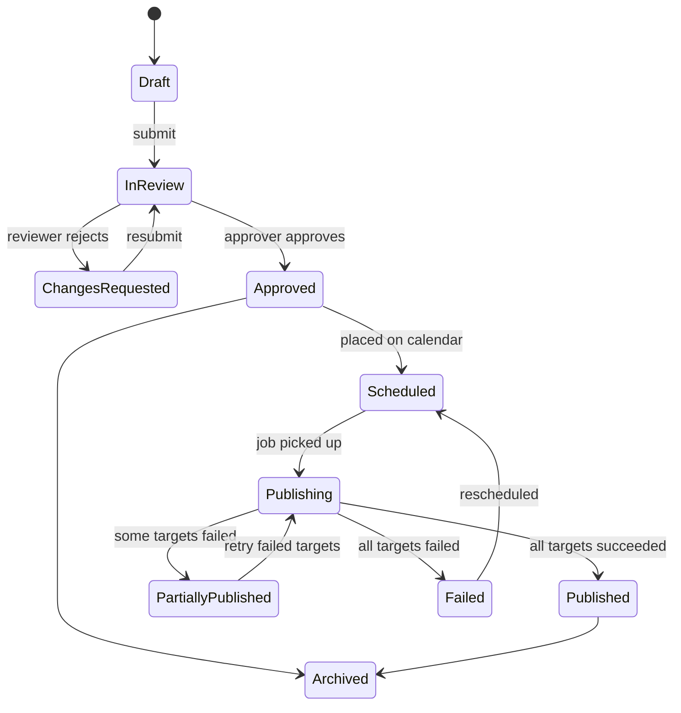
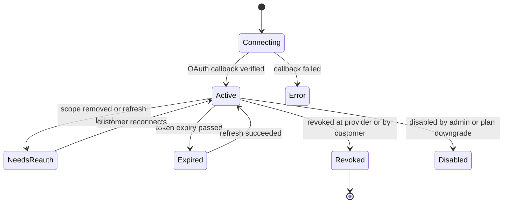
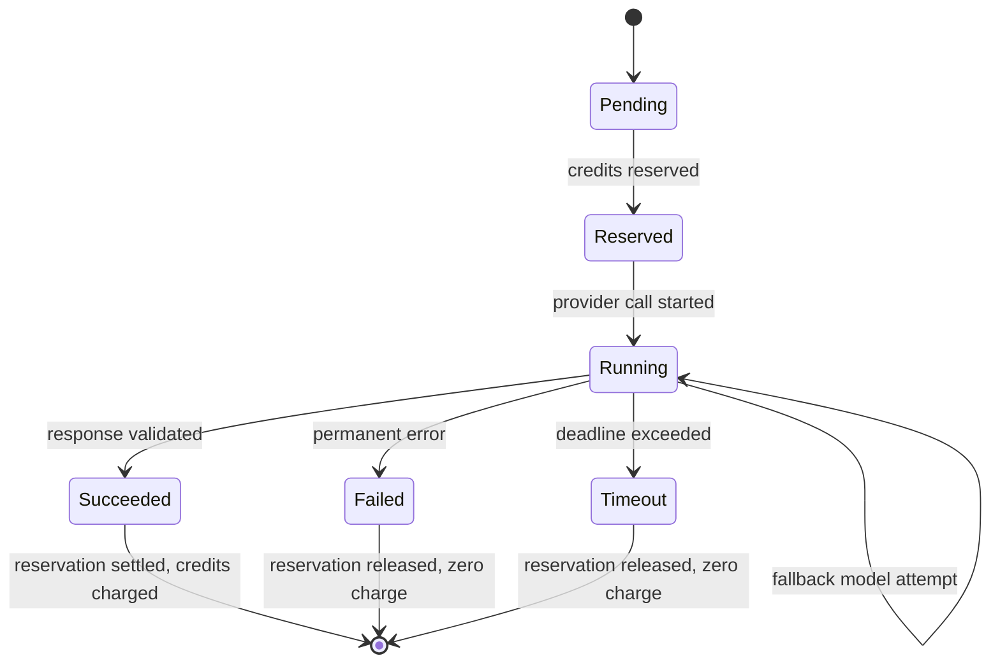
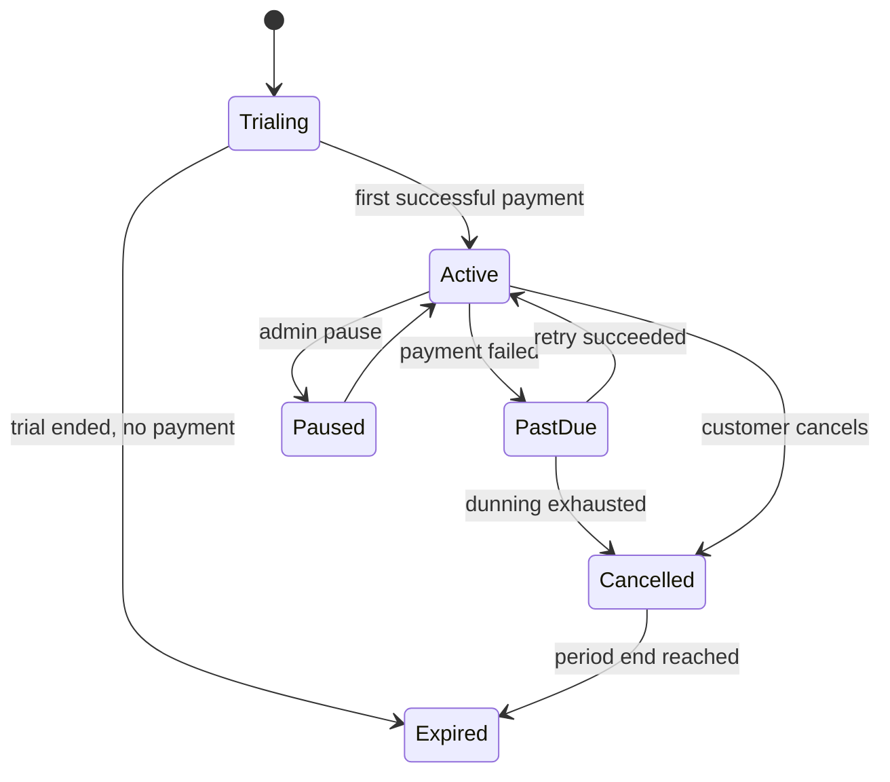

# BrandSpace — Data Model

> **الملخص التنفيذي بالعربية**
>
> هذا المستند يعرّف **نموذج البيانات الكامل** للمنصة: الكيانات، العلاقات، الفهارس، القيود، ودورة حياة كل كيان.
>
> **المبدأ الأول:** كل جدول يخص عميلًا يحتوي على عمود `workspaceId` إلزامي، وفهرس يبدأ بهذا العمود، وسياسة أمان على مستوى الصف (RLS)
> في PostgreSQL تمنع أي تسريب بين العملاء حتى لو أخطأ الكود.
>
> **المبدأ الثاني:** السجلات المالية (رصيد الذكاء الاصطناعي، الفواتير، سجل الاستخدام) **غير قابلة للتعديل أو الحذف** — الرصيد يُحسب من دفتر
> حركات ثابت (Immutable Ledger)، وأي تصحيح يتم بحركة عكسية جديدة وليس بتعديل حركة قديمة.
>
> **المبدأ الثالث:** لا تُحذف البيانات فعليًا في الحالات الحساسة، بل تُعلَّم بـ `deletedAt` (حذف ناعم)، مع مسار حذف نهائي منفصل ومُدقَّق
> عند طلب العميل أو انتهاء مدة الاحتفاظ.
>
> يتضمن المستند مخطط علاقات (ER Diagram) يوضح البنية الكاملة، وقائمة الفهارس المطلوبة للأداء، وحالات دورة الحياة لكل كيان رئيسي.

---

## 1. Conventions

| Convention     | Rule                                                                                                                 |
| -------------- | -------------------------------------------------------------------------------------------------------------------- |
| Primary keys   | UUID v7 (time-ordered) — index locality without exposing sequence counts                                             |
| Timestamps     | `createdAt`, `updatedAt` (UTC, `timestamptz`); `deletedAt` where soft delete applies                                 |
| Tenant column  | `workspaceId uuid NOT NULL` on every tenant-owned table                                                              |
| Brand column   | `brandId uuid` where brand-scoped, with a constraint that the brand belongs to `workspaceId`                         |
| Actor columns  | `createdByUserId`, `updatedByUserId` where attribution matters                                                       |
| Money          | `amountMinor bigint` + `currency char(3)` — never floats                                                             |
| Credits        | `integer` in whole credits (or `bigint` in milli-credits — see DECISIONS D-14)                                       |
| Enums          | PostgreSQL enums for closed sets; text + config validation for owner-extensible sets                                 |
| Localized text | `jsonb` shaped `{"ar": "...", "en": "..."}` for content the owner edits                                              |
| Soft delete    | Applies to `Brand`, `ContentItem`, `Asset`, `Campaign`, `AutomationRule`. Never to ledgers or audit                  |
| Immutable      | `AIUsageLedger`, `CreditTransaction`, `AuditEvent`, `ConfigurationVersion`, `PublishAttempt`, `Invoice` (post-issue) |
| Indexes        | Every tenant query path has an index whose **leading column is `workspaceId`**                                       |

**Naming:** tables are singular PascalCase in Prisma, snake_case in Postgres.

---

## 2. Entity Relationship Diagram



---

## 3. Identity and Access

### 3.1 `User`

Global identity. **Not** tenant-owned — a user may belong to several workspaces.

| Field                                            | Type            | Notes                                          |
| ------------------------------------------------ | --------------- | ---------------------------------------------- |
| `id`                                             | uuid            | PK                                             |
| `email`                                          | citext          | unique, case-insensitive                       |
| `emailVerifiedAt`                                | timestamptz     | null until confirmed                           |
| `passwordHash`                                   | text            | Argon2id; null for SSO-only users              |
| `name`, `avatarAssetId`                          | text/uuid       |                                                |
| `locale`                                         | enum(`ar`,`en`) | default from signup                            |
| `timezone`                                       | text            | IANA                                           |
| `mfaEnabled`, `mfaSecretRef`                     | bool/text       | secret stored via Secret Service, never inline |
| `status`                                         | enum            | `pending`, `active`, `suspended`, `deleted`    |
| `lastLoginAt`, `failedLoginCount`, `lockedUntil` |                 | brute-force protection                         |

Indexes: `unique(email)`, `(status)`.
Lifecycle: `pending → active → suspended → deleted` (soft, then purge after retention window).

### 3.2 `Workspace`

The isolation boundary.

| Field                                                                   | Type                 | Notes                                                                 |
| ----------------------------------------------------------------------- | -------------------- | --------------------------------------------------------------------- |
| `id`, `slug`                                                            | uuid / citext unique | slug used in URLs                                                     |
| `name`, `legalName`, `country`, `defaultLocale`, `timezone`, `currency` |                      |                                                                       |
| `type`                                                                  | enum                 | `individual`, `startup`, `company`, `creator`, `agency`, `enterprise` |
| `status`                                                                | enum                 | `trialing`, `active`, `past_due`, `suspended`, `cancelled`, `deleted` |
| `ownerUserId`                                                           | uuid                 | current Workspace Owner                                               |
| `parentWorkspaceId`                                                     | uuid null            | reserved for agency grouping (no data access implication)             |
| `dataRetentionDays`, `analyticsRetentionDays`                           | int                  | from plan, overridable                                                |
| `suspendedAt`, `suspendedReason`, `trialEndsAt`                         |                      |                                                                       |

Indexes: `unique(slug)`, `(status)`, `(ownerUserId)`.

**Lifecycle**



### 3.3 `Membership`

User ↔ Workspace with role and optional brand restriction.

| Field                                                                         | Type        | Notes                                       |
| ----------------------------------------------------------------------------- | ----------- | ------------------------------------------- |
| `id`, `workspaceId`, `userId`, `roleId`                                       | uuid        |                                             |
| `brandScope`                                                                  | uuid[] null | null = all brands; array = restricted set   |
| `status`                                                                      | enum        | `invited`, `active`, `suspended`, `removed` |
| `invitedByUserId`, `invitationTokenHash`, `invitationExpiresAt`, `acceptedAt` |             | token stored hashed only                    |

Constraints: `unique(workspaceId, userId)` where `status <> 'removed'`.
Indexes: `(workspaceId, status)`, `(userId, status)`.
Rule: **a workspace must always have at least one active Workspace Owner** — enforced by a transaction check
on role change and member removal.

### 3.4 `Role` and `Permission`

`Role`: `id`, `workspaceId` (null for system roles), `key`, `name` (localized), `scope` (`platform`|`workspace`),
`isSystem`, `description`. System roles are seeded from configuration; custom workspace roles are a
post-MVP option gated by plan.

`Permission`: `id`, `key` (e.g. `content.publish`), `resource`, `action`, `minScope`
(`platform`|`workspace`|`brand`|`campaign`), `description`.

`RolePermission`: `roleId`, `permissionId`, plus optional `constraint jsonb` (e.g. `{"ownOnly": true}`).

Indexes: `unique(role.workspaceId, role.key)`, `unique(permission.key)`, `unique(roleId, permissionId)`.

---

## 4. Brand and Content

### 4.1 `Brand`

| Field                                                                          | Notes                         |
| ------------------------------------------------------------------------------ | ----------------------------- |
| `id`, `workspaceId`, `slug`, `name`                                            | `unique(workspaceId, slug)`   |
| `industry`, `description`, `websiteUrl`, `defaultLocale`, `supportedLocales[]` |                               |
| `logoAssetId`, `colorPalette jsonb`, `typography jsonb`, `voiceProfile jsonb`  | brand kit                     |
| `status`                                                                       | `draft`, `active`, `archived` |
| `deletedAt`                                                                    | soft delete                   |

Indexes: `(workspaceId, status)`, `unique(workspaceId, slug)`.

### 4.2 `BrandKnowledgeItem` and the Brand Brain tables — AS BUILT (Phase 5A)

> **This section describes what exists.** The Phase-0 sketch below it (§4.2a) is kept because
> decisions elsewhere reference it, but where the two differ the tables here are the authority.

Nine tables, every one TENANT-OWNED and additionally BRAND-SCOPED. The brand boundary is a
composite foreign key `(workspaceId, brandId)` referencing `brand(workspaceId, id)`, so a row
pointing at another workspace's brand is refused by PostgreSQL and not by a service that remembered
to check. RLS alone would admit such a row, because it would carry its own `workspaceId`.

| Table                                              | What it holds                                                                                                                                                                                                                                                                                                                                                |
| -------------------------------------------------- | ------------------------------------------------------------------------------------------------------------------------------------------------------------------------------------------------------------------------------------------------------------------------------------------------------------------------------------------------------------ |
| `brand`                                            | One brand in a workspace. `unique(workspaceId, slug)`, soft delete                                                                                                                                                                                                                                                                                           |
| `brand_knowledge_item`                             | The canonical unit. `area`, `memory` (D-64), `origin` (D-65 human precedence), `status`, `itemKey`, localized `title`/`body`, `confidenceMilli` (NULL for human knowledge — a human statement is not a probability), provenance columns, `evidence`, `version`, `indexVector`, staleness and conflict columns. `unique(workspaceId, brandId, area, itemKey)` |
| `brand_knowledge_version`                          | APPEND-ONLY history. UPDATE and DELETE revoked from both roles, FORCE RLS leaves the owner without a policy, and a trigger refuses the operation outright — three independent layers                                                                                                                                                                         |
| `brand_source_document`                            | An uploaded source. The BYTES ARE NOT HERE: a `storageKey` points into object storage. `unique(workspaceId, brandId, checksum)` is duplicate protection by content; `unique(workspaceId, idempotencyKey)` is request replay                                                                                                                                  |
| `brand_source_chunk`                               | Retrievable chunks with a human-readable `locator`, so a citation points somewhere a person can check                                                                                                                                                                                                                                                        |
| `brand_knowledge_candidate`                        | **The governance boundary.** Extraction writes here and never to `brand_knowledge_item`, so no upload can change approved knowledge on its own. The extraction is preserved even when a reviewer edits before accepting                                                                                                                                      |
| `brand_ingestion_job`                              | Lifecycle, attempts and customer-safe failure text. A partial unique index keeps at most one live job per document                                                                                                                                                                                                                                           |
| `brand_brain_conversation` / `brand_brain_message` | Chat. D-78: the message row is the artifact, carries its own `expiresAt`, and the purge clears the BODY while leaving `aiRequestId` and the ledger link intact                                                                                                                                                                                               |

**Enums:** `BrandStatus`, `BrandKnowledgeArea` (ten areas), `BrandMemoryLayer` (D-64's four memories),
`BrandKnowledgeOrigin`, `BrandKnowledgeStatus`, `BrandSourceStatus`, `BrandIngestionStage`,
`BrandCandidateStatus`.

**Retrieval index.** `indexVector Float[]` holds a deterministic local vector, not a vendor
embedding: D-13 deferred provider selection, and `embeddingModelKey` is recorded so re-indexing on a
change is detectable. A pgvector column and an ANN index replace it behind the same interface once a
provider is approved.

**Foreign keys BETWEEN these tables are composite with `workspaceId` too** (D-112, F-80, F-83), for
the reason §4.6 gives about the Asset Library: PostgreSQL evaluates referential integrity with RLS
BYPASSED, so a plain parent id is an existence oracle over the whole platform. Phase 5A shipped
**eight** plain ones and all eight were confirmed exploitable:

| Key                                          | Now references                             | `ON DELETE`                        |
| -------------------------------------------- | ------------------------------------------ | ---------------------------------- |
| `brand_source_chunk.sourceDocumentId`        | `brand_source_document(workspaceId,id)`    | `CASCADE`                          |
| `brand_ingestion_job.sourceDocumentId`       | `brand_source_document(workspaceId,id)`    | `CASCADE`                          |
| `brand_brain_message.conversationId`         | `brand_brain_conversation(workspaceId,id)` | `CASCADE`                          |
| `brand_knowledge_candidate.sourceDocumentId` | `brand_source_document(workspaceId,id)`    | `CASCADE`                          |
| `brand_knowledge_candidate.targetItemId`     | `brand_knowledge_item(workspaceId,id)`     | `SET NULL ("targetItemId")`        |
| `brand_knowledge_item.sourceDocumentId`      | `brand_source_document(workspaceId,id)`    | `SET NULL ("sourceDocumentId")`    |
| `brand_knowledge_item.conflictsWithItemId`   | `brand_knowledge_item(workspaceId,id)`     | `SET NULL ("conflictsWithItemId")` |
| `brand_knowledge_version.knowledgeItemId`    | `brand_knowledge_item(workspaceId,id)`     | `CASCADE`                          |

The first three are F-80; the rest are F-83, found by asking the catalogue about the whole module
rather than the four tables F-80 happened to name. `brand_source_document`,
`brand_brain_conversation` and `brand_knowledge_item` each carry the `@@unique([workspaceId, id])`
those keys reference. Every referential action is unchanged from Phase 5A.

**A composite `ON DELETE SET NULL` names its column** (D-114). PostgreSQL nulls EVERY referencing
column of a key, so a bare `SET NULL` on `(workspaceId, targetItemId)` would null `workspaceId` —
which is `NOT NULL`, so the parent delete would FAIL rather than null the reference. The column list
restricts it to the one nullable reference, and `pg_constraint.confdelsetcols` is what the isolation
suite asserts. Prisma cannot express the list and warns about these three relations; the migration is
hand-written for exactly that reason, and a migrations-only database still shows no drift.

**A migration that validates tenant data must lift FORCE RLS to see it** (D-113). Migrations run as
the table owner, `brandspace_migrator`, which no policy on these tables names; under FORCE RLS the
owner therefore reads nothing, and `ADD CONSTRAINT FOREIGN KEY` will validate against an empty set
and still mark the constraint valid. The migration lifts FORCE inside its own transaction — under the
ACCESS EXCLUSIVE lock `ALTER TABLE` already holds, so no other session can observe it — and refuses
to commit unless all eight tables are ENABLED and FORCED again.

**An item with recorded history cannot be deleted at all**, and that is Phase 5A behaviour the
composite key preserved rather than introduced: `brand_knowledge_version.knowledgeItemId` cascades,
and the cascade reaches the append-only trigger, which refuses the DELETE and takes the statement
with it.

Migrations: `20260913140000_phase_5_brand_brain`,
`20260914200000_f80_brand_brain_composite_foreign_keys`. Isolation coverage:
`tests/isolation/phase5-tenancy.test.ts` (41 tests),
`tests/isolation/f80-brand-brain-composite-keys.test.ts` (38 tests) and
`tests/isolation/f80-migration-upgrade.test.ts` (15 tests).

### 4.2a `BrandKnowledge` — the original Phase 0 sketch

Structured brand facts and uploaded documents, chunked and embedded for retrieval.

| Field                                            | Notes                                                                                                                              |
| ------------------------------------------------ | ---------------------------------------------------------------------------------------------------------------------------------- |
| `id`, `workspaceId`, `brandId`                   |                                                                                                                                    |
| `type`                                           | `identity`, `audience`, `tone`, `offer`, `proof`, `objection`, `rule_do`, `rule_dont`, `glossary`, `competitor`, `faq`, `document` |
| `title`, `content jsonb`                         | localized `{ar, en}`                                                                                                               |
| `sourceAssetId`                                  | for uploaded documents                                                                                                             |
| `chunkIndex`, `chunkText`, `embedding vector(N)` | one row per chunk for `document` type                                                                                              |
| `embeddingModelKey`, `embeddedAt`                | so re-embedding on model change is detectable                                                                                      |
| `status`                                         | `draft`, `active`, `stale`, `archived`                                                                                             |
| `version`                                        | incremented on edit; retrieval cites version                                                                                       |

Indexes: `(workspaceId, brandId, type)`, `(workspaceId, brandId, status)`,
HNSW/IVFFlat on `embedding` **partitioned or filtered by `workspaceId`** so ANN search never scans other tenants.

### 4.2b The Asset Library tables — AS BUILT (Phase 5B-1)

Six tables. Every one is TENANT-OWNED; five are additionally BRAND-SCOPED, and the sixth — `Asset`
itself — is brand-scoped **optionally**, because a workspace-level file that every brand shares is a
real shape and not a degenerate one (D-101).

| Table                  | What it holds                                                                                                                                                                                                                                                                              |
| ---------------------- | ------------------------------------------------------------------------------------------------------------------------------------------------------------------------------------------------------------------------------------------------------------------------------------------ |
| `asset_folder`         | A named folder, nesting through a self-reference. `parentId` is composite, so a folder cannot be adopted by another workspace's tree. Depth is bounded by activated configuration, checked in the service. `unique(workspaceId, brandId, parentId, name)` over live rows                   |
| `asset`                | One logical file. The BYTES ARE NOT HERE — a `storageKey` points into the object store, exactly as `brand_source_document` does. Carries `kind`, `status`, `scanStatus`, `sizeBytes`, `checksumSha256`, `originalFilename` (normalised), provenance and soft delete. `brandId` is nullable |
| `asset_version`        | APPEND-ONLY history, one row per uploaded revision. Three independent layers hold the invariant (D-102)                                                                                                                                                                                    |
| `asset_derivative`     | A generated rendition — thumbnail, preview — with its own key, bounds and kind. The MODEL is complete; no encoder produces bytes yet (D-107)                                                                                                                                               |
| `asset_upload_session` | The reserve-then-commit record for one upload. Holds the declared size and type, the issued grant, an `idempotencyKey` and an expiry. `unique(workspaceId, idempotencyKey)` makes a replayed completion return the first result rather than a second asset                                 |
| `asset_processing_job` | Lifecycle, attempts, stage and customer-safe failure text — the same shape `brand_ingestion_job` uses, so the reconciliation sweep reasons about both the same way. A partial unique index keeps at most one live job per asset                                                            |

**Enums:** `AssetKind`, `AssetSource`, `AssetScanStatus`, `AssetStatus`, `AssetDerivativeKind`,
`AssetUploadSessionStatus`, `AssetProcessingStage`.

**Every intra-library foreign key is composite with `workspaceId` (D-99, generalised to the whole
platform as D-112), and this is not belt-and-braces.**
PostgreSQL evaluates referential integrity with RLS BYPASSED. A plain `folderId` column would therefore
accept another workspace's folder id — and even where it did not, the difference between "inserted" and
"constraint violated" answers the question _does this id exist in some workspace?_, which is exactly the
inference §2.1 of `CLAUDE.md` forbids. Composite keys make the referenced row invisible rather than
merely unusable. Each parent carries the `@@unique([workspaceId, id])` the child references.

**Duplicate protection is a partial unique index over live rows** (D-100):
`(workspaceId, checksumSha256) WHERE "deletedAt" IS NULL`. Content identity, not filename identity —
and scoped to what is still there, so archiving a file does not permanently poison its checksum.

**`asset_version` is append-only in three layers** (D-102), because one is a single mistake away from
being none:

1. `UPDATE` and `DELETE` are revoked from both application roles — except a column-level
   `GRANT UPDATE ("scanStatus")`, which is the one field the scanner writes after the row exists.
2. FORCE RLS is on and the owner has no policy, so even the table owner cannot rewrite history.
3. A trigger compares every immutable column field by field and raises if any of them moved, so the
   narrow column grant cannot be used as a doorway.

Migration: `20260914120000_phase_5b_asset_library`. Isolation coverage:
`tests/isolation/phase5b-asset-tenancy.test.ts` (42 tests) and
`tests/isolation/assets-lifecycle.test.ts` (51 tests).

### 4.3 `Campaign`

`id`, `workspaceId`, `brandId`, `name`, `objective`, `description`, `startDate`, `endDate`,
`channels text[]`, `budgetMinor`, `currency`, `kpis jsonb`, `strategyInsightId`, `ownerUserId`,
`status` (`draft`, `planned`, `active`, `paused`, `completed`, `archived`), `deletedAt`.

Indexes: `(workspaceId, brandId, status)`, `(workspaceId, startDate, endDate)`.

### 4.4 `ContentItem`

The canonical content object (channel-agnostic).

| Field                                                                                | Notes                                    |
| ------------------------------------------------------------------------------------ | ---------------------------------------- |
| `id`, `workspaceId`, `brandId`, `campaignId` (null)                                  |                                          |
| `title`, `contentType` (`post`,`carousel`,`story`,`reel`,`video`,`article`,`thread`) |                                          |
| `primaryLocale`, `pillar`, `tags text[]`                                             |                                          |
| `status`                                                                             | see lifecycle below                      |
| `createdByUserId`, `aiRequestId` (null)                                              | provenance: which AI request produced it |
| `approvalRequired bool`, `currentApprovalId`                                         |                                          |
| `deletedAt`                                                                          |                                          |

**Lifecycle**



Indexes: `(workspaceId, brandId, status)`, `(workspaceId, campaignId)`, `(workspaceId, brandId, createdAt desc)`.

### 4.5 `ContentVariant`

Per-platform, per-locale rendering of a content item.

`id`, `workspaceId`, `contentItemId`, `platformKey`, `locale`, `body text`, `hashtags text[]`,
`mentions text[]`, `linkUrl`, `firstComment`, `assetIds uuid[]`, `platformOptions jsonb`
(e.g. IG carousel order, YT title/description/category), `validationState`
(`unvalidated`, `valid`, `warnings`, `invalid`), `validationErrors jsonb`, `characterCount`,
`aiRequestId`.

Constraints: `unique(contentItemId, platformKey, locale)`.
Indexes: `(workspaceId, contentItemId)`.

### 4.4b The AI Content Studio tables — AS BUILT (Phase 5B-2)

§4.4 and §4.5 above are the DESIGN. This is what the migration
`20260915090000_phase_5b_2_ai_content_studio` actually created, which is narrower in two ways
and wider in three.

**NARROWER.** `campaignId`, `pillar`, `approvalRequired` and `currentApprovalId` are **not**
created: campaigns belong to the Social Calendar and approvals to the Approvals module, and a
column with no writer is a column whose meaning nobody has settled. `CalendarSlot`, `Approval`
and `Comment` are likewise untouched. The lifecycle diagram above stands as the design; Phase
5B-2 reaches **`DRAFT`, `IN_REVIEW` and `ARCHIVED` only**, and `ContentStudioService.transition`
refuses every other target rather than half-implementing the next phase's states.

**WIDER**, in three columns the design predates:

| Column                                     | Table                          | Why                                                                                                                                                                  |
| ------------------------------------------ | ------------------------------ | -------------------------------------------------------------------------------------------------------------------------------------------------------------------- |
| `arabicDialect`                            | both, and `workspace`, `brand` | D-115. The dialect a draft was WRITTEN IN, recorded on the row — because the configured default can change and a draft must still be able to say what it actually is |
| `citations jsonb`, `insufficientKnowledge` | `content_item`                 | AC-11.4 and the free-refusal path: what retrieval returned, and whether it returned enough. Written from RETRIEVAL, never from the model's own text                  |
| `expiresAt`, `bodyPurgedAt`                | both                           | D-116 and D-117. When this content may be purged, and when its body actually was — so a purged draft is visibly purged rather than silently blank                    |

**Tenancy.** Both tables carry `workspaceId`, both have RLS `ENABLED` and `FORCED`, and **every
foreign key to a tenant-owned parent is composite** — `content_item_brand_fkey` on
`(workspaceId, brandId)` and `content_variant_item_fkey` on `(workspaceId, contentItemId)`.
D-112 made that the platform rule after F-80 and F-83; these are the first keys written under it,
and `tests/isolation/phase5b2-content-tenancy.test.ts` asserts the refusal from inside the
attacker's OWN workspace, which is the case RLS does not cover.

**`content_item` constraints and indexes.** `unique(workspaceId, id)` (the composite-FK parent
scope), `unique(workspaceId, idempotencyKey)` (AC-11.2 — a retried generation returns the first
draft rather than billing twice), and indexes on `(workspaceId, brandId, status)`,
`(workspaceId, brandId, updatedAt desc)` and `(expiresAt)` for the purge sweep.

**`content_variant` constraints and indexes.** `unique(contentItemId, platformKey, locale)` as
designed, plus `(workspaceId, contentItemId)` and `(expiresAt)`.

**`assetIds uuid[]` carries no foreign key, and cannot.** PostgreSQL has no array element
reference, so the array is validated in the service rather than by the database. Recorded here
rather than left to be discovered: it is the one place in these tables where referential
integrity is the application's job, and a reader should not have to infer that from its absence.

**`workspace.aiContentRetentionDays`** is the D-117 control. `NULL` means "follow the
subscription" (D-116); a value means the customer asked for something shorter. It is bounded by
the CHECK `workspace_ai_content_retention_days_positive` (`> 0`), so "delete on write" is not
expressible even through a crafted request, and floored at write time by
`content.retention.minCustomerRetentionDays`. It can only ever SHORTEN the window — a large value
does not extend a cancelled account's grace period past what the owner approved.

### 4.6 `Asset`

`id`, `workspaceId`, `brandId` (null = workspace-level), `folderId`, `name`, `kind`
(`image`,`video`,`audio`,`document`,`font`), `mimeType`, `sizeBytes`, `width`, `height`,
`durationMs`, `storageKey`, `checksumSha256`, `derivatives jsonb`, `source`
(`upload`,`ai_generated`,`imported`), `aiRequestId`, `license`, `rightsExpiryAt`, `tags text[]`,
`scanStatus` (`pending`,`clean`,`infected`,`failed`), `status`
(`uploading`,`processing`,`ready`,`processing_failed`,`quarantined`,`archived`), `version`,
`replacesAssetId`, `deletedAt`.

Indexes: `(workspaceId, brandId, status)`, `(workspaceId, kind)`, `(workspaceId, checksumSha256)` for dedupe,
GIN on `tags`.
Rule: an asset is usable only when `status='ready' AND scanStatus='clean'`.

### 4.7 `CalendarSlot`

`id`, `workspaceId`, `brandId`, `contentItemId`, `socialConnectionIds uuid[]`,
`scheduledAtUtc timestamptz`, `scheduledLocalTime`, `timezone`, `recurrenceRule` (null),
`status` (`planned`,`scheduled`,`locked`,`publishing`,`published`,`failed`,`cancelled`),
`lockedAt`, `lockedBy`, `publishJobIds uuid[]`.

Indexes: `(workspaceId, brandId, scheduledAtUtc)`, `(status, scheduledAtUtc)` for the due-slot sweeper.
Constraint: a slot may not enter `scheduled` if its content item requires approval and is not `Approved`.

### 4.7b The Content Calendar table — AS BUILT (Phase 5B-2)

§4.7 above is the DESIGN. This is what the migration
`20260915120000_phase_5b_2_content_calendar` actually created, which is narrower in three ways
and wider in three.

**NARROWER.** `socialConnectionIds`, `publishJobIds`, `recurrenceRule`, `lockedAt` and `lockedBy`
are **not** created: every one of them belongs to the publishing pipeline, and the pipeline is
Phase 6. `status` likewise carries `PLANNED`, `SCHEDULED` and `CANCELLED` only — `LOCKED`,
`PUBLISHING`, `PUBLISHED` and `FAILED` are states no code in this phase can enter, and a state
nothing can reach is a state whose meaning nobody has settled.

**WIDER**, in three columns the design predates:

| Column                | Why                                                                                                                                                                                     |
| --------------------- | --------------------------------------------------------------------------------------------------------------------------------------------------------------------------------------- |
| `targetKind`          | AC-14.7. The publishing target is a MOCK, said in the data rather than only in a comment. Phase 6 adds real connection targets beside it; until then nothing in the system can name one |
| `platformKeys`        | Derived from the item's variants when the slot is created, so a slot still renders its channels after a variant is edited. A calendar is a plan, and a plan records what was planned    |
| `usageIdempotencyKey` | AC-14.5. The quota event this slot consumed, so cancelling refunds exactly what scheduling took and a retry cannot double-count                                                         |

**THE SLOT IS THE _WHEN_; `ContentItem` REMAINS THE SOURCE OF TRUTH FOR THE WHAT AND THE STATE.**
There is no caption, no status copy and no channel list here that `content_item` already answers.
`ContentCalendarService.schedule()` moves the item to `SCHEDULED` in the same transaction as the
slot write and `cancel()` moves it back, so the two can never disagree about whether something is
on the calendar — and `ContentLibraryService.transition()` refuses to move a `SCHEDULED` item at
all, so it cannot be archived out from under a live slot.

**THREE TIME COLUMNS, AND WHY ONE IS NOT ENOUGH (AC-14.2, AC-14.3).** A timestamp cannot answer
"what time did the customer MEAN?" across a daylight-saving boundary: 09:00 local converted to UTC
in January and read back in July is 08:00 or 10:00, and neither is what anyone asked for. So the
INTENT (`scheduledLocalTime` + `timezone`) is stored beside the INSTANT (`scheduledAtUtc`), and the
instant is derived from the intent. `scheduledLocalTime` is TEXT rather than a timestamp
deliberately — it is a wall-clock with no offset, and giving it one would invent the very fact the
column exists to preserve. `timezone` is COPIED from the workspace rather than joined, because a
workspace that relocates must not silently move every post it has already scheduled.

**Tenancy.** `workspaceId`, RLS `ENABLED` and `FORCED`, and **both foreign keys to a tenant-owned
parent composite** — `calendar_slot_brand_fkey` on `(workspaceId, brandId)` and
`calendar_slot_item_fkey` on `(workspaceId, contentItemId)`. The second is exactly F-80 and F-83's
shape, and `tests/isolation/phase5b2-calendar-tenancy.test.ts` asserts the refusal from inside the
attacker's OWN workspace — the case RLS does not cover — and that a real foreign draft id and a
fabricated one fail identically.

**Constraints.** `calendar_slot_local_time_shape` (`^\d{4}-\d{2}-\d{2}T\d{2}:\d{2}$`) keeps the
intent recomputable; `calendar_slot_cancelled_consistently` keeps `status` and `cancelledAt` from
disagreeing; and `calendar_slot_one_live_per_item` is a PARTIAL unique index on
`(workspaceId, contentItemId) WHERE status <> 'CANCELLED'` — partial because a full one would mean
a draft taken off the calendar could never be put back, the same shape D-100 settled for the asset
checksum.

**Indexes.** `(workspaceId, scheduledAtUtc)` and `(workspaceId, brandId, scheduledAtUtc)` for the
month and week ranges, `(workspaceId, contentItemId)` for the item's own lookup, and
`(status, scheduledAtUtc)` for the due-slot sweep Phase 6 will add.

### 4.8 `Approval` and `Comment`

`Approval`: `id`, `workspaceId`, `subjectType` (`content_item`,`campaign`,`asset`), `subjectId`,
`requestedByUserId`, `assignedToUserId`/`assignedToRoleId`, `status`
(`pending`,`approved`,`rejected`,`cancelled`,`expired`), `decidedByUserId`, `decidedAt`, `note`,
`dueAt`, `stepIndex`, `policySnapshot jsonb` (the approval rules in force at request time).

`Comment`: `id`, `workspaceId`, `subjectType`, `subjectId`, `parentCommentId`, `authorUserId`,
`body`, `mentions uuid[]`, `anchor jsonb` (position in text or region on an image),
`resolvedAt`, `resolvedByUserId`, `deletedAt`.

Indexes: `(workspaceId, subjectType, subjectId)`, `(workspaceId, assignedToUserId, status)`.

### 4.8b The Approvals tables — AS BUILT (Phase 5B-3)

§4.8 above is the DESIGN. This is what the migration
`20260915180000_phase_5b_3_approvals_activity_notifications` actually created.

**`approval` — NARROWER than §4.8 in three ways.**

`assignedToRoleId`, `dueAt` and `stepIndex` are **not** created. Assignment to a ROLE, review
deadlines and multi-step chains are a workflow builder, and this milestone builds a single-step
review. A column with no writer is a column whose meaning nobody has settled — the same rule §4.4b
applied to `campaignId`. `subjectType` carries `CONTENT_ITEM`, `CAMPAIGN` and `ASSET` because the
design names all three, but only `CONTENT_ITEM` is reachable: the others have no service behind
them, and `contentItemId` is a real typed column rather than a polymorphic id precisely so the
composite foreign key D-112 requires can exist at all.

**WIDER**, in three columns the design predates:

| Column        | Why                                                                                                                                                                 |
| ------------- | ------------------------------------------------------------------------------------------------------------------------------------------------------------------- |
| `brandId`     | Every approval is brand-scoped, and the composite key to `brand(workspaceId, id)` is what makes the BRAND boundary a database fact rather than a service convention |
| `requestNote` | §4.8 has one `note`. A requester's context and a reviewer's verdict are different statements by different people and are kept apart, so the history can show both   |
| `cycle`       | Which round of review this is, from 1. Makes the history orderable without depending on clock resolution, and gives the policy ceiling something to count           |

**Constraints that encode the rules.** `approval_subject_present` — a `CONTENT_ITEM` approval must
name its item. `approval_decision_consistent` — a decided row carries both its decider and its
timestamp, and a pending one carries neither, so half a decision is not a state the history can
render. `approval_one_open_per_item`, a PARTIAL unique index on `status = 'PENDING'` — two open
reviews for one draft is two reviewers each believing their verdict decided it, and a full unique
index would stop a closed cycle ever being followed by another.

**`approval_policy` — the per-brand rules** (ROADMAP Phase 5 scope item 6, "policy per brand").
Every column is NULLABLE and **NULL means "no opinion"**, resolving to the activated
`content.approvals` default. A row exists only once somebody has deliberately departed from the
defaults, so changing a default still reaches every brand that never chose otherwise. One row per
brand, by unique index.

### 4.8c Approval integrity — the corrective pass (Phase 5B-3, D-128)

`20260915210000_phase_5b_3_approval_integrity` narrows what
`20260915180000` granted, because that migration's grants did not match its own
comment: §9 said `notification` was "the only one of the three the application
may DELETE" and then granted DELETE on all three.

|                                                                              |                                                                                                                                                                                                                                                                                                                                  |
| ---------------------------------------------------------------------------- | -------------------------------------------------------------------------------------------------------------------------------------------------------------------------------------------------------------------------------------------------------------------------------------------------------------------------------- |
| **DELETE revoked** from `brandspace_app` on `approval` and `approval_policy` | An approval is the record that somebody reviewed something. A policy row is reset by setting its columns back to NULL — "no opinion", which is what an absent row means — so DELETE buys nothing there either, and `updatedByUserId` is worth keeping. The PLATFORM role keeps DELETE for tenant offboarding and the D-116 purge |
| **`approval_write_once`**, a `BEFORE UPDATE` trigger                         | A decided or withdrawn cycle never changes again, and a cycle's IDENTITY — `subjectType`, `contentItemId`, `requestedByUserId`, `cycle`, `createdAt`, `policySnapshot` — never changes at all. The legitimate `PENDING` → terminal transition is untouched, which is the whole workflow                                          |

A trigger rather than a CHECK because the rule is about the TRANSITION — old row
versus new row — and a CHECK sees only the new one. Test fixtures clean up as
the PLATFORM role rather than the production grant being widened to suit them.

### 9.3b The `notification` table — AS BUILT (Phase 5B-3)

§9.3 above is the DESIGN. Three differences, each with a reason.

**`userId` IS NOT NULL.** §9.3 allows NULL for "workspace-wide". A workspace-wide row has no
per-reader unread state, which is the single thing this table exists to hold; fan-out to several
members is several rows, each independently readable and independently marked.

**NO RENDERED TEXT.** `renderedSubject` and `renderedBodyRef` are not created. The row carries a
`templateKey` and a payload, and the reader's locale picks the sentence at READ time — storing one
language would make a bilingual workspace's inbox monolingual in whichever language the actor
happened to be using.

**NO DELIVERY COLUMNS.** `status`, `sentAt`, `providerMessageId`, `failureCode`, `priority` and
`groupKey` are not created, and a CHECK pins `channel` to `IN_APP` (D-123). There is no transport in
this platform to deliver with; a delivery status on a row nothing delivers would be a fiction, and
the CHECK is what makes the limitation a fact rather than a convention.

**WIDER** in `linkPath`, `brandId`, `resourceType` and `resourceId` — where the notification points.
`notification_link_is_relative` refuses anything that is not a relative path, so a row can never
carry an absolute redirect target written by one tenant and followed by another's browser.

### The Activity Log adds NO TABLE (Phase 5B-3, D-124)

`docs/PRODUCT.md` §5 module 17 lists `AuditEvent` as the Activity Log's entity, and that is exactly
what it reads. There is no customer-facing event table: a second record of the same facts would
drift from the first at the earliest writer that updated one and forgot the other, and it would be a
MUTABLE one — which is what AC-15.7 and the append-only trigger on `audit_event` exist to prevent.
The customer screen is a scoped, paged projection that returns actor, action, resource and outcome,
and never the `before`/`after` diffs.

---

## 5. Social

### 5.1 `SocialProvider` (configuration-backed registry)

`id`, `key` (`facebook`,`instagram`,`tiktok`,`linkedin`,`youtube`,`x`,…), `name`, `status`
(`available`,`beta`,`disabled`), `capabilities jsonb` (publish kinds, media limits, character limits,
scheduling support, analytics support), `authType` (`oauth2`), `requiredScopes text[]`,
`apiVersion`, `docsUrl`. **Platform-level, not tenant-owned.**

### 5.2 `SocialAppConfiguration`

The BrandSpace-owned application credentials per provider per environment.

`id`, `providerId`, `environment` (`development`,`staging`,`production`), `appId`,
`clientIdRef secretRef`, `clientSecretRef secretRef`, `redirectUri`, `scopes text[]`,
`webhookSecretRef`, `status` (`draft`,`validated`,`active`,`disabled`),
`lastValidatedAt`, `lastHealthAt`, `healthStatus`, `createdByPlatformUserId`, `rotatedAt`.

Constraint: `unique(providerId, environment)` where `status='active'`. **No secret values stored here** —
only references resolved by the Secret Service.

### 5.3 `SocialConnection` (tenant-owned)

A customer's connected account.

| Field                                                                                                          | Notes                                                                             |
| -------------------------------------------------------------------------------------------------------------- | --------------------------------------------------------------------------------- |
| `id`, `workspaceId`, `brandId` (null = workspace-level), `providerId`                                          |                                                                                   |
| `externalAccountId`, `externalAccountName`, `accountType` (`page`,`profile`,`business`,`channel`), `avatarUrl` |                                                                                   |
| `accessTokenRef`, `refreshTokenRef`                                                                            | encrypted via Secret Service; **never returned by API**                           |
| `tokenExpiresAt`, `refreshExpiresAt`, `scopesGranted text[]`, `scopesMissing text[]`                           |                                                                                   |
| `status`                                                                                                       | `connecting`, `active`, `needs_reauth`, `expired`, `revoked`, `disabled`, `error` |
| `healthStatus`, `lastHealthCheckAt`, `lastErrorCode`, `lastErrorAt`, `consecutiveFailures`                     |                                                                                   |
| `connectedByUserId`, `connectedAt`, `disconnectedAt`, `disconnectedByUserId`                                   |                                                                                   |
| `rateLimitState jsonb`                                                                                         | provider-reported quota state                                                     |

Constraints: `unique(workspaceId, providerId, externalAccountId)` where not revoked.
Indexes: `(workspaceId, status)`, `(status, tokenExpiresAt)` for proactive refresh.

**Lifecycle**



### 5.4 `PublishJob` and `PublishAttempt`

`PublishJob`: `id`, `workspaceId`, `brandId`, `contentItemId`, `contentVariantId`,
`calendarSlotId`, `socialConnectionId`, `providerId`, `idempotencyKey` (unique),
`scheduledAtUtc`, `status` (`queued`,`processing`,`succeeded`,`failed`,`cancelled`,`dead_letter`),
`attemptCount`, `nextAttemptAt`, `externalPostId`, `externalPostUrl`,
`failureCode`, `failureMessage`, `requiresConfirmation bool`, `confirmedByUserId`, `confirmedAt`.

Constraints: `unique(idempotencyKey)`; `unique(contentVariantId, socialConnectionId, calendarSlotId)`
prevents accidental double-scheduling.
Indexes: `(workspaceId, status)`, `(status, nextAttemptAt)`, `(workspaceId, brandId, scheduledAtUtc)`.

`PublishAttempt` (immutable): `id`, `workspaceId`, `publishJobId`, `attemptNumber`, `startedAt`,
`finishedAt`, `outcome` (`success`,`retryable_error`,`permanent_error`,`timeout`),
`httpStatus`, `providerErrorCode`, `providerResponse jsonb` (**redacted of tokens**),
`requestFingerprint`, `durationMs`.

Indexes: `(workspaceId, publishJobId, attemptNumber)`.

### 5.5 `MetricSnapshot` and `Insight`

`MetricSnapshot`: `id`, `workspaceId`, `brandId`, `providerId`, `socialConnectionId`,
`subjectType` (`post`,`account`), `subjectExternalId`, `publishJobId` (null),
`periodStart`, `periodEnd`, `granularity` (`hour`,`day`,`week`,`month`,`lifetime`),
`metrics jsonb` (impressions, reach, engagement, clicks, saves, shares, views, watchTime, followers…),
`currency` (for spend, future), `collectedAt`, `sourceVersion`.

Constraints: `unique(workspaceId, socialConnectionId, subjectExternalId, granularity, periodStart)`
— makes ingestion idempotent via upsert.
Indexes: `(workspaceId, brandId, periodStart desc)`, `(workspaceId, publishJobId)`.
Retention: pruned per `Workspace.analyticsRetentionDays`.

`Insight`: `id`, `workspaceId`, `brandId`, `type` (`strategy`,`analytics_explanation`,`recommendation`,
`trend`,`content_gap`,`anomaly`), `title`, `body jsonb` (localized), `evidence jsonb`
(metric refs, content refs, Brand Brain citations), `periodStart`, `periodEnd`,
`aiRequestId`, `confidence`, `status` (`new`,`seen`,`accepted`,`dismissed`), `expiresAt`.

Indexes: `(workspaceId, brandId, type, createdAt desc)`.

---

## 6. AI

### 6.1 `AIProvider`

`id`, `key` (`openai`,`anthropic`,`google`,`mock`,…), `name`, `baseUrl`, `authScheme`,
`status` (`draft`,`validated`,`active`,`disabled`), `defaultTimeoutMs`, `maxConcurrency`,
`rateLimitConfig jsonb`, `healthStatus`, `lastHealthCheckAt`, `notes`. **Platform-level.**

### 6.2 `AIProviderCredential`

`id`, `providerId`, `environment`, `label`, `secretRef`, `maskedHint` (e.g. `…a91f`),
`fingerprint` (hash for equality checks without the value), `status`
(`active`,`rotating`,`disabled`,`revoked`), `createdByPlatformUserId`, `activatedAt`,
`lastRotatedAt`, `lastUsedAt`, `expiresAt`, `scopeNotes`.

**The credential value is never a column.** Only `secretRef` is stored; resolution happens server-side.
Constraint: at most one `active` credential per `(providerId, environment)` unless rotation is in progress.

### 6.3 `AIModel`

`id`, `providerId`, `key` (provider's model id), `displayName`,
`modality` (`text`,`image`,`video`,`voice`,`embedding`,`moderation`),
`capabilities jsonb` (context window, max output, streaming, tools, JSON mode, languages, image sizes),
`inputCostPerUnitMinor`, `outputCostPerUnitMinor`, `unit` (`1k_tokens`,`image`,`second`,`character`),
`currency`, `status` (`available`,`beta`,`deprecated`,`disabled`), `disableSwitch bool`,
`qualityTier` (`fast`,`balanced`,`premium`), `notes`.

Constraint: `unique(providerId, key, environment)`.
Rule: a disabled model is immediately unusable by routing, even for in-flight rules.

### 6.4 `AIRoutingRule`

Maps a **task** to a model chain.

`id`, `taskKey` (`caption.generate`, `ideas.generate`, `plan.monthly`, `strategy.generate`,
`analytics.explain`, `copilot.chat`, `image.generate`, `video.generate`, `moderation.check`,
`brand.retrieve` …), `scope` (`global`,`plan`,`workspace`), `planId` (null), `workspaceId` (null),
`primaryModelId`, `fallbackModelIds uuid[]` (ordered), `parameters jsonb` (temperature, max tokens,
system prompt version), `qualityTier`, `maxCostPerRequestMinor`, `timeoutMs`, `retryPolicy jsonb`,
`priority int`, `status`, `configurationVersionId`.

Resolution order: workspace rule → plan rule → global rule. Highest `priority` wins within a scope.
Indexes: `(taskKey, scope, priority desc)`, `(workspaceId, taskKey)`.

### 6.5 `AIRequest`

One logical AI action.

| Field                                                               | Notes                                                                                                                                    |
| ------------------------------------------------------------------- | ---------------------------------------------------------------------------------------------------------------------------------------- |
| `id`, `workspaceId`, `brandId` (null), `userId` (null for system)   |                                                                                                                                          |
| `taskKey`, `idempotencyKey` (unique)                                |                                                                                                                                          |
| `routingRuleId`, `resolvedModelId`, `attemptedModelIds uuid[]`      |                                                                                                                                          |
| `status`                                                            | `pending`, `reserved`, `running`, `succeeded`, `failed`, `cancelled`, `timeout`, `moderation_blocked`                                    |
| `inputSummary jsonb`                                                | **audit-safe**: token/asset counts, language, brand refs, prompt template id — never raw customer content unless retention policy allows |
| `outputRefType`, `outputRefId`                                      | points at ContentItem / Asset / Insight                                                                                                  |
| `promptTokens`, `completionTokens`, `imageCount`, `durationSeconds` | usage units                                                                                                                              |
| `providerCostMinor`, `currency`                                     | actual provider cost                                                                                                                     |
| `creditsReserved`, `creditsCharged`                                 | credits                                                                                                                                  |
| `latencyMs`, `retryCount`, `failureCode`, `failureMessage`          |                                                                                                                                          |
| `byok bool`, `byokCredentialId`                                     | customer-supplied key path                                                                                                               |

Indexes: `unique(idempotencyKey)`, `(workspaceId, createdAt desc)`, `(workspaceId, taskKey, status)`,
`(status, createdAt)` for stuck-request sweeps.

**Lifecycle**



### 6.6 `AIUsageLedger` (immutable)

`id`, `workspaceId`, `aiRequestId`, `occurredAt`, `taskKey`, `providerId`, `modelId`,
`usageUnits jsonb`, `providerCostMinor`, `currency`, `creditsCharged`,
`creditTransactionId`, `userId`, `brandId`, `environment`.

Append-only. No updates, no deletes. Corrections are new rows referencing `correctsLedgerId`.
Indexes: `(workspaceId, occurredAt desc)`, `(workspaceId, taskKey, occurredAt)`, `(modelId, occurredAt)`.
This table is the source for admin cost/margin reporting.

---

## 7. Credits

### 7.1 `CreditWallet`

`id`, `workspaceId` (unique), `currentBalance`, `reservedBalance`, `lifetimeGranted`,
`lifetimeConsumed`, `lowBalanceThreshold`, `lowBalanceNotifiedAt`, `hardLimitEnabled`,
`overageEnabled`, `overageCapCredits`, `lastResetAt`, `nextResetAt`, `version` (optimistic lock).

**`currentBalance` is a materialized projection of the ledger**, updated only inside the same transaction as
the transaction row, and reconcilable by replaying `CreditTransaction`. A nightly job asserts equality and
alerts on drift.

Constraints: `CHECK (currentBalance >= 0)`, `CHECK (reservedBalance >= 0)`.

### 7.1a `CreditGrant` (Phase 3) — the FIFO bucket

`id`, `workspaceId`, `walletId`, `source`
(`plan_grant`,`trial_grant`,`promotional_grant`,`pack_purchase`,`admin_adjustment`,`rollover`),
`amountMilliCredits`, `remainingMilliCredits`, `reservedMilliCredits`, `expiresAt` (null = never),
`sourceTransactionId` (unique), `reason`, `grantedAt`.

**A PROJECTION, like `currentBalance`.** The ledger remains the source of truth: the GRANT
row carries `expiresAt` and every CHARGE row carries `sourceGrantId`, so
`remainingMilliCredits` is reconstructible by replay. The column exists so choosing the
next bucket is a short indexed read rather than an aggregate over the whole ledger.

Three quantities, kept apart deliberately:

```
remaining = amount − (charges settled against this bucket)   ← what replay computes
reserved  = estimates currently held against this bucket
spendable = remaining − reserved
```

Holding a reservation moves `reserved` only, so an open reservation never makes the bucket
disagree with the ledger — and two concurrent reservations cannot both allocate the same
credits, which they could if a reservation left no per-bucket trace.

Constraints: `CHECK (remaining BETWEEN 0 AND amount)`, `CHECK (reserved BETWEEN 0 AND remaining)`,
`CHECK (amount > 0)`. A trigger refuses any change to `amountMilliCredits`, `source`,
`workspaceId`, `grantedAt` or `sourceTransactionId`: rewriting those would break replay
SILENTLY — reconciliation would still report zero drift while the numbers underneath had
changed.

Indexes: `(workspaceId, expiresAt, grantedAt)` for the consumption order,
`(walletId, remainingMilliCredits)`.

### 7.1b `CreditReservation` (Phase 3)

`id`, `workspaceId`, `walletId`, `idempotencyKey` (unique), `estimateMilliCredits`,
`settledMilliCredits`, `status` (`open`,`settled`,`released`,`expired`), `allocations jsonb`,
`purpose`, `expiresAt`, `createdAt`, `settledAt`, `releasedAt`, `releaseReason`.

The ledger records every movement; this row holds the STATE that makes
`reserve → confirm → settle` safe. `allocations` freezes which buckets FIFO chose at
reserve time, so settlement charges the buckets the customer was quoted against rather
than re-deciding against a wallet that has since moved. `expiresAt` is what the sweeper
reads: an abandoned reservation must be released, and the leak count must stay at zero.

Constraint: `CHECK (settledMilliCredits IS NULL OR settledMilliCredits BETWEEN 0 AND estimateMilliCredits)`.
Charging above the reserved amount is the one way a wallet could go negative behind its own
CHECK, so the database refuses it directly. A trigger refuses re-opening a terminal
reservation, which is how the same estimate would be charged twice.

Indexes: `(workspaceId, status)`, `(status, expiresAt)` for the sweeper.

### 7.2 `CreditTransaction` (immutable)

`id`, `workspaceId`, `walletId`, `type`
(`plan_grant`,`addon_purchase`,`promotional_grant`,`admin_adjustment`,`reservation`,`reservation_release`,
`usage_charge`,`refund`,`expiry`,`reset`), `amount` (signed), `balanceAfter`, `reason`,
`aiRequestId` (null), `invoiceId` (null), `expiresAt` (for expiring grants), `sourceBucketId`
(which grant the usage consumed, for FIFO expiry), `idempotencyKey` (unique),
`actorType` (`system`,`user`,`platform_user`), `actorId`, `occurredAt`, `metadata jsonb`.

Indexes: `unique(idempotencyKey)`, `(workspaceId, occurredAt desc)`, `(walletId, type)`,
`(workspaceId, expiresAt)` for expiry sweeps.

**Concurrency:** all balance-changing operations run inside a transaction that begins with
`SELECT … FROM credit_wallet WHERE id = $1 FOR UPDATE`. Combined with `CHECK (currentBalance >= 0)` and
the unique idempotency key, this makes negative balances, lost updates, and duplicate deductions impossible.

---

## 8. Plans, Entitlements, Billing

### 8.1 `Plan`

`id`, `key`, `name jsonb` (localized), `description jsonb`, `tier`, `visibility`
(`public`,`private`,`legacy`), `status` (`draft`,`active`,`grandfathered`,`retired`),
`monthlyPriceMinor`, `annualPriceMinor`, `currency`, `supportedCurrencies jsonb` (per-currency prices),
`trialDays`, `monthlyCredits`, `creditRolloverPolicy`, `overagePolicy jsonb`,
`upgradeBehavior`, `downgradeBehavior`, `sortOrder`, `configurationVersionId`.

Retired plans remain readable so existing subscriptions still resolve.

### 8.2 `Feature`

`id`, `key` (`ai.image_generation`, `social.publish`, `automations`, `byok`, …), `name jsonb`,
`category`, `valueType` (`boolean`,`quota`,`enum`), `defaultValue jsonb`,
`dependsOnFeatureKeys text[]`, `status`.

### 8.3 `PlanEntitlement`

`id`, `planId`, `featureId`, `enabled`, `limitValue` (null = unlimited), `limitPeriod`
(`day`,`month`,`billing_cycle`,`total`), `metadata jsonb`.
Constraint: `unique(planId, featureId)`.

Standard quota features: users, brands, social accounts, scheduled posts/month, storage GB,
analytics retention days, AI credits/month, per-feature AI limits.

### 8.4 `WorkspaceOverride`

Owner-granted, per-customer deviation.

`id`, `workspaceId`, `featureId`, `enabled`, `limitValue`, `reason`, `grantedByPlatformUserId`,
`effectiveFrom`, `effectiveUntil` (null = permanent), `status`.
Constraint: `unique(workspaceId, featureId, effectiveFrom)`.

**Precedence** (highest wins): workspace override → percentage/beta/country/date flag rules → plan
entitlement → feature default. Full rules in `docs/ADMIN-CONTROL-CENTER.md` §Feature Flags.

### 8.4a `UsageCounter` and `UsageEvent` (Phase 3)

`UsageCounter`: `id`, `workspaceId`, `featureKey`, `periodStart`, `periodEnd`, `usedValue`.
Constraint: `unique(workspaceId, featureKey, periodStart)`, `CHECK (usedValue >= 0)`.

`UsageEvent`: `id`, `workspaceId`, `featureKey`, `idempotencyKey` (unique), `amount`,
`counterId`, `occurredAt`. Append-only for both roles (REVOKE plus a trigger).

**Why the unique key on the counter matters.** It is what makes the check and the
increment ONE statement:

```sql
INSERT INTO usage_counter (…) VALUES (…, $n, …)
ON CONFLICT ("workspaceId", "featureKey", "periodStart")
DO UPDATE SET "usedValue" = usage_counter."usedValue" + $n
WHERE usage_counter."usedValue" + $n <= $limit
RETURNING "usedValue"
```

PostgreSQL evaluates the WHERE against the row it has just locked, so the losing request
updates nothing and gets no row back. A read-then-write implementation passes every
sequential test and fails the moment two requests arrive together — which is the normal
outcome of two clicks, not a rare interleaving.

Idempotency is a SECOND, independent mechanism: the `UsageEvent` row is inserted in the
same transaction and its key is unique, so a retried recording aborts the transaction and
leaves the counter untouched. The event carries a feature key and an amount; it never
carries request content.

### 8.4b `BetaCohortMembership` (Phase 3)

`id`, `workspaceId`, `cohortKey`, `addedByPlatformUserId`, `reason`, `addedAt`.
Constraint: `unique(workspaceId, cohortKey)`.

Cohort DEFINITIONS are configuration (`beta-cohorts`); membership is a row for the same
reason a `WorkspaceOverride` is — per-customer state with an author, a reason and a date,
belonging in the audit trail rather than in a configuration document that would grow a
line per customer. Until this model existed the precedence engine's beta dimension read a
hard-coded empty set, so a flag targeted at a cohort could never match anyone.

### 8.5 `Subscription`

`id`, `workspaceId`, `planId`, `status` (`trialing`,`active`,`past_due`,`paused`,`cancelled`,`expired`),
`billingInterval` (`month`,`year`), `currency`, `quantitySeats`, `addOns jsonb`,
`currentPeriodStart`, `currentPeriodEnd`, `trialEndsAt`, `cancelAtPeriodEnd`, `cancelledAt`,
`gracePeriodEndsAt`, `providerKey`, `providerSubscriptionId`, `providerCustomerId`,
`couponCode`, `discountJson`, `taxProfile jsonb`, `pendingPlanChange jsonb`.

> **Phase 3 ships `WorkspaceSubscription`, which is NOT this model yet.** It carries the
> plan, the PINNED price and its source configuration version, the billing interval, the
> cycle boundaries, the trial dates and a scheduled plan change — and no provider
> reference, no invoice linkage and no payment state, because payment collection is
> Phase 7 and this phase must not simulate it. One row per workspace, evolving in place,
> so the trial history cannot be erased by starting again.
>
> The pinned price is the whole reason the record exists now: AC-04.7 requires that
> changing a plan's price does not reprice existing customers, and a system that reads
> the price out of the live catalogue at render time cannot have that property, however
> carefully it is written. Phase 7 extends this record rather than replacing it.

Indexes: `(workspaceId, status)`, `unique(providerKey, providerSubscriptionId)`,
`(status, currentPeriodEnd)` for renewal sweeps.

**Lifecycle**



### 8.6 `Invoice`

`id`, `workspaceId`, `subscriptionId`, `number` (unique, sequential per workspace/tenant),
`status` (`draft`,`open`,`paid`,`void`,`uncollectible`,`refunded`,`partially_refunded`),
`currency`, `subtotalMinor`, `discountMinor`, `taxMinor`, `totalMinor`, `amountPaidMinor`,
`amountRefundedMinor`, `lineItems jsonb`, `taxBreakdown jsonb`, `issuedAt`, `dueAt`, `paidAt`,
`providerKey`, `providerInvoiceId`, `pdfStorageKey`, `billingAddress jsonb`.

Immutable once `status='open'` or later; corrections are credit notes.
Indexes: `(workspaceId, issuedAt desc)`, `unique(providerKey, providerInvoiceId)`, `unique(number)`.

---

## 9. Automation, Notifications, Platform Ops

### 9.1 `AutomationRule`

`id`, `workspaceId`, `brandId` (null), `name`, `trigger jsonb`
(`content.approved`, `publish.failed`, `metric.threshold`, `schedule.cron`, `connection.needs_reauth`…),
`conditions jsonb`, `actions jsonb` (`schedule_content`, `notify`, `create_approval`, `generate_content`,
`tag`, `webhook`), `enabled`, `maxRunsPerDay`, `requiresApprovalForExternalActions bool`,
`createdByUserId`, `lastRunAt`, `deletedAt`.

Rule: an automation may **never** perform an external publish without either an explicit standing
authorization recorded on the rule or a human approval step.

### 9.2 `AutomationRun`

`id`, `workspaceId`, `ruleId`, `triggeredBy jsonb`, `startedAt`, `finishedAt`,
`status` (`running`,`succeeded`,`failed`,`skipped`,`blocked_by_policy`),
`actionsExecuted jsonb`, `errorCode`, `errorMessage`, `idempotencyKey` (unique).

Indexes: `(workspaceId, ruleId, startedAt desc)`.

### 9.3 `Notification`

`id`, `workspaceId`, `userId` (null = workspace-wide), `templateKey`, `locale`,
`channel` (`in_app`,`email`,`sms`,`whatsapp`,`push`), `payload jsonb`, `renderedSubject`,
`renderedBodyRef`, `status` (`queued`,`sent`,`delivered`,`failed`,`bounced`,`suppressed`),
`readAt`, `sentAt`, `providerMessageId`, `failureCode`, `idempotencyKey` (unique),
`priority`, `groupKey` (for digest collapsing).

Indexes: `(workspaceId, userId, readAt)`, `(status, createdAt)`.

Notification **templates** live in the Configuration Service (versioned, bilingual, previewable,
test-sendable, rollback-able), not in this table.

### 9.4 `AuditEvent` (immutable)

| Field                                                                                             | Notes                                                                                |
| ------------------------------------------------------------------------------------------------- | ------------------------------------------------------------------------------------ |
| `id`, `occurredAt`                                                                                |                                                                                      |
| `workspaceId`                                                                                     | null for platform-only events                                                        |
| `actorType` (`user`,`platform_user`,`system`,`automation`,`copilot`), `actorId`, `actorEmailHash` |                                                                                      |
| `action`                                                                                          | e.g. `content.published`, `plan.activated`, `secret.rotated`, `support_mode.entered` |
| `resourceType`, `resourceId`, `brandId`                                                           |                                                                                      |
| `severity` (`info`,`notice`,`warning`,`critical`)                                                 |                                                                                      |
| `before jsonb`, `after jsonb`                                                                     | **redacted**; secrets and tokens never included                                      |
| `ip`, `userAgent`, `requestId`, `traceId`, `sessionId`                                            |                                                                                      |
| `supportModeSessionId`                                                                            | set when the action occurred under support mode                                      |
| `outcome` (`success`,`denied`,`error`), `reason`                                                  |                                                                                      |

Indexes: `(workspaceId, occurredAt desc)`, `(actorId, occurredAt desc)`,
`(resourceType, resourceId, occurredAt desc)`, `(action, occurredAt desc)`.
Append-only, enforced by revoking UPDATE/DELETE from the application role. Retention is long
(default 24 months, configurable), and export is supported.

### 9.5 `ConfigurationVersion` (immutable)

`id`, `domain`, `environment`, `versionNumber`, `schemaVersion`, `payload jsonb`,
`payloadChecksum`, `status` (`draft`,`validated`,`active`,`superseded`,`discarded`),
`previousVersionId`, `validationReport jsonb`, `impactPreview jsonb`,
`createdByPlatformUserId`, `activatedByPlatformUserId`, `activatedAt`, `deactivatedAt`,
`changeReason`, `rollbackOfVersionId`.

Constraints: `unique(domain, environment, versionNumber)`; a partial unique index guarantees **at most one
`active` version per `(domain, environment)`**.
Indexes: `(domain, environment, status)`, `(activatedAt desc)`.

---

## 10. Supporting Tables (not enumerated in the brief but required)

| Table                                       | Purpose                                                                                                                              |
| ------------------------------------------- | ------------------------------------------------------------------------------------------------------------------------------------ |
| `Session` / `PlatformSession`               | separate session stores per realm, with device metadata and revocation                                                               |
| `Invitation`                                | if modelled separately from `Membership` for platform-initiated invites                                                              |
| `SecretRecord`                              | vault metadata: `ref`, `scope`, `environment`, `version`, `maskedHint`, `fingerprint`, `rotatedAt`, `status` — never the value       |
| `IdempotencyKey`                            | `key`, `scope`, `workspaceId`, `requestHash`, `responseSnapshot`, `status`, `expiresAt`                                              |
| `WebhookEvent`                              | inbound provider events: `providerKey`, `externalEventId` (unique), `signatureValid`, `payload`, `status`, `processedAt`, `attempts` |
| `OutboxEvent`                               | transactional outbox so domain events are never lost between DB commit and queue enqueue                                             |
| `AssetFolder`                               | asset library hierarchy                                                                                                              |
| `SupportModeSession`                        | `platformUserId`, `workspaceId`, `reason`, `ticketRef`, `grantedAt`, `expiresAt`, `endedAt`, `permissionsSnapshot`                   |
| `DataExportRequest` / `DataDeletionRequest` | GDPR-style lifecycle with status and artifacts                                                                                       |
| `RateLimitCounter`                          | if persisted beyond Redis for auditability                                                                                           |

---

## 11. Index Strategy Summary

1. **Every** tenant-owned table: `(workspaceId, <most common filter>, <sort column> DESC)`.
2. Foreign keys are always indexed (Postgres does not do this automatically).
3. Status-scan tables (`PublishJob`, `AIRequest`, `Notification`, `CalendarSlot`) get partial indexes on
   in-flight states only — e.g. `WHERE status IN ('queued','processing')` — keeping sweeper queries small.
4. Unique idempotency indexes on `AIRequest`, `PublishJob`, `CreditTransaction`, `AutomationRun`,
   `Notification`, `WebhookEvent`.
5. GIN indexes on `tags` arrays and on searchable `jsonb`; full-text search columns are generated and
   workspace-filtered.
6. Vector index on `BrandKnowledge.embedding` with the workspace predicate applied inside the query.
7. Time-series growth (`MetricSnapshot`, `AIUsageLedger`, `AuditEvent`, `PublishAttempt`) is monitored;
   monthly partitioning is planned once a table exceeds ~50M rows.

---

## 12. Constraints That Encode Business Rules

| Rule                                               | Enforcement                                                                                                          |
| -------------------------------------------------- | -------------------------------------------------------------------------------------------------------------------- |
| Credit balance never negative                      | `CHECK (currentBalance >= 0)` + `FOR UPDATE` lock                                                                    |
| No duplicate AI charge                             | `unique(AIRequest.idempotencyKey)` + `unique(CreditTransaction.idempotencyKey)`                                      |
| No double publish                                  | `unique(PublishJob.idempotencyKey)` and `unique(variant, connection, slot)`                                          |
| One active config per domain/env                   | partial unique index on `status='active'`                                                                            |
| One active credential per provider/env             | partial unique index                                                                                                 |
| Brand belongs to workspace                         | composite FK `(workspaceId, brandId)` referencing `Brand(workspaceId, id)`                                           |
| A referenced row belongs to the caller's workspace | every tenant-to-tenant FK is composite on `workspaceId` against the parent's `unique(workspaceId, id)` (D-99, D-112) |
| Workspace keeps an owner                           | transactional guard on membership/role change                                                                        |
| Only approved content publishes                    | guard on `CalendarSlot` transition + re-check at job execution time                                                  |
| Analytics ingestion is idempotent                  | natural unique key + upsert                                                                                          |
| Ledgers are append-only                            | `REVOKE UPDATE, DELETE` from the application role                                                                    |

---

## 13. Data Lifecycle and Retention

| Data                           | Default retention                     | Notes                                                           |
| ------------------------------ | ------------------------------------- | --------------------------------------------------------------- |
| Audit events                   | 24 months                             | configurable per plan; exportable                               |
| Metric snapshots               | per plan (`analyticsRetentionDays`)   | pruned by a scheduled job                                       |
| AI request input summaries     | 90 days                               | raw prompt/response bodies are **not** stored by default (R-23) |
| AI usage ledger                | 7 years                               | financial record                                                |
| Credit transactions / invoices | 7 years                               | financial record                                                |
| Soft-deleted content           | 30 days, then purge                   | restorable within the window                                    |
| Deleted workspace              | 30-day grace, then irreversible purge | export offered first                                            |
| Publish attempts               | 12 months                             | provider responses redacted                                     |
| Backups                        | 30 days PITR + 12 monthly snapshots   | restore tested quarterly                                        |

---

## 14. Platform-Owned Tables (implemented in Phase 2A)

> **ملخّص بالعربية**
>
> هذه الجداول تخص المنصة نفسها لا العملاء: هوية مسؤولي المنصة وجلساتهم، إصدارات الإعدادات، والمفاتيح السرية
> المشفّرة. لا تحتوي على `workspaceId`، ولا يملك دور التطبيق أي صلاحية عليها إطلاقًا.

These carry **no `workspaceId`**. They are not tenant data, and the tenant application role has no privilege on
them at all — a query from `brandspace_app` returns _permission denied_, not an empty result.

| Table                        | Purpose                                 | Notable constraints                                                                                                                                        |
| ---------------------------- | --------------------------------------- | ---------------------------------------------------------------------------------------------------------------------------------------------------------- |
| `platform_user`              | Platform Admin identity                 | `email` unique; `mfaSecretRef` is a vault reference, never a secret; `lockedUntil` drives lockout                                                          |
| `platform_session`           | Admin sessions                          | `tokenHash` unique — the token itself is never stored; `mfaVerifiedAt IS NULL` grants nothing                                                              |
| `platform_mfa_recovery_code` | Single-use recovery codes               | stored as SHA-256 hashes; `usedAt` burns one on use                                                                                                        |
| `configuration_version`      | Versioned configuration documents       | partial unique index `(domain, environment) WHERE status = 'ACTIVE'`; trigger rejects editing an ACTIVE payload                                            |
| `secret_record`              | Secret identity and lifecycle           | unique `(ref, environment)`                                                                                                                                |
| `secret_version`             | Encrypted material, one row per version | partial unique index `(secretRecordId) WHERE status = 'ACTIVE'`; trigger rejects any change to ciphertext, IV, auth tag, wrapped key or encryption context |

### 14.1 Protection

Each of the six has, in the same migration that creates it:

```sql
ALTER TABLE "<table>" ENABLE ROW LEVEL SECURITY;
ALTER TABLE "<table>" FORCE  ROW LEVEL SECURITY;
CREATE POLICY platform_only ON "<table>"
  TO brandspace_platform USING (true) WITH CHECK (true);
REVOKE ALL ON "<table>" FROM brandspace_app;
GRANT SELECT, INSERT, UPDATE, DELETE ON "<table>" TO brandspace_platform;
```

Two independent controls, so neither is load-bearing alone: the grant is gone, **and** the policy names only
the platform role, so a future blanket `GRANT` still yields zero rows.

`platform_user` joined this set in migration `20260901210500_platform_user_isolation`. It was created in Phase
1 as an unclassified table and picked up the RLS migration's `GRANT ... ON ALL TABLES IN SCHEMA public`, which
left its password hashes readable by the tenant role. See `docs/DECISIONS.md` F-10.

### 14.2 Secret material columns

`secret_version` stores `ciphertext`, `iv`, `authTag`, `wrappedDataKey` and `encryptionContext`. The plaintext
appears in no column, no index and no log. The encryption context binds the ciphertext to
`(ref, environment, version)` as AEAD additional data, so a row copied to another environment fails to decrypt
rather than quietly working.

### 14.3 The tenancy registry is the source of truth

`packages/database/src/tenant-models.ts` classifies **every** model as tenant-owned, platform-owned, identity,
or a global catalogue. `scripts/isolation-gate.ts` fails the build when a model is unclassified, when the
classification disagrees with the schema, when a platform-owned table lacks its policy or its revoke, or when
the isolation suite never exercises it. A model nobody thought about is a build failure, not a default.

---

## 15. Phase 2B Tables — Customers, Invitations, Entitlements, Credits

> **ملخّص بالعربية**
>
> جداول المرحلة 2B: جلسات العملاء ورموز إعادة تعيين كلمة المرور (هوية عالمية، لا تخص مساحة عمل)،
> الدعوات ذات الرمز المُخزَّن كتجزئة فقط، استثناءات الاستحقاقات لكل عميل، محفظة الأرصدة ودفترها غير القابل
> للتعديل، وصندوق البريد الصادر. كل جدول يحمل `workspaceId` محميّ بـ RLS واختبار عزل.

### 15.1 Tenant-owned

| Table                | Purpose                            | Notable constraints                                                                                                                                                                                         |
| -------------------- | ---------------------------------- | ----------------------------------------------------------------------------------------------------------------------------------------------------------------------------------------------------------- |
| `invitation`         | A workspace invitation             | `unique(tokenHash)`; partial unique `(workspaceId, email) WHERE status='PENDING'`; CHECK exactly one inviter; CHECK the address is lower-case; trigger refuses reviving a terminal row or editing the token |
| `workspace_override` | Per-customer entitlement deviation | partial unique `(workspaceId, featureKey) WHERE status='ACTIVE'`                                                                                                                                            |
| `credit_wallet`      | One wallet per workspace           | `unique(workspaceId)`; `CHECK (balanceMilliCredits >= 0)`; `CHECK (reservedMilliCredits >= 0)`                                                                                                              |
| `credit_transaction` | The immutable ledger               | `unique(idempotencyKey)`; `UPDATE`/`DELETE` revoked from **both** roles; trigger as the second stop                                                                                                         |
| `email_message`      | The outbox (nullable tenant key)   | `workspaceId IS NULL` for messages that precede any workspace, e.g. a password reset                                                                                                                        |

### 15.2 Identity, RLS-protected, not tenant-owned

`customer_session` and `password_reset_token` carry no `workspaceId`, because a `User` is a global identity
and the workspace is chosen **after** authentication. They are still RLS-protected, with the tightest
policy in the schema:

```sql
CREATE POLICY tenant_isolation ON "customer_session"
  TO brandspace_app
  USING      (app.current_workspace_id() IS NULL)
  WITH CHECK (app.current_workspace_id() IS NULL);
```

Readable **only** with no workspace context — that is, from the authentication path. A member acting inside
workspace A cannot read session rows at all: not another tenant's, and not even their own. Authentication
itself works because it runs before any workspace is known, which the isolation suite asserts in both
directions so the policy cannot be "narrow" by simply being broken.

### 15.3 Changes to existing tables

`workspace` gains: `statusReason`, `statusChangedAt`, `statusChangedByPlatformUserId`, `archivedAt` (the
provenance of a lifecycle change, so a suspension is never an unexplained state); `planKey`,
`planAssignedAt`, `planAssignedByPlatformUserId` (D-40 — superseded by `Subscription` when billing
arrives); `lockVersion` (optimistic concurrency for platform edits); and `lastActivityAt`, which is **null**
until a customer session touches the workspace and is displayed as "none yet" rather than as a date.

`WorkspaceStatus` gains `ARCHIVED`: retained, read-only, out of the working set. There is no hard-delete
path through any interface (CLAUDE.md §2.5).

A CHECK constraint requires `statusReason` whenever the status is `SUSPENDED`, `ARCHIVED` or `CANCELLED`.
An unexplained lifecycle change is the one support cannot answer.

### 15.4 The context-less reads, and the two write-only widenings

Four Phase 2B questions arise **before** any workspace context exists. Each is answered by the narrowest
policy that can answer it, and no wider:

| Question                                  | Policy                                    | Keyed on                     | Shape                       |
| ----------------------------------------- | ----------------------------------------- | ---------------------------- | --------------------------- |
| Which workspaces may this session act in? | `session_membership`, `session_workspace` | `app.session_token_hash`     | `SELECT` only, tenant role  |
| What does this invitation offer?          | `invitation_by_token`                     | `app.invitation_token_hash`  | `SELECT` only, PENDING only |
| May the login path record what happened?  | `audit_event` `WITH CHECK`                | NULL workspace, NULL context | write only, never readable  |
| May the reset path queue a message?       | `email_message` `WITH CHECK`              | NULL workspace, NULL context | write only, never readable  |

The two read widenings expose rows the caller already holds a 256-bit secret for. The two write widenings
leave `USING` untouched, so what they permit to be written can never be read back by any tenant — and
inside a workspace a NULL-workspace write is still refused, so a tenant cannot detach a record from their
own history.

**A trap worth naming.** PostgreSQL applies `USING` to `INSERT … RETURNING`, and reports the refusal as
`new row violates row-level security policy` — a _write_ error for a write the policy allows. Any table
whose `WITH CHECK` is wider than its `USING` will do this, so both the audit path and the outbox generate
the row id and insert without `RETURNING`.

### 15.5 Credit units

Milli-credits are stored; whole credits are displayed (D-14). `balanceMilliCredits` is a materialised
projection of the ledger, updated only inside the same transaction as its `CreditTransaction` row.
`CreditService.reconcile()` replays the ledger and reports the drift, which must be zero.

## 16. Workspace-scoped foreign keys, as built (D-112 / D-131)

Every foreign key from a tenant-owned child to a tenant-owned parent is
composite on `workspaceId` against a `(workspaceId, id)` unique on the parent.
PostgreSQL evaluates referential integrity as the table owner with RLS
bypassed, so a plain single-column key resolves another tenant's row perfectly
well and the difference between "inserted" and "violates foreign key" answers
_does that id exist?_

The rule reached Brand Brain in `20260914200000` (F-80/F-83) and the rest of the
platform in `20260915234500`:

| Child                | Column(s)                       | Parent            | Constraint                       |
| -------------------- | ------------------------------- | ----------------- | -------------------------------- |
| `credit_transaction` | `workspaceId, walletId`         | `credit_wallet`   | `credit_transaction_wallet_fkey` |
| `credit_grant`       | `workspaceId, walletId`         | `credit_wallet`   | `credit_grant_wallet_fkey`       |
| `credit_reservation` | `workspaceId, walletId`         | `credit_wallet`   | `credit_reservation_wallet_fkey` |
| `ai_usage_ledger`    | `workspaceId, aiRequestId`      | `ai_request`      | `ai_usage_ledger_request_fkey`   |
| `ai_usage_ledger`    | `workspaceId, correctsLedgerId` | `ai_usage_ledger` | `ai_usage_ledger_corrects_fkey`  |

`ON UPDATE NO ACTION` throughout: a `workspaceId` is never rewritten, and a key
that silently followed one would be a cross-tenant move rather than an update.
The delete actions are unchanged from the plain keys they replaced.

### 16.1 `role` — the exception, and why it needs a trigger

`role."workspaceId"` is **nullable**: a system role is shared by every workspace
(`NULL`), a custom role belongs to exactly one. A child whose `workspaceId` is
NOT NULL can never match a parent row whose `workspaceId` IS NULL, so the
composite key above is impossible by construction here, not merely missing.

`membership` and `invitation` are guarded instead by
`app.role_reference_is_workspace_scoped()`
(`20260915235000_d112_role_reference_is_workspace_scoped`), which refuses a
`roleId` that is neither a system role nor a role of the row's own workspace. It
reads `role` as the invoker, so in a tenant context `role`'s own RLS policy —
`"workspaceId" IS NULL OR "workspaceId" = app.current_workspace_id()` — is
already the rule, and "not found" is the tenancy check. `role_permission` has no
tenant key of its own and inherits the role's, so it raises no cross-tenant
question.
