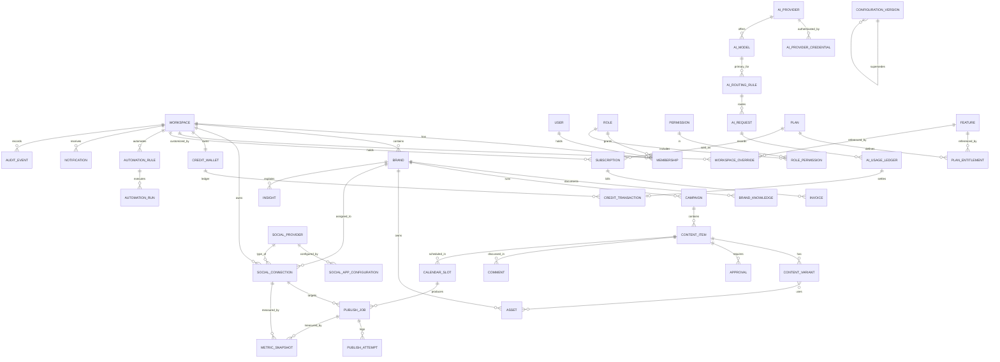
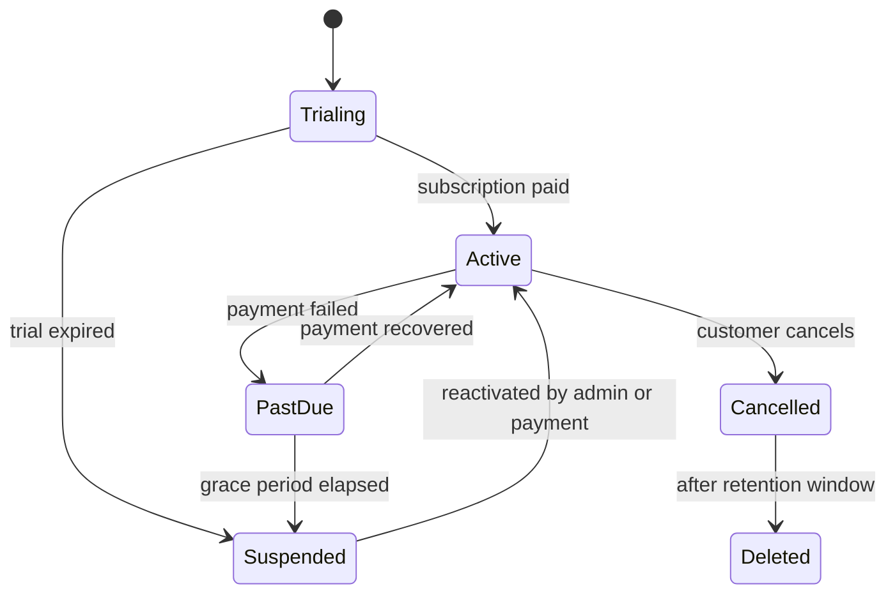
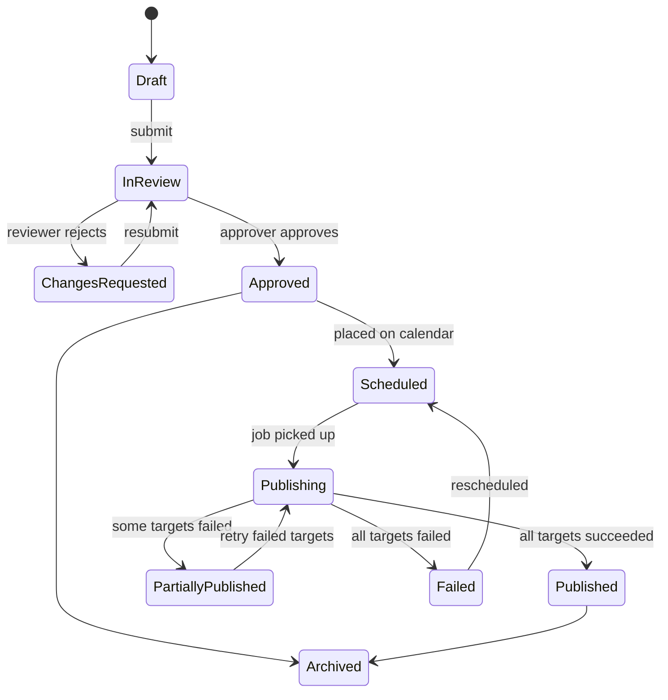
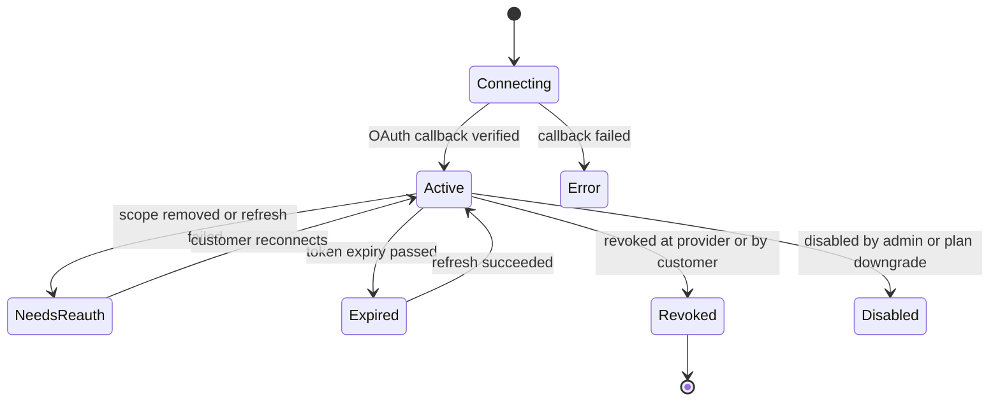
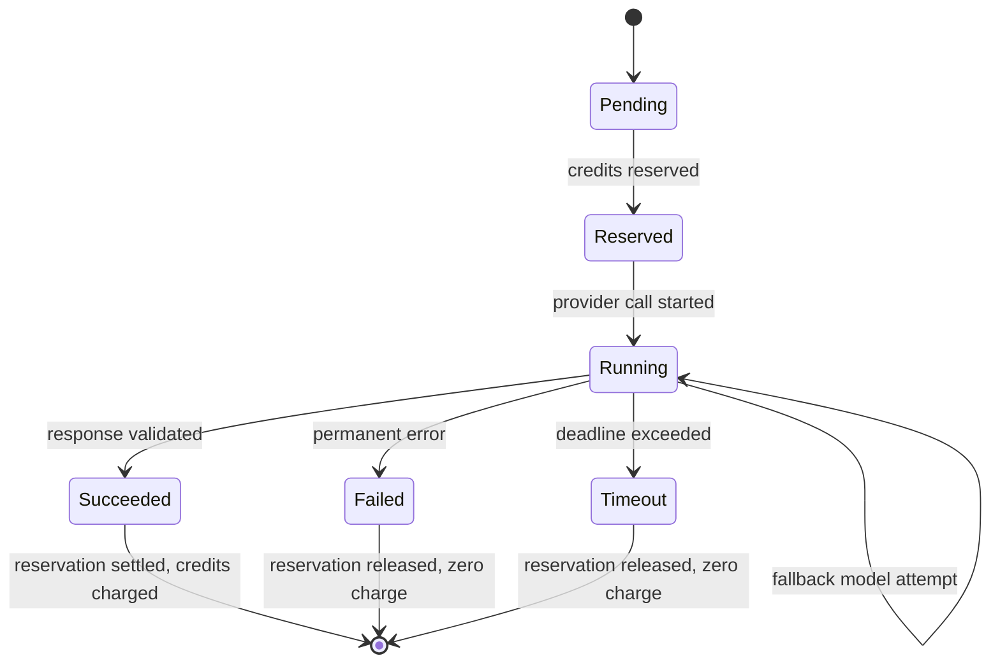
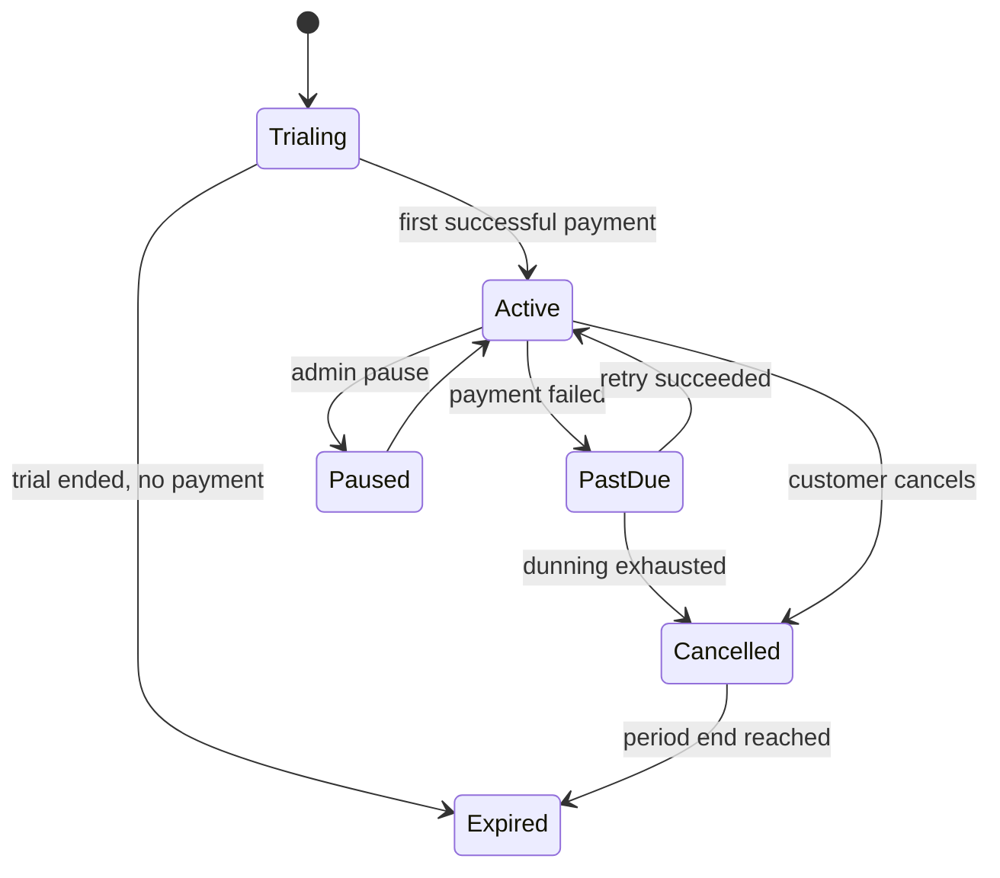

# BrandSpace — Data Model

> **الملخص التنفيذي بالعربية**
>
> هذا المستند يعرّف **نموذج البيانات الكامل** للمنصة: الكيانات، العلاقات، الفهارس، القيود، ودورة حياة كل كيان.
>
> **المبدأ الأول:** كل جدول يخص عميلًا يحتوي على عمود `workspaceId` إلزامي، وفهرس يبدأ بهذا العمود، وسياسة أمان على مستوى الصف (RLS)
> في PostgreSQL تمنع أي تسريب بين العملاء حتى لو أخطأ الكود.
>
> **المبدأ الثاني:** السجلات المالية (رصيد الذكاء الاصطناعي، الفواتير، سجل الاستخدام) **غير قابلة للتعديل أو الحذف** — الرصيد يُحسب من دفتر
> حركات ثابت (Immutable Ledger)، وأي تصحيح يتم بحركة عكسية جديدة وليس بتعديل حركة قديمة.
>
> **المبدأ الثالث:** لا تُحذف البيانات فعليًا في الحالات الحساسة، بل تُعلَّم بـ `deletedAt` (حذف ناعم)، مع مسار حذف نهائي منفصل ومُدقَّق
> عند طلب العميل أو انتهاء مدة الاحتفاظ.
>
> يتضمن المستند مخطط علاقات (ER Diagram) يوضح البنية الكاملة، وقائمة الفهارس المطلوبة للأداء، وحالات دورة الحياة لكل كيان رئيسي.

---

## 1. Conventions

| Convention     | Rule                                                                                                                 |
| -------------- | -------------------------------------------------------------------------------------------------------------------- |
| Primary keys   | UUID v7 (time-ordered) — index locality without exposing sequence counts                                             |
| Timestamps     | `createdAt`, `updatedAt` (UTC, `timestamptz`); `deletedAt` where soft delete applies                                 |
| Tenant column  | `workspaceId uuid NOT NULL` on every tenant-owned table                                                              |
| Brand column   | `brandId uuid` where brand-scoped, with a constraint that the brand belongs to `workspaceId`                         |
| Actor columns  | `createdByUserId`, `updatedByUserId` where attribution matters                                                       |
| Money          | `amountMinor bigint` + `currency char(3)` — never floats                                                             |
| Credits        | `integer` in whole credits (or `bigint` in milli-credits — see DECISIONS D-14)                                       |
| Enums          | PostgreSQL enums for closed sets; text + config validation for owner-extensible sets                                 |
| Localized text | `jsonb` shaped `{"ar": "...", "en": "..."}` for content the owner edits                                              |
| Soft delete    | Applies to `Brand`, `ContentItem`, `Asset`, `Campaign`, `AutomationRule`. Never to ledgers or audit                  |
| Immutable      | `AIUsageLedger`, `CreditTransaction`, `AuditEvent`, `ConfigurationVersion`, `PublishAttempt`, `Invoice` (post-issue) |
| Indexes        | Every tenant query path has an index whose **leading column is `workspaceId`**                                       |

**Naming:** tables are singular PascalCase in Prisma, snake_case in Postgres.

---

## 2. Entity Relationship Diagram



---

## 3. Identity and Access

### 3.1 `User`

Global identity. **Not** tenant-owned — a user may belong to several workspaces.

| Field                                            | Type            | Notes                                          |
| ------------------------------------------------ | --------------- | ---------------------------------------------- |
| `id`                                             | uuid            | PK                                             |
| `email`                                          | citext          | unique, case-insensitive                       |
| `emailVerifiedAt`                                | timestamptz     | null until confirmed                           |
| `passwordHash`                                   | text            | Argon2id; null for SSO-only users              |
| `name`, `avatarAssetId`                          | text/uuid       |                                                |
| `locale`                                         | enum(`ar`,`en`) | default from signup                            |
| `timezone`                                       | text            | IANA                                           |
| `mfaEnabled`, `mfaSecretRef`                     | bool/text       | secret stored via Secret Service, never inline |
| `status`                                         | enum            | `pending`, `active`, `suspended`, `deleted`    |
| `lastLoginAt`, `failedLoginCount`, `lockedUntil` |                 | brute-force protection                         |

Indexes: `unique(email)`, `(status)`.
Lifecycle: `pending → active → suspended → deleted` (soft, then purge after retention window).

### 3.2 `Workspace`

The isolation boundary.

| Field                                                                   | Type                 | Notes                                                                 |
| ----------------------------------------------------------------------- | -------------------- | --------------------------------------------------------------------- |
| `id`, `slug`                                                            | uuid / citext unique | slug used in URLs                                                     |
| `name`, `legalName`, `country`, `defaultLocale`, `timezone`, `currency` |                      |                                                                       |
| `type`                                                                  | enum                 | `individual`, `startup`, `company`, `creator`, `agency`, `enterprise` |
| `status`                                                                | enum                 | `trialing`, `active`, `past_due`, `suspended`, `cancelled`, `deleted` |
| `ownerUserId`                                                           | uuid                 | current Workspace Owner                                               |
| `parentWorkspaceId`                                                     | uuid null            | reserved for agency grouping (no data access implication)             |
| `dataRetentionDays`, `analyticsRetentionDays`                           | int                  | from plan, overridable                                                |
| `suspendedAt`, `suspendedReason`, `trialEndsAt`                         |                      |                                                                       |

Indexes: `unique(slug)`, `(status)`, `(ownerUserId)`.

**Lifecycle**



### 3.3 `Membership`

User ↔ Workspace with role and optional brand restriction.

| Field                                                                         | Type        | Notes                                       |
| ----------------------------------------------------------------------------- | ----------- | ------------------------------------------- |
| `id`, `workspaceId`, `userId`, `roleId`                                       | uuid        |                                             |
| `brandScope`                                                                  | uuid[] null | null = all brands; array = restricted set   |
| `status`                                                                      | enum        | `invited`, `active`, `suspended`, `removed` |
| `invitedByUserId`, `invitationTokenHash`, `invitationExpiresAt`, `acceptedAt` |             | token stored hashed only                    |

Constraints: `unique(workspaceId, userId)` where `status <> 'removed'`.
Indexes: `(workspaceId, status)`, `(userId, status)`.
Rule: **a workspace must always have at least one active Workspace Owner** — enforced by a transaction check
on role change and member removal.

### 3.4 `Role` and `Permission`

`Role`: `id`, `workspaceId` (null for system roles), `key`, `name` (localized), `scope` (`platform`|`workspace`),
`isSystem`, `description`. System roles are seeded from configuration; custom workspace roles are a
post-MVP option gated by plan.

`Permission`: `id`, `key` (e.g. `content.publish`), `resource`, `action`, `minScope`
(`platform`|`workspace`|`brand`|`campaign`), `description`.

`RolePermission`: `roleId`, `permissionId`, plus optional `constraint jsonb` (e.g. `{"ownOnly": true}`).

Indexes: `unique(role.workspaceId, role.key)`, `unique(permission.key)`, `unique(roleId, permissionId)`.

---

## 4. Brand and Content

### 4.1 `Brand`

| Field                                                                          | Notes                         |
| ------------------------------------------------------------------------------ | ----------------------------- |
| `id`, `workspaceId`, `slug`, `name`                                            | `unique(workspaceId, slug)`   |
| `industry`, `description`, `websiteUrl`, `defaultLocale`, `supportedLocales[]` |                               |
| `logoAssetId`, `colorPalette jsonb`, `typography jsonb`, `voiceProfile jsonb`  | brand kit                     |
| `status`                                                                       | `draft`, `active`, `archived` |
| `deletedAt`                                                                    | soft delete                   |

Indexes: `(workspaceId, status)`, `unique(workspaceId, slug)`.

### 4.2 `BrandKnowledge`

Structured brand facts and uploaded documents, chunked and embedded for retrieval.

| Field                                            | Notes                                                                                                                              |
| ------------------------------------------------ | ---------------------------------------------------------------------------------------------------------------------------------- |
| `id`, `workspaceId`, `brandId`                   |                                                                                                                                    |
| `type`                                           | `identity`, `audience`, `tone`, `offer`, `proof`, `objection`, `rule_do`, `rule_dont`, `glossary`, `competitor`, `faq`, `document` |
| `title`, `content jsonb`                         | localized `{ar, en}`                                                                                                               |
| `sourceAssetId`                                  | for uploaded documents                                                                                                             |
| `chunkIndex`, `chunkText`, `embedding vector(N)` | one row per chunk for `document` type                                                                                              |
| `embeddingModelKey`, `embeddedAt`                | so re-embedding on model change is detectable                                                                                      |
| `status`                                         | `draft`, `active`, `stale`, `archived`                                                                                             |
| `version`                                        | incremented on edit; retrieval cites version                                                                                       |

Indexes: `(workspaceId, brandId, type)`, `(workspaceId, brandId, status)`,
HNSW/IVFFlat on `embedding` **partitioned or filtered by `workspaceId`** so ANN search never scans other tenants.

### 4.3 `Campaign`

`id`, `workspaceId`, `brandId`, `name`, `objective`, `description`, `startDate`, `endDate`,
`channels text[]`, `budgetMinor`, `currency`, `kpis jsonb`, `strategyInsightId`, `ownerUserId`,
`status` (`draft`, `planned`, `active`, `paused`, `completed`, `archived`), `deletedAt`.

Indexes: `(workspaceId, brandId, status)`, `(workspaceId, startDate, endDate)`.

### 4.4 `ContentItem`

The canonical content object (channel-agnostic).

| Field                                                                                | Notes                                    |
| ------------------------------------------------------------------------------------ | ---------------------------------------- |
| `id`, `workspaceId`, `brandId`, `campaignId` (null)                                  |                                          |
| `title`, `contentType` (`post`,`carousel`,`story`,`reel`,`video`,`article`,`thread`) |                                          |
| `primaryLocale`, `pillar`, `tags text[]`                                             |                                          |
| `status`                                                                             | see lifecycle below                      |
| `createdByUserId`, `aiRequestId` (null)                                              | provenance: which AI request produced it |
| `approvalRequired bool`, `currentApprovalId`                                         |                                          |
| `deletedAt`                                                                          |                                          |

**Lifecycle**



Indexes: `(workspaceId, brandId, status)`, `(workspaceId, campaignId)`, `(workspaceId, brandId, createdAt desc)`.

### 4.5 `ContentVariant`

Per-platform, per-locale rendering of a content item.

`id`, `workspaceId`, `contentItemId`, `platformKey`, `locale`, `body text`, `hashtags text[]`,
`mentions text[]`, `linkUrl`, `firstComment`, `assetIds uuid[]`, `platformOptions jsonb`
(e.g. IG carousel order, YT title/description/category), `validationState`
(`unvalidated`, `valid`, `warnings`, `invalid`), `validationErrors jsonb`, `characterCount`,
`aiRequestId`.

Constraints: `unique(contentItemId, platformKey, locale)`.
Indexes: `(workspaceId, contentItemId)`.

### 4.6 `Asset`

`id`, `workspaceId`, `brandId` (null = workspace-level), `folderId`, `name`, `kind`
(`image`,`video`,`audio`,`document`,`font`), `mimeType`, `sizeBytes`, `width`, `height`,
`durationMs`, `storageKey`, `checksumSha256`, `derivatives jsonb`, `source`
(`upload`,`ai_generated`,`imported`), `aiRequestId`, `license`, `rightsExpiryAt`, `tags text[]`,
`scanStatus` (`pending`,`clean`,`infected`,`failed`), `status`
(`uploading`,`processing`,`ready`,`processing_failed`,`quarantined`,`archived`), `version`,
`replacesAssetId`, `deletedAt`.

Indexes: `(workspaceId, brandId, status)`, `(workspaceId, kind)`, `(workspaceId, checksumSha256)` for dedupe,
GIN on `tags`.
Rule: an asset is usable only when `status='ready' AND scanStatus='clean'`.

### 4.7 `CalendarSlot`

`id`, `workspaceId`, `brandId`, `contentItemId`, `socialConnectionIds uuid[]`,
`scheduledAtUtc timestamptz`, `scheduledLocalTime`, `timezone`, `recurrenceRule` (null),
`status` (`planned`,`scheduled`,`locked`,`publishing`,`published`,`failed`,`cancelled`),
`lockedAt`, `lockedBy`, `publishJobIds uuid[]`.

Indexes: `(workspaceId, brandId, scheduledAtUtc)`, `(status, scheduledAtUtc)` for the due-slot sweeper.
Constraint: a slot may not enter `scheduled` if its content item requires approval and is not `Approved`.

### 4.8 `Approval` and `Comment`

`Approval`: `id`, `workspaceId`, `subjectType` (`content_item`,`campaign`,`asset`), `subjectId`,
`requestedByUserId`, `assignedToUserId`/`assignedToRoleId`, `status`
(`pending`,`approved`,`rejected`,`cancelled`,`expired`), `decidedByUserId`, `decidedAt`, `note`,
`dueAt`, `stepIndex`, `policySnapshot jsonb` (the approval rules in force at request time).

`Comment`: `id`, `workspaceId`, `subjectType`, `subjectId`, `parentCommentId`, `authorUserId`,
`body`, `mentions uuid[]`, `anchor jsonb` (position in text or region on an image),
`resolvedAt`, `resolvedByUserId`, `deletedAt`.

Indexes: `(workspaceId, subjectType, subjectId)`, `(workspaceId, assignedToUserId, status)`.

---

## 5. Social

### 5.1 `SocialProvider` (configuration-backed registry)

`id`, `key` (`facebook`,`instagram`,`tiktok`,`linkedin`,`youtube`,`x`,…), `name`, `status`
(`available`,`beta`,`disabled`), `capabilities jsonb` (publish kinds, media limits, character limits,
scheduling support, analytics support), `authType` (`oauth2`), `requiredScopes text[]`,
`apiVersion`, `docsUrl`. **Platform-level, not tenant-owned.**

### 5.2 `SocialAppConfiguration`

The BrandSpace-owned application credentials per provider per environment.

`id`, `providerId`, `environment` (`development`,`staging`,`production`), `appId`,
`clientIdRef secretRef`, `clientSecretRef secretRef`, `redirectUri`, `scopes text[]`,
`webhookSecretRef`, `status` (`draft`,`validated`,`active`,`disabled`),
`lastValidatedAt`, `lastHealthAt`, `healthStatus`, `createdByPlatformUserId`, `rotatedAt`.

Constraint: `unique(providerId, environment)` where `status='active'`. **No secret values stored here** —
only references resolved by the Secret Service.

### 5.3 `SocialConnection` (tenant-owned)

A customer's connected account.

| Field                                                                                                          | Notes                                                                             |
| -------------------------------------------------------------------------------------------------------------- | --------------------------------------------------------------------------------- |
| `id`, `workspaceId`, `brandId` (null = workspace-level), `providerId`                                          |                                                                                   |
| `externalAccountId`, `externalAccountName`, `accountType` (`page`,`profile`,`business`,`channel`), `avatarUrl` |                                                                                   |
| `accessTokenRef`, `refreshTokenRef`                                                                            | encrypted via Secret Service; **never returned by API**                           |
| `tokenExpiresAt`, `refreshExpiresAt`, `scopesGranted text[]`, `scopesMissing text[]`                           |                                                                                   |
| `status`                                                                                                       | `connecting`, `active`, `needs_reauth`, `expired`, `revoked`, `disabled`, `error` |
| `healthStatus`, `lastHealthCheckAt`, `lastErrorCode`, `lastErrorAt`, `consecutiveFailures`                     |                                                                                   |
| `connectedByUserId`, `connectedAt`, `disconnectedAt`, `disconnectedByUserId`                                   |                                                                                   |
| `rateLimitState jsonb`                                                                                         | provider-reported quota state                                                     |

Constraints: `unique(workspaceId, providerId, externalAccountId)` where not revoked.
Indexes: `(workspaceId, status)`, `(status, tokenExpiresAt)` for proactive refresh.

**Lifecycle**



### 5.4 `PublishJob` and `PublishAttempt`

`PublishJob`: `id`, `workspaceId`, `brandId`, `contentItemId`, `contentVariantId`,
`calendarSlotId`, `socialConnectionId`, `providerId`, `idempotencyKey` (unique),
`scheduledAtUtc`, `status` (`queued`,`processing`,`succeeded`,`failed`,`cancelled`,`dead_letter`),
`attemptCount`, `nextAttemptAt`, `externalPostId`, `externalPostUrl`,
`failureCode`, `failureMessage`, `requiresConfirmation bool`, `confirmedByUserId`, `confirmedAt`.

Constraints: `unique(idempotencyKey)`; `unique(contentVariantId, socialConnectionId, calendarSlotId)`
prevents accidental double-scheduling.
Indexes: `(workspaceId, status)`, `(status, nextAttemptAt)`, `(workspaceId, brandId, scheduledAtUtc)`.

`PublishAttempt` (immutable): `id`, `workspaceId`, `publishJobId`, `attemptNumber`, `startedAt`,
`finishedAt`, `outcome` (`success`,`retryable_error`,`permanent_error`,`timeout`),
`httpStatus`, `providerErrorCode`, `providerResponse jsonb` (**redacted of tokens**),
`requestFingerprint`, `durationMs`.

Indexes: `(workspaceId, publishJobId, attemptNumber)`.

### 5.5 `MetricSnapshot` and `Insight`

`MetricSnapshot`: `id`, `workspaceId`, `brandId`, `providerId`, `socialConnectionId`,
`subjectType` (`post`,`account`), `subjectExternalId`, `publishJobId` (null),
`periodStart`, `periodEnd`, `granularity` (`hour`,`day`,`week`,`month`,`lifetime`),
`metrics jsonb` (impressions, reach, engagement, clicks, saves, shares, views, watchTime, followers…),
`currency` (for spend, future), `collectedAt`, `sourceVersion`.

Constraints: `unique(workspaceId, socialConnectionId, subjectExternalId, granularity, periodStart)`
— makes ingestion idempotent via upsert.
Indexes: `(workspaceId, brandId, periodStart desc)`, `(workspaceId, publishJobId)`.
Retention: pruned per `Workspace.analyticsRetentionDays`.

`Insight`: `id`, `workspaceId`, `brandId`, `type` (`strategy`,`analytics_explanation`,`recommendation`,
`trend`,`content_gap`,`anomaly`), `title`, `body jsonb` (localized), `evidence jsonb`
(metric refs, content refs, Brand Brain citations), `periodStart`, `periodEnd`,
`aiRequestId`, `confidence`, `status` (`new`,`seen`,`accepted`,`dismissed`), `expiresAt`.

Indexes: `(workspaceId, brandId, type, createdAt desc)`.

---

## 6. AI

### 6.1 `AIProvider`

`id`, `key` (`openai`,`anthropic`,`google`,`mock`,…), `name`, `baseUrl`, `authScheme`,
`status` (`draft`,`validated`,`active`,`disabled`), `defaultTimeoutMs`, `maxConcurrency`,
`rateLimitConfig jsonb`, `healthStatus`, `lastHealthCheckAt`, `notes`. **Platform-level.**

### 6.2 `AIProviderCredential`

`id`, `providerId`, `environment`, `label`, `secretRef`, `maskedHint` (e.g. `…a91f`),
`fingerprint` (hash for equality checks without the value), `status`
(`active`,`rotating`,`disabled`,`revoked`), `createdByPlatformUserId`, `activatedAt`,
`lastRotatedAt`, `lastUsedAt`, `expiresAt`, `scopeNotes`.

**The credential value is never a column.** Only `secretRef` is stored; resolution happens server-side.
Constraint: at most one `active` credential per `(providerId, environment)` unless rotation is in progress.

### 6.3 `AIModel`

`id`, `providerId`, `key` (provider's model id), `displayName`,
`modality` (`text`,`image`,`video`,`voice`,`embedding`,`moderation`),
`capabilities jsonb` (context window, max output, streaming, tools, JSON mode, languages, image sizes),
`inputCostPerUnitMinor`, `outputCostPerUnitMinor`, `unit` (`1k_tokens`,`image`,`second`,`character`),
`currency`, `status` (`available`,`beta`,`deprecated`,`disabled`), `disableSwitch bool`,
`qualityTier` (`fast`,`balanced`,`premium`), `notes`.

Constraint: `unique(providerId, key, environment)`.
Rule: a disabled model is immediately unusable by routing, even for in-flight rules.

### 6.4 `AIRoutingRule`

Maps a **task** to a model chain.

`id`, `taskKey` (`caption.generate`, `ideas.generate`, `plan.monthly`, `strategy.generate`,
`analytics.explain`, `copilot.chat`, `image.generate`, `video.generate`, `moderation.check`,
`brand.retrieve` …), `scope` (`global`,`plan`,`workspace`), `planId` (null), `workspaceId` (null),
`primaryModelId`, `fallbackModelIds uuid[]` (ordered), `parameters jsonb` (temperature, max tokens,
system prompt version), `qualityTier`, `maxCostPerRequestMinor`, `timeoutMs`, `retryPolicy jsonb`,
`priority int`, `status`, `configurationVersionId`.

Resolution order: workspace rule → plan rule → global rule. Highest `priority` wins within a scope.
Indexes: `(taskKey, scope, priority desc)`, `(workspaceId, taskKey)`.

### 6.5 `AIRequest`

One logical AI action.

| Field                                                               | Notes                                                                                                                                    |
| ------------------------------------------------------------------- | ---------------------------------------------------------------------------------------------------------------------------------------- |
| `id`, `workspaceId`, `brandId` (null), `userId` (null for system)   |                                                                                                                                          |
| `taskKey`, `idempotencyKey` (unique)                                |                                                                                                                                          |
| `routingRuleId`, `resolvedModelId`, `attemptedModelIds uuid[]`      |                                                                                                                                          |
| `status`                                                            | `pending`, `reserved`, `running`, `succeeded`, `failed`, `cancelled`, `timeout`, `moderation_blocked`                                    |
| `inputSummary jsonb`                                                | **audit-safe**: token/asset counts, language, brand refs, prompt template id — never raw customer content unless retention policy allows |
| `outputRefType`, `outputRefId`                                      | points at ContentItem / Asset / Insight                                                                                                  |
| `promptTokens`, `completionTokens`, `imageCount`, `durationSeconds` | usage units                                                                                                                              |
| `providerCostMinor`, `currency`                                     | actual provider cost                                                                                                                     |
| `creditsReserved`, `creditsCharged`                                 | credits                                                                                                                                  |
| `latencyMs`, `retryCount`, `failureCode`, `failureMessage`          |                                                                                                                                          |
| `byok bool`, `byokCredentialId`                                     | customer-supplied key path                                                                                                               |

Indexes: `unique(idempotencyKey)`, `(workspaceId, createdAt desc)`, `(workspaceId, taskKey, status)`,
`(status, createdAt)` for stuck-request sweeps.

**Lifecycle**



### 6.6 `AIUsageLedger` (immutable)

`id`, `workspaceId`, `aiRequestId`, `occurredAt`, `taskKey`, `providerId`, `modelId`,
`usageUnits jsonb`, `providerCostMinor`, `currency`, `creditsCharged`,
`creditTransactionId`, `userId`, `brandId`, `environment`.

Append-only. No updates, no deletes. Corrections are new rows referencing `correctsLedgerId`.
Indexes: `(workspaceId, occurredAt desc)`, `(workspaceId, taskKey, occurredAt)`, `(modelId, occurredAt)`.
This table is the source for admin cost/margin reporting.

---

## 7. Credits

### 7.1 `CreditWallet`

`id`, `workspaceId` (unique), `currentBalance`, `reservedBalance`, `lifetimeGranted`,
`lifetimeConsumed`, `lowBalanceThreshold`, `lowBalanceNotifiedAt`, `hardLimitEnabled`,
`overageEnabled`, `overageCapCredits`, `lastResetAt`, `nextResetAt`, `version` (optimistic lock).

**`currentBalance` is a materialized projection of the ledger**, updated only inside the same transaction as
the transaction row, and reconcilable by replaying `CreditTransaction`. A nightly job asserts equality and
alerts on drift.

Constraints: `CHECK (currentBalance >= 0)`, `CHECK (reservedBalance >= 0)`.

### 7.2 `CreditTransaction` (immutable)

`id`, `workspaceId`, `walletId`, `type`
(`plan_grant`,`addon_purchase`,`promotional_grant`,`admin_adjustment`,`reservation`,`reservation_release`,
`usage_charge`,`refund`,`expiry`,`reset`), `amount` (signed), `balanceAfter`, `reason`,
`aiRequestId` (null), `invoiceId` (null), `expiresAt` (for expiring grants), `sourceBucketId`
(which grant the usage consumed, for FIFO expiry), `idempotencyKey` (unique),
`actorType` (`system`,`user`,`platform_user`), `actorId`, `occurredAt`, `metadata jsonb`.

Indexes: `unique(idempotencyKey)`, `(workspaceId, occurredAt desc)`, `(walletId, type)`,
`(workspaceId, expiresAt)` for expiry sweeps.

**Concurrency:** all balance-changing operations run inside a transaction that begins with
`SELECT … FROM credit_wallet WHERE id = $1 FOR UPDATE`. Combined with `CHECK (currentBalance >= 0)` and
the unique idempotency key, this makes negative balances, lost updates, and duplicate deductions impossible.

---

## 8. Plans, Entitlements, Billing

### 8.1 `Plan`

`id`, `key`, `name jsonb` (localized), `description jsonb`, `tier`, `visibility`
(`public`,`private`,`legacy`), `status` (`draft`,`active`,`grandfathered`,`retired`),
`monthlyPriceMinor`, `annualPriceMinor`, `currency`, `supportedCurrencies jsonb` (per-currency prices),
`trialDays`, `monthlyCredits`, `creditRolloverPolicy`, `overagePolicy jsonb`,
`upgradeBehavior`, `downgradeBehavior`, `sortOrder`, `configurationVersionId`.

Retired plans remain readable so existing subscriptions still resolve.

### 8.2 `Feature`

`id`, `key` (`ai.image_generation`, `social.publish`, `automations`, `byok`, …), `name jsonb`,
`category`, `valueType` (`boolean`,`quota`,`enum`), `defaultValue jsonb`,
`dependsOnFeatureKeys text[]`, `status`.

### 8.3 `PlanEntitlement`

`id`, `planId`, `featureId`, `enabled`, `limitValue` (null = unlimited), `limitPeriod`
(`day`,`month`,`billing_cycle`,`total`), `metadata jsonb`.
Constraint: `unique(planId, featureId)`.

Standard quota features: users, brands, social accounts, scheduled posts/month, storage GB,
analytics retention days, AI credits/month, per-feature AI limits.

### 8.4 `WorkspaceOverride`

Owner-granted, per-customer deviation.

`id`, `workspaceId`, `featureId`, `enabled`, `limitValue`, `reason`, `grantedByPlatformUserId`,
`effectiveFrom`, `effectiveUntil` (null = permanent), `status`.
Constraint: `unique(workspaceId, featureId, effectiveFrom)`.

**Precedence** (highest wins): workspace override → percentage/beta/country/date flag rules → plan
entitlement → feature default. Full rules in `docs/ADMIN-CONTROL-CENTER.md` §Feature Flags.

### 8.5 `Subscription`

`id`, `workspaceId`, `planId`, `status` (`trialing`,`active`,`past_due`,`paused`,`cancelled`,`expired`),
`billingInterval` (`month`,`year`), `currency`, `quantitySeats`, `addOns jsonb`,
`currentPeriodStart`, `currentPeriodEnd`, `trialEndsAt`, `cancelAtPeriodEnd`, `cancelledAt`,
`gracePeriodEndsAt`, `providerKey`, `providerSubscriptionId`, `providerCustomerId`,
`couponCode`, `discountJson`, `taxProfile jsonb`, `pendingPlanChange jsonb`.

Indexes: `(workspaceId, status)`, `unique(providerKey, providerSubscriptionId)`,
`(status, currentPeriodEnd)` for renewal sweeps.

**Lifecycle**



### 8.6 `Invoice`

`id`, `workspaceId`, `subscriptionId`, `number` (unique, sequential per workspace/tenant),
`status` (`draft`,`open`,`paid`,`void`,`uncollectible`,`refunded`,`partially_refunded`),
`currency`, `subtotalMinor`, `discountMinor`, `taxMinor`, `totalMinor`, `amountPaidMinor`,
`amountRefundedMinor`, `lineItems jsonb`, `taxBreakdown jsonb`, `issuedAt`, `dueAt`, `paidAt`,
`providerKey`, `providerInvoiceId`, `pdfStorageKey`, `billingAddress jsonb`.

Immutable once `status='open'` or later; corrections are credit notes.
Indexes: `(workspaceId, issuedAt desc)`, `unique(providerKey, providerInvoiceId)`, `unique(number)`.

---

## 9. Automation, Notifications, Platform Ops

### 9.1 `AutomationRule`

`id`, `workspaceId`, `brandId` (null), `name`, `trigger jsonb`
(`content.approved`, `publish.failed`, `metric.threshold`, `schedule.cron`, `connection.needs_reauth`…),
`conditions jsonb`, `actions jsonb` (`schedule_content`, `notify`, `create_approval`, `generate_content`,
`tag`, `webhook`), `enabled`, `maxRunsPerDay`, `requiresApprovalForExternalActions bool`,
`createdByUserId`, `lastRunAt`, `deletedAt`.

Rule: an automation may **never** perform an external publish without either an explicit standing
authorization recorded on the rule or a human approval step.

### 9.2 `AutomationRun`

`id`, `workspaceId`, `ruleId`, `triggeredBy jsonb`, `startedAt`, `finishedAt`,
`status` (`running`,`succeeded`,`failed`,`skipped`,`blocked_by_policy`),
`actionsExecuted jsonb`, `errorCode`, `errorMessage`, `idempotencyKey` (unique).

Indexes: `(workspaceId, ruleId, startedAt desc)`.

### 9.3 `Notification`

`id`, `workspaceId`, `userId` (null = workspace-wide), `templateKey`, `locale`,
`channel` (`in_app`,`email`,`sms`,`whatsapp`,`push`), `payload jsonb`, `renderedSubject`,
`renderedBodyRef`, `status` (`queued`,`sent`,`delivered`,`failed`,`bounced`,`suppressed`),
`readAt`, `sentAt`, `providerMessageId`, `failureCode`, `idempotencyKey` (unique),
`priority`, `groupKey` (for digest collapsing).

Indexes: `(workspaceId, userId, readAt)`, `(status, createdAt)`.

Notification **templates** live in the Configuration Service (versioned, bilingual, previewable,
test-sendable, rollback-able), not in this table.

### 9.4 `AuditEvent` (immutable)

| Field                                                                                             | Notes                                                                                |
| ------------------------------------------------------------------------------------------------- | ------------------------------------------------------------------------------------ |
| `id`, `occurredAt`                                                                                |                                                                                      |
| `workspaceId`                                                                                     | null for platform-only events                                                        |
| `actorType` (`user`,`platform_user`,`system`,`automation`,`copilot`), `actorId`, `actorEmailHash` |                                                                                      |
| `action`                                                                                          | e.g. `content.published`, `plan.activated`, `secret.rotated`, `support_mode.entered` |
| `resourceType`, `resourceId`, `brandId`                                                           |                                                                                      |
| `severity` (`info`,`notice`,`warning`,`critical`)                                                 |                                                                                      |
| `before jsonb`, `after jsonb`                                                                     | **redacted**; secrets and tokens never included                                      |
| `ip`, `userAgent`, `requestId`, `traceId`, `sessionId`                                            |                                                                                      |
| `supportModeSessionId`                                                                            | set when the action occurred under support mode                                      |
| `outcome` (`success`,`denied`,`error`), `reason`                                                  |                                                                                      |

Indexes: `(workspaceId, occurredAt desc)`, `(actorId, occurredAt desc)`,
`(resourceType, resourceId, occurredAt desc)`, `(action, occurredAt desc)`.
Append-only, enforced by revoking UPDATE/DELETE from the application role. Retention is long
(default 24 months, configurable), and export is supported.

### 9.5 `ConfigurationVersion` (immutable)

`id`, `domain`, `environment`, `versionNumber`, `schemaVersion`, `payload jsonb`,
`payloadChecksum`, `status` (`draft`,`validated`,`active`,`superseded`,`discarded`),
`previousVersionId`, `validationReport jsonb`, `impactPreview jsonb`,
`createdByPlatformUserId`, `activatedByPlatformUserId`, `activatedAt`, `deactivatedAt`,
`changeReason`, `rollbackOfVersionId`.

Constraints: `unique(domain, environment, versionNumber)`; a partial unique index guarantees **at most one
`active` version per `(domain, environment)`**.
Indexes: `(domain, environment, status)`, `(activatedAt desc)`.

---

## 10. Supporting Tables (not enumerated in the brief but required)

| Table                                       | Purpose                                                                                                                              |
| ------------------------------------------- | ------------------------------------------------------------------------------------------------------------------------------------ |
| `Session` / `PlatformSession`               | separate session stores per realm, with device metadata and revocation                                                               |
| `Invitation`                                | if modelled separately from `Membership` for platform-initiated invites                                                              |
| `SecretRecord`                              | vault metadata: `ref`, `scope`, `environment`, `version`, `maskedHint`, `fingerprint`, `rotatedAt`, `status` — never the value       |
| `IdempotencyKey`                            | `key`, `scope`, `workspaceId`, `requestHash`, `responseSnapshot`, `status`, `expiresAt`                                              |
| `WebhookEvent`                              | inbound provider events: `providerKey`, `externalEventId` (unique), `signatureValid`, `payload`, `status`, `processedAt`, `attempts` |
| `OutboxEvent`                               | transactional outbox so domain events are never lost between DB commit and queue enqueue                                             |
| `AssetFolder`                               | asset library hierarchy                                                                                                              |
| `SupportModeSession`                        | `platformUserId`, `workspaceId`, `reason`, `ticketRef`, `grantedAt`, `expiresAt`, `endedAt`, `permissionsSnapshot`                   |
| `DataExportRequest` / `DataDeletionRequest` | GDPR-style lifecycle with status and artifacts                                                                                       |
| `RateLimitCounter`                          | if persisted beyond Redis for auditability                                                                                           |

---

## 11. Index Strategy Summary

1. **Every** tenant-owned table: `(workspaceId, <most common filter>, <sort column> DESC)`.
2. Foreign keys are always indexed (Postgres does not do this automatically).
3. Status-scan tables (`PublishJob`, `AIRequest`, `Notification`, `CalendarSlot`) get partial indexes on
   in-flight states only — e.g. `WHERE status IN ('queued','processing')` — keeping sweeper queries small.
4. Unique idempotency indexes on `AIRequest`, `PublishJob`, `CreditTransaction`, `AutomationRun`,
   `Notification`, `WebhookEvent`.
5. GIN indexes on `tags` arrays and on searchable `jsonb`; full-text search columns are generated and
   workspace-filtered.
6. Vector index on `BrandKnowledge.embedding` with the workspace predicate applied inside the query.
7. Time-series growth (`MetricSnapshot`, `AIUsageLedger`, `AuditEvent`, `PublishAttempt`) is monitored;
   monthly partitioning is planned once a table exceeds ~50M rows.

---

## 12. Constraints That Encode Business Rules

| Rule                                   | Enforcement                                                                     |
| -------------------------------------- | ------------------------------------------------------------------------------- |
| Credit balance never negative          | `CHECK (currentBalance >= 0)` + `FOR UPDATE` lock                               |
| No duplicate AI charge                 | `unique(AIRequest.idempotencyKey)` + `unique(CreditTransaction.idempotencyKey)` |
| No double publish                      | `unique(PublishJob.idempotencyKey)` and `unique(variant, connection, slot)`     |
| One active config per domain/env       | partial unique index on `status='active'`                                       |
| One active credential per provider/env | partial unique index                                                            |
| Brand belongs to workspace             | composite FK `(workspaceId, brandId)` referencing `Brand(workspaceId, id)`      |
| Workspace keeps an owner               | transactional guard on membership/role change                                   |
| Only approved content publishes        | guard on `CalendarSlot` transition + re-check at job execution time             |
| Analytics ingestion is idempotent      | natural unique key + upsert                                                     |
| Ledgers are append-only                | `REVOKE UPDATE, DELETE` from the application role                               |

---

## 13. Data Lifecycle and Retention

| Data                           | Default retention                     | Notes                                                           |
| ------------------------------ | ------------------------------------- | --------------------------------------------------------------- |
| Audit events                   | 24 months                             | configurable per plan; exportable                               |
| Metric snapshots               | per plan (`analyticsRetentionDays`)   | pruned by a scheduled job                                       |
| AI request input summaries     | 90 days                               | raw prompt/response bodies are **not** stored by default (R-23) |
| AI usage ledger                | 7 years                               | financial record                                                |
| Credit transactions / invoices | 7 years                               | financial record                                                |
| Soft-deleted content           | 30 days, then purge                   | restorable within the window                                    |
| Deleted workspace              | 30-day grace, then irreversible purge | export offered first                                            |
| Publish attempts               | 12 months                             | provider responses redacted                                     |
| Backups                        | 30 days PITR + 12 monthly snapshots   | restore tested quarterly                                        |

---

## 14. Platform-Owned Tables (implemented in Phase 2A)

> **ملخّص بالعربية**
>
> هذه الجداول تخص المنصة نفسها لا العملاء: هوية مسؤولي المنصة وجلساتهم، إصدارات الإعدادات، والمفاتيح السرية
> المشفّرة. لا تحتوي على `workspaceId`، ولا يملك دور التطبيق أي صلاحية عليها إطلاقًا.

These carry **no `workspaceId`**. They are not tenant data, and the tenant application role has no privilege on
them at all — a query from `brandspace_app` returns _permission denied_, not an empty result.

| Table                        | Purpose                                 | Notable constraints                                                                                                                                        |
| ---------------------------- | --------------------------------------- | ---------------------------------------------------------------------------------------------------------------------------------------------------------- |
| `platform_user`              | Platform Admin identity                 | `email` unique; `mfaSecretRef` is a vault reference, never a secret; `lockedUntil` drives lockout                                                          |
| `platform_session`           | Admin sessions                          | `tokenHash` unique — the token itself is never stored; `mfaVerifiedAt IS NULL` grants nothing                                                              |
| `platform_mfa_recovery_code` | Single-use recovery codes               | stored as SHA-256 hashes; `usedAt` burns one on use                                                                                                        |
| `configuration_version`      | Versioned configuration documents       | partial unique index `(domain, environment) WHERE status = 'ACTIVE'`; trigger rejects editing an ACTIVE payload                                            |
| `secret_record`              | Secret identity and lifecycle           | unique `(ref, environment)`                                                                                                                                |
| `secret_version`             | Encrypted material, one row per version | partial unique index `(secretRecordId) WHERE status = 'ACTIVE'`; trigger rejects any change to ciphertext, IV, auth tag, wrapped key or encryption context |

### 14.1 Protection

Each of the six has, in the same migration that creates it:

```sql
ALTER TABLE "<table>" ENABLE ROW LEVEL SECURITY;
ALTER TABLE "<table>" FORCE  ROW LEVEL SECURITY;
CREATE POLICY platform_only ON "<table>"
  TO brandspace_platform USING (true) WITH CHECK (true);
REVOKE ALL ON "<table>" FROM brandspace_app;
GRANT SELECT, INSERT, UPDATE, DELETE ON "<table>" TO brandspace_platform;
```

Two independent controls, so neither is load-bearing alone: the grant is gone, **and** the policy names only
the platform role, so a future blanket `GRANT` still yields zero rows.

`platform_user` joined this set in migration `20260901210500_platform_user_isolation`. It was created in Phase
1 as an unclassified table and picked up the RLS migration's `GRANT ... ON ALL TABLES IN SCHEMA public`, which
left its password hashes readable by the tenant role. See `docs/DECISIONS.md` F-10.

### 14.2 Secret material columns

`secret_version` stores `ciphertext`, `iv`, `authTag`, `wrappedDataKey` and `encryptionContext`. The plaintext
appears in no column, no index and no log. The encryption context binds the ciphertext to
`(ref, environment, version)` as AEAD additional data, so a row copied to another environment fails to decrypt
rather than quietly working.

### 14.3 The tenancy registry is the source of truth

`packages/database/src/tenant-models.ts` classifies **every** model as tenant-owned, platform-owned, identity,
or a global catalogue. `scripts/isolation-gate.ts` fails the build when a model is unclassified, when the
classification disagrees with the schema, when a platform-owned table lacks its policy or its revoke, or when
the isolation suite never exercises it. A model nobody thought about is a build failure, not a default.
