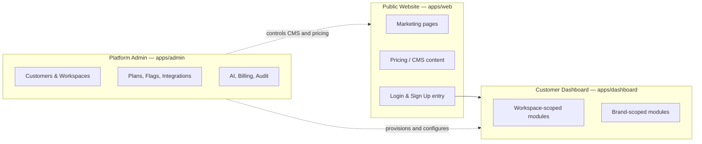
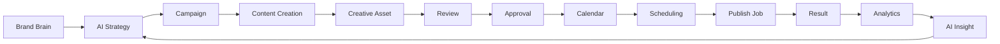
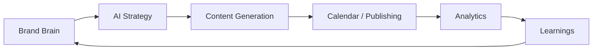

# BrandSpace — Product Definition

> **الملخص التنفيذي بالعربية**
>
> BrandSpace هي منصة SaaS ثنائية اللغة (عربي/إنجليزي) ومتعددة المستأجرين، تعمل كـ **نظام تشغيل للعلامة التجارية ووسائل التواصل الاجتماعي**
> مدعوم بالذكاء الاصطناعي، موجّه لرواد الأعمال والشركات الناشئة والشركات الصغيرة والمتوسطة وفرق التسويق وصنّاع المحتوى والوكالات.
>
> **المنتج ينقسم إلى ثلاث واجهات منفصلة تمامًا:**
>
> 1. **الموقع العام** — للتعريف بالمنتج والتسعير والتسجيل (١٥ صفحة مخططة).
> 2. **لوحة تحكم العميل** — ١٩ وحدة تشمل مركز القيادة، مركز العلامة التجارية، عقل العلامة (Brand Brain)، الاستراتيجية بالذكاء الاصطناعي،
>    الحملات، التقويم الاجتماعي، استوديو المحتوى، الاستوديو الإبداعي، مركز التواصل الاجتماعي، المساعد الذكي، التحليلات، مكتبة الأصول،
>    الفريق والموافقات، الأتمتة، الإشعارات، سجل النشاط، الإعدادات، والفوترة.
> 3. **مركز تحكم المالك (Platform Admin)** — خاص بمالك المنصة والفريق الداخلي فقط، ومنفصل معماريًا عن لوحة العميل.
>
> **رحلة القيمة الأساسية:** استراتيجية ← حملة ← محتوى ← تصميم ← مراجعة ← موافقة ← تقويم ← جدولة ← نشر ← تحليلات ← رؤية ذكية.
>
> **المبدأ الحاكم:** كل عميل داخل "مساحة عمل" معزولة تمامًا، وكل شيء قابل للتهيئة من لوحة المالك دون تعديل الكود.

---

## 1. Product Statement

BrandSpace is the operating system for a brand's marketing presence. It replaces the fragmented stack of
strategy documents, spreadsheets, design tools, scheduling apps, and analytics dashboards with one
workspace where a brand's identity, knowledge, strategy, content, creative, publishing, and performance
live together — and where AI is a first-class collaborator that understands the brand rather than a generic
text box.

**Positioning statement:** _For teams that need a consistent brand voice across many channels, BrandSpace is
an AI brand and social operating system that turns brand knowledge into strategy, content, and measurable
performance — in Arabic and English — without stitching together five tools._

### 1.1 What makes it different

1. **Brand Brain** — a per-brand knowledge base (identity, tone, audience, offers, do/don't rules, documents)
   that grounds every AI output. AI is brand-aware by default, not prompt-by-prompt.
2. **True bilingual product** — Arabic RTL is a first-class experience, not a translation afterthought.
   Content generation, calendars, analytics narratives, and templates all work natively in Arabic.
3. **Owner-controlled platform** — plans, prices, limits, features, AI models, and integrations are managed
   from the Control Center. The business can evolve without an engineering release.
4. **Credits, not tokens** — customers see a simple, predictable AI credit unit; provider complexity and cost
   volatility stay internal.
5. **Agency-ready multi-tenancy** — one workspace can hold many brands; an agency can hold many workspaces.

### 1.2 Explicit non-goals (MVP)

- Not a full graphic design editor replacement (creative studio focuses on AI generation + templated edits).
- Not a social listening / sentiment monitoring suite at MVP (Phase 7+ candidate).
- Not an ads-buying platform (paid campaign management is future expansion).
- Not a CRM. CRM integration is planned; CRM ownership is not.

---

## 2. Target Customers and Personas

| Persona                    | Primary need                                            | Shape of usage                                                |
| -------------------------- | ------------------------------------------------------- | ------------------------------------------------------------- |
| **Individual founder**     | Look professional without a marketing team              | 1 workspace, 1 brand, 1 user, heavy AI reliance               |
| **Startup**                | Consistent output with 2–5 people, fast iteration       | 1 workspace, 1–2 brands, light approvals                      |
| **Company marketing team** | Process, roles, approvals, reporting to leadership      | 1 workspace, 1–3 brands, formal approval chains, analysts     |
| **Creator**                | Volume of content, personal brand voice, scheduling     | 1 workspace, 1 brand, mobile-heavy, calendar-centric          |
| **Multi-brand company**    | Several owned brands under one roof, shared team        | 1 workspace, many brands, shared assets and approvals         |
| **Enterprise team**        | Security, SSO, audit, data residency, retention control | 1 workspace, many brands, strict RBAC, export and audit needs |

> **MVP SCOPE (D-62).** BrandSpace is for **businesses, founders, in-house brand teams and multi-brand
> companies**. It is **not an agency operating system** in the current scope: there is no Agency plan, no
> client portal, no client hand-off workflow, no white-labelling, and the read-only Viewer role is not
> offered or promoted as a plan feature. Agency capability is possible **future expansion**, recorded in
> §11.1 and deliberately outside the MVP. This narrows A-20's sibling assumption A-22.

### 2.1 Persona → capability mapping

- Founder / Creator lean on **AI Content Studio**, **Social Calendar**, **Smart Analytics**.
- Marketing teams lean on **AI Strategy**, **Campaigns**, **Team & Approvals**, **Marketing Intelligence**.
- Multi-brand companies lean on **many brands in one workspace**, **Asset Library**, **Automations**.
- Enterprises lean on **RBAC depth**, **Audit Log**, **retention/export controls**, **SSO (future)**.

---

## 3. The Three Interfaces

**Separation guarantees**

- Different applications, different deploy targets, different route namespaces.
- Different session cookies and different token audiences. A customer session is never valid in Admin.
- Admin is reachable only on a dedicated hostname, behind platform authentication, with 2FA support planned
  (mandatory for Platform Owner and Platform Admin from Phase 2).
- Admin never renders customer credentials or raw tokens; support access is a scoped, audited, time-boxed mode.

---

## 4. Public Website

Marketing surface: fast, SEO-strong, bilingual, CMS-driven where content changes often.

| Page                      | Purpose                                               | Content source                       | Notes                                                                                                |
| ------------------------- | ----------------------------------------------------- | ------------------------------------ | ---------------------------------------------------------------------------------------------------- |
| **Home**                  | Value proposition, proof, primary CTA                 | CMS                                  | Hero, module highlights, testimonials, CTA                                                           |
| **Product Overview**      | The whole system in one narrative                     | CMS                                  | Journey: strategy → publish → insight                                                                |
| **Feature Pages**         | One page per major capability                         | CMS (templated)                      | Brand Brain, AI Strategy, Content Studio, Creative Studio, Calendar, Analytics, Copilot, Automations |
| **Solutions**             | By persona and industry                               | CMS                                  | Founders, Startups, Teams, Creators, Agencies, Enterprise                                            |
| **Integrations**          | Supported platforms and providers                     | Config-driven list                   | Reads the active social provider registry                                                            |
| **Pricing**               | Plans, comparison, FAQ                                | **Config-driven** from Plan registry | Never hard-coded; currency-aware                                                                     |
| **Templates**             | Public template gallery                               | CMS + template registry              | Drives sign-up intent                                                                                |
| **Resources**             | Blog, guides, case studies, changelog                 | CMS                                  | Bilingual, SEO-optimized                                                                             |
| **Security**              | Security posture and practices                        | CMS                                  | Mirrors `docs/SECURITY.md` public-safe subset                                                        |
| **About**                 | Company, mission, team                                | CMS                                  |                                                                                                      |
| **Contact / Book a Demo** | Lead capture, demo scheduling                         | Form → CRM/notification              | Spam protection, rate limiting                                                                       |
| **Status**                | Uptime and incident history                           | Status data source                   | Public health of publishing/AI/API                                                                   |
| **Legal**                 | Terms, Privacy, DPA, Cookies, Acceptable Use, Refunds | CMS (versioned)                      | Version history retained                                                                             |
| **Login**                 | Authentication entry                                  | App                                  | Redirects into dashboard                                                                             |
| **Sign Up**               | Self-serve registration + trial                       | App                                  | Creates Workspace, starts trial per config                                                           |

### 4.1 Cross-cutting website requirements

- **Bilingual routing:** `/{locale}/…` with `ar` and `en`; `hreflang` alternates; locale-aware sitemaps.
- **RTL:** full mirrored layout for Arabic, logical CSS properties, RTL-aware icons and charts.
- **SEO:** SSG/ISR rendering, canonical URLs, Open Graph and Twitter cards, JSON-LD (`Organization`,
  `SoftwareApplication`, `Product`/`Offer` for pricing, `FAQPage`, `BreadcrumbList`, `Article` for resources),
  per-locale sitemap index, `robots.txt`.
- **Performance budget:** LCP < 2.0s, INP < 200ms, CLS < 0.1, JS < 150KB gzip on marketing routes.
- **Accessibility:** WCAG 2.2 AA; brand yellow `#FFDD15` is never used as text on white without a darkened
  token — contrast pairings are defined in the design system.
- **Design language:** clean, premium, generous whitespace, purple `#7935FE` as the single primary
  action colour, yellow `#FFDD15` as accent/highlight only, on an ink `#111114` and white interface.
  This applies to the public website as well as the applications (D-61). The legacy identity blue
  `#00ADEE` is retired and must not be used.

---

## 5. Customer Dashboard Modules

Each module is listed with purpose, key objects, and the permissions that gate it. Scope column shows whether
the module operates at **W** (workspace) or **B** (brand) level.

| #   | Module                     | Scope | Purpose                                                                                                                                                                                                                                       | Key entities                                |
| --- | -------------------------- | ----- | --------------------------------------------------------------------------------------------------------------------------------------------------------------------------------------------------------------------------------------------- | ------------------------------------------- |
| 1   | **Command Center**         | W     | Daily home: what needs approval, what publishes today, alerts, credit balance, performance deltas                                                                                                                                             | aggregates all                              |
| 2   | **Brand Profile**          | B     | Canonical brand identity: name, industry, description, website, locales, palette, typography, and the CANONICAL identity assets (logos) referenced into the one Asset Library. **Reached contextually, not from the primary sidebar (D-189)** | `Brand`, `Asset`                            |
| 3   | **Brand Brain**            | B     | Structured brand knowledge + documents used to ground AI (audience, offers, tone, do/don't, FAQ, competitors)                                                                                                                                 | `BrandKnowledge`                            |
| 4   | **AI Strategy**            | B     | Generate and maintain marketing strategy, pillars, monthly plans, channel mix                                                                                                                                                                 | `Insight`, `Campaign`                       |
| 5   | **Campaigns**              | B     | Campaign objects with goals, dates, budget, channels, content set, status                                                                                                                                                                     | `Campaign`, `ContentItem`                   |
| 6   | **Social Calendar**        | B     | Month/week/day/list views of scheduled and published content; drag to reschedule                                                                                                                                                              | `CalendarSlot`, `ContentItem`, `PublishJob` |
| 7   | **AI Content Studio**      | B     | Generate and edit captions, hooks, threads, articles, variants per platform, bilingual                                                                                                                                                        | `ContentItem`, `ContentVariant`             |
| 8   | **AI Creative Studio**     | B     | Generate and adapt images on-brand; templated resizing per platform. **Video and voice are excluded from the MVP (D-16)** — video is a Phase 7+ candidate                                                                                     | `Asset`                                     |
| 9   | **Social Media Hub**       | W/B   | Connect accounts, view connection health, per-platform rules, inbox of publish results                                                                                                                                                        | `SocialConnection`, `PublishJob`            |
| 10  | **AI Copilot**             | W/B   | Permission-aware assistant that can read Brand Brain, explain data, and propose/execute allowed actions                                                                                                                                       | `AIRequest`, action plans                   |
| 11  | **Marketing Intelligence** | B     | Competitive and market context, content gap analysis, trend suggestions                                                                                                                                                                       | `Insight`                                   |
| 12  | **Smart Analytics**        | B     | Performance metrics with AI narrative explanation and recommendations                                                                                                                                                                         | `MetricSnapshot`, `Insight`                 |
| 13  | **Asset Library**          | W/B   | Central media library: folders, tags, versions, rights/expiry, usage tracking                                                                                                                                                                 | `Asset`                                     |
| 14  | **Team and Approvals**     | W     | Members, roles, invitations, approval workflows and queues, comments                                                                                                                                                                          | `Membership`, `Approval`, `Comment`         |
| 15  | **Automations**            | W/B   | Rule builder: trigger → condition → action (e.g. "on approval, schedule to best slot")                                                                                                                                                        | `AutomationRule`, `AutomationRun`           |
| 16  | **Notifications**          | W     | In-app notification center + channel preferences                                                                                                                                                                                              | `Notification`                              |
| 17  | **Activity Log**           | W     | Human-readable, filterable history of workspace activity                                                                                                                                                                                      | `AuditEvent`                                |
| 18  | **Settings**               | W     | Workspace profile, locale/timezone, brands, security, integrations, data controls                                                                                                                                                             | `Workspace`                                 |
| 19  | **Billing and Usage**      | W     | Plan, invoices, payment method, AI credit balance and usage, limits, upgrade                                                                                                                                                                  | `Subscription`, `Invoice`, `CreditWallet`   |

### 5.0 The final navigation inventory, and what each area is scoped to

**FIXED IN PHASE 8 (D-188).** The authenticated customer product consists of exactly these
functional areas. Anything not on this list is not a customer-facing area of the MVP.

Command Center · Brand Brain · Assets · AI Strategy · Campaigns · AI Content Studio ·
AI Creative Studio · Calendar · Approvals · Social Accounts · Analytics · Marketing Intelligence ·
Copilot · Automations · Team · Activity · Settings · Billing & Usage

**BRAND PROFILE IS NOT ONE OF THEM (D-189).** It is not a primary sidebar module. A brand's canonical
identity is reached _contextually_ — from the global Brand Selector, and from Settings — because it
is configuration for the brand you are already working in rather than a place you go to work.

**A LINK THAT GOES NOWHERE IS NOT NAVIGATION.** An area on this list appears in the sidebar only once
its screen exists; adding a placeholder entry for one that does not is the dead link
`docs/UI-FIDELITY-CONTRACT.md` §20 forbids.

**ALL EIGHTEEN ARE LINKED.** Campaigns, the AI Creative Studio and Marketing Intelligence were the
last three unlinked areas, and their screens landed in the Phase 8 workstreams that built them. The
rule still holds in both directions, and is now a test rather than a promise:
`tests/unit/phase8-navigation.test.ts` walks the rail and requires every entry to have a `page.tsx`
and a declared brand scope, and requires each of the eighteen areas below to be on it.
`tests/e2e/phase8-journey.spec.ts` then opens them.

**BRAND PROFILE IS REACHED FROM TWO PLACES, BOTH PERMISSION-GATED.** The global Brand Selector offers
it when a brand is resolved AND the member holds `brand.read`; the Settings section navigation offers
it under the same permission. A row a member cannot follow is not shown — and the route authorizes
independently regardless, answering 404 exactly as a route that does not exist would (D-197).

### 5.0.1 One sidebar, two selectors

The customer does **not** get a duplicated sidebar per brand, and no page invents its own brand
picker. The shell carries a **global Workspace Selector** and a **global Brand Selector**; the
sidebar itself is stable, and the selected brand changes what brand-scoped pages are about (D-190).

Every route declares exactly one scope, in one place (D-192):

| Scope                   | Meaning                                                                                        |
| ----------------------- | ---------------------------------------------------------------------------------------------- |
| **Workspace**           | The brand selection is irrelevant to the page and is not read                                  |
| **Brand**               | The page needs exactly ONE brand and says so; it never silently picks the workspace's first    |
| **Brand or All Brands** | An aggregate is semantically meaningful, and "All Brands" means the brands THIS MEMBER may see |

### 5.1 Module detail notes

**Command Center** — the only screen a busy owner needs daily. Widgets: _Needs your approval_, _Publishing
today_, _Failed publishes_, _AI credits remaining + burn rate_, _Top performing post this week_,
_Connection health warnings_, _Trial/plan status_. Every widget respects the viewer's permissions; a
Viewer (read-only) sees a read-only subset.

**Team and Approvals · Notifications · Activity Log** — built in Phase 5B-3, and narrower than the
row above in one respect worth stating: `Comment` is **not** built. Threaded comments with
`@mentions` and positions anchored into the text are a collaboration surface of their own; what the
review workflow needs — the requester's context and the reviewer's reason — lives on the `Approval`
itself. Approval is **per brand** by policy: whether it is required before scheduling, whether a
reviewer may approve their own work (D-122, denied by default). **Viewer (read-only) cannot approve
at all** — D-130 withdraws D-121 and D-62 is authoritative: the MVP has no Client Portal, client
hand-off or external reviewer surface, and the capability is deferred to a future External Review /
Guest Approval actor. The Activity Log is a read model over `AuditEvent` and adds
no table of its own (D-124). Notifications are **in-app only** until a mail transport exists
(D-123).

**Brand Brain** — the differentiator. Structured sections (identity, audience segments, tone of voice,
products/offers, proof points, objections, do/don't rules, glossary, competitors) plus uploaded documents
that are chunked and embedded for retrieval. Every AI generation cites which Brand Brain sections it used,
so output is explainable and correctable. Bilingual: each field can hold `ar` and `en` values.

**AI Content Studio** — generation is always: _task + brand context + platform constraints + language_.
Produces a `ContentItem` with per-platform `ContentVariant`s (character limits, hashtag rules, mention rules,
link handling). Supports rewrite, shorten, expand, change tone, translate ar↔en with brand-preserving glossary.

**Social Media Hub** — customers connect their own accounts via OAuth only. **BrandSpace never asks for a
social account password.** Shows scopes granted, token expiry, health, and per-platform publishing capability.

_As built in Phase 6, at `/[locale]/integrations`:_ connected accounts with the provider, the account or
page identity, the kind of thing connected, connection health, when access expires and the last successful
sync; connect, reconnect and disconnect; and the publishing history beside them — what went out, what
failed, and why, in the reader's own language rather than the provider's. Each platform's declared
capabilities are stated BEFORE the customer commits, because telling somebody a ceiling after they have
written three thousand characters is telling them too late.

**The provider set is Facebook, Instagram, TikTok, LinkedIn and X** (D-139). **The adapters are
deterministic mocks until platform app review completes** (D-135) — every security property is real and
tested, and a production environment refuses to resolve a mock rather than publishing into the void.
There is no Client Portal, no client hand-off and no external-reviewer surface here or anywhere (D-62,
D-130); a Viewer (read-only) cannot see this module at all.

**AI Copilot** — see `docs/AI-GATEWAY.md` §Copilot. It is permission-aware and action-capable but never
performs an external or destructive action without preview and confirmation.

**Billing and Usage** — plan and price data is read from the active Plan configuration; the customer sees
credits (not tokens), usage by member and by feature, and a projection of when credits will run out.

---

## 6. Core Value Journey

The loop is deliberate: insights feed back into strategy, and strategy is stored in Brand Brain, so the
system gets better at the specific brand over time.

---

## 6A. Brand Brain — the intelligence and memory layer

> **NON-NEGOTIABLE PRINCIPLE (D-63, D-64).**
>
> **Brand Brain is the intelligence and memory layer for the entire BrandSpace workspace. Relevant AI
> tasks retrieve from it before generation, and meaningful approved outputs, strategies, campaigns,
> content decisions and performance learnings can feed back into it.**

This is the product's differentiator, not a premium feature. **Every paid plan receives the real Brand
Brain, a functional AI Copilot, and AI Strategy.** Plans differ by capacity — brands, credits, storage,
seats, analytics depth and retention, automation capacity, and governance controls — and never by removing
the intelligence layer. Starter's Copilot is **functional**, governed by its credit and usage limits; it is
not a read-only preview of one.

### 6A.1 The loop

Read on the way out, write on the way back. Both directions matter: a system that only reads from Brand
Brain is a retrieval feature, and a system that writes back without safeguards compounds its own errors.

### 6A.2 The four memories (future architecture)

Separated deliberately, because they have different truth conditions, different lifetimes, and different
authority.

| Memory                            | What it holds                                                                                                     | Written by                                           | Authority                                                                |
| --------------------------------- | ----------------------------------------------------------------------------------------------------------------- | ---------------------------------------------------- | ------------------------------------------------------------------------ |
| **Canonical Brand Knowledge**     | Identity, audience, tone, offers, do/don't, FAQ, competitors, glossary — what the customer states about the brand | Humans, and uploaded documents the customer supplies | **Highest.** A human-entered rule always outranks an inferred learning   |
| **Strategy Memory**               | Approved strategies, pillars, monthly plans, channel mix, and the reasoning behind them                           | AI proposal → human approval                         | High, but revisable — a strategy is a decision, not a fact               |
| **Content Memory**                | What was actually produced and published, in which variant, for which channel, and what was rejected              | The content pipeline, on approval and on publish     | Factual record; never inferred                                           |
| **Performance / Learning Memory** | What performed, what did not, and the inferences drawn from it                                                    | Analytics ingestion, then inference                  | **Lowest.** Always inferred, always evidenced, never overrides the above |

### 6A.3 Requirements for write-back (future, D-65)

No learning enters Brand Brain without all of these. They are recorded now so Phases 4–7 are built against
them rather than retrofitted to them.

| Requirement          | What it means                                                                                                                                 |
| -------------------- | --------------------------------------------------------------------------------------------------------------------------------------------- |
| **Provenance**       | Every entry records where it came from: which human, which document, which analytics window, which AI request                                 |
| **Evidence**         | An inferred learning cites the specific data that supports it, and the citation is inspectable by the customer                                |
| **Confidence**       | Inferences carry a confidence value, and low-confidence entries are proposals rather than knowledge                                           |
| **Approval state**   | `proposed` → `approved` → `active`. Nothing an AI infers becomes grounding until a human approves it                                          |
| **Versioning**       | Entries are versioned, never silently overwritten. The previous value stays readable                                                          |
| **Reproducibility**  | A generation can be replayed against the exact Brand Brain state it used, so an output can be explained after the fact                        |
| **Human precedence** | Where a human-entered rule and an inferred learning conflict, the human rule wins, and the conflict is surfaced rather than resolved silently |

**Scheduling.** The Brand Brain backend AND its customer screen were built in **Phase 5A**
(`docs/ROADMAP.md`). Schema, chunking, retrieval, governance, chat and the UI exist; the WRITE-BACK
direction of the loop does not yet, because it needs the analytics of Phase 7 to have anything to
infer from. The schema carries what write-back will need — memory layer, origin, confidence,
evidence, approval state, versioning — so it is not a retrofit.

Two things in this section are specification still. Embeddings are a LOCAL deterministic index
rather than a vendor one (D-13 deferred provider selection), and inferred learnings are proposed by
nothing yet: `LEARNINGS` is a real area with real storage and no producer.

The approved visual reference is `docs/visual-reference/full-demo/brand-brain-preview.index.html`
(D-60). The screen as built is captured in `docs/visual-review/phase-5/`.

---

## 7. Customer Lifecycle

1. **Discover** — public website, SEO, templates gallery.
2. **Sign up** — self-serve creates `User` + `Workspace` + trial `Subscription` (trial length is configuration).
   Or: **owner-provisioned** — Platform Owner creates the workspace and sends an invitation.
3. **Onboard** — create first `Brand`, complete minimum Brand Brain, optionally connect a social account.
4. **Activate** — generate first content draft, place it on the calendar. (This is the activation metric.)
5. **Habit** — weekly planning, approvals, publishing, reviewing analytics.
6. **Expand** — more brands, more seats, more credits, higher plan.
7. **Renew / churn** — billing lifecycle with grace periods, dunning, suspension, export, deletion.

---

## 8. Multi-Tenant Product Model

| Level          | Meaning                                               | Examples of what it owns                                         |
| -------------- | ----------------------------------------------------- | ---------------------------------------------------------------- |
| **Platform**   | BrandSpace itself                                     | Plans, features, providers, global config, all workspaces        |
| **Workspace**  | One customer tenant — the isolation boundary          | Members, subscription, credit wallet, brands, connections, audit |
| **Brand**      | One brand inside a workspace                          | Brand Brain, campaigns, content, calendar, assets, analytics     |
| **User**       | A person (global identity)                            | Can hold memberships in several workspaces                       |
| **Membership** | User ↔ Workspace link carrying role and brand scoping | Determines effective permissions                                 |

Customer shapes map cleanly:

- Founder / Startup / Creator → one workspace, one or two brands.
- Company team → one workspace, several brands, several roles.
- **Agency** → either many brands inside one workspace (shared team, per-brand scoping) **or** one workspace
  per client (hard isolation, separate billing). Both are supported; the agency chooses. Cross-workspace
  switching is a UI convenience only — it never relaxes isolation.
- Enterprise → one workspace, deep RBAC, audit and retention controls.

---

## 9. Roles (product view)

Detailed permission matrices live in `docs/SECURITY.md`. Product-level intent:

**Customer roles** — Workspace Owner (everything incl. billing), Workspace Admin (everything except
ownership transfer/deletion), Marketing Manager (plan, campaign, approve), Content Creator (create content),
Copywriter (text only), Designer (creative/assets only), Approver (approve/reject only), Analyst
(read analytics/export), Viewer (read-only on assigned brands, no financials, no settings).

**Platform roles** — Platform Owner (everything), Platform Admin (everything except destructive platform
config and role grants), Support Agent (support mode, read-only customer context, no secrets, no billing
mutation), Billing Manager (plans, subscriptions, invoices, refunds), Operations Viewer (read-only
dashboards, health, usage).

---

## 10. Product Metrics

| Category    | Metric                                                                                     | Why                 |
| ----------- | ------------------------------------------------------------------------------------------ | ------------------- |
| Activation  | % of new workspaces reaching "first draft on calendar" within 7 days                       | The core aha moment |
| Engagement  | Weekly active brands; posts scheduled per brand per week                                   | Habit strength      |
| AI value    | AI actions per active user; % of AI drafts published without heavy edit                    | Output quality      |
| Reliability | Publish success rate; median publish latency vs. scheduled time                            | Trust               |
| Economics   | Credits consumed vs. plan allocation; provider cost per credit; gross margin per workspace | Unit economics      |
| Retention   | Logo and net revenue retention; trial → paid conversion                                    | Business health     |
| Support     | Support-mode sessions per workspace; time to resolution                                    | Operational load    |

---

## 10A. Plans and What Each One Unlocks

> **Every value on this page is CONFIGURATION, set from Platform Admin.** `AC-04.3` fails the build if a
> plan name, price, limit or trial duration appears in application source. The numbers here are the
> owner's approved starting values (D-06…D-12), recorded so the product and the configuration agree —
> not a second source of truth.
>
> **Pricing is PROVISIONAL** and must be reviewed again before production launch (D-07).
>
> **As of Phase 3 (2026-09-07) this page is ENFORCEABLE, not merely descriptive.** Every value below
> can be entered from Platform Admin at `/console/plans` and `/console/features`, and the
> configuration validator refuses several of the decisions being contradicted: an Agency plan in
> either language, a `client_viewer` plan feature, a price table missing a supported currency,
> postpaid overage while the platform hard-stops, and a downgrade that deletes a customer resource.
>
> **No value on this page has been entered into any environment.** Entering provisional prices would
> look like a launch decision nobody has made. The owner enters them when they are final.

### 10A.1 The four plans

| Plan           | Key          | For                                             |
| -------------- | ------------ | ----------------------------------------------- |
| **Starter**    | `starter`    | Individual founders and very small businesses   |
| **Growth**     | `growth`     | Growing businesses and in-house marketing teams |
| **Scale**      | `scale`      | Larger or multi-brand businesses                |
| **Enterprise** | `enterprise` | Negotiated requirements                         |

There is no Agency plan and no Client Viewer feature (D-62).

### 10A.2 Price and trial

|               | Starter                                          | Growth       | Scale        | Enterprise |
| ------------- | ------------------------------------------------ | ------------ | ------------ | ---------- |
| Monthly (USD) | $29                                              | $79          | $199         | Custom     |
| Monthly (SAR) | SAR 109                                          | SAR 299      | SAR 749      | Custom     |
| Annual        | 10 × monthly (two months free)                   | 10 × monthly | 10 × monthly | Custom     |
| Trial         | 14 days, no card, 200 credits, one per workspace | same         | same         | Negotiated |

Currencies at launch: **SAR and USD**, each with its own explicitly set price table. **No runtime FX
conversion** (D-08). There is no permanent free plan at launch (D-09).

### 10A.3 Limits

The six dimensions `AC-04.2` requires a plan to carry.

| Limit                   | Starter | Growth    | Scale     | Enterprise |
| ----------------------- | ------- | --------- | --------- | ---------- |
| Seats                   | 2       | 8         | 20        | Negotiated |
| Brands                  | 1       | 3         | 10        | Negotiated |
| Social accounts         | 3       | 12        | 40        | Negotiated |
| Scheduled posts / month | 100     | 500       | 2,000     | Negotiated |
| Storage                 | 5 GB    | 50 GB     | 250 GB    | Negotiated |
| Analytics retention     | 90 days | 12 months | 24 months | Negotiated |

### 10A.4 What each plan unlocks

Feature keys are the identifiers the entitlements engine resolves. **Brand Brain, AI Strategy and a
functional Copilot are in every paid plan** — plans differ by capacity, not by removing the intelligence
layer (D-63).

| Capability                                       | Feature key             | Starter | Growth |  Scale   | Enterprise |
| ------------------------------------------------ | ----------------------- | :-----: | :----: | :------: | :--------: |
| **Brand Brain**                                  | `brand.brain`           |   ✅    |   ✅   |    ✅    |     ✅     |
| **AI Strategy**                                  | `ai.strategy`           |   ✅    |   ✅   |    ✅    |     ✅     |
| **AI Copilot** (functional, credit-governed)     | `ai.copilot`            |   ✅    |   ✅   |    ✅    |     ✅     |
| **AI content generation**                        | `ai.content_generation` |   ✅    |   ✅   |    ✅    |     ✅     |
| **Brand Center**                                 | `brand.center`          |   ✅    |   ✅   |    ✅    |     ✅     |
| **Social Calendar**                              | `calendar`              |   ✅    |   ✅   |    ✅    |     ✅     |
| **Publishing** _(from Phase 6)_                  | `publishing`            |   ✅    |   ✅   |    ✅    |     ✅     |
| **Asset Library**                                | `assets.library`        |   ✅    |   ✅   |    ✅    |     ✅     |
| **Settings · Activity · Notifications**          | —                       |   ✅    |   ✅   |    ✅    |     ✅     |
| **Analytics**                                    | `analytics.smart`       |  Basic  |  Full  | Advanced |  Advanced  |
| **Team approvals**                               | `approvals.workflow`    |   ❌    |   ✅   |    ✅    |     ✅     |
| **AI image generation**                          | `ai.image_generation`   |   ❌    |   ✅   |    ✅    |     ✅     |
| **Campaigns**                                    | `campaigns`             |   ❌    |   ✅   |    ✅    |     ✅     |
| **Marketing Intelligence**                       | `intelligence.market`   |   ❌    |   ❌   |    ✅    |     ✅     |
| **Automations**                                  | `automations`           |   ❌    |   ❌   |    ✅    |     ✅     |
| **Advanced governance**                          | `governance.advanced`   |   ❌    |   ❌   |    ✅    |     ✅     |
| **SSO / SAML**                                   | `security.sso`          |   ❌    |   ❌   |    ❌    |     ✅     |
| **BYOK** _(where supported)_                     | `ai.byok`               |   ❌    |   ❌   |    ❌    |     ✅     |
| **Custom limits, security and support controls** | —                       |   ❌    |   ❌   |    ❌    |     ✅     |

**Starter is a complete product, not a demo.** It has the brand's intelligence, its strategy, a working
Copilot, content generation, a calendar and publishing. What it does not have is a second person to
approve things, image generation, campaign structure, and headroom. The three upgrade triggers follow
from that: Starter → Growth when a second person needs to approve; Growth → Scale at the fourth brand or
the first automation; Scale → Enterprise on SSO, BYOK or a negotiated volume.

### 10A.5 Credits

**Provisional and configurable** (D-07, D-11, D-12). These allowances and action costs must **not** be
activated as final production economics until real provider costs are measured against the target gross
margin — **D-15, approved 2026-09-13 at 65%**, applied as
`customer price = provider cost / (1 - target gross margin)`. The numbers below are unchanged by that
approval: they will be calibrated from real provider benchmarks once D-13 and D-17 are cleared.

|                 | Starter | Growth | Scale | Enterprise |
| --------------- | ------- | ------ | ----- | ---------- |
| Monthly credits | 500     | 2,000  | 6,000 | Negotiated |

- **Hard stop at zero on every plan.** AI actions refuse with a clear message; everything non-AI keeps
  working. **No postpaid overage and no surprise invoice charges** (D-11).
- **Prepaid top-ups only.** Credit packs are purchased before they are used.
- Purchased packs expire after **12 months**; promotional credits after **3 months**.
- Monthly plan credits **roll over up to one monthly allowance**.
- Consumption is **FIFO by nearest expiry**.
- On downgrade, **no customer resource is ever deleted** — resources over the new limit become read-only
  and are restored on re-upgrade. Excess credits above the new cap are retained until their own expiry.

---

## 11. Product Constraints and Assumptions

- Bilingual from day one; adding a third language must not require schema change (locale-keyed values).
- Timezone correctness is critical for scheduling; every workspace has a timezone and every slot stores UTC
  plus the intended local time.
- Social platform APIs change; connectors must be independently versioned and independently disableable.
- AI providers change pricing and availability; the routing layer must switch models without a code release.
- The product must remain usable when AI is degraded or a provider is down (manual paths always exist).

### 11.1 Possible future expansion — explicitly outside the MVP

Recorded so the ideas are not lost and not mistaken for scope. None of these is planned, scheduled, or
promised; each would need its own owner decision (D-62).

| Idea                                | Why it is out of MVP scope                                                                                                                 |
| ----------------------------------- | ------------------------------------------------------------------------------------------------------------------------------------------ |
| **Agency operating mode**           | Client portals, client-visible reporting and hand-off workflows are a different product shape from the in-house brand team this MVP serves |
| **White-labelling**                 | Logo-only, custom domain, or full brand removal — U-04 deferred it pending real agency demand                                              |
| **Client Viewer as a sold feature** | The `client_viewer` RBAC key remains in the role catalogue and is unchanged; it is simply not offered or promoted as a plan feature        |
| **Postpaid overage**                | D-11 chose hard-stop-plus-top-up for the MVP; postpaid billing can be added once customers have a usage history to reason about            |
| **Custom workspace roles**          | U-07 — the fixed role set is enough at launch                                                                                              |

---

## 12. Phase 7 as shipped — what a customer can actually do

Four modules move from "described" to "usable" in this phase, and the paragraphs below say what each one
does AND what it deliberately does not, so a reader does not infer a capability from a heading.

### 12.1 Smart Analytics (module 12)

Performance for a brand, a campaign, a platform or a single post, over a chosen range and optionally
against the preceding one. Totals, rates, trends, top posts and a per-platform comparison, exportable as
CSV.

**What it will not do is invent a number.** A metric with no readings says which of six things is true —
this platform does not publish that figure; nothing has been published; readings have not arrived; a
rate's components are missing; there is no connected account; the connection needs reauthorization — and
never shows a zero in place of any of them. A screen showing any sample figure says so on the screen.

### 12.2 Grounded explanations and anomalies

`Explain this` turns the numbers into sentences, and every sentence rests on evidence a customer can
open: the metric, the value, the window and where it came from, rendered from the stored measurement
rather than from the model's prose. An explanation that cannot be grounded is refused rather than
softened, and a refusal for lack of data costs nothing.

An anomaly always states its own basis — what was observed, what it is being compared with, how many
periods that baseline came from, and the threshold it crossed. There is no "we detected a problem" label.

### 12.3 AI Strategy and content gaps (modules 8 and 12)

A strategy, a monthly plan and a content-gap reading, grounded in the four Brand Brain memories in their
existing precedence order. **Everything generated is a PROPOSAL** until a permitted person accepts it,
and accepting is the only thing that changes a brand fact. Learnings inferred from performance enter the
review queue that already exists, carrying their evidence, their confidence and any conflict with a fact
a person wrote — and a human-authored fact always wins.

Content-gap analysis reads what this brand has published and what its own figures show. It is **not** a
competitor feed and **not** a trend service; there is no such data source, and presenting a model's prior
knowledge as live market intelligence would be a fabrication with a chart around it.

### 12.4 The AI Copilot (module 10)

Ten things it can do, each one something the person asking could already do by hand, through the same
domain services they would use. It can read analytics, brand context, content and the calendar; it can
create and update a campaign, draft content and place it on the calendar; and it can publish — only ever
after a person has read the exact plan and confirmed it.

**It always shows the plan first.** Anything that changes state waits for a confirmation, and anything
that leaves the platform says so before the button. What it did can be undone where undoing is safe, and
where it is not — a published post — the product says so rather than offering an undo it cannot honour.

It has no way to pay, refund, change a plan, change a role, touch a secret, delete a workspace, or
disconnect an account: those tools do not exist.

### 12.5 Automations (module 15)

When something happens, check a condition, do one thing. Four triggers, a short list of comparable facts,
and four actions: notify, submit for approval, place on the calendar, or PROPOSE a publish. A rule can
only do what its author could do, checked again every time it runs — so a rule stops working the day its
author loses the permission, rather than quietly keeping it. A rule that would publish never publishes on
its own: it waits, tells the workspace, and a permitted person confirms that exact run.

There is no way to make an automation call a URL, run code, or send email: the list of things a rule can
do is fixed.
