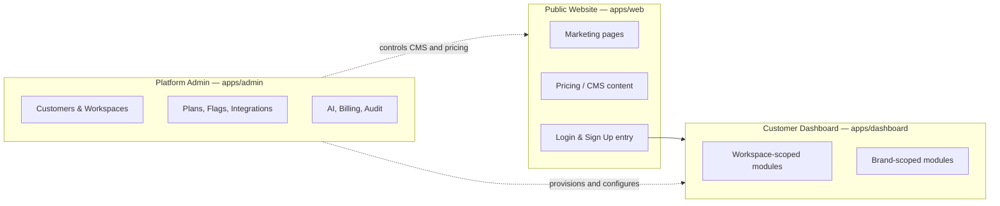
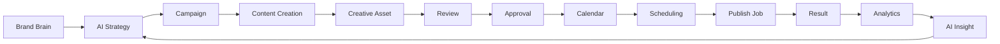

# BrandSpace — Product Definition

> **الملخص التنفيذي بالعربية**
>
> BrandSpace هي منصة SaaS ثنائية اللغة (عربي/إنجليزي) ومتعددة المستأجرين، تعمل كـ **نظام تشغيل للعلامة التجارية ووسائل التواصل الاجتماعي**
> مدعوم بالذكاء الاصطناعي، موجّه لرواد الأعمال والشركات الناشئة والشركات الصغيرة والمتوسطة وفرق التسويق وصنّاع المحتوى والوكالات.
>
> **المنتج ينقسم إلى ثلاث واجهات منفصلة تمامًا:**
> 1. **الموقع العام** — للتعريف بالمنتج والتسعير والتسجيل (١٥ صفحة مخططة).
> 2. **لوحة تحكم العميل** — ١٩ وحدة تشمل مركز القيادة، مركز العلامة التجارية، عقل العلامة (Brand Brain)، الاستراتيجية بالذكاء الاصطناعي،
>    الحملات، التقويم الاجتماعي، استوديو المحتوى، الاستوديو الإبداعي، مركز التواصل الاجتماعي، المساعد الذكي، التحليلات، مكتبة الأصول،
>    الفريق والموافقات، الأتمتة، الإشعارات، سجل النشاط، الإعدادات، والفوترة.
> 3. **مركز تحكم المالك (Platform Admin)** — خاص بمالك المنصة والفريق الداخلي فقط، ومنفصل معماريًا عن لوحة العميل.
>
> **رحلة القيمة الأساسية:** استراتيجية ← حملة ← محتوى ← تصميم ← مراجعة ← موافقة ← تقويم ← جدولة ← نشر ← تحليلات ← رؤية ذكية.
>
> **المبدأ الحاكم:** كل عميل داخل "مساحة عمل" معزولة تمامًا، وكل شيء قابل للتهيئة من لوحة المالك دون تعديل الكود.

---

## 1. Product Statement

BrandSpace is the operating system for a brand's marketing presence. It replaces the fragmented stack of
strategy documents, spreadsheets, design tools, scheduling apps, and analytics dashboards with one
workspace where a brand's identity, knowledge, strategy, content, creative, publishing, and performance
live together — and where AI is a first-class collaborator that understands the brand rather than a generic
text box.

**Positioning statement:** *For teams that need a consistent brand voice across many channels, BrandSpace is
an AI brand and social operating system that turns brand knowledge into strategy, content, and measurable
performance — in Arabic and English — without stitching together five tools.*

### 1.1 What makes it different
1. **Brand Brain** — a per-brand knowledge base (identity, tone, audience, offers, do/don't rules, documents)
   that grounds every AI output. AI is brand-aware by default, not prompt-by-prompt.
2. **True bilingual product** — Arabic RTL is a first-class experience, not a translation afterthought.
   Content generation, calendars, analytics narratives, and templates all work natively in Arabic.
3. **Owner-controlled platform** — plans, prices, limits, features, AI models, and integrations are managed
   from the Control Center. The business can evolve without an engineering release.
4. **Credits, not tokens** — customers see a simple, predictable AI credit unit; provider complexity and cost
   volatility stay internal.
5. **Agency-ready multi-tenancy** — one workspace can hold many brands; an agency can hold many workspaces.

### 1.2 Explicit non-goals (MVP)
- Not a full graphic design editor replacement (creative studio focuses on AI generation + templated edits).
- Not a social listening / sentiment monitoring suite at MVP (Phase 7+ candidate).
- Not an ads-buying platform (paid campaign management is future expansion).
- Not a CRM. CRM integration is planned; CRM ownership is not.

---

## 2. Target Customers and Personas

| Persona | Primary need | Shape of usage |
|---|---|---|
| **Individual founder** | Look professional without a marketing team | 1 workspace, 1 brand, 1 user, heavy AI reliance |
| **Startup** | Consistent output with 2–5 people, fast iteration | 1 workspace, 1–2 brands, light approvals |
| **Company marketing team** | Process, roles, approvals, reporting to leadership | 1 workspace, 1–3 brands, formal approval chains, analysts |
| **Creator** | Volume of content, personal brand voice, scheduling | 1 workspace, 1 brand, mobile-heavy, calendar-centric |
| **Agency** | Many client brands, separation, client-visible reporting | Many workspaces (or many brands), Client Viewer role, white-label interest |
| **Enterprise team** | Security, SSO, audit, data residency, retention control | 1 workspace, many brands, strict RBAC, export and audit needs |

### 2.1 Persona → capability mapping
- Founder / Creator lean on **AI Content Studio**, **Social Calendar**, **Smart Analytics**.
- Marketing teams lean on **AI Strategy**, **Campaigns**, **Team & Approvals**, **Marketing Intelligence**.
- Agencies lean on **multi-workspace switching**, **Client Viewer**, **Asset Library**, **Automations**.
- Enterprises lean on **RBAC depth**, **Audit Log**, **retention/export controls**, **SSO (future)**.

---

## 3. The Three Interfaces

**Separation guarantees**
- Different applications, different deploy targets, different route namespaces.
- Different session cookies and different token audiences. A customer session is never valid in Admin.
- Admin is reachable only on a dedicated hostname, behind platform authentication, with 2FA support planned
  (mandatory for Platform Owner and Platform Admin from Phase 2).
- Admin never renders customer credentials or raw tokens; support access is a scoped, audited, time-boxed mode.

---

## 4. Public Website

Marketing surface: fast, SEO-strong, bilingual, CMS-driven where content changes often.

| Page | Purpose | Content source | Notes |
|---|---|---|---|
| **Home** | Value proposition, proof, primary CTA | CMS | Hero, module highlights, testimonials, CTA |
| **Product Overview** | The whole system in one narrative | CMS | Journey: strategy → publish → insight |
| **Feature Pages** | One page per major capability | CMS (templated) | Brand Brain, AI Strategy, Content Studio, Creative Studio, Calendar, Analytics, Copilot, Automations |
| **Solutions** | By persona and industry | CMS | Founders, Startups, Teams, Creators, Agencies, Enterprise |
| **Integrations** | Supported platforms and providers | Config-driven list | Reads the active social provider registry |
| **Pricing** | Plans, comparison, FAQ | **Config-driven** from Plan registry | Never hard-coded; currency-aware |
| **Templates** | Public template gallery | CMS + template registry | Drives sign-up intent |
| **Resources** | Blog, guides, case studies, changelog | CMS | Bilingual, SEO-optimized |
| **Security** | Security posture and practices | CMS | Mirrors `docs/SECURITY.md` public-safe subset |
| **About** | Company, mission, team | CMS | |
| **Contact / Book a Demo** | Lead capture, demo scheduling | Form → CRM/notification | Spam protection, rate limiting |
| **Status** | Uptime and incident history | Status data source | Public health of publishing/AI/API |
| **Legal** | Terms, Privacy, DPA, Cookies, Acceptable Use, Refunds | CMS (versioned) | Version history retained |
| **Login** | Authentication entry | App | Redirects into dashboard |
| **Sign Up** | Self-serve registration + trial | App | Creates Workspace, starts trial per config |

### 4.1 Cross-cutting website requirements
- **Bilingual routing:** `/{locale}/…` with `ar` and `en`; `hreflang` alternates; locale-aware sitemaps.
- **RTL:** full mirrored layout for Arabic, logical CSS properties, RTL-aware icons and charts.
- **SEO:** SSG/ISR rendering, canonical URLs, Open Graph and Twitter cards, JSON-LD (`Organization`,
  `SoftwareApplication`, `Product`/`Offer` for pricing, `FAQPage`, `BreadcrumbList`, `Article` for resources),
  per-locale sitemap index, `robots.txt`.
- **Performance budget:** LCP < 2.0s, INP < 200ms, CLS < 0.1, JS < 150KB gzip on marketing routes.
- **Accessibility:** WCAG 2.2 AA; brand yellow `#FFDD15` is never used as text on white without a darkened
  token — contrast pairings are defined in the design system.
- **Design language:** clean, premium, generous whitespace, blue `#00ADEE` as primary action color,
  yellow `#FFDD15` as accent/highlight only.

---

## 5. Customer Dashboard Modules

Each module is listed with purpose, key objects, and the permissions that gate it. Scope column shows whether
the module operates at **W** (workspace) or **B** (brand) level.

| # | Module | Scope | Purpose | Key entities |
|---|---|---|---|---|
| 1 | **Command Center** | W | Daily home: what needs approval, what publishes today, alerts, credit balance, performance deltas | aggregates all |
| 2 | **Brand Center** | B | Brand identity: name, logos, palettes, typography, voice, boilerplate, guidelines | `Brand`, `Asset` |
| 3 | **Brand Brain** | B | Structured brand knowledge + documents used to ground AI (audience, offers, tone, do/don't, FAQ, competitors) | `BrandKnowledge` |
| 4 | **AI Strategy** | B | Generate and maintain marketing strategy, pillars, monthly plans, channel mix | `Insight`, `Campaign` |
| 5 | **Campaigns** | B | Campaign objects with goals, dates, budget, channels, content set, status | `Campaign`, `ContentItem` |
| 6 | **Social Calendar** | B | Month/week/day/list views of scheduled and published content; drag to reschedule | `CalendarSlot`, `ContentItem`, `PublishJob` |
| 7 | **AI Content Studio** | B | Generate and edit captions, hooks, threads, articles, variants per platform, bilingual | `ContentItem`, `ContentVariant` |
| 8 | **AI Creative Studio** | B | Generate and adapt images/video/voice assets on-brand; templated resizing per platform | `Asset` |
| 9 | **Social Media Hub** | W/B | Connect accounts, view connection health, per-platform rules, inbox of publish results | `SocialConnection`, `PublishJob` |
| 10 | **AI Copilot** | W/B | Permission-aware assistant that can read Brand Brain, explain data, and propose/execute allowed actions | `AIRequest`, action plans |
| 11 | **Marketing Intelligence** | B | Competitive and market context, content gap analysis, trend suggestions | `Insight` |
| 12 | **Smart Analytics** | B | Performance metrics with AI narrative explanation and recommendations | `MetricSnapshot`, `Insight` |
| 13 | **Asset Library** | W/B | Central media library: folders, tags, versions, rights/expiry, usage tracking | `Asset` |
| 14 | **Team and Approvals** | W | Members, roles, invitations, approval workflows and queues, comments | `Membership`, `Approval`, `Comment` |
| 15 | **Automations** | W/B | Rule builder: trigger → condition → action (e.g. "on approval, schedule to best slot") | `AutomationRule`, `AutomationRun` |
| 16 | **Notifications** | W | In-app notification center + channel preferences | `Notification` |
| 17 | **Activity Log** | W | Human-readable, filterable history of workspace activity | `AuditEvent` |
| 18 | **Settings** | W | Workspace profile, locale/timezone, brands, security, integrations, data controls | `Workspace` |
| 19 | **Billing and Usage** | W | Plan, invoices, payment method, AI credit balance and usage, limits, upgrade | `Subscription`, `Invoice`, `CreditWallet` |

### 5.1 Module detail notes

**Command Center** — the only screen a busy owner needs daily. Widgets: *Needs your approval*, *Publishing
today*, *Failed publishes*, *AI credits remaining + burn rate*, *Top performing post this week*,
*Connection health warnings*, *Trial/plan status*. Every widget respects the viewer's permissions; a
Client Viewer sees a read-only subset.

**Brand Brain** — the differentiator. Structured sections (identity, audience segments, tone of voice,
products/offers, proof points, objections, do/don't rules, glossary, competitors) plus uploaded documents
that are chunked and embedded for retrieval. Every AI generation cites which Brand Brain sections it used,
so output is explainable and correctable. Bilingual: each field can hold `ar` and `en` values.

**AI Content Studio** — generation is always: *task + brand context + platform constraints + language*.
Produces a `ContentItem` with per-platform `ContentVariant`s (character limits, hashtag rules, mention rules,
link handling). Supports rewrite, shorten, expand, change tone, translate ar↔en with brand-preserving glossary.

**Social Media Hub** — customers connect their own accounts via OAuth only. **BrandSpace never asks for a
social account password.** Shows scopes granted, token expiry, health, and per-platform publishing capability.

**AI Copilot** — see `docs/AI-GATEWAY.md` §Copilot. It is permission-aware and action-capable but never
performs an external or destructive action without preview and confirmation.

**Billing and Usage** — plan and price data is read from the active Plan configuration; the customer sees
credits (not tokens), usage by member and by feature, and a projection of when credits will run out.

---

## 6. Core Value Journey

The loop is deliberate: insights feed back into strategy, and strategy is stored in Brand Brain, so the
system gets better at the specific brand over time.

---

## 7. Customer Lifecycle

1. **Discover** — public website, SEO, templates gallery.
2. **Sign up** — self-serve creates `User` + `Workspace` + trial `Subscription` (trial length is configuration).
   Or: **owner-provisioned** — Platform Owner creates the workspace and sends an invitation.
3. **Onboard** — create first `Brand`, complete minimum Brand Brain, optionally connect a social account.
4. **Activate** — generate first content draft, place it on the calendar. (This is the activation metric.)
5. **Habit** — weekly planning, approvals, publishing, reviewing analytics.
6. **Expand** — more brands, more seats, more credits, higher plan.
7. **Renew / churn** — billing lifecycle with grace periods, dunning, suspension, export, deletion.

---

## 8. Multi-Tenant Product Model

| Level | Meaning | Examples of what it owns |
|---|---|---|
| **Platform** | BrandSpace itself | Plans, features, providers, global config, all workspaces |
| **Workspace** | One customer tenant — the isolation boundary | Members, subscription, credit wallet, brands, connections, audit |
| **Brand** | One brand inside a workspace | Brand Brain, campaigns, content, calendar, assets, analytics |
| **User** | A person (global identity) | Can hold memberships in several workspaces |
| **Membership** | User ↔ Workspace link carrying role and brand scoping | Determines effective permissions |

Customer shapes map cleanly:
- Founder / Startup / Creator → one workspace, one or two brands.
- Company team → one workspace, several brands, several roles.
- **Agency** → either many brands inside one workspace (shared team, per-brand scoping) **or** one workspace
  per client (hard isolation, separate billing). Both are supported; the agency chooses. Cross-workspace
  switching is a UI convenience only — it never relaxes isolation.
- Enterprise → one workspace, deep RBAC, audit and retention controls.

---

## 9. Roles (product view)

Detailed permission matrices live in `docs/SECURITY.md`. Product-level intent:

**Customer roles** — Workspace Owner (everything incl. billing), Workspace Admin (everything except
ownership transfer/deletion), Marketing Manager (plan, campaign, approve), Content Creator (create content),
Copywriter (text only), Designer (creative/assets only), Approver (approve/reject only), Analyst
(read analytics/export), Client Viewer (read-only on assigned brands, no financials, no settings).

**Platform roles** — Platform Owner (everything), Platform Admin (everything except destructive platform
config and role grants), Support Agent (support mode, read-only customer context, no secrets, no billing
mutation), Billing Manager (plans, subscriptions, invoices, refunds), Operations Viewer (read-only
dashboards, health, usage).

---

## 10. Product Metrics

| Category | Metric | Why |
|---|---|---|
| Activation | % of new workspaces reaching "first draft on calendar" within 7 days | The core aha moment |
| Engagement | Weekly active brands; posts scheduled per brand per week | Habit strength |
| AI value | AI actions per active user; % of AI drafts published without heavy edit | Output quality |
| Reliability | Publish success rate; median publish latency vs. scheduled time | Trust |
| Economics | Credits consumed vs. plan allocation; provider cost per credit; gross margin per workspace | Unit economics |
| Retention | Logo and net revenue retention; trial → paid conversion | Business health |
| Support | Support-mode sessions per workspace; time to resolution | Operational load |

---

## 11. Product Constraints and Assumptions

- Bilingual from day one; adding a third language must not require schema change (locale-keyed values).
- Timezone correctness is critical for scheduling; every workspace has a timezone and every slot stores UTC
  plus the intended local time.
- Social platform APIs change; connectors must be independently versioned and independently disableable.
- AI providers change pricing and availability; the routing layer must switch models without a code release.
- The product must remain usable when AI is degraded or a provider is down (manual paths always exist).
