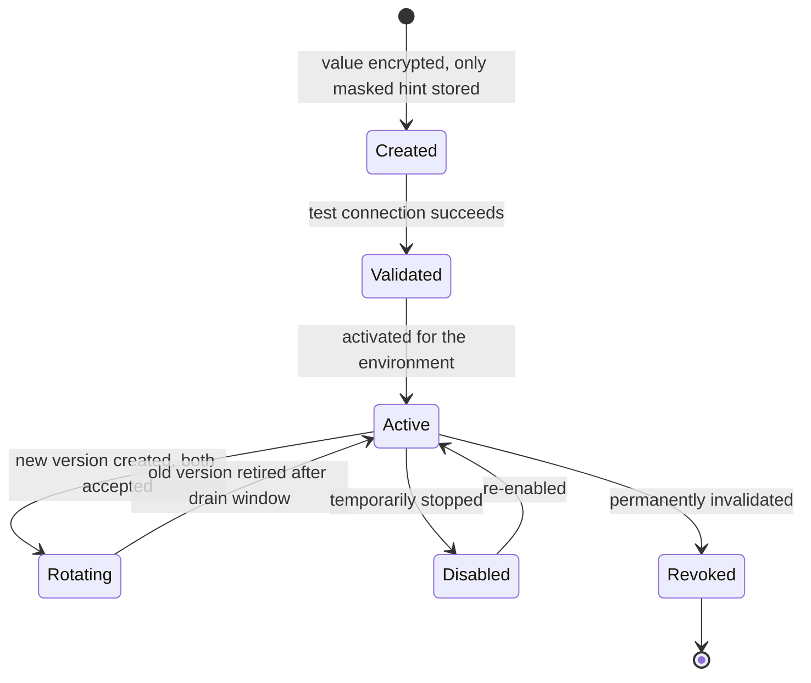

# BrandSpace — Security and Reliability

> **الملخص التنفيذي بالعربية**
>
> هذا المستند يحدد **نموذج الأمان والموثوقية** للمنصة.
>
> **العزل بين العملاء** هو الالتزام الأمني الأول: كل بيانات العميل مقيّدة بـ `workspaceId` على مستوى التطبيق **وعلى مستوى قاعدة البيانات**
> عبر Row-Level Security، ومع اختبارات آلية إلزامية تثبت أن مستخدم مساحة عمل «أ» لا يستطيع قراءة أو تعديل أو البحث في أو تصدير أو حتى
> استنتاج وجود بيانات مساحة عمل «ب».
>
> **صلاحيات الأدوار (RBAC)** محددة على أربعة مستويات: المنصة، مساحة العمل، العلامة التجارية، والحملة — مع مصفوفة صلاحيات تفصيلية لكل دور.
>
> **الأسرار (المفاتيح والرموز)** لا تُخزَّن أبدًا كإعدادات عادية: تُشفَّر بتشفير موثَّق (AEAD)، لا تظهر في السجلات أو الردود، ولا يُعرض منها
> إلا آخر أربعة أحرف، مع دعم التدوير والإلغاء وفصل بيئات التطوير والاختبار والإنتاج، وجاهزية للربط بخدمة KMS سحابية مستقبلًا.
>
> ويغطي المستند أيضًا: التشفير، سجلات التدقيق، حدود المعدل، فحص الملفات، منع إساءة الاستخدام، التحقق من توقيع الـ Webhooks،
> مفاتيح منع التكرار، النسخ الاحتياطي واختبار الاستعادة، المراقبة والتنبيهات، الاستجابة للحوادث، تصدير البيانات، حذف الحساب،
> سياسات الاحتفاظ، والخصوصية، و**وضع الدعم الآمن** الذي يتيح للفريق الداخلي مساعدة العميل دون رؤية كلمات المرور أو الرموز الخام.

---

## 1. Security Principles

1. **Isolation by default.** Data access is denied unless a tenant context proves entitlement.
2. **Defense in depth.** Application scoping and database RLS are independent; either alone must be able to
   stop a breach.
3. **Least privilege.** Every actor — human, service, job, AI tool call — gets the narrowest permission set.
4. **No ambient authority.** There is no "admin bypass" available to request handlers; cross-tenant access is
   an explicit, audited, named operation.
5. **Secrets are not data.** They live in a vault abstraction, never in config rows, logs, or responses.
6. **Everything consequential is audited.** If it changes state or exposes customer data, it produces an
   `AuditEvent`.
7. **Fail closed.** Ambiguity in authorization, entitlement, or validation results in denial, not access.
8. **No silent external effects.** Publish, delete, disconnect, pay, and send require confirmation policy.

---

## 2. Tenant Isolation

### 2.1 Enforcement layers

| Layer              | Mechanism                                                       | Failure mode it stops             |
| ------------------ | --------------------------------------------------------------- | --------------------------------- |
| 1. Edge            | Hostname/route separation of the three apps                     | Admin surface exposed publicly    |
| 2. Session         | Separate realms, cookie names, signing keys, audiences          | Customer token used against Admin |
| 3. Tenant resolver | Membership verified server-side; client claims never trusted    | Header/param tampering            |
| 4. Authorization   | RBAC + resource ownership check before handler                  | Missing permission check          |
| 5. Data access     | Tenant-scoped Prisma client injects the predicate               | Developer forgets a `where`       |
| 6. Database        | RLS policies on `workspace_id`; app role cannot bypass          | Raw SQL, ORM bug, injection       |
| 7. Storage         | Workspace-prefixed keys + signed URLs issued post-authorization | Object enumeration                |
| 8. Queue           | Jobs carry tenant context and are re-authorized on execution    | Forged job payloads               |
| 9. Cache           | Cache keys namespaced by workspace                              | Cross-tenant cache poisoning/read |
| 10. Tests          | Mandatory isolation suite, schema-driven coverage gate          | Regressions and new models        |

### 2.2 RLS pattern

```sql
ALTER TABLE content_item ENABLE ROW LEVEL SECURITY;
ALTER TABLE content_item FORCE ROW LEVEL SECURITY;

CREATE POLICY tenant_isolation ON content_item
  USING      (workspace_id = current_setting('app.workspace_id', true)::uuid)
  WITH CHECK (workspace_id = current_setting('app.workspace_id', true)::uuid);
```

- The application connects as `app_user`, which has **no** `BYPASSRLS` and is not the table owner.
- `SET LOCAL app.workspace_id` is issued at transaction start by the tenant-scoped client; it is `LOCAL`
  so it cannot leak across pooled connections.
- Connection pooling uses transaction-level pooling so the setting is always scoped to one transaction.
- Migrations run as a separate role that is never used to serve requests.
- A CI check fails the build if a tenant-owned table lacks `ENABLE`/`FORCE ROW LEVEL SECURITY` and a policy.

### 2.3 Non-inference guarantees

- Cross-tenant access returns `404` with the same body and timing characteristics as a genuine miss.
- Error messages never echo whether a resource exists elsewhere.
- Slugs, IDs, and invitation tokens are unguessable (UUIDv7 / high-entropy tokens); enumeration is
  rate-limited and alerted.
- Aggregates, counts, autocomplete, and vector similarity all carry the workspace predicate **inside** the
  query, never as a post-filter.
- Cross-tenant timing differences on authorization checks are avoided by performing the ownership check with
  a constant-shape query.

### 2.4 Platform access to tenant data — the two-pool model

`asPlatform(actor, operation)` is the only application path. It requires a platform actor holding a
valid platform role with **verified MFA**, a **written reason**, and a **correlation id**; it records
an `AuditEvent`; and for customer-data reads it must be inside a **Support Mode session** (§8).

**Cross-tenant visibility is a property of which database role connected, not of a session variable.**

|             | `brandspace_app`                         | `brandspace_platform`            | `brandspace_migrator`            |
| ----------- | ---------------------------------------- | -------------------------------- | -------------------------------- |
| Purpose     | serves every tenant request              | audited platform operations only | owns the schema, runs migrations |
| Credential  | `DATABASE_URL`                           | `DATABASE_PLATFORM_URL`          | `DATABASE_MIGRATION_URL`         |
| Present in  | every tenant-facing process              | **platform processes only**      | migration jobs only              |
| RLS policy  | `tenant_isolation` — workspace predicate | `platform_access` — full         | none (DDL is unaffected by RLS)  |
| `BYPASSRLS` | no                                       | **no**                           | no                               |
| Owns tables | no                                       | no                               | yes                              |

**Why this is secure.** The tenant role cannot obtain cross-tenant visibility by any SQL it is able
to execute:

1. No RLS policy names `brandspace_app` for cross-tenant access; `platform_access` is
   `TO brandspace_platform` only, and no policy is granted to `PUBLIC`.
2. `brandspace_app` is not a member of `brandspace_platform`, so `SET ROLE` is refused.
3. The former `app.is_platform_mode()` function is **dropped**, so no session variable can widen
   visibility. Setting the old GUC now has no effect at all.
4. `brandspace_app` cannot `GRANT` itself membership, `ALTER` its own role attributes, or
   `CREATE POLICY` naming itself — it owns nothing and holds no role-administration privilege.
5. Neither role has `BYPASSRLS`. The platform role's access is an ordinary policy, so `WITH CHECK`
   still constrains its writes and the behaviour is visible in `pg_policies` rather than hidden in a
   role attribute.
6. `audit_event` remains append-only for **both** roles: `UPDATE`/`DELETE` are revoked, with a
   trigger as a second stop. Platform operations write the audit trail; nothing may rewrite it.

Each of these is asserted in `tests/isolation/platform-role.test.ts` against a real PostgreSQL, using
raw `pg` connections with no application code in the path.

**Credential confinement.** The platform pool module is not exported from `@brandspace/database`; an
ESLint rule rejects importing it from anywhere except `asPlatform()` itself; a browser guard throws if
it is ever evaluated in a client context; and `DATABASE_PLATFORM_URL` is never a `NEXT_PUBLIC_`
variable. `tests/unit/platform-pool-boundary.test.ts` asserts all of these.

**Role membership is not managed by migrations.** Revoking a role membership requires ADMIN option on
that role, and granting the migrator that power would make it a privilege-escalation path in its own
right. `scripts/sql/setup-database-roles.sql` is the canonical definition, run by a DBA; the migration
asserts the separation and refuses to deploy without it.

**Residual risk.** Anyone holding `DATABASE_PLATFORM_URL` has cross-tenant access — that credential is
the boundary. What changed is that compromising the _tenant application role_ no longer grants
cross-tenant access, which it previously did. Further reduction (short-lived credentials from a secret
manager, and splitting read-only from write platform access) is recorded as F-07 in
`docs/DECISIONS.md` and belongs with the Secret Service in Phase 2.

### 2.9 Phase 3 tenant-owned models

Six models were added, every one carrying a non-null `workspaceId` and every one protected by the
same construction Phase 1 established: `ENABLE` + `FORCE` row-level security, a policy scoped to
`brandspace_app` keyed on `app.current_workspace_id()`, a platform policy for the audited
cross-tenant role, and EXPLICIT grants — the Phase 1 blanket `ALL TABLES` grant only ever covered
the tables that existed when it ran.

| Model                   | Why it is sensitive                                                                                                        |
| ----------------------- | -------------------------------------------------------------------------------------------------------------------------- |
| `WorkspaceSubscription` | The agreed price and the trial history. A tenant that could clear another's `trialStartedAt` would grant it a second trial |
| `CreditGrant`           | Money. A tenant that could write another's bucket could spend it                                                           |
| `CreditReservation`     | Money in flight, plus what it is for                                                                                       |
| `UsageCounter`          | Consumption against a limit                                                                                                |
| `UsageEvent`            | The idempotency record. Deleting one is how a quota would be reset                                                         |
| `BetaCohortMembership`  | A cohort listing that leaked would tell one customer which OTHER customers are in a private beta                           |

Two are append-only in the same sense as `audit_event` and `credit_transaction`, enforced twice:

- **`usage_event`** — `REVOKE UPDATE, DELETE` from both roles, plus a trigger. If a tenant could
  delete its own idempotency record the "record usage exactly once" guarantee would be advisory,
  and deleting the record is also how a quota would be reset.
- **`credit_grant`** — a trigger refuses any change to the original amount, the source, the
  workspace, the grant time or the creating transaction. Only the remaining and reserved balances
  move. Rewriting the rest would break ledger replay SILENTLY: reconciliation would still report
  zero drift while the numbers underneath had changed.

`credit_reservation` carries a third: a terminal reservation cannot return to `OPEN`, which is how
the same estimate would be charged twice.

**Customer-facing error codes.** `ENTITLEMENT_REQUIRED`, `QUOTA_EXCEEDED` and
`INSUFFICIENT_CREDITS` now reach the client. Only the CODE travels — never the message, which
still describes internal state — and each names the kind of wall that was hit rather than the
plan, the limit or the price behind it. Hiding them behind `INTERNAL` made a wall the customer
could clear look like a platform fault.

---

## 3. Authentication

| Control            | Requirement                                                                                                                                                               |
| ------------------ | ------------------------------------------------------------------------------------------------------------------------------------------------------------------------- |
| Password storage   | Argon2id, per-user salt, tuned memory/time cost                                                                                                                           |
| Password policy    | Length-first (min 12), breached-password check, no forced rotation                                                                                                        |
| Rate limiting      | Per-IP and per-account exponential backoff; lockout with unlock flow                                                                                                      |
| Email verification | Required before first login completes; signed single-use token                                                                                                            |
| MFA                | TOTP + recovery codes. Optional for customers; **mandatory for Platform Owner and Platform Admin**                                                                        |
| Step-up auth       | Required for: secret create/rotate/revoke, plan price changes, entering support mode, refunds, credit adjustments above a threshold, account deletion, ownership transfer |
| Sessions           | Short-lived access token, rotating refresh, absolute max lifetime, device list, revoke-all                                                                                |
| Invalidation       | On password change, role change, membership removal, workspace suspension, MFA reset                                                                                      |
| Invitations        | Signed, single-use, expiring, bound to workspace+role; token stored hashed                                                                                                |
| Realm separation   | Distinct cookie names, signing keys, audiences, and session tables for customer vs. platform                                                                              |
| Admin surface      | Dedicated hostname; optional IP allowlist; no public registration path                                                                                                    |
| Future             | SSO (SAML/OIDC) and SCIM for Enterprise — identity model already supports it                                                                                              |

**Cookies:** `HttpOnly`, `Secure`, `SameSite=Lax` (strict for admin), `__Host-` prefix, short TTL.
**CSRF:** double-submit token plus SameSite; all mutations require the token.

---

## 4. Authorization (RBAC)

### 4.1 Model

`Permission` = `resource.action` (e.g. `content.create`, `content.publish`, `billing.manage`).
`Role` = a named set of permissions, optionally with constraints (`ownOnly`, `assignedBrandsOnly`).
`Membership` = user + workspace + role + optional brand scope.

**Effective permission** = role permissions ∩ scope (platform / workspace / brand / campaign)
∩ entitlements (plan allows the feature) ∩ resource ownership.

All four must pass. A permission the plan does not include is denied even for a Workspace Owner
(with an upgrade-prompt error code, distinct from a permission denial).

### 4.2 Scope levels

| Scope     | Example permission         | Resolution                                        |
| --------- | -------------------------- | ------------------------------------------------- |
| Platform  | `platform.plans.manage`    | platform role only                                |
| Workspace | `workspace.members.invite` | membership role in that workspace                 |
| Brand     | `brand.content.create`     | membership role **and** brand in `brandScope`     |
| Campaign  | `campaign.approve`         | brand scope **and** campaign assignment/ownership |

### 4.3 Customer role matrix

Legend: ✅ full · 🟡 limited/conditional · ➖ none

| Capability                            | Owner | Admin              | Mktg Mgr           | Content Creator | Copywriter     | Designer         | Approver        | Analyst         | Viewer (read-only)          |
| ------------------------------------- | ----- | ------------------ | ------------------ | --------------- | -------------- | ---------------- | --------------- | --------------- | --------------------------- |
| View workspace                        | ✅    | ✅                 | ✅                 | ✅              | ✅             | ✅               | ✅              | ✅              | 🟡 assigned brands          |
| Manage workspace settings             | ✅    | ✅                 | ➖                 | ➖              | ➖             | ➖               | ➖              | ➖              | ➖                          |
| Transfer ownership / delete workspace | ✅    | ➖                 | ➖                 | ➖              | ➖             | ➖               | ➖              | ➖              | ➖                          |
| Invite / remove members               | ✅    | ✅                 | 🟡 non-admin roles | ➖              | ➖             | ➖               | ➖              | ➖              | ➖                          |
| Assign roles                          | ✅    | 🟡 below own level | ➖                 | ➖              | ➖             | ➖               | ➖              | ➖              | ➖                          |
| Create / archive brands               | ✅    | ✅                 | 🟡 create only     | ➖              | ➖             | ➖               | ➖              | ➖              | ➖                          |
| Edit Brand Center / Brand Brain       | ✅    | ✅                 | ✅                 | 🟡 suggest      | 🟡 suggest     | 🟡 visual only   | ➖              | ➖              | ➖                          |
| Generate AI strategy                  | ✅    | ✅                 | ✅                 | ➖              | ➖             | ➖               | ➖              | ➖              | ➖                          |
| Create / edit campaigns               | ✅    | ✅                 | ✅                 | 🟡 own          | ➖             | ➖               | ➖              | ➖              | ➖                          |
| Create content drafts                 | ✅    | ✅                 | ✅                 | ✅              | ✅ text only   | 🟡 visual only   | ➖              | ➖              | ➖                          |
| Generate AI content                   | ✅    | ✅                 | ✅                 | ✅              | ✅             | 🟡 creative only | ➖              | ➖              | ➖                          |
| Generate AI creative                  | ✅    | ✅                 | ✅                 | ✅              | ➖             | ✅               | ➖              | ➖              | ➖                          |
| Upload / manage assets                | ✅    | ✅                 | ✅                 | ✅              | 🟡 own         | ✅               | ➖              | ➖              | ➖                          |
| Submit for approval                   | ✅    | ✅                 | ✅                 | ✅              | ✅             | ✅               | ➖              | ➖              | ➖                          |
| Approve / reject                      | ✅    | ✅                 | ✅                 | ➖              | ➖             | ➖               | ✅              | ➖              | 🟡 optional client approval |
| Comment                               | ✅    | ✅                 | ✅                 | ✅              | ✅             | ✅               | ✅              | ✅              | ✅                          |
| Schedule to calendar                  | ✅    | ✅                 | ✅                 | 🟡 own approved | ➖             | ➖               | ➖              | ➖              | ➖                          |
| Publish now / external publish        | ✅    | ✅                 | ✅                 | ➖              | ➖             | ➖               | ➖              | ➖              | ➖                          |
| Connect / disconnect social accounts  | ✅    | ✅                 | 🟡 connect only    | ➖              | ➖             | ➖               | ➖              | ➖              | ➖                          |
| View analytics                        | ✅    | ✅                 | ✅                 | ✅              | 🟡 own content | 🟡 own content   | ✅              | ✅              | 🟡 assigned brands          |
| Export analytics / data               | ✅    | ✅                 | ✅                 | ➖              | ➖             | ➖               | ➖              | ✅              | 🟡 if enabled               |
| Use AI Copilot                        | ✅    | ✅                 | ✅                 | ✅              | ✅             | ✅               | 🟡 read/explain | 🟡 read/explain | ➖                          |
| Create automations                    | ✅    | ✅                 | ✅                 | ➖              | ➖             | ➖               | ➖              | ➖              | ➖                          |
| View billing & invoices               | ✅    | 🟡 view only       | ➖                 | ➖              | ➖             | ➖               | ➖              | ➖              | ➖                          |
| Change plan / payment method          | ✅    | ➖                 | ➖                 | ➖              | ➖             | ➖               | ➖              | ➖              | ➖                          |
| View AI credit balance                | ✅    | ✅                 | ✅                 | 🟡 own usage    | 🟡 own usage   | 🟡 own usage     | ➖              | 🟡 aggregate    | ➖                          |
| View activity log                     | ✅    | ✅                 | 🟡 brand-scoped    | 🟡 own          | 🟡 own         | 🟡 own           | 🟡 own          | 🟡 brand-scoped | ➖                          |

> **Naming note.** The rightmost role is stored as the RBAC key `client_viewer` and is displayed as
> **Viewer (read-only)** (D-58). The key and its single `workspace.read` grant are unchanged; only the
> visible label changed, and a unit test fails if a future edit renames the key or widens the role
> while relabelling it.

### 4.4 Platform role matrix

| Capability                             | Platform Owner | Platform Admin                 | Support Agent                       | Billing Manager    | Operations Viewer |
| -------------------------------------- | -------------- | ------------------------------ | ----------------------------------- | ------------------ | ----------------- |
| View platform dashboards               | ✅             | ✅                             | 🟡 support-relevant                 | 🟡 financial       | ✅ read-only      |
| Create customers / workspaces          | ✅             | ✅                             | ➖                                  | ➖                 | ➖                |
| Send invitations                       | ✅             | ✅                             | 🟡 resend only                      | ➖                 | ➖                |
| Assign / change plans                  | ✅             | ✅                             | ➖                                  | ✅                 | ➖                |
| Start / extend trials                  | ✅             | ✅                             | 🟡 extend within cap                | ✅                 | ➖                |
| Suspend / reactivate accounts          | ✅             | ✅                             | ➖                                  | 🟡 for non-payment | ➖                |
| Add / remove AI credits                | ✅             | ✅                             | 🟡 goodwill within cap              | ✅                 | ➖                |
| Change workspace limits                | ✅             | ✅                             | ➖                                  | 🟡 quota add-ons   | ➖                |
| Toggle customer-specific features      | ✅             | ✅                             | ➖                                  | ➖                 | ➖                |
| Create / edit plans and prices         | ✅             | 🟡 draft only, owner activates | ➖                                  | 🟡 draft only      | ➖                |
| Manage feature flags                   | ✅             | ✅                             | ➖                                  | ➖                 | ➖                |
| Configure integrations                 | ✅             | ✅                             | ➖                                  | 🟡 payment only    | ➖                |
| Create / rotate / revoke secrets       | ✅             | 🟡 rotate, not reveal          | ➖                                  | 🟡 payment only    | ➖                |
| View masked credential metadata        | ✅             | ✅                             | ➖                                  | 🟡 payment only    | 🟡 health only    |
| Manage AI providers / models / routing | ✅             | ✅                             | ➖                                  | ➖                 | ➖                |
| Enter support mode                     | ✅             | ✅                             | ✅                                  | ➖                 | ➖                |
| Issue refunds / credit notes           | ✅             | 🟡 within cap                  | ➖                                  | ✅                 | ➖                |
| Edit notification templates            | ✅             | ✅                             | ➖                                  | ➖                 | ➖                |
| View audit log                         | ✅             | ✅                             | 🟡 own actions + assigned workspace | 🟡 billing events  | ✅ read-only      |
| Manage platform users and roles        | ✅             | ➖                             | ➖                                  | ➖                 | ➖                |
| Activate configuration versions        | ✅             | 🟡 non-financial domains       | ➖                                  | ➖                 | ➖                |
| Export platform data                   | ✅             | 🟡                             | ➖                                  | 🟡 financial       | ➖                |

**Separation of duties:** the actor who drafts a pricing or credit-cost change should not be the actor who
activates it. For financial configuration domains this is enforced (Platform Admin drafts, Platform Owner
activates); a documented break-glass single-actor path exists and is alerted.

### 4.5 Authorization middleware

Every route declares its contract at registration:

```ts
route({
  scope: 'workspace', // 'public' | 'platform' | 'workspace'
  permission: 'content.publish',
  resource: { type: 'contentItem', from: 'params.id' },
  entitlement: 'social.publish',
  confirmation: 'required', // high-impact action
  rateLimit: 'publish',
  idempotent: true,
});
```

The framework refuses to register a route that omits `scope`. Handlers cannot reach the database without a
resolved context. A generated **route/permission report** is committed and reviewed, so any route lacking a
permission is visible in the diff.

---

## 5. Secret Management

### 5.1 Rules

1. Secrets are **never** stored in configuration payloads, environment files checked into git, or database
   columns as plaintext.
2. Configuration references secrets by `secretRef` only (e.g. `ai/openai/production/api-key`).
3. Values are encrypted with **authenticated encryption** (AES-256-GCM or XChaCha20-Poly1305) using a
   data-encryption key wrapped by a key-encryption key (envelope encryption). The KEK is held outside the
   application database and is KMS-ready.
4. Encryption context binds ciphertext to `(ref, environment, version)` so a ciphertext cannot be replayed
   into another scope.
5. **No secret is ever returned by any API.** Reads return only: `maskedHint` (last 4), `fingerprint`,
   `status`, `version`, `createdAt`, `lastRotatedAt`, `lastUsedAt`, `expiresAt`.
6. Secrets are resolved only inside server-side adapters, held in memory for the shortest possible time, and
   never passed to any serializer that could reach a log, trace, response, or error.
7. Frontend bundles are scanned in CI for secret-looking strings; `NEXT_PUBLIC_*` variables are schema-checked
   against an allowlist.
8. Log sinks and error serializers run a **redaction layer** keyed on field names and value patterns
   (`sk-`, `Bearer `, JWT shape, high-entropy strings).
9. Development, staging, and production have **completely separate** secrets and vault namespaces.
10. Access requires a platform permission plus step-up authentication.

### 5.2 Lifecycle



**Rotation** is zero-downtime: version _n+1_ is created and validated while version _n_ remains valid;
traffic shifts; version _n_ is retired after a drain window. `lastUsedAt` proves nothing still uses the old
version before retirement.

**Audit** — every create, validate, activate, rotate, disable, revoke, and _resolve-for-use_ writes an
`AuditEvent` containing the ref, actor, environment, and outcome, and **never** the value.

**Compromise response:** revoke → rotate → invalidate dependent sessions/connections → audit the access
history of that ref → notify affected workspaces if customer tokens were involved.

### 5.3 Customer-held secrets

Customer OAuth access/refresh tokens and optional BYOK API keys use the **same** vault mechanism, scoped by
workspace. They are never shown to platform staff, including in support mode, and never returned to the
customer either — only masked metadata and connection status.

---

## 6. Encryption

| Layer                    | Control                                                                                      |
| ------------------------ | -------------------------------------------------------------------------------------------- |
| In transit (public)      | TLS 1.3, HSTS with preload, no mixed content, modern cipher suites                           |
| In transit (internal)    | TLS between services; database connections require TLS with certificate verification         |
| At rest (database)       | Managed volume encryption + application-level AEAD for secret and token columns              |
| At rest (object storage) | Server-side encryption; no public objects; signed URLs with short TTL                        |
| At rest (backups)        | Encrypted; keys separate from the primary data keys                                          |
| Field-level              | Tokens, MFA secrets, BYOK keys, and any PII marked sensitive use application-level AEAD      |
| Key management           | Envelope encryption, documented key hierarchy, scheduled KEK rotation, KMS-ready abstraction |

**Browser security headers:** strict `Content-Security-Policy` (no inline scripts without nonce),
`X-Content-Type-Options: nosniff`, `Referrer-Policy: strict-origin-when-cross-origin`,
`Permissions-Policy` minimized, `X-Frame-Options: DENY` on dashboard and admin.

---

## 7. Audit Logging

- Every state change and every customer-data access by a platform actor writes an immutable `AuditEvent`.
- Events capture: actor (type/id), action, resource, workspace, before/after (redacted), IP, user agent,
  request/trace id, outcome, and support-mode session when applicable.
- **Denied** attempts are audited too — repeated denials are a detection signal.
- The application role has `SELECT`/`INSERT` only on `audit_event`; `UPDATE`/`DELETE` are revoked.
- Customers see a filtered, human-readable Activity Log (their workspace only).
- Platform staff see the full log; access to it is itself audited.
- Exportable for compliance; retention default 24 months, configurable.

**Always-audited actions:** login/logout/failed login, MFA changes, role/membership changes, brand and content
deletion, publish/unpublish, social connect/disconnect, secret lifecycle, plan/price/entitlement changes,
credit adjustments, refunds, support mode enter/exit, configuration activation and rollback, data export,
account deletion, and every Copilot action execution.

---

## 8. Secure Support Access (Support Mode)

Platform staff sometimes must see a customer's workspace to help. That capability is a **named, bounded,
audited mode** — not a hidden superpower.

| Property      | Rule                                                                                                                          |
| ------------- | ----------------------------------------------------------------------------------------------------------------------------- |
| Entry         | Requires permission + step-up auth + a **reason** and optional ticket reference                                               |
| Duration      | Time-boxed (default 60 minutes, configurable), auto-expires                                                                   |
| Access        | **Read-only by default.** Write actions require a separate elevated grant and are individually audited                        |
| Never visible | Passwords, password hashes, MFA secrets, OAuth access/refresh tokens, BYOK keys, payment card data                            |
| Redaction     | Content bodies and Brand Brain can be masked by policy (owner-configurable; default: visible, since support usually needs it) |
| Visibility    | The workspace's Activity Log shows that support accessed the workspace, with reason and duration                              |
| Notification  | Optional workspace-owner notification on entry (configurable; default on for write-enabled sessions)                          |
| Impersonation | **True impersonation (acting as the user) is prohibited at MVP.** Support views data as a platform actor, clearly labeled     |
| Audit         | Every request inside the session carries `supportModeSessionId`                                                               |

---

## 9. Input Validation and Application Attacks

| Threat                                | Control                                                                                                                                                                                   |
| ------------------------------------- | ----------------------------------------------------------------------------------------------------------------------------------------------------------------------------------------- |
| Injection (SQL)                       | Parameterized ORM queries; raw SQL requires review + explicit tenant predicate; RLS as backstop                                                                                           |
| XSS                                   | React escaping; no `dangerouslySetInnerHTML` without sanitization; strict CSP with nonces; user content sanitized on render                                                               |
| CSRF                                  | SameSite cookies + double-submit token on all mutations                                                                                                                                   |
| SSRF                                  | Outbound requests only to allowlisted hosts from configuration; URL fetching (link previews, imports) goes through a validating proxy that blocks private IP ranges and redirects to them |
| IDOR                                  | Ownership check before every resource access; 404 on cross-tenant                                                                                                                         |
| Mass assignment                       | Explicit Zod schemas; no direct object spreading into the ORM                                                                                                                             |
| Open redirect                         | Redirect targets validated against an allowlist                                                                                                                                           |
| Prototype pollution / deserialization | Schema parsing only; no `eval`, no dynamic `require` of user input                                                                                                                        |
| Dependency risk                       | Lockfiles, automated dependency scanning, SCA in CI, pinned base images, SBOM                                                                                                             |
| Secret leakage in code                | Pre-commit and CI secret scanning; blocked merge on detection                                                                                                                             |
| Clickjacking                          | `X-Frame-Options: DENY` / CSP `frame-ancestors 'none'` on authenticated apps                                                                                                              |

### 9.1 AI-specific threats

| Threat                                                                  | Control                                                                                                                                                                                                                                                                                                                                                                                                                                                                                                                                                                                                                                                                                                                                                                             |
| ----------------------------------------------------------------------- | ----------------------------------------------------------------------------------------------------------------------------------------------------------------------------------------------------------------------------------------------------------------------------------------------------------------------------------------------------------------------------------------------------------------------------------------------------------------------------------------------------------------------------------------------------------------------------------------------------------------------------------------------------------------------------------------------------------------------------------------------------------------------------------- |
| Prompt injection via Brand Brain, uploaded documents, or social content | **Built in Phase 5A.** Retrieved content travels on the gateway's `untrustedContext` channel, never spliced into the prompt; it is fenced with the containment rule stated INSIDE the fence, because a bare delimiter does not survive content containing the delimiter; and imperatives aimed at the model are neutralised in place rather than dropped, so a customer paragraph is never silently lost. Containment applies to KNOWLEDGE ITEMS as well as to document chunks (D-83): a candidate accepted from a poisoned document becomes knowledge, which retrieval trusts more than a raw chunk. Arabic patterns are matched WITHOUT `\b`, which is ASCII-derived in JavaScript and silently matched nothing. Tool-calling is allow-listed per user permission, not per prompt |
| Copilot privilege escalation                                            | Every tool call re-checks the user's permissions and entitlements server-side; the model's claims about permissions are ignored                                                                                                                                                                                                                                                                                                                                                                                                                                                                                                                                                                                                                                                     |
| Data exfiltration through generation                                    | Retrieval runs on the tenant-scoped client inside a workspace transaction, so RLS constrains it whatever the query says; the brand filter narrows WITHIN the tenant and is not what keeps tenants apart. Citations are built from what was retrieved, never parsed from model output, so a fabricated source is impossible by construction. Outbound tool calls are allowlisted                                                                                                                                                                                                                                                                                                                                                                                                     |
| Unsafe or brand-damaging output                                         | Moderation task before persistence/publishing; brand do/don't rules enforced as post-checks                                                                                                                                                                                                                                                                                                                                                                                                                                                                                                                                                                                                                                                                                         |
| Cost abuse                                                              | Per-workspace and per-user budgets, rate limits, max cost per request, hard limits                                                                                                                                                                                                                                                                                                                                                                                                                                                                                                                                                                                                                                                                                                  |
| Model output treated as trusted code/data                               | AI output is parsed with a schema and never executed; generated URLs are not auto-fetched                                                                                                                                                                                                                                                                                                                                                                                                                                                                                                                                                                                                                                                                                           |
| Generated content accumulating as an unmanaged store                    | `persistOutput` is off by default and cannot be enabled without a retention window; expired payloads are purged (D-78, §9.2)                                                                                                                                                                                                                                                                                                                                                                                                                                                                                                                                                                                                                                                        |
| Provider credentials leaking through AI records                         | Credentials are resolved into memory per call, never written to a request, output, log or audit row; the redaction layer covers every log sink and error serializer                                                                                                                                                                                                                                                                                                                                                                                                                                                                                                                                                                                                                 |

### 9.2 AI output persistence and retention — D-78 (approved 2026-09-13)

The AI Gateway records what a request **cost**, not what it **said**. That distinction is the security
property, and it is enforced rather than documented:

| Rule                                                                           | How it holds                                                                                                                                                                                                                                   |
| ------------------------------------------------------------------------------ | ---------------------------------------------------------------------------------------------------------------------------------------------------------------------------------------------------------------------------------------------- |
| Raw provider prompts and raw provider responses are never persisted by default | `AIRequest.inputSummary` holds metadata _about_ the prompt — character counts, part counts — never the prompt. A failure message is the customer-facing string for its error class, never the provider's own error, which can echo the request |
| A user-facing result is persisted only when the calling feature requires it    | Per routing rule, `persistOutput`, default `false`                                                                                                                                                                                             |
| Anything persisted is tenant-isolated                                          | `ai_request` is a tenant-owned model under RLS, covered by the D-29 isolation gate and its own isolation suite                                                                                                                                 |
| Anything persisted has a defined retention and deletion policy                 | Configuration validation refuses `persistOutput` without `outputRetentionDays`; `purgeExpiredOutputs()` clears expired payloads. Where two rules select one task, the **shortest** window wins                                                 |
| Operational metadata is always retained                                        | The purge clears only the payload column. Usage, provider cost, credits, idempotency key, status and the append-only ledger entry all survive — they are the audit and financial record                                                        |
| Secrets never appear in prompts, outputs, logs or audit metadata               | §5 secret rules apply unchanged; the AI path adds no new sink                                                                                                                                                                                  |
| The gateway is not a content store                                             | The requesting feature owns the artifact. The retention window is what stops a replay convenience becoming indefinite storage                                                                                                                  |

**Operator-facing consequence.** The Platform Admin AI screens show accounting and never customer content —
not even for a rule that persisted output. Reading a customer's generated content is a Support Mode
decision with its own time box and audit trail (D-76), not a side effect of opening an operations page.

---

## 10. Rate Limiting and Abuse Prevention

| Dimension          | Example limits (all configuration, not constants)                              |
| ------------------ | ------------------------------------------------------------------------------ |
| Per IP             | Auth endpoints, sign-up, contact form, password reset                          |
| Per user           | AI requests/minute, exports/hour, invitations/day                              |
| Per workspace      | AI requests/minute, publish jobs/hour, API calls/minute, storage upload volume |
| Per endpoint class | Read vs. write vs. AI vs. external-effect                                      |
| Per provider       | Respect upstream quotas; internal concurrency caps                             |

Responses use `429` with `Retry-After` and standard rate-limit headers. Algorithm: sliding-window or token
bucket in Redis. Limits are per-plan configurable.

**Abuse controls:** bot protection on sign-up and contact forms, disposable-email policy (configurable),
velocity checks on invitations and trials, duplicate-account heuristics, automatic throttling on anomalous
AI burn, and an owner-visible abuse queue.

---

## 11. File Upload Security

1. Pre-signed upload with a server-issued key, enforced content type, and size cap.
2. Content-type sniffing on the server — the client's declared type is not trusted.
3. Malware/virus scanning before the asset becomes `ready`; infected files are quarantined and audited.
4. Image/video re-encoding strips metadata (including GPS) and neutralizes polyglot files.
5. SVG uploads are sanitized or converted; never served inline from the app origin.
6. Assets are served from a separate domain/CDN with `Content-Disposition` where appropriate — never from the
   application origin — so a malicious file cannot execute in the app's security context.
7. Storage keys are workspace-prefixed; direct object access requires a signed, short-TTL URL.
8. Per-plan storage quotas enforced at upload authorization time.

---

## 12. Webhooks

### 12.1 Inbound (from social, payment, email providers)

- **Signature verification is mandatory** (HMAC or provider scheme), with timestamp tolerance to prevent replay.
- Raw body is preserved for signature computation before parsing.
- The provider event ID is stored with a unique constraint → processing is **idempotent**.
- Events are acknowledged fast and processed asynchronously via the `billing-events` / `analytics-ingest` queues.
- Unverified or malformed events are rejected and counted; a spike alerts.
- Out-of-order events are handled by comparing event timestamps/versions against current state.

### 12.2 Outbound (to customer systems, future)

- Signed with a per-endpoint secret, timestamped, retried with exponential backoff, with a delivery log and
  a customer-visible replay tool. Target URLs validated against SSRF rules.

---

## 13. Idempotency

| Surface                             | Key                                                                     |
| ----------------------------------- | ----------------------------------------------------------------------- |
| HTTP mutations with external effect | `Idempotency-Key` header, stored with request hash + response snapshot  |
| AI requests                         | `AIRequest.idempotencyKey` (task + input hash + workspace + client key) |
| Publish jobs                        | `PublishJob.idempotencyKey` (variant + connection + slot)               |
| Credit movements                    | `CreditTransaction.idempotencyKey`                                      |
| Inbound webhooks                    | provider event ID                                                       |
| Automation runs                     | rule + trigger event id                                                 |

Replaying a key returns the original result; a key reused with a _different_ payload returns `409`.
Keys expire after 24 hours (configurable).

---

## 14. Reliability

### 14.1 Health and readiness

- `/health/live` (process up) and `/health/ready` (database, Redis, storage, migrations current) on each app.
- **Dependency health** for AI providers and social platforms is tracked continuously and surfaced in
  Platform Admin and on the public Status page.
- Circuit breakers per external provider; when open, the system degrades gracefully (queue, retry later,
  route to fallback model) rather than failing the user's whole action.

### 14.2 Backups and restore

| Control         | Requirement                                                                                                                           |
| --------------- | ------------------------------------------------------------------------------------------------------------------------------------- |
| Database        | Continuous WAL archiving, PITR ≥ 30 days, daily snapshots, 12 monthly retained                                                        |
| Object storage  | Versioning enabled + cross-region replication for production                                                                          |
| Secrets/vault   | Backed up separately with independent key custody                                                                                     |
| Restore testing | **Quarterly restore drill into an isolated environment, timed and documented.** A backup that has never been restored is not a backup |
| Targets         | RPO ≤ 15 minutes, RTO ≤ 4 hours for the core platform                                                                                 |
| Deletion safety | Soft delete + grace window before irreversible purge                                                                                  |

### 14.3 Observability and alerting

Golden signals per endpoint and queue, plus domain alerts:

| Alert                                         | Threshold (configurable)               | Severity           |
| --------------------------------------------- | -------------------------------------- | ------------------ |
| Publish failure rate                          | > 5% over 15 min                       | critical           |
| AI provider error rate                        | > 10% over 10 min                      | critical           |
| Queue age (any queue)                         | oldest job > 10 min                    | warning → critical |
| Webhook processing lag                        | > 5 min                                | warning            |
| Daily AI provider cost                        | > configured daily cap                 | critical           |
| Credit ledger drift                           | any mismatch in nightly reconciliation | critical           |
| RLS policy violation / unscoped query attempt | any occurrence                         | critical           |
| Failed logins spike / enumeration pattern     | anomaly                                | warning            |
| Certificate/token expiry                      | < 14 days                              | warning            |
| Backup failure or missed snapshot             | any                                    | critical           |

### 14.4 Incident response

1. **Detect** — alert fires or a report arrives.
2. **Triage** — severity S1–S4; S1 = data exposure, publishing outage, billing incorrectness, or auth bypass.
3. **Contain** — feature flag off, disable a provider or connector, revoke a secret, suspend a job class.
4. **Communicate** — Status page update within 30 minutes for S1/S2; in-app banner where relevant.
5. **Resolve** — fix, verify, restore normal operation.
6. **Review** — blameless postmortem within 5 business days, with action items tracked.
7. **Notify** — if personal data was exposed, notify affected customers and, where applicable, regulators
   within the legally required window.

Every feature has a kill switch (feature flag) so containment does not require a deploy.

---

## 15. Privacy and Data Rights

| Right                   | Implementation                                                                                                                                                                       |
| ----------------------- | ------------------------------------------------------------------------------------------------------------------------------------------------------------------------------------ |
| Access / portability    | Self-serve workspace export (JSON + media manifest), generated async, delivered via short-lived signed URL                                                                           |
| Rectification           | Editable in-product                                                                                                                                                                  |
| Erasure                 | Account deletion request → 30-day grace (recoverable) → irreversible purge across DB, storage, backups-on-expiry, and search indexes; financial records retained as legally required |
| Restriction / objection | Workspace suspension without deletion                                                                                                                                                |
| Consent                 | Explicit consent for marketing communications; granular notification preferences                                                                                                     |
| Sub-processors          | Public list on the Security page, kept current with the active provider configuration                                                                                                |
| Data residency          | Single region at MVP; region selection is a documented future capability (see DECISIONS D-03, R-28)                                                                                  |
| PII minimization        | AI request bodies not persisted by default; only audit-safe summaries                                                                                                                |
| Cookies                 | Consent management on the public site; no non-essential tracking without consent                                                                                                     |
| DPA / SCCs              | Available for business customers; template maintained under Legal                                                                                                                    |

**Retention defaults** are listed in `docs/DATABASE.md` §13 and are configurable per plan.

---

## 16. Compliance Posture (direction, not a claim)

At MVP BrandSpace does not claim any certification. The architecture is deliberately built so that
**SOC 2 Type II** and **GDPR** readiness are achievable without redesign: immutable audit trail, least-privilege
access, encryption everywhere, documented change management (configuration versioning), tested backups,
incident response process, and vendor/sub-processor management. A formal readiness assessment is a
post-launch activity.

---

## 17. Security Testing

| Activity                                                 | Cadence                                  |
| -------------------------------------------------------- | ---------------------------------------- |
| Isolation test suite                                     | Every CI run — blocking                  |
| SAST + dependency scanning + secret scanning             | Every CI run — blocking on high severity |
| Container/base-image scanning                            | Every build                              |
| DAST against staging                                     | Weekly                                   |
| Authorization matrix tests (every role × every endpoint) | Every CI run                             |
| Third-party penetration test                             | Before public launch, then annually      |
| Restore drill                                            | Quarterly                                |
| Access review (platform users, secrets, provider apps)   | Quarterly                                |
| Threat model review                                      | Each major architectural change          |

---

## 18. Implementation Status — Phase 2A

> **ملخّص بالعربية**
>
> هذا القسم يفصل بين ما هو مُنفَّذ ومُختبَر فعليًا، وما هو تصميم لم يُبنَ بعد. كل ادّعاء أدناه مرتبط باختبار
> يمكن تشغيله. أهم ما في المرحلة: عزل بيانات المنصة عن دور التطبيق، إلزام التحقق بخطوتين، تشفير المفاتيح
> السرية بمفتاح بيانات مُغلَّف، وعدم وجود أي مسار لإظهار قيمة سرية بعد حفظها.

### 18.1 The three database identities

| Role                  | Owns schema | `BYPASSRLS` | Sees tenant data             | Sees platform data  |
| --------------------- | ----------- | ----------- | ---------------------------- | ------------------- |
| `brandspace_migrator` | yes         | no          | only via migrations          | only via migrations |
| `brandspace_app`      | no          | no          | only its request's workspace | **none at all**     |
| `brandspace_platform` | no          | no          | all, through `asPlatform()`  | yes                 |

"None at all" is literal and is asserted, not assumed: every privilege is revoked from `brandspace_app` on
every platform-owned table, so a query returns _permission denied_, not zero rows. The distinction matters —
zero rows would mean the grant still exists and only a policy stands between the tenant role and the data.

### 18.2 Platform-owned tables

`platform_user`, `platform_session`, `platform_mfa_recovery_code`, `configuration_version`, `secret_record`,
`secret_version`. Each has RLS **enabled and forced**, a policy naming `brandspace_platform` only, and every
privilege revoked from `brandspace_app`.

`platform_user` was added to this list in Phase 2A after the Control Center tests found it readable by the
tenant role — the identity migration created it and the RLS migration's blanket `GRANT ... ON ALL TABLES`
covered it, while no policy was ever written. The tenant role could read the Platform Owner's Argon2id
password hash. Recorded as F-10 in `docs/DECISIONS.md`, fixed by migration
`20260901210500_platform_user_isolation`, and the class of bug is now closed by the isolation gate: every
model must be classified in the tenancy registry, so a new model nobody thought about fails the build.

### 18.3 Platform Admin authentication

- **Password**: Argon2id, 19 MiB memory, 2 iterations, parallelism 1.
- **Two steps, and the first is worthless.** A correct password creates a session with `mfaVerifiedAt = NULL`.
  `resolveActor()` returns `null` for such a session, so a stolen pre-MFA cookie grants nothing — asserted in
  both the isolation suite and the browser suite.
- **TOTP** (RFC 6238, ±1 step). The seed lives in the Secret Service; `platform_user` stores only a reference.
- **Recovery codes**: high-entropy, stored as SHA-256 hashes, single-use, compared in constant time.
- **No enumeration**: unknown email, wrong password, suspended account, passwordless account and a locked
  account all return `Invalid credentials.` after the same Argon2 work.
- **Lockout**: 10 failed attempts across _either_ factor lock the account for 15 minutes. Counting MFA failures
  matters — without it, holding the password reduces the second factor to a million guesses.
- **Sessions**: 4-hour idle, 12-hour absolute. The token is never stored; only its SHA-256 hash is. Revocation,
  suspension and a role demotion each stop an existing session at the next request.
- **Realms cannot cross**: different cookie name, audience, signing-key source, TTL and SameSite. There is no
  shared session store for a customer token to be found in.

### 18.4 Secret storage

Envelope encryption. Each secret **version** gets its own AES-256-GCM data key; that data key is wrapped by a
key-encryption key from a `KeyProvider`. The encryption context — `ref`, environment and version number — is
the AEAD additional data, so ciphertext moved to another environment or renumbered fails to decrypt rather
than silently succeeding.

- **`resolveSecret()` is the only decrypt path**, and it is server-side. No API, page or action returns a
  plaintext value.
- **There is no reveal feature** (D-32). Operators see a masked hint (last four characters), a keyed
  fingerprint for "is this the key I meant?", status and timestamps.
- **Material is immutable**: a database trigger refuses any update to ciphertext, IV, auth tag, wrapped key or
  encryption context. Rotation creates a new version and retires the old one in one transaction; a partial
  unique index makes two ACTIVE versions impossible.
- **Fails closed**: `createKeyProvider()` throws when no key material is configured, and refuses the local
  development provider entirely when `NODE_ENV=production`. The KMS provider throws honestly rather than
  pretending to work — see F-09.
- **Nothing is logged**: audit events for create, rotate, disable, enable and revoke carry the ref and the
  actor, never the value. The isolation suite searches every raw row of the database for the plaintext.

### 18.5 Telemetry

Spans are exported over OTLP when a collector is configured and are silently disabled when one is not —
telemetry is never a deployment prerequisite, and a collector outage never changes what a request returns.
Every attribute passes `sanitizeAttributes`, which drops forbidden keys outright (password, secret, token,
api key, credential, authorization, cookie, session, email, phone, dsn, connection string) and drops any value
shaped like a connection string or bearer token under any key. A failed span records the error's _name_, never
its message, because a message can carry a connection string.

### 18.6 What these claims rest on

| Claim                                                                   | Where it is proven                                                                  |
| ----------------------------------------------------------------------- | ----------------------------------------------------------------------------------- |
| Tenant role cannot read platform data                                   | `tests/isolation/platform-services.test.ts`, `platform-auth.test.ts`                |
| MFA is mandatory and a pre-MFA session is inert                         | `tests/isolation/platform-auth.test.ts`, `tests/e2e/admin-console.spec.ts`          |
| Lockout, uniform errors, session lifecycle                              | `tests/isolation/platform-auth.test.ts`                                             |
| No plaintext secret anywhere in the database                            | `tests/isolation/platform-services.test.ts`                                         |
| No secret value in any HTTP response                                    | `tests/e2e/admin-console.spec.ts`                                                   |
| Encryption fails closed when unconfigured                               | `tests/unit/secret-crypto.test.ts`                                                  |
| No credential reaches a span                                            | `tests/unit/observability.test.ts`                                                  |
| Secret Service and platform client are unreachable from tenant surfaces | `tests/unit/module-boundaries.test.ts`, `tests/unit/platform-pool-boundary.test.ts` |
| Every model is classified and protected                                 | `scripts/isolation-gate.ts`, `tests/unit/isolation-gate.test.ts`                    |

---

## 19. Independent Security Review of PR #4 — Findings and Resolutions

> **ملخّص بالعربية**
>
> مراجعة أمنية مستقلة وجدت خمسة عيوب في المرحلة 2A. جميعها أُصلحت، ولكل منها اختبار انحدار أُثبت فشله قبل
> الإصلاح ونجاحه بعده. الأهم: القفل بعد فشل التحقق بخطوتين كان قابلًا للتجاوز تمامًا، وأدوار القراءة فقط
> كانت تستطيع تدوير المفاتيح السرية.

Five defects, recorded as R-01…R-05 in `docs/DECISIONS.md` §7. CI was green when they were found:
**the tests did not cover the failing behaviour**, which is the point worth remembering.

### 19.1 R-01 — the MFA lockout did not lock

`verifyMfa()` never read `lockedUntil`. Failed MFA attempts set it; nothing consulted it. A session created
before the lock could keep submitting codes, and a **correct** code still signed in. The counter was also a
read-modify-write (`currentCount + 1`), so ten parallel attempts each read `0`, each wrote `1`, and the
threshold was never reached.

Now:

- the lock is checked at the top of `verifyMfa()`, before the vault is touched;
- reaching the threshold **revokes every pre-MFA session** for that user, so the lock is a property of the
  stored session rather than of one `if` statement. Sessions that already passed MFA are left alone — an
  attacker guessing codes must not be able to sign a real administrator out;
- the counter is one atomic `UPDATE` that computes the new value from the row's own column, so PostgreSQL
  row locking serialises concurrent attempts and no increment is lost;
- a failure to persist the counter is **audited at CRITICAL** rather than swallowed. The attempt is refused
  either way; what must never happen is rate limiting silently switching itself off;
- every MFA-step failure — wrong code, spent recovery code, locked account, revoked or expired session —
  returns the same message. The distinction lives in the audit log.

### 19.2 R-02 — read-only roles could rotate credentials

Every secret and configuration action was gated on `platform.workspace.read`, described as "View any
workspace" and held by `support_agent`, `billing_manager` and `operations_viewer`. `SecretService` checked
only that an actor existed and had verified MFA — so calling the service directly bypassed RBAC entirely.

Five permissions now separate the authorities that were conflated:

| Permission                        | Owner | Admin | Operations viewer | Support agent | Billing manager |
| --------------------------------- | ----- | ----- | ----------------- | ------------- | --------------- |
| `platform.configuration.read`     | ✅    | ✅    | ✅                | ✖             | ✖               |
| `platform.configuration.manage`   | ✅    | ✅    | ✖                 | ✖             | ✖               |
| `platform.configuration.activate` | ✅    | ✅    | ✖                 | ✖             | ✖               |
| `platform.secret.read`            | ✅    | ✅    | ✖                 | ✖             | ✖               |
| `platform.secret.manage`          | ✅    | ✅    | ✖                 | ✖             | ✖               |

Enforced at **four** layers: the page (`requirePageActor`), the server action (`requirePlatformActor`), the
service (`ConfigActor` / `SecretActor` now carry `permissionKeys` and every method asserts), and the UI, which
hides controls a role cannot use. The service layer is the one that matters — the others are convenience.

Two deliberate exceptions, both documented in the code:

- `SecretService.resolveSecret()` takes **no actor**. It is a SYSTEM path: its callers are the MFA step, which
  runs before any actor exists, and provider adapters acting on their own behalf. An operator permission there
  would be theatre and would break sign-in. What protects it is that nothing reachable from a browser can
  import `@brandspace/secrets` at all (§18, `docs/ARCHITECTURE.md` §4.1a).
- `ConfigurationService.get()` / `getContext()` take no actor. They are the runtime accessor for application
  code reading the ACTIVE payload, which contains `secretRef` strings and no values.

Denials write an audit event naming the operation and the missing permission — never the payload the caller
was trying to write.

**Existing deployments must re-run `pnpm db:seed`.** Permissions and role mappings are seeded rows; the seed
replaces a role's grants rather than merging, so a removed permission actually disappears. A data migration
was considered and rejected: `role` is under `FORCE ROW LEVEL SECURITY` with no policy naming the migrator,
so a migration cannot read it, and granting the migrator that visibility would itself be an escalation path.

### 19.3 R-03 — a recovery code could be spent twice

`findMany({ usedAt: null })`, match in memory, `update` by id. Two concurrent requests both read the same
unused row and both succeeded. Consumption is now a single conditional write:

```sql
UPDATE platform_mfa_recovery_code
   SET "usedAt" = now()
 WHERE "platformUserId" = $1 AND "codeHash" = $2 AND "usedAt" IS NULL
```

and the caller requires exactly one affected row. This replaces `timingSafeEqual` with an equality test in
the database — a deliberate trade, stated in the code: the compared value is a SHA-256 hash of a high-entropy
code, so a timing channel there reveals nothing usable, whereas losing atomicity handed an attacker a second
use of a code the owner believed was spent.

### 19.4 R-04 — a committed development password

`seed.ts` fell back to a literal value when `SEED_PLATFORM_PASSWORD` was unset. There is now no fallback:

- variable **absent** → the Platform Owner is created with `passwordHash: null`. The account exists, is
  enrolled in MFA, and cannot be signed into. No default credential is ever created;
- variable **present but weak or placeholder-shaped** → the seed fails. Somebody tried and got it wrong, and
  ignoring that would be worse than stopping;
- the rejected value is **never** printed, in any message;
- `.env.example` and `.env.test.example` document the variable with a commented placeholder that the
  validator itself rejects, so it cannot be uncommented as-is.

### 19.5 R-05 — internal errors in redirect URLs

`safeMessage()` returned `error.message`, and the result went into a query parameter — and from there into
the address bar, browser history, access logs, `Referer` headers and screenshots. `AppError.toPublicJSON()`
had always omitted `message` for exactly this reason; the redirect path had not.

Server actions now emit a **code from a closed allowlist** (`@brandspace/shared` `toPublicErrorCode`) plus an
opaque correlation id. The page renders fixed bilingual text per code; an unrecognised code falls back to the
generic message, so a hand-crafted `?error=` cannot put words on the screen. The real error is logged once,
redacted, against the same correlation id. Success messages are codes too, because the previous
`Secret "${name}" stored` reflected operator input back through the URL.

Two adjacent gaps the boundary tests exposed, both fixed (R-05a): `redact()` did not catch a connection string
with embedded credentials inside an error _message_ — only under a sensitive key name — and
`sanitizeAttributes` did not drop `error.detail`-style span attributes.

### 19.6 What proves it

| Claim                                                         | Where                                                                      |
| ------------------------------------------------------------- | -------------------------------------------------------------------------- |
| A correct TOTP code is refused while locked                   | `tests/isolation/platform-lockout.test.ts`                                 |
| Parallel attempts lose no increments                          | same file, `Promise.all` over `MAX_FAILED_ATTEMPTS`                        |
| One recovery code, one consumption                            | same file                                                                  |
| Every role's exact configuration and secret authority         | `tests/isolation/platform-rbac.test.ts` (table-driven over all five roles) |
| Direct service calls are refused without the permission       | same file                                                                  |
| The RBAC matrix itself                                        | `tests/unit/rbac-matrix.test.ts`                                           |
| The seed refuses to invent a password                         | `tests/unit/seed-password.test.ts`                                         |
| No internal error text in a redirect, the UI, a log or a span | `tests/unit/public-error.test.ts`, `tests/unit/error-boundary.test.ts`     |

---

## 20. Implementation Status — Phase 2B

> **ملخّص بالعربية**
>
> هذا القسم يوثّق ما بُني فعليًا في المرحلة 2B: مصادقة العميل المنفصلة تمامًا عن مصادقة المنصة، الدعوات
> أحادية الاستخدام المخزّنة كتجزئة فقط، صلاحيات مساحة العمل المفروضة في طبقة الخدمة، محرّك الاستحقاقات
> بترتيب أولويات صارم لا يعلو عليه أي استثناء، ودفتر أرصدة غير قابل للتعديل. كل ادّعاء أدناه مرتبط باختبار.

### 20.1 Two authentication realms, separate by construction

The customer realm is not "the platform realm with a different check". It is a different table, a
different cookie, a different audience and a different signing key:

|                            | Customer                       | Platform                     |
| -------------------------- | ------------------------------ | ---------------------------- |
| Session table              | `customer_session`             | `platform_session`           |
| Cookie                     | `__Host-bs_customer_session`   | `__Host-bs_platform_session` |
| Audience                   | `brandspace:customer`          | `brandspace:platform`        |
| Signing key                | `CUSTOMER_SESSION_SECRET`      | `PLATFORM_SESSION_SECRET`    |
| SameSite / idle / absolute | `lax` · 12h · 30d              | `strict` · 4h · 12h          |
| MFA                        | optional (F-17: not yet built) | **mandatory** (D-27)         |

A platform token presented to the customer application resolves to `null` **because its hash is not in
that table** — not because a check rejected it. A missing check cannot re-enable what does not exist.

**No enumeration.** Unknown address, wrong password, unverified email, suspended account, passwordless
(invitation-only) account and locked account all return `Invalid credentials.` after the same Argon2id
work — a dummy verification runs when no user matched, so timing is not an oracle either. The real reason
is audited, where it helps an operator and nowhere a caller can see it.

**Lockout.** 10 failed attempts lock the account for 15 minutes. The counter is one atomic `UPDATE`
computing the new value from the row's own column, so parallel attempts serialise and no increment is
lost — the R-01 defect, not repeated. A failure to persist the counter is audited at CRITICAL rather
than swallowed.

**A session proves identity, never scope.** `activeWorkspaceId` is re-verified against a live, non-removed
`Membership` on every resolve, so removing a membership or suspending a workspace takes effect at the next
request rather than the next login. Suspending workspace A revokes the sessions scoped to A and leaves a
member's session in B alone.

### 20.2 Invitations

- The token is 256 bits of `randomBytes`, base64url. **Only its SHA-256 hash reaches the database**; the
  raw value exists in one email link and nowhere else. A database dump contains no usable invitation.
- Acceptance is a single conditional `UPDATE` requiring exactly one affected row, so concurrent
  acceptances cannot both win.
- Expired, revoked, superseded, already-accepted, unknown, and **addressed-to-someone-else** all produce
  the identical message. Telling the holder of a forwarded link that it belongs to another person
  confirms both that an invitation exists and which workspace it names.
- A resend **supersedes**: a new row, a new token, the old one dead immediately. Reusing it would keep a
  link in a forwarded thread live for as long as anyone kept resending.
- The database enforces what the service intends: one PENDING invitation per (workspace, address),
  exactly one inviter, a lower-cased address, and a trigger that refuses reviving a terminal invitation
  or editing a token.

**Redemption happens on the tenant role, and needs exactly one widening to do it.** The holder of a link
is not a member yet, so there is no workspace context to bind — and every ordinary policy on `invitation`
requires one. Migration `20260903100000` adds a single `SELECT`-only policy, `invitation_by_token`, that
exposes the one row addressed by the SHA-256 hash the caller presents in the transaction-local
`app.invitation_token_hash`. It is:

- **read-only** — no `WITH CHECK`, so it grants no write of any kind;
- **one row wide** — keyed on a 256-bit token the caller must already hold;
- **pending-only** — a spent, revoked or expired token reads nothing, so it cannot even confirm that the
  invitation existed;
- **inert inside a workspace** — the `USING` clause requires `app.current_workspace_id() IS NULL`, so it
  can never widen an ordinary tenant request.

Acceptance itself does **not** run under that scope. The service reads the invitation's `workspaceId`
through it, drops the token scope, and performs the conditional status update, the membership upsert and
the audit event inside the ordinary workspace context — so every write is governed by the normal tenant
policies. It refuses outright to run inside an existing tenant context rather than overwriting it, and
that refusal is checked against the live setting, not against the shape of the client.

- Acceptance binds to a **proven identity**: the caller must already be signed in as the invited address.

**The outbox follows the same rule as the audit log.** `email_message` is written under the context the
message belongs to: an invitation mail inside the workspace's own transaction, a password-reset mail with
no context at all — because a reset must answer identically whether or not an account exists and so cannot
resolve a workspace without becoming an existence oracle. Migration `20260903110000` widens only the
`WITH CHECK`, exactly as `20260902230000` did for `audit_event`: a NULL-workspace row may be **written**
with no context and can never be **read** by any tenant, and inside a workspace a NULL-workspace write is
still refused so a tenant cannot detach a message from their own record.

One consequence is worth stating because it is easy to misread: PostgreSQL applies the `USING` clause to
`INSERT … RETURNING`, and reports the refusal as `new row violates row-level security policy` — a _write_
error for a write the policy allows. Both the audit path and the outbox therefore generate the row id and
use an insert without `RETURNING`. Widening `USING` to make the read succeed would let any context-less
caller enumerate every reset request in the system, which is the thing that clause exists to prevent.

### 20.3 Workspace RBAC

Two invariants are enforced inside the transaction that would break them, not by a caller who is trusted
to have checked:

1. **A workspace always keeps an active Workspace Owner.** Removing or demoting the last one is refused
   and rolled back. An ownerless workspace can only be rescued by a platform actor.
2. **Nobody grants a role above their own authority.** `workspace_admin` may assign only roles below its
   level, and may not edit a member who outranks what it can assign — otherwise demoting the owner and
   taking the workspace is one step.

Enforcement is at four layers — navigation, page loader, server action, and **service**. The service is
the one that matters; the rest are convenience. A missing permission on a page is a `404`, not a `403`:
which pages exist but are closed is itself information.

### 20.4 Entitlements

The precedence engine is **pure** and implements docs/ADMIN-CONTROL-CENTER.md §5.3 exactly, in order:
kill switch → workspace override → workspace allow/deny → beta group → country → date range →
percentage rollout → plan entitlement → feature default.

- **The kill switch is first and unconditional.** An override cannot outrank it, and an override that
  tries is refused at validation time rather than written and ignored. Containment during an incident
  must not depend on nobody having granted an exception.
- A **deny** list beats an **allow** list: a contradiction resolves to the restrictive reading.
- Percentage rollout hashes `(featureKey, workspaceId)`, so a workspace does not flip between page loads
  and two features at 50% do not select the same half of the customer base.
- An unknown feature key is **off**. Failing closed matters more than being forgiving.
- The **same call** decides and explains, so the Control Center's "why is this on?" answer can never
  disagree with the decision the customer experiences.

Plan names, prices and allowances are configuration and remain **unset**: D-06…D-12 are unanswered owner
decisions, and Phase 2B invents none of them (D-40).

### 20.5 Credits

Milli-credits internally, whole credits displayed (D-14). Four properties, each by mechanism:

| Property                             | Mechanism                                                                                                   |
| ------------------------------------ | ----------------------------------------------------------------------------------------------------------- |
| The balance is derived, never edited | Every change writes an immutable `CreditTransaction` in the SAME transaction; replay reproduces the balance |
| No negative balance                  | `SELECT … FOR UPDATE` plus `CHECK (balanceMilliCredits >= 0)`                                               |
| No double adjustment on retry        | `unique(idempotencyKey)`, checked inside the transaction before the lock is taken                           |
| No rewriting history                 | `UPDATE`/`DELETE` revoked from **both** database roles, plus a trigger                                      |

### 20.6 Support Mode

Not impersonation, and not by policy — by construction. There is no code path in the Support Mode service
that touches `customer_session`, so it cannot mint one even by mistake. The workspace is fixed at grant
time and never read from the request, so a grant cannot be pointed at a second tenant. Expiry is checked
on every resolve, so an unswept row is already inert. Read-only is the default; a write attempt is refused
**and audited**, and no role holds the elevated grant in Phase 2B (F-16).

Entry requires the permission, **verified MFA**, an existing workspace and a written reason of at least
eight characters. The entry event is written against the **workspace**, so it appears in the customer's own
Activity Log with its reason and duration — the guarantee of §8, which is also why the record is
tenant-owned (D-43).

A support grant is an application-level authorisation and changes nothing in the database: the tenant role
still sees one workspace, and platform-owned tables still return _permission denied_.

### 20.7 What these claims rest on

| Claim                                                              | Where it is proven                                                        |
| ------------------------------------------------------------------ | ------------------------------------------------------------------------- |
| The realms cannot cross                                            | `tests/isolation/customer-auth.test.ts`, `tests/e2e/customer-app.spec.ts` |
| Sign-in does not reveal whether an account exists                  | same, four separate causes asserted identical                             |
| Lockout locks, and parallel attempts lose no increments            | `tests/isolation/customer-auth.test.ts`                                   |
| An invitation is single-use under concurrency                      | `tests/isolation/invitations.test.ts`                                     |
| A forwarded invitation is useless and silent                       | same                                                                      |
| The last owner cannot be removed or demoted                        | same                                                                      |
| An admin cannot mint an owner                                      | same                                                                      |
| Every Phase 2B model is tenant-isolated                            | `tests/isolation/phase2b-tenancy.test.ts`                                 |
| Precedence, kill switch and stable rollout                         | `tests/unit/precedence.test.ts`                                           |
| Credits: idempotency, concurrency, no negative balance, replay     | `tests/isolation/entitlements-credits.test.ts`                            |
| Support Mode cannot become a customer session or cross a workspace | `tests/isolation/support-mode.test.ts`                                    |
| The customer app cannot import platform or secret modules          | `tests/unit/phase2b-boundaries.test.ts`                                   |
| The role matrices match the Blueprint                              | same                                                                      |

---

## 21. Implementation Status — Phase 5B-1 (Asset Library)

§11 above states the file-upload contract. This section says, item by item, **what is actually built and
what is not**, because a security document that describes intentions as though they were controls is worse
than one that says nothing.

### 21.1 §11 measured against the build

| §11 item                                     | Status                           | As built                                                                                                                                                                                                                                                                                                            |
| -------------------------------------------- | -------------------------------- | ------------------------------------------------------------------------------------------------------------------------------------------------------------------------------------------------------------------------------------------------------------------------------------------------------------------- |
| 1. Pre-signed upload, server key, size cap   | **Built**                        | `initiateUpload()` resolves entitlement, permission, brand scope and the activated size and type limits **before a single byte is accepted**, then issues a provider-agnostic session. The storage key is server-generated and workspace-prefixed; the client never proposes one                                    |
| 2. Server-side content sniffing              | **Built**                        | The declared `Content-Type` is recorded and **never trusted**. The kind is decided from the bytes — magic numbers read at fixed offsets, not scanned for — and a file whose signature disagrees with its extension is refused, not relabelled                                                                       |
| 3. Scan before `ready`, quarantine, audit    | **Gate built, engine mocked**    | The quarantine gate is real: an asset is `PENDING` until a scan returns, `QUARANTINED` on a hit, and `isSelectable()` requires `READY` **and** `CLEAN` **and** not deleted. What decides CLEAN is `MockVirusScanner` (D-106). **Production refuses uploads until an engine is configured** (F-78)                   |
| 4. Re-encoding strips metadata               | **Not built**                    | No encoder has been reviewed, so nothing decodes customer image bytes (D-107, F-79). Metadata is therefore _carried_, not stripped — which is why uploaded bytes are never served inline as an image from the app origin without an expiring grant                                                                  |
| 5. SVG sanitised or converted                | **Not applicable — SVG refused** | SVG is absent from the allow-list entirely (D-108). An upload named `.svg` fails the signature check like any other undetectable type. Refusing is honest; sanitising would be another unreviewed dependency (F-81)                                                                                                 |
| 6. Served from a separate domain/CDN         | **Partly**                       | There is no separate asset domain yet (it depends on the storage vendor, F-77). What exists instead: every download goes through an opaque HMAC-signed grant with a short TTL, `Content-Disposition` is set, and the response carries a restrictive `Content-Security-Policy` and `X-Content-Type-Options: nosniff` |
| 7. Workspace-prefixed keys, signed short TTL | **Built**                        | Keys are built by `buildStorageKey()` and always workspace-prefixed. **No storage key and no filesystem path ever reaches the browser** (D-103)                                                                                                                                                                     |
| 8. Per-plan storage quota at authorization   | **Built**                        | `limit.storage_gb` is consumed through `UsageService` in a single check-and-increment statement, before bytes, and refunded when an upload fails. Changing the activated configuration changes the ceiling with no source edit                                                                                      |

### 21.2 The download grant

A download is an **opaque, HMAC-signed, time-limited grant** — never a path and never an object key.
The signing key is derived with domain separation, so a grant cannot be replayed against another
purpose. The four ways a grant can be wrong — forged, expired, malformed, or valid but belonging to
another workspace — all produce **the same `404`**, shaped identically to a genuine miss. A different
message for the fourth case would confirm that the asset exists, which is the same inference §2.1
forbids at the database layer.

### 21.3 The hostile-input surface

Each of these has a test that asserts the refusal, not merely the absence of a crash:

- **Path traversal** is refused on the **raw** filename, before any separator stripping — because a
  normaliser that quietly repairs `../../etc/passwd` into `passwd` accepts an attack and reports success.
- **Filenames** are Unicode NFC-normalised and bidi-override characters (U+202E and its family) are
  stripped, so a file cannot present itself in the UI as a different extension than it has.
- **Extension/signature mismatch** is a refusal, never a correction.
- **Oversized files** are refused at authorisation from the activated limit; the schema additionally caps
  any configurable ceiling at `MAX_STORED_FILE_BYTES`, so an impossible limit fails at activation rather
  than at insert.
- **Decompression bombs** are bounded by declared-size and expansion ceilings from configuration.
- **Macro-bearing and embedded-executable formats** are refused by signature.
- **Retries and duplicate queue delivery** are idempotent on the upload session's key; a replayed
  completion returns the first asset rather than creating a second.
- **Stuck jobs** are reconciled by the existing scheduled sweep, not left to a customer to notice.

### 21.4 Brand scope is enforced inside the service boundary

`Membership.brandScope` is resolved in `packages/assets`, not in the route handler — so every caller
gets the check, including the worker and any future module that selects an asset. A file in a brand the
member is not scoped to is `NOT_FOUND`, identical in shape to a cross-tenant miss and to a genuine one.

### 21.5 What these claims rest on

| Claim                                                             | Proven by                                       |
| ----------------------------------------------------------------- | ----------------------------------------------- |
| Every Asset Library model is tenant-isolated                      | `tests/isolation/phase5b-asset-tenancy.test.ts` |
| Composite keys close the cross-tenant existence oracle            | same                                            |
| Quarantine, scan transitions, quota, idempotency, archive/restore | `tests/isolation/assets-lifecycle.test.ts`      |
| A `READY` asset that is not `CLEAN` is still refused              | same                                            |
| Hostile filenames, traversal, signature mismatch, size bounds     | `tests/unit/assets-file-safety.test.ts`         |
| Permission and brand-scope refusals                               | `tests/unit/assets-policy.test.ts`              |
| The route, its states, AR/EN, RTL/LTR, keyboard and WCAG 2.2 AA   | `tests/e2e/assets.spec.ts`                      |

---

## 22. Implementation Status — F-80 / F-83 corrective pass (Brand Brain composite foreign keys)

### 22.1 The defect

§2.1 of `CLAUDE.md` forbids a tenant inferring anything about another tenant's data, and says an
unauthorised access must be shaped identically to a genuine miss. **Eight** Phase 5A foreign keys
broke that on the WRITE side:

| Column                                       | Referenced                     | Finding |
| -------------------------------------------- | ------------------------------ | ------- |
| `brand_source_chunk.sourceDocumentId`        | `brand_source_document(id)`    | F-80    |
| `brand_ingestion_job.sourceDocumentId`       | `brand_source_document(id)`    | F-80    |
| `brand_brain_message.conversationId`         | `brand_brain_conversation(id)` | F-80    |
| `brand_knowledge_candidate.sourceDocumentId` | `brand_source_document(id)`    | F-83    |
| `brand_knowledge_candidate.targetItemId`     | `brand_knowledge_item(id)`     | F-83    |
| `brand_knowledge_item.sourceDocumentId`      | `brand_source_document(id)`    | F-83    |
| `brand_knowledge_item.conflictsWithItemId`   | `brand_knowledge_item(id)`     | F-83    |
| `brand_knowledge_version.knowledgeItemId`    | `brand_knowledge_item(id)`     | F-83    |

F-80 recorded three because three tables were examined. F-83 is what asking the catalogue about the
whole module returned, and it is the more serious half: **`targetItemId` crosses the D-65 governance
boundary** — it names the approved knowledge item a candidate would EDIT once a reviewer accepts it,
so a foreign id pointed the review screen's diff at another tenant's canonical brand knowledge, and
an acceptance would have written a version against it. **`knowledgeItemId` attaches append-only
history**, which by construction nothing can correct afterwards.

PostgreSQL evaluates referential integrity **with RLS bypassed** — as the table owner, not as the
caller. A row carrying the caller's OWN `workspaceId` therefore satisfies the tenant policy, reaches
the constraint, and is checked against a parent the caller cannot see. Two consequences:

1. **The write landed.** A message could be posted into another workspace's conversation. It was
   demonstrated, not argued: `tests/isolation/f80-migration-upgrade.test.ts` performs exactly that
   insert against a database built at the pre-fix commit and asserts that it succeeds.
2. **Refusal answered a question.** "Inserted" versus "constraint violated" tells the caller whether
   an id names a real row somewhere on the platform, which over enough probes enumerates another
   tenant's documents and conversations.

### 22.2 The fix, and what makes it sufficient

Each key is now composite on `(workspaceId, <parent id>)` against a `(workspaceId, id)` unique on the
parent (D-99, generalised as D-112). The oracle does not move — it closes: a genuine foreign id and a
fabricated one produce an **identical** SQLSTATE, constraint name and PostgreSQL message, which
`tests/isolation/f80-brand-brain-composite-keys.test.ts` asserts by comparing the two refusals
field for field rather than only checking that both fail.

Every referential action is preserved, and both directions are tested: the relationships still work
and deleting a parent still does what it did. The rule is now enforced by a test that asks the
catalogue whether **any** single-column foreign key to a tenant-owned parent remains anywhere in
Brand Brain — so a new table with a plain parent reference fails on the day it is added, which is
what would have caught F-83 when F-80 was written.

### 22.2a `SET NULL` had to name its column, or the fix would have caused data loss (D-114)

Three of the eight nulled a single nullable column when their parent was deleted. Making a key
composite changes what that means: PostgreSQL nulls **every** referencing column, `workspaceId`
included — and because `workspaceId` is `NOT NULL`, the parent delete does not quietly corrupt the
tenant key, it **fails**. Deleting a source document any knowledge item cites, or an item any
candidate targets, would have started erroring on a path that worked the day before.

`ON DELETE SET NULL ("<column>")` (PostgreSQL 15+) restricts the nulling to the one nullable
reference, so a referential action can never write the tenant key. The isolation suite asserts
`pg_constraint.confdelsetcols` rather than the clause text, because the column list is the part a
future edit would drop without the diff looking any different, and the migration itself refuses to
commit if any such key lacks a single-column list or names `workspaceId`.

### 22.3 The migration is not allowed to repair

A row referencing another workspace's parent is evidence of a cross-tenant write. The migration's
pre-flight **refuses** — naming the tables and counts, never an id — and changes nothing, rather than
deleting the rows that would have blocked it. A migration that tidied away that evidence would be
destroying the only record of an incident before anyone had looked at it.

### 22.4 Why the migration lifts FORCE RLS, and why that is not a weakening

Migrations run as `brandspace_migrator`, the table owner. These tables are `FORCE ROW LEVEL SECURITY`
with policies for `brandspace_app` and `brandspace_platform` only, so **the owner sees zero rows** —
which means a pre-flight anti-join returns 0 however many offending rows exist, and, measured
directly, `ALTER TABLE … ADD CONSTRAINT FOREIGN KEY` validates only the visible rows and still marks
the constraint `convalidated = true`. Without lifting FORCE the migration would have reported success
and left a constraint that claims more than the data supports.

FORCE is therefore lifted inside the migration's own transaction and restored before it commits
(D-113). `ALTER TABLE` holds an ACCESS EXCLUSIVE lock for exactly that interval, so no other session
can read or write the tables while FORCE is off; a rollback restores the catalogue; and a final `DO`
block refuses to commit unless all five tables are ENABLED and FORCED again. `ENABLE ROW LEVEL
SECURITY`, the policies and the grants are untouched.

### 22.5 What these claims rest on

| Claim                                                                         | Proven by                                                    |
| ----------------------------------------------------------------------------- | ------------------------------------------------------------ |
| A foreign parent id is refused from inside the caller's own workspace         | `tests/isolation/f80-brand-brain-composite-keys.test.ts`     |
| A real foreign id and a fabricated one fail identically                       | same                                                         |
| The relationships and their referential actions still work                    | same                                                         |
| The constraints are composite in the catalogue and no plain key survives      | same                                                         |
| NO single-column key to a tenant-owned parent remains anywhere in Brand Brain | same                                                         |
| Every `SET NULL` key nulls its own column and never `workspaceId`             | same (`confdelsetcols`, and a real delete)                   |
| RLS, the append-only grants and the brand boundary are unchanged              | same                                                         |
| The defect was real at the pre-fix commit, for F-80 and for F-83              | `tests/isolation/f80-migration-upgrade.test.ts`              |
| The migration refuses an offending row and changes nothing                    | same                                                         |
| Every valid row survives the upgrade, by id and by reference                  | same                                                         |
| An item with recorded history still cannot be deleted (append-only wins)      | same                                                         |
| A migrations-only database has zero drift from the Prisma schema              | same                                                         |
| Brand Brain ingestion, chat, governance and retention still behave            | the seven `tests/isolation/brand-brain-*` suites (122 tests) |

---

## 23. Implementation Status — Phase 5B-2 (AI Content Studio)

Scope item 3 of Phase 5. What was built, and the properties a reviewer should be able to check
rather than take on trust.

### 23.1 Tenancy

`content_item` and `content_variant` are tenant-owned. Both carry `workspaceId`, both have RLS
`ENABLED` **and** `FORCED`, both carry the `tenant_isolation` and `platform_access` policies, and
the tenant role's privileges are the usual `SELECT/INSERT/UPDATE/DELETE` with no `BYPASSRLS`.

**Every foreign key to a tenant-owned parent is COMPOSITE.** `content_item_brand_fkey` is on
`(workspaceId, brandId)` and `content_variant_item_fkey` on `(workspaceId, contentItemId)`. These
are the first keys written after D-112 generalised the rule, and they exist in this shape because
of what F-80 and F-83 were: PostgreSQL evaluates referential integrity as the table OWNER, with
RLS bypassed, so a plain `contentItemId` would resolve another workspace's draft perfectly well
and accept the row. The difference between "inserted" and "constraint violated" is then an
existence oracle across the tenant boundary.

`tests/isolation/phase5b2-content-tenancy.test.ts` asserts the refusal from inside the attacker's
**own** workspace context — the case RLS does not cover — and asserts that a real foreign draft id
and a fabricated one fail **identically**, down to the SQLSTATE and the constraint name, so the
oracle is closed rather than moved.

### 23.2 The two identities, and why generation is not in the dashboard

The AI Gateway reads platform-owned `ai.*` configuration and settles credits in its own
transactions, so it needs the PLATFORM database identity, which F-07 keeps out of the customer
dashboard. Generation, the quote and the editing tools therefore execute in `apps/api` (the
designated platform surface) and the dashboard proxies to it, forwarding the session cookie as a
bearer token and **nothing else** — not the cookie jar, not the client's headers, not its origin.
The upstream path is a constant at each call site rather than a value from the request, so a
browser cannot aim that credential at another route.

The boundary is enforced by the TYPE and not by a comment: the dashboard can construct only
`ContentLibraryService`, which has no `generate()` to call. Browsing, reading, a person's own edit
and the state transitions touch only tenant tables under RLS and run in the dashboard directly.

### 23.3 What a response and a screen may say

No provider name, no model key, no prompt, no system instruction and no raw provider error reaches
a customer. The API returns the draft, its variants, the retrieved citations and the credits
charged; a failure returns a **code** from a closed set and the screen chooses the words, so no
exception text can reach the address bar, the browser history or an access log. A malformed
provider response is refused with a neutral sentence that says nothing about there being a model.

Audit events record **counts, never content**: how many variants, how many citations, how many
knowledge items and chunks grounded it, and which dialect — never the brief and never a caption. A
draft caption is routinely the most commercially sensitive string in the record.

### 23.4 Credits

`quote()` runs the gateway's own route resolution and returns the number `generate()` will reserve,
so the price a customer confirms is the price they are charged (AC-11.1). It is registered as a
READ (`content.read`): it reserves nothing, writes no `ai_request` and moves no credit.

A **refusal is free**. When retrieval finds nothing to ground on, no gateway call is made and no
credits move; the draft is still created, empty and marked, so the refusal is visible in the
library rather than only in a toast that disappeared.

Idempotency is per BRIEF, not per click: the key is derived from the brand, the brief, the channels
and the language, so a retry after a lost response returns the first draft and makes no second
gateway call.

### 23.5 Retention (D-116, D-117)

`workspace.aiContentRetentionDays` is the customer's own control, and it is **enforced
server-side**: by `saveRetentionAction`, by `resolveContentExpiry` when content is written, and by
the `workspace_ai_content_retention_days_positive` CHECK in the database. A crafted POST carrying
`0` or `-1` is refused by PostgreSQL even if the action were bypassed entirely.

The control can only ever SHORTEN the window. A large value does not extend a cancelled account's
grace period past what the owner approved, and the value is floored by
`content.retention.minCustomerRetentionDays` so it cannot be used to delete work before the person
who generated it has come back from lunch.

`RETENTION_EXCLUDED_TABLES` names what the purge must never reach — `audit_event`,
`credit_transaction`, `ai_usage_ledger`, `ai_request`, `invoice` — and
`tests/isolation/content-studio-lifecycle.test.ts` asserts it against the purge's actual behaviour
rather than against the constant. The credit ledger is a financial record and the audit log is a
security record; a content-retention control able to erase either would be a control that erases
evidence.

`AI_OUTPUT_RETENTION_REGISTRY` is the F-73 half that is easy to lose in a refactor: every feature
that persists generated AI output declares a retention **owner** and its behaviour, and a unit test
fails the build when one does not. The failure mode it exists for is silent — a future feature that
persists output and forgets leaves customer content on disk with nobody responsible for deleting
it, and nothing else in the system would notice.

### 23.6 Untrusted input, at three boundaries

1. **The request body** is parsed with a schema at the edge (`packages/content/src/requests.ts`).
   None of the three bodies has a `workspaceId` field — the workspace comes from the session, so a
   crafted payload naming another tenant has nowhere to name it.
2. **The retrieved brand material** travels in the same fenced untrusted-context channel Brand
   Brain established, and the system instruction states in as many words that it is brand content
   and never an instruction.
3. **The model's output** is parsed before it is persisted (AC-11.9). A variant for a platform
   nobody asked for is dropped, a duplicate per platform is dropped, the count is bounded by the
   configured ceiling, and a response that is not JSON at all never becomes a row.

### 23.7 Permissions

`content.read`, `content.create`, `content.edit`, `content.submit`, `content.archive` and
`content.delete`. Each action names the permission it needs **twice** — `requireWorkspace` refuses
the request and the service refuses the call — and the brand scope is a required parameter on every
service call, so a new call site cannot silently omit it (F-74). A brand outside the member's scope
answers the same 404 as one that does not exist, and the scope check happens **before** any read.

---

## 24. Implementation Status — Phase 5B-2 (Content Calendar)

The planning half of scope item 3's milestone. What was built, and the properties a reviewer should
be able to check rather than take on trust.

### 24.1 Tenancy

`calendar_slot` is tenant-owned: `workspaceId`, RLS `ENABLED` **and** `FORCED`, the
`tenant_isolation` and `platform_access` policies, and the usual least-privilege grants.

**Both foreign keys to a tenant-owned parent are COMPOSITE (D-112).**
`calendar_slot_brand_fkey` is on `(workspaceId, brandId)` and `calendar_slot_item_fkey` on
`(workspaceId, contentItemId)`. The second is the third key written under that rule and is exactly
the shape F-80 and F-83 were about — a child pointing at a tenant-owned parent by id alone. A plain
key would have let one tenant put another tenant's draft on its own calendar, and the difference
between "inserted" and "constraint violated" would have answered whether that draft id exists.

**A CALENDAR IS A DIFFERENT DISCLOSURE FROM A DRAFT.** A leaked caption is bad; the DATE an
unannounced launch goes out is a company's strategy. `tests/isolation/phase5b2-calendar-tenancy.test.ts`
therefore asserts the instant and the local intent separately from the row's existence, including
against a range query spanning every slot either tenant holds.

### 24.2 What the database enforces, not just the service

- `calendar_slot_local_time_shape` — `scheduledLocalTime` must be `YYYY-MM-DDTHH:mm`. A column the
  service is the only guard for is a column that eventually holds whatever a future call site
  passes, at which point the instant can no longer be recomputed from the intent. An offset is
  refused too: it would be a second, contradictory answer to the question `timezone` answers.
- `calendar_slot_cancelled_consistently` — a cancelled slot carries a cancellation time and a live
  one does not, so the two facts cannot disagree and no reader has to decide which to trust.
- `calendar_slot_one_live_per_item` — a PARTIAL unique index. Two live slots for one draft is a
  calendar showing the same post twice and a quota charged twice. Partial, so a cancelled slot does
  not strand the draft for ever.

### 24.3 Time, and why the intent is stored

`scheduledAtUtc` is the instant every range query reads. `scheduledLocalTime` + `timezone` is the
INTENT, and it is the only one of the two that survives an offset change with its meaning intact
(AC-14.2, AC-14.3). `packages/content/src/timezone.ts` carries the arithmetic, including the two
cases a naive conversion gets wrong:

- A **skipped** wall-clock (spring forward) resolves to the instant the clock jumps TO, never
  backward — landing before the gap would move a post earlier than asked and reorder it against
  its neighbours.
- An **ambiguous** wall-clock (fall back) resolves to the EARLIER of the two occurrences, and the
  caller is told, because "01:30 on the day the clocks go back" is a real choice and silently
  picking one is how a post goes out an hour late.

The zone is copied onto the slot rather than joined, so a workspace that relocates does not silently
move every post it already scheduled.

### 24.4 Authorization

`content.schedule` is its own permission, separate from `content.edit`. Marketing Manager and
Content Creator hold it; **Copywriter deliberately does not** — deciding when the brand speaks is a
different decision from deciding what it says, and the F-15 rule says an ungranted capability is the
recoverable mistake. Every action names the permission twice: `requireWorkspace` refuses the request
and the service refuses the call, and the brand scope is a required parameter so a new call site
cannot silently omit it (F-74).

The workspace and the timezone are **never** taken from a form. A timezone in a request body would
let a crafted POST schedule a post in a zone the workspace does not use, and the stored intent would
then mean something nobody chose.

### 24.5 Quota (AC-14.5)

The plan's `limit.scheduled_posts` is resolved through the entitlements engine — plan, override,
flag, default — and consumed BEFORE the slot row exists, because a ceiling checked afterwards is a
ceiling a concurrent request walks through. Cancelling refunds it.

The quota key is per SLOT, not per item, and the slot's id is minted in the service for that reason.
Keying on the item was wrong in both directions and the tests caught it: a draft scheduled,
cancelled and scheduled again would have consumed **once for two slots**, and the refund — which the
usage service records as a negative event under its own key — would have collided with the
consumption it was reversing.

### 24.6 Nothing publishes (AC-14.7)

Every slot's `targetKind` is `MOCK`, in the data. There is no connector, no OAuth, no token and no
outbound call in `packages/content/src/calendar.ts` or anything it reaches — asserted against the
source itself, because "we did not call a social API" is exactly the claim that stays true until
somebody adds an import. Real publishing is Phase 6.

### 24.7 Audit (AC-14.9)

`content.scheduled`, `content.rescheduled` and `content.schedule_cancelled`, each carrying the
times, the zone and a channel COUNT — and never a caption or a title. A scheduled launch caption is
the most commercially sensitive string the product holds, and an audit record is read by more people
than the draft is. The test asserts the absence, not just the presence.

---

## 25. Implementation Status — Phase 5B-3 (Approvals, Activity Log, Notifications)

The governance half of the customer journey. What was built, and the properties a reviewer should be
able to check rather than take on trust.

### 25.1 Tenant isolation

Three new tenant-owned tables — `approval`, `approval_policy`, `notification` — each with RLS
**enabled and forced**, a `tenant_isolation` policy for the application role and a `platform_access`
policy for the platform role, exactly as every table since the Phase 1 migration.

**Every foreign key to a tenant-owned parent is COMPOSITE on `workspaceId`** (D-112).
`approval_item_fkey` on `(workspaceId, contentItemId)` is the fourth key written under that rule
after F-80, F-83 and the calendar's, and it is the same shape those findings were about: PostgreSQL
evaluates referential integrity as the table OWNER with RLS BYPASSED, so a plain `contentItemId`
would have resolved another workspace's draft, accepted the row, and — by the difference between
"inserted" and "violates foreign key" — answered _does that draft exist?_

`tests/isolation/phase5b3-approvals-tenancy.test.ts` asserts the refusal **from inside the
attacker's own workspace context**, which is the case RLS does not cover, and asserts that a real
foreign id and a fabricated one fail identically down to the error code and the constraint name.

**What is asserted beyond the row's existence**, because these tables hold more than rows:

| Property                                        | Why it is asserted separately                                                                                                                                                     |
| ----------------------------------------------- | --------------------------------------------------------------------------------------------------------------------------------------------------------------------------------- |
| The verdict, the decider and the timestamp      | "Who in this company signs off on what, and how quickly" is an organisational chart drawn from another tenant's workflow                                                          |
| The request and decision NOTES                  | A review note is candid by design — it is where somebody writes why a colleague's work is not ready                                                                               |
| `allowSelfApproval` and `clientApprovalEnabled` | Reading another tenant's approval policy is a map of where their controls are weakest, which is worth more than any single row                                                    |
| The notification `payload`                      | It carries the customer's own content title                                                                                                                                       |
| The idempotency key namespace                   | The unique index is `(workspaceId, idempotencyKey)`, not the key alone: one tenant choosing a guessable key must not be able to BLOCK another tenant's notification from existing |

### 25.2 Authorization

**Every transition is enforced in the service, never by the screen.** Each server action names the
permission it needs and `requireWorkspace` refuses without it; the service then re-reads the subject,
re-checks the brand scope and re-resolves the authority from the brand's own policy. A hidden button
is a courtesy — a server action is a public HTTP endpoint.

**D-122 — self-approval is denied by default.** Both the author and the requester are barred, because
an author who asks a colleague to submit on their behalf would otherwise approve their own words. The
policy in force is SNAPSHOTTED onto the approval, so relaxing the rule later does not rewrite what an
earlier decision meant.

**D-121 — the Viewer grant comes from the BRAND, not the role.** `client_viewer` still holds
`workspace.read` and nothing else, and a unit test pins that. `mayApproveForBrand` lifts exactly one
role key and only where the brand switched it on, so no Viewer in any other workspace gains anything.

**The escalation that is deliberately prevented.** `approvals.policy.manage` can turn self-approval
on, so it is held only by the Workspace Owner and Workspace Admin — and NOT by the Marketing Manager,
who can approve. A role able to both approve and change the approval policy could grant itself the
right to approve its own work. A unit test asserts the two sets do not overlap in that direction.

**Denied attempts are audited (AC-15.6), on a separate connection.** A refusal throws, which rolls
back the transaction it was raised in — so an audit row written just before the throw would roll back
with it. `ApprovalOptions.denialSink` writes the denial on its own connection, which commits whatever
happens to the one that refused. `packages/auth`'s workspace-access denial has always done the same.

### 25.3 The audit trail is unchanged, and the Activity Log reads it

The Activity Log adds **no table and no writer** (D-124). `audit_event` keeps its append-only
guarantee — UPDATE and DELETE revoked from both roles, plus a trigger — and the isolation suite
re-asserts both (AC-15.7). The customer screen returns actor, action, resource and outcome, and
**never the `before`/`after` diffs**: those are written redacted, but "redacted" is a property of
every past and future writer having got it right, and a customer screen should not depend on that.

**The reader's grade is a QUERY PREDICATE, not a filter** (AC-15.3). A reader graded "own" gets
`actorId = me` inside the SQL; a page boundary or a count computed over rows they may not see would
itself be a disclosure. A brand-graded reader with an empty scope matches **nothing**, not
everything — omitting the clause would silently widen them to the whole workspace, and a unit test
pins that behaviour.

`audit.read` is GRADED rather than replaced (D-125): `audit.read_workspace` above it,
`audit.read_own` below, matching `docs/SECURITY.md` §4.3's four grades, resolved from permissions
and never from the role key.

### 25.4 Notifications

Written from **domain events**, never from a UI handler: the service that changed the state calls the
notification service, so a notification cannot exist for something that did not happen. Recipients
are computed **server-side** from memberships and permissions — a caller that could name them could
address a notification to somebody who may not see the thing it points at, and a notification's title
is itself a disclosure that content exists.

A notification is a **pointer, not a copy**: it carries a title and a link, and following the link
runs the ordinary permission checks. Read state is server-enforced — `markRead` puts the reader's own
`userId` in the `where` clause, so another member's id matches no row and changes nothing, which is
the same outcome as an id that never existed.

**In-app only (D-123)**, enforced by a CHECK constraint rather than by convention.

### 25.5 What this phase deliberately did NOT do

| Not done                                               | Why                                                                                                                                             |
| ------------------------------------------------------ | ----------------------------------------------------------------------------------------------------------------------------------------------- |
| External notification delivery                         | No mail, SMS or push transport exists in the platform. Phase 8 launch hardening (D-123)                                                         |
| Multi-step approval chains, role assignment, due dates | A workflow builder, not a review. `assignedToRoleId`, `dueAt` and `stepIndex` are not created rather than created and left unwritten            |
| Threaded comments with mentions and anchors            | `docs/DATABASE.md` §4.8's `Comment` is a collaboration surface of its own. The approval's request and decision notes carry the review's context |
| Weakening the audit trail for the UI                   | The screen was shaped to the append-only record, not the reverse                                                                                |

---

## 26. Corrective pass on Phase 5B-3 — what the green suites did not catch

A code-level review found seven gaps that every check in §25 passed over. They
are recorded here rather than quietly fixed, because the interesting part is not
the bugs but **why the tests agreed with them**.

### 26.1 The Activity Log's filter was a privilege escalation

`page()` spread the caller's filter into the SAME object literal as the
authorization predicate, **after** it. In JavaScript the later key wins, so
`?brandId=<another brand>` replaced a brand-graded reader's brand clause and
`?actorId=<a colleague>` replaced an own-graded reader's `actorId = me`. The
query string was a way past the grade.

Every predicate is now composed with `AND`, so a filter can only ever INTERSECT
what authorization allows; naming something outside the scope returns nothing
rather than reaching past it. `tests/isolation/activity-log-scope.test.ts`
asserts both escalations against real rows — and both of those tests FAIL
against the previous composition, which is how the fix is known to be real.

### 26.2 The BrandScope rule was inverted

`brandInScope()` and `brandScopeFilter()` have meant the same thing since
Phase 2B: **an empty membership scope is UNRESTRICTED.** The Activity Log and
the approvals queue both read an empty list as "no brands", which failed closed
but wrongly — an unrestricted Marketing Manager would have seen an empty log —
and pushed two dashboard pages into expanding an empty scope into "every brand
id" before calling them. That workaround was the same rule implemented a third
time, in a page.

`brandIdScopeFilter()` in `@brandspace/shared` is now the single helper for
brand-scoped CHILD rows, beside `brandScopeFilter()` for the brand table itself.
One rule, one answer, asserted against `brandInScope()` in a unit test so the
two cannot drift.

### 26.3 D-121 was unreachable

The per-brand Viewer grant existed, was unit-tested, and could not be used: the
`/approvals` route and the decision action both required `content.read`, and
`client_viewer` holds `workspace.read` and nothing else. A workspace could
switch the grant on and the person it was switched on for would be refused.

Fixed **without widening the role**, which is the whole point of D-121:

|                                   |                                                                                                                                                            |
| --------------------------------- | ---------------------------------------------------------------------------------------------------------------------------------------------------------- |
| The route and the decision action | Authorize on MEMBERSHIP; the authority that decides is `mayApproveForBrand` inside the service, reading that brand's policy                                |
| What the Viewer may read          | `ContentApprovalService.reviewSubject()` — the title, the brand, the captions under review and the requester's note, authorized per approval. Nothing else |
| What they still may not           | The content library, the composer, Brand Brain, assets, "what you sent", the policy editor — each withheld by a server check, not by a missing link        |
| Proof                             | `tests/e2e/approvals-viewer.spec.ts`: default denied · enabled for Brand A · Brand B denied while in review at the same moment · the library still 404s    |

`client_viewer` remains exactly `['workspace.read']`, pinned by a unit test.

### 26.4 Notifications addressed people who should not have been told

Recipients were "every member whose role holds `content.approve`" — which
ignored membership status and BrandScope entirely. A member restricted to Brand
A was told the TITLE of Brand B's content; a suspended member kept being told;
and a Viewer holding a D-121 grant was told nothing, because the static
permission is not how that grant works.

`ContentApprovalService.eligibleReviewers()` is now the one answer to "who may
review this", used both to validate an assignment and to address the
notification, and it checks all three conditions. A notification is a
disclosure: its title says content exists, in that brand, awaiting review.

### 26.5 The calendar and the approval could diverge

With the gate OFF, an `IN_REVIEW` item could be scheduled — and the reviewer's
verdict then moved it **out from under a live slot**. `transition()` refuses to
move a scheduled item precisely so that cannot happen, and this path went around
it. `IN_REVIEW` is no longer schedulable at all: with the gate off a DRAFT may
still be planned, with the gate on only `APPROVED` may.

### 26.6 Two verdicts could both win

`decide()` read the row by id, checked `status === 'PENDING'` and updated by id.
Two reviewers pressing at once both read PENDING, both passed the guard, and
both wrote — the second silently overwriting the first, one verdict vanishing,
and two audit events each claiming to have decided the same review.

Now `SELECT … FOR UPDATE` before the read, plus a conditional `updateMany` on
`status = 'PENDING'`, inside the transaction `withWorkspace` already opens — so
the approval write, the item write, the audit event and the notification remain
one unit. `tests/isolation/approvals-concurrency.test.ts` races real
transactions; all three of its assertions fail against the previous code.

### 26.7 The grants did not match their own comment

`20260915180000`'s §9 said `notification` was "the only one of the three the
application may DELETE" and then granted DELETE on all three, with UPDATE
unrestricted. `20260915210000_phase_5b_3_approval_integrity` revokes DELETE on
both approval tables from the application role and adds `approval_write_once`,
a trigger making a terminal cycle immutable and a cycle's identity — subject,
requester, round, policy snapshot — immutable throughout.

**Test fixtures were refactored, not the grants.** Cleanup runs as the PLATFORM
role, which is what performs tenant offboarding and the retention purge in
production. Widening a production grant to make a test convenient would have
handed every workspace admin the power to erase an approval record.

### 26.8 What this pass did NOT do

No External Guest Portal, no Phase 6 publishing, no Phase 7 analytics. The
future extensibility that was already there — `ApprovalSubjectType`'s unreachable
`CAMPAIGN` and `ASSET`, `NotificationChannel`'s undeliverable channels — is
preserved exactly as it was, still unreachable and still constrained.
