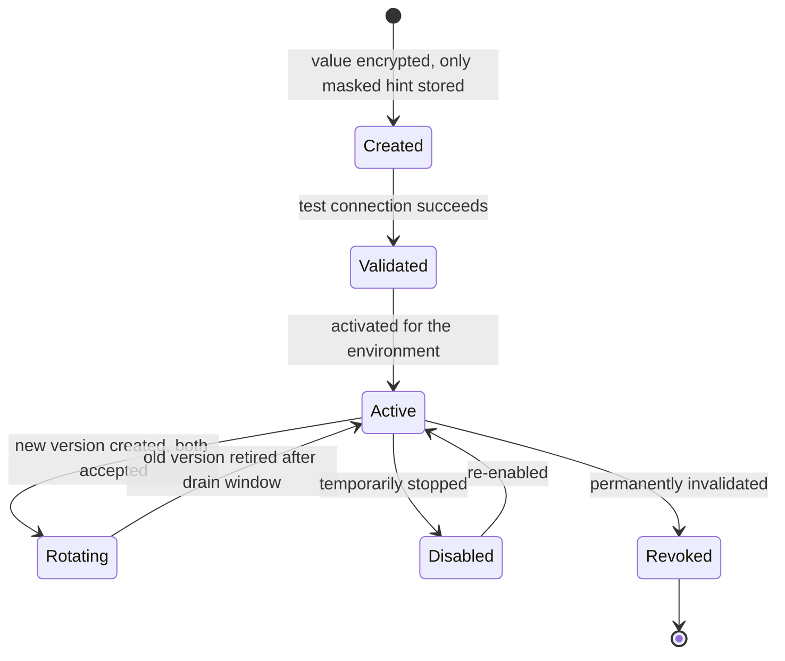

# BrandSpace — Security and Reliability

> **الملخص التنفيذي بالعربية**
>
> هذا المستند يحدد **نموذج الأمان والموثوقية** للمنصة.
>
> **العزل بين العملاء** هو الالتزام الأمني الأول: كل بيانات العميل مقيّدة بـ `workspaceId` على مستوى التطبيق **وعلى مستوى قاعدة البيانات**
> عبر Row-Level Security، ومع اختبارات آلية إلزامية تثبت أن مستخدم مساحة عمل «أ» لا يستطيع قراءة أو تعديل أو البحث في أو تصدير أو حتى
> استنتاج وجود بيانات مساحة عمل «ب».
>
> **صلاحيات الأدوار (RBAC)** محددة على أربعة مستويات: المنصة، مساحة العمل، العلامة التجارية، والحملة — مع مصفوفة صلاحيات تفصيلية لكل دور.
>
> **الأسرار (المفاتيح والرموز)** لا تُخزَّن أبدًا كإعدادات عادية: تُشفَّر بتشفير موثَّق (AEAD)، لا تظهر في السجلات أو الردود، ولا يُعرض منها
> إلا آخر أربعة أحرف، مع دعم التدوير والإلغاء وفصل بيئات التطوير والاختبار والإنتاج، وجاهزية للربط بخدمة KMS سحابية مستقبلًا.
>
> ويغطي المستند أيضًا: التشفير، سجلات التدقيق، حدود المعدل، فحص الملفات، منع إساءة الاستخدام، التحقق من توقيع الـ Webhooks،
> مفاتيح منع التكرار، النسخ الاحتياطي واختبار الاستعادة، المراقبة والتنبيهات، الاستجابة للحوادث، تصدير البيانات، حذف الحساب،
> سياسات الاحتفاظ، والخصوصية، و**وضع الدعم الآمن** الذي يتيح للفريق الداخلي مساعدة العميل دون رؤية كلمات المرور أو الرموز الخام.

---

## 1. Security Principles

1. **Isolation by default.** Data access is denied unless a tenant context proves entitlement.
2. **Defense in depth.** Application scoping and database RLS are independent; either alone must be able to
   stop a breach.
3. **Least privilege.** Every actor — human, service, job, AI tool call — gets the narrowest permission set.
4. **No ambient authority.** There is no "admin bypass" available to request handlers; cross-tenant access is
   an explicit, audited, named operation.
5. **Secrets are not data.** They live in a vault abstraction, never in config rows, logs, or responses.
6. **Everything consequential is audited.** If it changes state or exposes customer data, it produces an
   `AuditEvent`.
7. **Fail closed.** Ambiguity in authorization, entitlement, or validation results in denial, not access.
8. **No silent external effects.** Publish, delete, disconnect, pay, and send require confirmation policy.

---

## 2. Tenant Isolation

### 2.1 Enforcement layers

| Layer | Mechanism | Failure mode it stops |
|---|---|---|
| 1. Edge | Hostname/route separation of the three apps | Admin surface exposed publicly |
| 2. Session | Separate realms, cookie names, signing keys, audiences | Customer token used against Admin |
| 3. Tenant resolver | Membership verified server-side; client claims never trusted | Header/param tampering |
| 4. Authorization | RBAC + resource ownership check before handler | Missing permission check |
| 5. Data access | Tenant-scoped Prisma client injects the predicate | Developer forgets a `where` |
| 6. Database | RLS policies on `workspace_id`; app role cannot bypass | Raw SQL, ORM bug, injection |
| 7. Storage | Workspace-prefixed keys + signed URLs issued post-authorization | Object enumeration |
| 8. Queue | Jobs carry tenant context and are re-authorized on execution | Forged job payloads |
| 9. Cache | Cache keys namespaced by workspace | Cross-tenant cache poisoning/read |
| 10. Tests | Mandatory isolation suite, schema-driven coverage gate | Regressions and new models |

### 2.2 RLS pattern

```sql
ALTER TABLE content_item ENABLE ROW LEVEL SECURITY;
ALTER TABLE content_item FORCE ROW LEVEL SECURITY;

CREATE POLICY tenant_isolation ON content_item
  USING      (workspace_id = current_setting('app.workspace_id', true)::uuid)
  WITH CHECK (workspace_id = current_setting('app.workspace_id', true)::uuid);
```

- The application connects as `app_user`, which has **no** `BYPASSRLS` and is not the table owner.
- `SET LOCAL app.workspace_id` is issued at transaction start by the tenant-scoped client; it is `LOCAL`
  so it cannot leak across pooled connections.
- Connection pooling uses transaction-level pooling so the setting is always scoped to one transaction.
- Migrations run as a separate role that is never used to serve requests.
- A CI check fails the build if a tenant-owned table lacks `ENABLE`/`FORCE ROW LEVEL SECURITY` and a policy.

### 2.3 Non-inference guarantees
- Cross-tenant access returns `404` with the same body and timing characteristics as a genuine miss.
- Error messages never echo whether a resource exists elsewhere.
- Slugs, IDs, and invitation tokens are unguessable (UUIDv7 / high-entropy tokens); enumeration is
  rate-limited and alerted.
- Aggregates, counts, autocomplete, and vector similarity all carry the workspace predicate **inside** the
  query, never as a post-filter.
- Cross-tenant timing differences on authorization checks are avoided by performing the ownership check with
  a constant-shape query.

### 2.4 Platform access to tenant data
`asPlatform(actor, reason)` is the only path. It requires a platform session with an appropriate permission,
records an `AuditEvent`, and for customer-data reads must be inside a **Support Mode session** (§8).

---

## 3. Authentication

| Control | Requirement |
|---|---|
| Password storage | Argon2id, per-user salt, tuned memory/time cost |
| Password policy | Length-first (min 12), breached-password check, no forced rotation |
| Rate limiting | Per-IP and per-account exponential backoff; lockout with unlock flow |
| Email verification | Required before first login completes; signed single-use token |
| MFA | TOTP + recovery codes. Optional for customers; **mandatory for Platform Owner and Platform Admin** |
| Step-up auth | Required for: secret create/rotate/revoke, plan price changes, entering support mode, refunds, credit adjustments above a threshold, account deletion, ownership transfer |
| Sessions | Short-lived access token, rotating refresh, absolute max lifetime, device list, revoke-all |
| Invalidation | On password change, role change, membership removal, workspace suspension, MFA reset |
| Invitations | Signed, single-use, expiring, bound to workspace+role; token stored hashed |
| Realm separation | Distinct cookie names, signing keys, audiences, and session tables for customer vs. platform |
| Admin surface | Dedicated hostname; optional IP allowlist; no public registration path |
| Future | SSO (SAML/OIDC) and SCIM for Enterprise — identity model already supports it |

**Cookies:** `HttpOnly`, `Secure`, `SameSite=Lax` (strict for admin), `__Host-` prefix, short TTL.
**CSRF:** double-submit token plus SameSite; all mutations require the token.

---

## 4. Authorization (RBAC)

### 4.1 Model
`Permission` = `resource.action` (e.g. `content.create`, `content.publish`, `billing.manage`).
`Role` = a named set of permissions, optionally with constraints (`ownOnly`, `assignedBrandsOnly`).
`Membership` = user + workspace + role + optional brand scope.

**Effective permission** = role permissions ∩ scope (platform / workspace / brand / campaign)
∩ entitlements (plan allows the feature) ∩ resource ownership.

All four must pass. A permission the plan does not include is denied even for a Workspace Owner
(with an upgrade-prompt error code, distinct from a permission denial).

### 4.2 Scope levels

| Scope | Example permission | Resolution |
|---|---|---|
| Platform | `platform.plans.manage` | platform role only |
| Workspace | `workspace.members.invite` | membership role in that workspace |
| Brand | `brand.content.create` | membership role **and** brand in `brandScope` |
| Campaign | `campaign.approve` | brand scope **and** campaign assignment/ownership |

### 4.3 Customer role matrix

Legend: ✅ full · 🟡 limited/conditional · ➖ none

| Capability | Owner | Admin | Mktg Mgr | Content Creator | Copywriter | Designer | Approver | Analyst | Client Viewer |
|---|---|---|---|---|---|---|---|---|---|
| View workspace | ✅ | ✅ | ✅ | ✅ | ✅ | ✅ | ✅ | ✅ | 🟡 assigned brands |
| Manage workspace settings | ✅ | ✅ | ➖ | ➖ | ➖ | ➖ | ➖ | ➖ | ➖ |
| Transfer ownership / delete workspace | ✅ | ➖ | ➖ | ➖ | ➖ | ➖ | ➖ | ➖ | ➖ |
| Invite / remove members | ✅ | ✅ | 🟡 non-admin roles | ➖ | ➖ | ➖ | ➖ | ➖ | ➖ |
| Assign roles | ✅ | 🟡 below own level | ➖ | ➖ | ➖ | ➖ | ➖ | ➖ | ➖ |
| Create / archive brands | ✅ | ✅ | 🟡 create only | ➖ | ➖ | ➖ | ➖ | ➖ | ➖ |
| Edit Brand Center / Brand Brain | ✅ | ✅ | ✅ | 🟡 suggest | 🟡 suggest | 🟡 visual only | ➖ | ➖ | ➖ |
| Generate AI strategy | ✅ | ✅ | ✅ | ➖ | ➖ | ➖ | ➖ | ➖ | ➖ |
| Create / edit campaigns | ✅ | ✅ | ✅ | 🟡 own | ➖ | ➖ | ➖ | ➖ | ➖ |
| Create content drafts | ✅ | ✅ | ✅ | ✅ | ✅ text only | 🟡 visual only | ➖ | ➖ | ➖ |
| Generate AI content | ✅ | ✅ | ✅ | ✅ | ✅ | 🟡 creative only | ➖ | ➖ | ➖ |
| Generate AI creative | ✅ | ✅ | ✅ | ✅ | ➖ | ✅ | ➖ | ➖ | ➖ |
| Upload / manage assets | ✅ | ✅ | ✅ | ✅ | 🟡 own | ✅ | ➖ | ➖ | ➖ |
| Submit for approval | ✅ | ✅ | ✅ | ✅ | ✅ | ✅ | ➖ | ➖ | ➖ |
| Approve / reject | ✅ | ✅ | ✅ | ➖ | ➖ | ➖ | ✅ | ➖ | 🟡 optional client approval |
| Comment | ✅ | ✅ | ✅ | ✅ | ✅ | ✅ | ✅ | ✅ | ✅ |
| Schedule to calendar | ✅ | ✅ | ✅ | 🟡 own approved | ➖ | ➖ | ➖ | ➖ | ➖ |
| Publish now / external publish | ✅ | ✅ | ✅ | ➖ | ➖ | ➖ | ➖ | ➖ | ➖ |
| Connect / disconnect social accounts | ✅ | ✅ | 🟡 connect only | ➖ | ➖ | ➖ | ➖ | ➖ | ➖ |
| View analytics | ✅ | ✅ | ✅ | ✅ | 🟡 own content | 🟡 own content | ✅ | ✅ | 🟡 assigned brands |
| Export analytics / data | ✅ | ✅ | ✅ | ➖ | ➖ | ➖ | ➖ | ✅ | 🟡 if enabled |
| Use AI Copilot | ✅ | ✅ | ✅ | ✅ | ✅ | ✅ | 🟡 read/explain | 🟡 read/explain | ➖ |
| Create automations | ✅ | ✅ | ✅ | ➖ | ➖ | ➖ | ➖ | ➖ | ➖ |
| View billing & invoices | ✅ | 🟡 view only | ➖ | ➖ | ➖ | ➖ | ➖ | ➖ | ➖ |
| Change plan / payment method | ✅ | ➖ | ➖ | ➖ | ➖ | ➖ | ➖ | ➖ | ➖ |
| View AI credit balance | ✅ | ✅ | ✅ | 🟡 own usage | 🟡 own usage | 🟡 own usage | ➖ | 🟡 aggregate | ➖ |
| View activity log | ✅ | ✅ | 🟡 brand-scoped | 🟡 own | 🟡 own | 🟡 own | 🟡 own | 🟡 brand-scoped | ➖ |

### 4.4 Platform role matrix

| Capability | Platform Owner | Platform Admin | Support Agent | Billing Manager | Operations Viewer |
|---|---|---|---|---|---|
| View platform dashboards | ✅ | ✅ | 🟡 support-relevant | 🟡 financial | ✅ read-only |
| Create customers / workspaces | ✅ | ✅ | ➖ | ➖ | ➖ |
| Send invitations | ✅ | ✅ | 🟡 resend only | ➖ | ➖ |
| Assign / change plans | ✅ | ✅ | ➖ | ✅ | ➖ |
| Start / extend trials | ✅ | ✅ | 🟡 extend within cap | ✅ | ➖ |
| Suspend / reactivate accounts | ✅ | ✅ | ➖ | 🟡 for non-payment | ➖ |
| Add / remove AI credits | ✅ | ✅ | 🟡 goodwill within cap | ✅ | ➖ |
| Change workspace limits | ✅ | ✅ | ➖ | 🟡 quota add-ons | ➖ |
| Toggle customer-specific features | ✅ | ✅ | ➖ | ➖ | ➖ |
| Create / edit plans and prices | ✅ | 🟡 draft only, owner activates | ➖ | 🟡 draft only | ➖ |
| Manage feature flags | ✅ | ✅ | ➖ | ➖ | ➖ |
| Configure integrations | ✅ | ✅ | ➖ | 🟡 payment only | ➖ |
| Create / rotate / revoke secrets | ✅ | 🟡 rotate, not reveal | ➖ | 🟡 payment only | ➖ |
| View masked credential metadata | ✅ | ✅ | ➖ | 🟡 payment only | 🟡 health only |
| Manage AI providers / models / routing | ✅ | ✅ | ➖ | ➖ | ➖ |
| Enter support mode | ✅ | ✅ | ✅ | ➖ | ➖ |
| Issue refunds / credit notes | ✅ | 🟡 within cap | ➖ | ✅ | ➖ |
| Edit notification templates | ✅ | ✅ | ➖ | ➖ | ➖ |
| View audit log | ✅ | ✅ | 🟡 own actions + assigned workspace | 🟡 billing events | ✅ read-only |
| Manage platform users and roles | ✅ | ➖ | ➖ | ➖ | ➖ |
| Activate configuration versions | ✅ | 🟡 non-financial domains | ➖ | ➖ | ➖ |
| Export platform data | ✅ | 🟡 | ➖ | 🟡 financial | ➖ |

**Separation of duties:** the actor who drafts a pricing or credit-cost change should not be the actor who
activates it. For financial configuration domains this is enforced (Platform Admin drafts, Platform Owner
activates); a documented break-glass single-actor path exists and is alerted.

### 4.5 Authorization middleware

Every route declares its contract at registration:

```ts
route({
  scope: 'workspace',                    // 'public' | 'platform' | 'workspace'
  permission: 'content.publish',
  resource: { type: 'contentItem', from: 'params.id' },
  entitlement: 'social.publish',
  confirmation: 'required',              // high-impact action
  rateLimit: 'publish',
  idempotent: true,
})
```

The framework refuses to register a route that omits `scope`. Handlers cannot reach the database without a
resolved context. A generated **route/permission report** is committed and reviewed, so any route lacking a
permission is visible in the diff.

---

## 5. Secret Management

### 5.1 Rules
1. Secrets are **never** stored in configuration payloads, environment files checked into git, or database
   columns as plaintext.
2. Configuration references secrets by `secretRef` only (e.g. `ai/openai/production/api-key`).
3. Values are encrypted with **authenticated encryption** (AES-256-GCM or XChaCha20-Poly1305) using a
   data-encryption key wrapped by a key-encryption key (envelope encryption). The KEK is held outside the
   application database and is KMS-ready.
4. Encryption context binds ciphertext to `(ref, environment, version)` so a ciphertext cannot be replayed
   into another scope.
5. **No secret is ever returned by any API.** Reads return only: `maskedHint` (last 4), `fingerprint`,
   `status`, `version`, `createdAt`, `lastRotatedAt`, `lastUsedAt`, `expiresAt`.
6. Secrets are resolved only inside server-side adapters, held in memory for the shortest possible time, and
   never passed to any serializer that could reach a log, trace, response, or error.
7. Frontend bundles are scanned in CI for secret-looking strings; `NEXT_PUBLIC_*` variables are schema-checked
   against an allowlist.
8. Log sinks and error serializers run a **redaction layer** keyed on field names and value patterns
   (`sk-`, `Bearer `, JWT shape, high-entropy strings).
9. Development, staging, and production have **completely separate** secrets and vault namespaces.
10. Access requires a platform permission plus step-up authentication.

### 5.2 Lifecycle



**Rotation** is zero-downtime: version *n+1* is created and validated while version *n* remains valid;
traffic shifts; version *n* is retired after a drain window. `lastUsedAt` proves nothing still uses the old
version before retirement.

**Audit** — every create, validate, activate, rotate, disable, revoke, and *resolve-for-use* writes an
`AuditEvent` containing the ref, actor, environment, and outcome, and **never** the value.

**Compromise response:** revoke → rotate → invalidate dependent sessions/connections → audit the access
history of that ref → notify affected workspaces if customer tokens were involved.

### 5.3 Customer-held secrets
Customer OAuth access/refresh tokens and optional BYOK API keys use the **same** vault mechanism, scoped by
workspace. They are never shown to platform staff, including in support mode, and never returned to the
customer either — only masked metadata and connection status.

---

## 6. Encryption

| Layer | Control |
|---|---|
| In transit (public) | TLS 1.3, HSTS with preload, no mixed content, modern cipher suites |
| In transit (internal) | TLS between services; database connections require TLS with certificate verification |
| At rest (database) | Managed volume encryption + application-level AEAD for secret and token columns |
| At rest (object storage) | Server-side encryption; no public objects; signed URLs with short TTL |
| At rest (backups) | Encrypted; keys separate from the primary data keys |
| Field-level | Tokens, MFA secrets, BYOK keys, and any PII marked sensitive use application-level AEAD |
| Key management | Envelope encryption, documented key hierarchy, scheduled KEK rotation, KMS-ready abstraction |

**Browser security headers:** strict `Content-Security-Policy` (no inline scripts without nonce),
`X-Content-Type-Options: nosniff`, `Referrer-Policy: strict-origin-when-cross-origin`,
`Permissions-Policy` minimized, `X-Frame-Options: DENY` on dashboard and admin.

---

## 7. Audit Logging

- Every state change and every customer-data access by a platform actor writes an immutable `AuditEvent`.
- Events capture: actor (type/id), action, resource, workspace, before/after (redacted), IP, user agent,
  request/trace id, outcome, and support-mode session when applicable.
- **Denied** attempts are audited too — repeated denials are a detection signal.
- The application role has `SELECT`/`INSERT` only on `audit_event`; `UPDATE`/`DELETE` are revoked.
- Customers see a filtered, human-readable Activity Log (their workspace only).
- Platform staff see the full log; access to it is itself audited.
- Exportable for compliance; retention default 24 months, configurable.

**Always-audited actions:** login/logout/failed login, MFA changes, role/membership changes, brand and content
deletion, publish/unpublish, social connect/disconnect, secret lifecycle, plan/price/entitlement changes,
credit adjustments, refunds, support mode enter/exit, configuration activation and rollback, data export,
account deletion, and every Copilot action execution.

---

## 8. Secure Support Access (Support Mode)

Platform staff sometimes must see a customer's workspace to help. That capability is a **named, bounded,
audited mode** — not a hidden superpower.

| Property | Rule |
|---|---|
| Entry | Requires permission + step-up auth + a **reason** and optional ticket reference |
| Duration | Time-boxed (default 60 minutes, configurable), auto-expires |
| Access | **Read-only by default.** Write actions require a separate elevated grant and are individually audited |
| Never visible | Passwords, password hashes, MFA secrets, OAuth access/refresh tokens, BYOK keys, payment card data |
| Redaction | Content bodies and Brand Brain can be masked by policy (owner-configurable; default: visible, since support usually needs it) |
| Visibility | The workspace's Activity Log shows that support accessed the workspace, with reason and duration |
| Notification | Optional workspace-owner notification on entry (configurable; default on for write-enabled sessions) |
| Impersonation | **True impersonation (acting as the user) is prohibited at MVP.** Support views data as a platform actor, clearly labeled |
| Audit | Every request inside the session carries `supportModeSessionId` |

---

## 9. Input Validation and Application Attacks

| Threat | Control |
|---|---|
| Injection (SQL) | Parameterized ORM queries; raw SQL requires review + explicit tenant predicate; RLS as backstop |
| XSS | React escaping; no `dangerouslySetInnerHTML` without sanitization; strict CSP with nonces; user content sanitized on render |
| CSRF | SameSite cookies + double-submit token on all mutations |
| SSRF | Outbound requests only to allowlisted hosts from configuration; URL fetching (link previews, imports) goes through a validating proxy that blocks private IP ranges and redirects to them |
| IDOR | Ownership check before every resource access; 404 on cross-tenant |
| Mass assignment | Explicit Zod schemas; no direct object spreading into the ORM |
| Open redirect | Redirect targets validated against an allowlist |
| Prototype pollution / deserialization | Schema parsing only; no `eval`, no dynamic `require` of user input |
| Dependency risk | Lockfiles, automated dependency scanning, SCA in CI, pinned base images, SBOM |
| Secret leakage in code | Pre-commit and CI secret scanning; blocked merge on detection |
| Clickjacking | `X-Frame-Options: DENY` / CSP `frame-ancestors 'none'` on authenticated apps |

### 9.1 AI-specific threats

| Threat | Control |
|---|---|
| Prompt injection via Brand Brain, uploaded documents, or social content | Retrieved content is delimited and labeled as untrusted data; system instructions are never overridable by retrieved text; tool-calling is allow-listed per user permission, not per prompt |
| Copilot privilege escalation | Every tool call re-checks the user's permissions and entitlements server-side; the model's claims about permissions are ignored |
| Data exfiltration through generation | Retrieval is workspace-scoped at the query level; the model never receives another tenant's context; outbound tool calls are allowlisted |
| Unsafe or brand-damaging output | Moderation task before persistence/publishing; brand do/don't rules enforced as post-checks |
| Cost abuse | Per-workspace and per-user budgets, rate limits, max cost per request, hard limits |
| Model output treated as trusted code/data | AI output is parsed with a schema and never executed; generated URLs are not auto-fetched |

---

## 10. Rate Limiting and Abuse Prevention

| Dimension | Example limits (all configuration, not constants) |
|---|---|
| Per IP | Auth endpoints, sign-up, contact form, password reset |
| Per user | AI requests/minute, exports/hour, invitations/day |
| Per workspace | AI requests/minute, publish jobs/hour, API calls/minute, storage upload volume |
| Per endpoint class | Read vs. write vs. AI vs. external-effect |
| Per provider | Respect upstream quotas; internal concurrency caps |

Responses use `429` with `Retry-After` and standard rate-limit headers. Algorithm: sliding-window or token
bucket in Redis. Limits are per-plan configurable.

**Abuse controls:** bot protection on sign-up and contact forms, disposable-email policy (configurable),
velocity checks on invitations and trials, duplicate-account heuristics, automatic throttling on anomalous
AI burn, and an owner-visible abuse queue.

---

## 11. File Upload Security

1. Pre-signed upload with a server-issued key, enforced content type, and size cap.
2. Content-type sniffing on the server — the client's declared type is not trusted.
3. Malware/virus scanning before the asset becomes `ready`; infected files are quarantined and audited.
4. Image/video re-encoding strips metadata (including GPS) and neutralizes polyglot files.
5. SVG uploads are sanitized or converted; never served inline from the app origin.
6. Assets are served from a separate domain/CDN with `Content-Disposition` where appropriate — never from the
   application origin — so a malicious file cannot execute in the app's security context.
7. Storage keys are workspace-prefixed; direct object access requires a signed, short-TTL URL.
8. Per-plan storage quotas enforced at upload authorization time.

---

## 12. Webhooks

### 12.1 Inbound (from social, payment, email providers)
- **Signature verification is mandatory** (HMAC or provider scheme), with timestamp tolerance to prevent replay.
- Raw body is preserved for signature computation before parsing.
- The provider event ID is stored with a unique constraint → processing is **idempotent**.
- Events are acknowledged fast and processed asynchronously via the `billing-events` / `analytics-ingest` queues.
- Unverified or malformed events are rejected and counted; a spike alerts.
- Out-of-order events are handled by comparing event timestamps/versions against current state.

### 12.2 Outbound (to customer systems, future)
- Signed with a per-endpoint secret, timestamped, retried with exponential backoff, with a delivery log and
  a customer-visible replay tool. Target URLs validated against SSRF rules.

---

## 13. Idempotency

| Surface | Key |
|---|---|
| HTTP mutations with external effect | `Idempotency-Key` header, stored with request hash + response snapshot |
| AI requests | `AIRequest.idempotencyKey` (task + input hash + workspace + client key) |
| Publish jobs | `PublishJob.idempotencyKey` (variant + connection + slot) |
| Credit movements | `CreditTransaction.idempotencyKey` |
| Inbound webhooks | provider event ID |
| Automation runs | rule + trigger event id |

Replaying a key returns the original result; a key reused with a *different* payload returns `409`.
Keys expire after 24 hours (configurable).

---

## 14. Reliability

### 14.1 Health and readiness
- `/health/live` (process up) and `/health/ready` (database, Redis, storage, migrations current) on each app.
- **Dependency health** for AI providers and social platforms is tracked continuously and surfaced in
  Platform Admin and on the public Status page.
- Circuit breakers per external provider; when open, the system degrades gracefully (queue, retry later,
  route to fallback model) rather than failing the user's whole action.

### 14.2 Backups and restore
| Control | Requirement |
|---|---|
| Database | Continuous WAL archiving, PITR ≥ 30 days, daily snapshots, 12 monthly retained |
| Object storage | Versioning enabled + cross-region replication for production |
| Secrets/vault | Backed up separately with independent key custody |
| Restore testing | **Quarterly restore drill into an isolated environment, timed and documented.** A backup that has never been restored is not a backup |
| Targets | RPO ≤ 15 minutes, RTO ≤ 4 hours for the core platform |
| Deletion safety | Soft delete + grace window before irreversible purge |

### 14.3 Observability and alerting
Golden signals per endpoint and queue, plus domain alerts:

| Alert | Threshold (configurable) | Severity |
|---|---|---|
| Publish failure rate | > 5% over 15 min | critical |
| AI provider error rate | > 10% over 10 min | critical |
| Queue age (any queue) | oldest job > 10 min | warning → critical |
| Webhook processing lag | > 5 min | warning |
| Daily AI provider cost | > configured daily cap | critical |
| Credit ledger drift | any mismatch in nightly reconciliation | critical |
| RLS policy violation / unscoped query attempt | any occurrence | critical |
| Failed logins spike / enumeration pattern | anomaly | warning |
| Certificate/token expiry | < 14 days | warning |
| Backup failure or missed snapshot | any | critical |

### 14.4 Incident response
1. **Detect** — alert fires or a report arrives.
2. **Triage** — severity S1–S4; S1 = data exposure, publishing outage, billing incorrectness, or auth bypass.
3. **Contain** — feature flag off, disable a provider or connector, revoke a secret, suspend a job class.
4. **Communicate** — Status page update within 30 minutes for S1/S2; in-app banner where relevant.
5. **Resolve** — fix, verify, restore normal operation.
6. **Review** — blameless postmortem within 5 business days, with action items tracked.
7. **Notify** — if personal data was exposed, notify affected customers and, where applicable, regulators
   within the legally required window.

Every feature has a kill switch (feature flag) so containment does not require a deploy.

---

## 15. Privacy and Data Rights

| Right | Implementation |
|---|---|
| Access / portability | Self-serve workspace export (JSON + media manifest), generated async, delivered via short-lived signed URL |
| Rectification | Editable in-product |
| Erasure | Account deletion request → 30-day grace (recoverable) → irreversible purge across DB, storage, backups-on-expiry, and search indexes; financial records retained as legally required |
| Restriction / objection | Workspace suspension without deletion |
| Consent | Explicit consent for marketing communications; granular notification preferences |
| Sub-processors | Public list on the Security page, kept current with the active provider configuration |
| Data residency | Single region at MVP; region selection is a documented future capability (see DECISIONS D-03, R-28) |
| PII minimization | AI request bodies not persisted by default; only audit-safe summaries |
| Cookies | Consent management on the public site; no non-essential tracking without consent |
| DPA / SCCs | Available for business customers; template maintained under Legal |

**Retention defaults** are listed in `docs/DATABASE.md` §13 and are configurable per plan.

---

## 16. Compliance Posture (direction, not a claim)

At MVP BrandSpace does not claim any certification. The architecture is deliberately built so that
**SOC 2 Type II** and **GDPR** readiness are achievable without redesign: immutable audit trail, least-privilege
access, encryption everywhere, documented change management (configuration versioning), tested backups,
incident response process, and vendor/sub-processor management. A formal readiness assessment is a
post-launch activity.

---

## 17. Security Testing

| Activity | Cadence |
|---|---|
| Isolation test suite | Every CI run — blocking |
| SAST + dependency scanning + secret scanning | Every CI run — blocking on high severity |
| Container/base-image scanning | Every build |
| DAST against staging | Weekly |
| Authorization matrix tests (every role × every endpoint) | Every CI run |
| Third-party penetration test | Before public launch, then annually |
| Restore drill | Quarterly |
| Access review (platform users, secrets, provider apps) | Quarterly |
| Threat model review | Each major architectural change |
