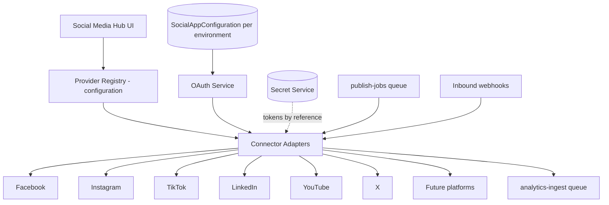
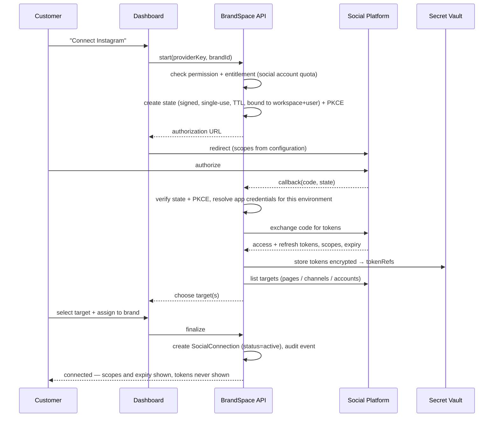
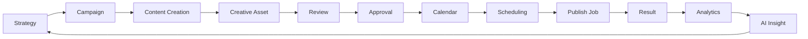
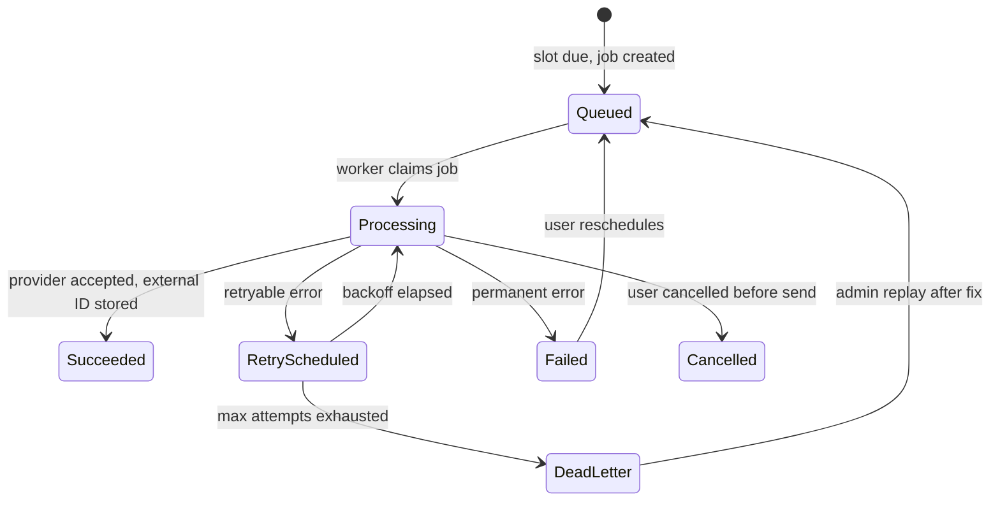

# BrandSpace — Social Integrations, Calendar and Publishing

> **الملخص التنفيذي بالعربية**
>
> هذا المستند يحدد كيفية ربط حسابات التواصل الاجتماعي والنشر عليها.
>
> **القاعدة الذهبية:** لا نطلب من العميل **أبدًا** كلمة مرور حسابه على أي منصة تواصل. الربط يتم حصريًا عبر **OAuth**،
> ويتم تخزين رموز الوصول والتحديث **مشفّرة** ولا تظهر أبدًا في أي واجهة أو سجل أو استجابة.
>
> **بيانات اعتماد التطبيق** (Client ID/Secret لكل منصة) يملكها ويديرها **مالك المنصة** من مركز التحكم، لكل بيئة على حدة.
>
> **كل منصة لها مُحوِّل (Adapter) مستقل** — فيسبوك، إنستغرام، تيك توك، لينكدإن، يوتيوب، إكس، ومنصات مستقبلية — يمكن تعطيله أو تحديثه
> بشكل منفصل دون التأثير على البقية.
>
> **مسار النشر الكامل:** استراتيجية ← حملة ← محتوى ← تصميم ← مراجعة ← موافقة ← تقويم ← جدولة ← مهمة نشر ← نتيجة ← تحليلات ← رؤية ذكية.
> **لا يُنشر أي محتوى يتطلب موافقة قبل اعتماده**، وكل عملية نشر أو حذف أو فصل حساب أو عملية جماعية تتطلب تأكيدًا صريحًا وسجل تدقيق.
>
> نظام النشر يعتمد على **قوائم مهام خلفية** مع إعادة محاولة ذكية، ومفاتيح منع التكرار (لمنع النشر مرتين)، وطابور للمهام الفاشلة نهائيًا،
> وتعافٍ تلقائي عند انتهاء صلاحية الرموز.

---

## 1. Principles

1. **OAuth only.** BrandSpace never asks a customer for a social account password. Any UI that requests one is
   a defect.
2. **Platform owns the app, customer owns the account.** App credentials are Platform Admin configuration;
   account authorization is the customer's OAuth grant.
3. **Tokens are secrets.** Stored encrypted by reference, never returned by an API, never logged, never
   visible to support staff.
4. **Every connector is independent.** One platform's API break, deprecation, or outage must not affect others.
5. **Publishing is a job, not a request.** All external publishing goes through a durable, idempotent,
   retryable queue.
6. **No accidental external effects.** Publish, delete, disconnect, and bulk operations require confirmation
   and produce audit records.
7. **Capabilities are declared, not assumed.** What each platform supports is configuration the UI reads, so
   the interface never offers something the platform cannot do.

---

## 2. Connector Architecture



### 2.1 Adapter interface

```ts
interface SocialConnectorAdapter {
  readonly key: string; // 'instagram', 'tiktok', ...
  readonly capabilities: PlatformCapabilities; // declared, config-overridable

  // Connection
  buildAuthorizationUrl(p: AuthStartParams): string;
  exchangeCode(p: AuthCallbackParams): Promise<TokenBundle>;
  refreshToken(p: RefreshParams): Promise<TokenBundle>;
  revoke(p: RevokeParams): Promise<void>;
  listTargets(ctx: ConnCtx): Promise<PublishTarget[]>; // pages, channels, business accounts
  checkHealth(ctx: ConnCtx): Promise<ConnectionHealth>;

  // Publishing
  validateContent(v: ContentVariant, target: PublishTarget): ValidationReport;
  publish(req: PublishRequest, ctx: ConnCtx): Promise<PublishResult>;
  deletePost?(req: DeleteRequest, ctx: ConnCtx): Promise<void>;
  getPostStatus?(externalId: string, ctx: ConnCtx): Promise<PostStatus>;

  // Analytics
  fetchPostMetrics(p: MetricsParams, ctx: ConnCtx): Promise<MetricSnapshotInput[]>;
  fetchAccountMetrics(p: MetricsParams, ctx: ConnCtx): Promise<MetricSnapshotInput[]>;

  // Webhooks
  verifyWebhook(raw: Buffer, headers: Headers, secret: string): boolean;
  parseWebhook(raw: Buffer): SocialWebhookEvent[];

  classifyError(e: unknown): SocialErrorClass;
}
```

**Error taxonomy:** `auth_expired` · `auth_revoked` · `insufficient_scope` · `rate_limited` ·
`content_rejected` · `media_invalid` · `duplicate_content` · `target_unavailable` · `platform_unavailable` ·
`timeout` · `unknown`. Retry, re-auth prompts, and user messaging derive from this class.

### 2.2 Capability declaration (per platform, configuration)

| Capability      | Description                                                       |
| --------------- | ----------------------------------------------------------------- |
| Post kinds      | text, image, carousel, video, reel, story, short, article, thread |
| Media limits    | count, size, dimensions, aspect ratios, duration, codecs          |
| Text limits     | max characters, hashtag count, mention rules, link handling       |
| Scheduling      | native scheduling vs. BrandSpace-side scheduling                  |
| First comment   | supported or not                                                  |
| Delete          | supported or not                                                  |
| Analytics       | metrics available, granularity, historical window, delay          |
| Webhooks        | supported events                                                  |
| Required scopes | per capability                                                    |
| Rate limits     | documented quotas used to shape our own throttling                |

The UI is generated from these declarations — so if a platform does not support stories, the option never
appears, rather than failing at publish time.

---

## 3. Platform Notes (MVP set)

| Platform      | Connection target                         | Notable constraints                                                                                                                                             |
| ------------- | ----------------------------------------- | --------------------------------------------------------------------------------------------------------------------------------------------------------------- |
| **Facebook**  | Page (via Business login)                 | Page access tokens derived from a user token; page roles matter; link previews; long-lived token exchange                                                       |
| **Instagram** | Business/Creator account linked to a Page | Container-then-publish two-step flow; media must be publicly reachable at publish time; carousel and reel rules; strict aspect ratios; publishing quota per 24h |
| **TikTok**    | Creator/business account                  | Chunked video upload; async processing with a status poll; content review delay; strict duration/codec rules                                                    |
| **LinkedIn**  | Personal profile and/or Organization page | Different endpoints and permissions per author type; asset upload registration step                                                                             |
| **YouTube**   | Channel                                   | Resumable upload; quota units are the real limit, not request counts; processing time before availability; metadata (title, description, category, visibility)  |
| **X**         | Account                                   | Tier-dependent API access and posting limits; media upload is a separate step; thread posting is sequential and must be idempotent per tweet                    |

**Assumption recorded in DECISIONS (D-18, D-19):** exact API versions, scopes, and app-review requirements are
confirmed during Phase 6 implementation, when app review submissions are prepared. Each platform requires
business verification and app review before production publishing — this is a **lead-time item the owner
should start early**.

---

## 4. OAuth Connection Flow



**Security controls:** signed single-use `state` bound to workspace and user with a short TTL; PKCE where
supported; exact redirect-URI matching; scope verification after callback (a missing scope yields
`needs_reauth` rather than a silent partial connection); quota check before starting; full audit trail.

---

## 5. Token Management

| Concern           | Behavior                                                                                                                                                                                 |
| ----------------- | ---------------------------------------------------------------------------------------------------------------------------------------------------------------------------------------- |
| Storage           | Encrypted via the Secret Service; only `tokenRef` in the database                                                                                                                        |
| Exposure          | Never in API responses, logs, traces, error messages, exports, or support mode                                                                                                           |
| Proactive refresh | A scheduled job refreshes tokens **before** expiry (e.g. at 75% of lifetime); failures set `needs_reauth`                                                                                |
| Reactive refresh  | On `auth_expired`, refresh once and retry the operation transparently                                                                                                                    |
| Rotation          | Refresh-token rotation is honored where the platform supports it; the old token is retired after success                                                                                 |
| Revocation        | Customer disconnect and admin disable both revoke at the provider where supported, then mark the connection `revoked`/`disabled`                                                         |
| Expiry recovery   | On `needs_reauth`: pause scheduled jobs for that connection, notify the workspace with a reconnect link, keep queued jobs pending until the deadline, then fail them with a clear reason |
| Scope changes     | Detected at refresh and health check; missing scopes disable the affected capabilities only, not the whole connection                                                                    |
| Health            | Periodic lightweight probe; rolling status, consecutive failure count, last error, circuit-breaker state                                                                                 |

---

## 6. End-to-End Publishing Workflow



### 6.1 Stage gates

| Stage            | Entry condition                                         | Produces                           |
| ---------------- | ------------------------------------------------------- | ---------------------------------- |
| Strategy         | Brand Brain has minimum viable content                  | `Insight` (strategy)               |
| Campaign         | Strategy accepted or created manually                   | `Campaign`                         |
| Content creation | Brand + campaign context available                      | `ContentItem` + `ContentVariant`s  |
| Creative asset   | Variant needs media                                     | `Asset` (`ready` + `clean` scan)   |
| Review           | Variants validated against platform rules               | comments, change requests          |
| Approval         | Workspace policy requires it                            | `Approval` (`approved`)            |
| Calendar         | **Approved** (when approval is required)                | `CalendarSlot`                     |
| Scheduling       | Slot has a valid time, connection, and target           | delayed job + sweeper coverage     |
| Publish job      | Slot is due; pre-flight checks pass                     | `PublishJob`                       |
| Result           | Provider responded                                      | `PublishAttempt`, external post ID |
| Analytics        | Post exists and the platform's metric delay has elapsed | `MetricSnapshot`                   |
| Insight          | Enough data accumulated                                 | `Insight`                          |

### 6.2 Approval enforcement

The approval requirement is checked **twice**: when a slot is scheduled, and again inside the publish job
immediately before the external call. If approval was revoked in between, the job aborts with
`approval_revoked` and the user is notified. **Content that requires approval and lacks it can never be
published** — this is enforced in the job, not only in the UI.

### 6.3 Content validation

Before scheduling, each variant is validated against the target platform's declared capabilities:
character count, hashtag and mention rules, link policy, media count, aspect ratio, file size, duration,
codec, and required fields. Results are `valid` / `warnings` / `invalid`. **Invalid variants cannot be
scheduled.** Validation runs again at publish time, since assets may have changed.

---

## 7. Publish Job Pipeline



### 7.1 Pre-flight checks (inside the job, before any external call)

1. Workspace is active, not suspended.
2. Entitlement allows publishing; monthly scheduled-post quota not exceeded.
3. Content is approved if approval is required.
4. Connection is `active` with the required scopes.
5. Assets are `ready` and `clean`.
6. Variant re-validates against platform rules.
7. Idempotency key not already succeeded.
8. Platform rate-limit budget available.

Any failure ends the job **before** contacting the platform, with a precise status the customer can act on.

### 7.2 Idempotency

`PublishJob.idempotencyKey = hash(contentVariantId, socialConnectionId, calendarSlotId, targetId)` with a
unique constraint. A worker claims a job with a conditional status transition, so two workers cannot process
the same job. Where the platform supports a client-side idempotency token, it is passed through.

**Uncertain outcomes** (timeout after send, connection reset) are never blindly retried. The job enters
`verification_pending` and the adapter's `getPostStatus` / recent-posts lookup determines whether the post
landed. Only a confirmed non-publish is retried. This is the single most important rule for avoiding
duplicate posts.

### 7.3 Retry policy

Exponential backoff with jitter, per error class:

| Class                                | Retry     | Notes                                              |
| ------------------------------------ | --------- | -------------------------------------------------- |
| `rate_limited`                       | yes       | honor `Retry-After`; may exceed the scheduled time |
| `platform_unavailable`, `timeout`    | yes       | with verification step first                       |
| `auth_expired`                       | yes, once | after a token refresh                              |
| `auth_revoked`, `insufficient_scope` | no        | connection → `needs_reauth`, customer notified     |
| `content_rejected`, `media_invalid`  | no        | actionable error shown to the customer             |
| `duplicate_content`                  | no        | treated as success if the external post is found   |

Max attempts and windows are configuration. Exhausted jobs land in the **dead-letter queue** with full
context and an admin replay tool.

### 7.4 Provider response storage

Every attempt stores a `PublishAttempt` with HTTP status, provider error code, timing, and the raw response
**with tokens and secrets redacted**. This is the evidence trail for support and for platform disputes.

### 7.5 Publishing statuses shown to the customer

| Status                | Meaning                                                         |
| --------------------- | --------------------------------------------------------------- |
| `scheduled`           | Placed on the calendar, waiting for its time                    |
| `queued`              | Due, waiting for a worker                                       |
| `publishing`          | Being sent to the platform                                      |
| `published`           | Live, with a link to the post                                   |
| `partially_published` | Some targets succeeded, others failed — per-target detail shown |
| `failed`              | Did not publish; reason and suggested fix shown                 |
| `needs_reconnection`  | Blocked by an expired or revoked connection                     |
| `cancelled`           | Cancelled before sending                                        |
| `pending_approval`    | Blocked because approval is missing                             |

---

## 8. Scheduling Correctness

- Slots store `scheduledAtUtc` plus the intended local time and timezone, so DST changes never silently move
  a post.
- The delayed job is an optimization; a **reconciliation sweeper** runs every minute for slots that are due
  and unclaimed, so a Redis failure costs punctuality, not correctness.
- A slot is claimed with an atomic status transition; double-claim is impossible.
- Late publishing has a configurable tolerance window: beyond it, the job is held and the customer is asked
  whether to publish late or reschedule (rather than posting a time-sensitive message hours late).
- Bulk scheduling and per-platform "best time" suggestions respect per-platform daily posting caps.

---

## 9. Analytics Ingestion

| Aspect        | Design                                                                                                      |
| ------------- | ----------------------------------------------------------------------------------------------------------- |
| Trigger       | Scheduled per connection and per platform, respecting each platform's metric availability delay             |
| Windows       | Recent posts polled more frequently, then backing off (e.g. 1h, 6h, 24h, 3d, 7d, 30d)                       |
| Idempotency   | Upsert on `(workspace, connection, subjectExternalId, granularity, periodStart)`                            |
| Backfill      | On new connection, fetch history as far as the platform and plan allow                                      |
| Rate limits   | Ingestion shares the platform's quota budget with publishing; **publishing has priority**                   |
| Gaps          | Missing windows are tracked and retried; the UI shows data freshness rather than pretending completeness    |
| Normalization | Platform-specific metrics are mapped to a common vocabulary, with platform-native values retained alongside |
| Retention     | Pruned per the plan's `analyticsRetentionDays`                                                              |
| Failure       | Ingestion failures never affect publishing; they surface as a freshness warning                             |

Normalized core metrics: impressions, reach, engagements, likes, comments, shares, saves, clicks, video views,
watch time, completion rate, follower count and delta, profile visits. Platform-only metrics are preserved in
the raw `metrics` JSON.

---

## 10. Webhooks (inbound)

- Signature and timestamp verified on the **raw body** before parsing; failures are rejected and counted.
- Stored with the provider event ID under a unique constraint ⇒ idempotent processing.
- Acknowledged immediately, processed asynchronously.
- Handled events (where supported): permission/scope revocation, account disconnection, post status changes,
  comment/mention notifications (future inbox), and platform deprecation notices.
- Out-of-order events are resolved by comparing event timestamps against current state.
- Webhook health (volume, verification failures, processing lag) is visible in Platform Admin.

---

## 11. Confirmation and Audit Policy for External Actions

| Action                                       | Confirmation                                                         | Audit                                        |
| -------------------------------------------- | -------------------------------------------------------------------- | -------------------------------------------- |
| Publish now                                  | Explicit confirm dialog naming the accounts and content              | `content.published`                          |
| Schedule                                     | Implicit (the scheduling action is itself explicit)                  | `content.scheduled`                          |
| Cancel a scheduled post                      | Simple confirm                                                       | `content.schedule_cancelled`                 |
| Delete an external post                      | **Typed confirmation** (irreversible on most platforms)              | `content.external_deleted`                   |
| Disconnect an account                        | Typed confirmation + impact list (N scheduled posts affected)        | `social.disconnected`                        |
| Bulk publish / bulk reschedule / bulk delete | Preview of every affected item + typed confirmation + dry-run option | `bulk.*` with item manifest                  |
| Reconnect / re-auth                          | Standard OAuth consent                                               | `social.reconnected`                         |
| Copilot-initiated publish                    | **Always** preview + explicit human confirmation                     | `content.published` with `actorType=copilot` |

Every audit record captures actor, workspace, brand, targets, content reference, and outcome.

---

## 12. Failure Handling and Customer Communication

| Situation             | System behavior                                               | Customer sees                                                          |
| --------------------- | ------------------------------------------------------------- | ---------------------------------------------------------------------- |
| Token expired         | Auto-refresh; if it fails, pause the connection's jobs        | "Reconnect Instagram" with one-click re-auth                           |
| Scope removed         | Disable affected capabilities only                            | Clear notice of what stopped working and why                           |
| Platform outage       | Circuit breaker opens; jobs retry within the tolerance window | "Instagram is experiencing issues — we'll keep trying until 14:30"     |
| Content rejected      | No retry; job fails                                           | The platform's reason, mapped to plain language, plus a fix suggestion |
| Media invalid         | No retry                                                      | Which rule was violated (aspect ratio, duration, size)                 |
| Rate limited          | Backoff and retry                                             | "Delayed by Instagram's rate limit — publishing shortly"               |
| Quota exceeded (plan) | Job blocked pre-flight                                        | Upgrade prompt with current usage                                      |
| Approval missing      | Job blocked pre-flight                                        | "Waiting for approval from …"                                          |
| Dead letter           | Admin alerted; job replayable                                 | "Publishing failed — we're looking into it", with support reference    |

Notifications for publish success and failure are configurable, bilingual templates
(`docs/ADMIN-CONTROL-CENTER.md` §11).

---

## 13. Testing Strategy

| Test                      | Assertion                                                                          |
| ------------------------- | ---------------------------------------------------------------------------------- |
| Mock connector end-to-end | Full workflow from draft to published with a simulated platform                    |
| Idempotency               | Duplicate job execution produces exactly one external post                         |
| Timeout verification      | A send that times out is verified, not blindly retried                             |
| Approval gate             | An unapproved item can never publish, even via a directly enqueued job             |
| Token expiry              | Expired token triggers refresh; failed refresh sets `needs_reauth` and pauses jobs |
| Scope loss                | Missing scope disables only the affected capability                                |
| Retry classification      | Each error class retries or fails exactly as specified                             |
| Dead letter               | Exhausted jobs are recoverable and replayable                                      |
| Isolation                 | Workspace A cannot see, target, or publish through B's connections                 |
| Validation                | Over-limit content cannot be scheduled                                             |
| Analytics idempotency     | Re-ingesting a window creates no duplicate rows                                    |
| Webhook security          | Invalid signatures are rejected; replays are ignored                               |
| Rate-limit sharing        | Analytics ingestion never starves publishing                                       |
| Contract tests            | Recorded provider fixtures detect breaking API changes per platform                |

**No real social credentials are used before Phase 6.** Development and the first vertical slice use mock
connectors exclusively.

---

## 14. As built — Phase 6

This section records what Phase 6 actually shipped, where it departs from the design above, and what it
deliberately did not do. The sections before it are the DESIGN; this one is the CODE.

### 14.1 What is real and what is a mock

**Every security property is real. Every provider is a mock.**

That split is not a shortcut, it is the only honest way to build this milestone before app review
completes (D-18, D-19). So:

- The OAuth state, the PKCE verifier, the token encryption, the RLS policies, the composite foreign keys,
  the idempotency key, the conditional claim, the approval gate and the retry classification are all
  **real**, and are proven against real PostgreSQL through the unprivileged application role.
- The five adapters are **deterministic mocks**. They model rejection, rate limiting, expiry, revocation
  and — most importantly — a timeout whose outcome is unknown, because those are the paths the pipeline's
  correctness rests on. A mock that only succeeded would test the one case that was never in doubt.
- `createConnectorRegistry` **refuses to return a mock in a PRODUCTION environment**. A deployment with no
  real connector fails loudly rather than accepting publish jobs, marking them `PUBLISHED`, and storing an
  external id that points at nothing.

### 14.2 The provider set

Facebook, Instagram, TikTok, LinkedIn and X. **YouTube is not in this phase (D-139)**: it is the only
platform in the design whose publishing model is a resumable video upload with quota units rather than
request counts, and the milestone's brief named four. It remains in §3 as a designed platform.

### 14.3 The data model

Five tenant-owned tables, all `ENABLE + FORCE` RLS, all composite-keyed to their tenant-owned parents
(D-112):

| Table                | What it holds                                                                                        |
| -------------------- | ---------------------------------------------------------------------------------------------------- |
| `social_connection`  | The customer's authorization to post to one external account. Brand-scoped, NOT NULL                 |
| `social_credential`  | The encrypted OAuth material. A **separate table**, so a screen cannot leak a token it never loaded  |
| `social_oauth_state` | One authorization in flight. State stored **hashed**, PKCE verifier **encrypted**                    |
| `publish_job`        | One variant, one connection, one slot. Unique on a derived idempotency key per workspace             |
| `publish_attempt`    | The evidence trail. **Immutable** by trigger; **not tenant-deletable** by privilege (DATABASE §17.3) |

**Why the credential is a separate table.** Every screen, every list and every log line reads a
connection; exactly one code path reads a token. In one table, `SELECT *` — which is what an ORM emits by
default — would carry a customer's access token through the application on every render.

**Why the connection's brand is NOT NULL (D-138).** Every other brand-scoped table here allows a null
brand to mean "belongs to the workspace". That is right for a shared logo pack and wrong for a publishing
credential: BrandScope has to be a query predicate (D-132/D-134), and "visible to every brand" is exactly
the hole a brand-restricted member would publish through.

### 14.4 Where each operation runs, and why

| Operation                                           | Runs in              | Because                                                                                                                              |
| --------------------------------------------------- | -------------------- | ------------------------------------------------------------------------------------------------------------------------------------ |
| Start authorization, exchange code, refresh, revoke | `apps/api`           | Needs the platform app's client secret, which resolves through the Secret Service. F-07 keeps that path out of tenant-facing apps    |
| Materialise due slots into jobs, dispatch           | `apps/api` scheduler | The enumeration "which workspaces have work due" is cross-tenant; every write happens inside that tenant's own context               |
| Publish                                             | `apps/worker`        | An external call is unbounded work against somebody else's infrastructure. On a request path that is a held connection and a spinner |
| List connections, read history, cancel, retry       | `apps/dashboard`     | Tenant tables under RLS only. No platform credential is in play                                                                      |

The dashboard's `SocialConnectionService` is constructed **without** an `ApplicationResolver`, so it has no
path to a platform credential — the boundary is expressed in the type rather than in a comment.

### 14.5 The token key domain (D-136)

Customer tokens are encrypted with the same envelope primitives `secret_version` uses, out of the new
`@brandspace/vault` package, but under a **different key-encryption key**: `SOCIAL_TOKEN_VAULT_KEK`.

That separation is the point. The publish worker holds the social KEK and has database access; if the two
domains shared a key, that worker could unwrap every platform provider credential in the database — the
exact reach F-07 exists to deny it. The encryption context additionally binds each ciphertext to one
workspace, one connection and one version, so a credential row copied elsewhere fails to decrypt rather
than returning somebody else's token.

### 14.6 Duplicate prevention, stated plainly

This is the property the milestone exists to guarantee, so it is worth stating in one place:

1. The idempotency key is **derived** from `(workspace, slot, connection, variant)` — no clock, no
   counter, no random component — and is unique per workspace. Every path that could create the job
   computes the same key and collides.
2. A job is claimed with a **conditional UPDATE**. Two workers cannot both hold it.
3. The job is moved to `PUBLISHING` **before** the external call, so a process that dies mid-flight leaves
   a row that says "we may have sent this".
4. An **uncertain outcome is never resent**. A timeout goes to `VERIFICATION_PENDING` and the adapter is
   asked whether the post landed. Where a provider cannot be asked
   (`capabilities.supportsPostLookup: false`), the job **stops** and waits for a human — a duplicate post
   is worse than a missing one.
5. `UNKNOWN` is neither retryable nor indeterminate. An unclassified failure we resend is how a caption
   goes out twice.

### 14.7 The approval gate, checked twice

Once when a due slot is materialised into jobs, and again inside the job immediately before the external
call. Not because the first check is unreliable, but because approval can be **withdrawn in between** —
and the check that matters is the last one. Content in `IN_REVIEW` or `CHANGES_REQUESTED` never publishes,
checked against the item's own state rather than inferred from the slot's.

### 14.8 Not in this phase

- **Inbound webhooks** (§10). They need a verified platform app to send them; signature verification
  written against no signer would be untested code that looks tested.
- **Dead-letter queue and Control Center replay.** The customer-facing half — a `FAILED` job with its
  class and a manual retry where the class allows one — is here. The operator half is deferred with the
  webhooks it would sit beside.
- **Analytics ingestion** (§9). Phase 7.
- **`deletePost`.** Declared in the adapter contract as optional and implemented by nobody, because no
  product surface asks for it yet. A capability with no caller is a capability nobody has thought about.
